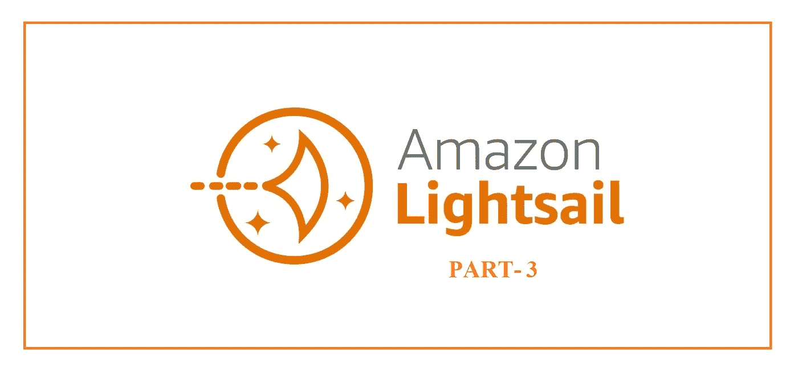
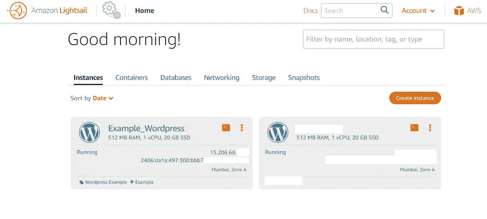
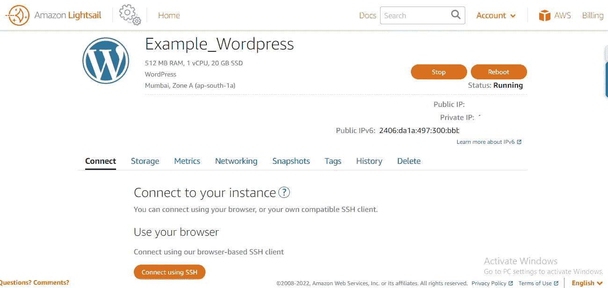
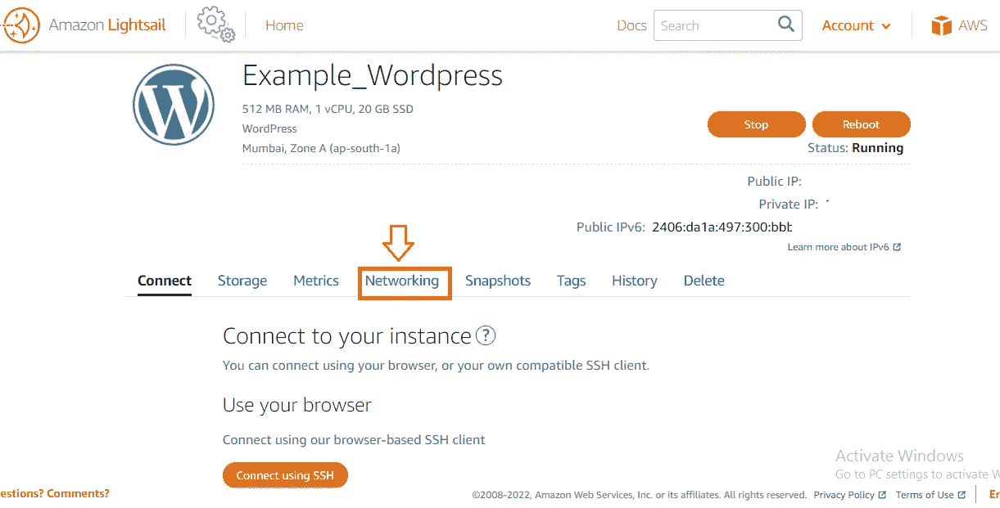
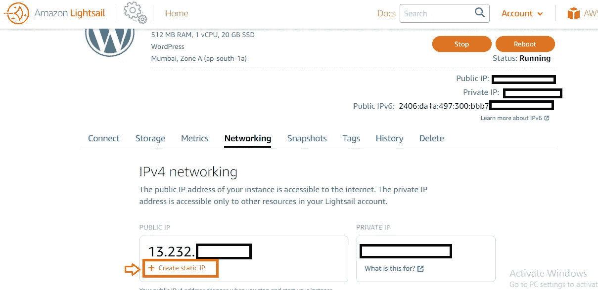
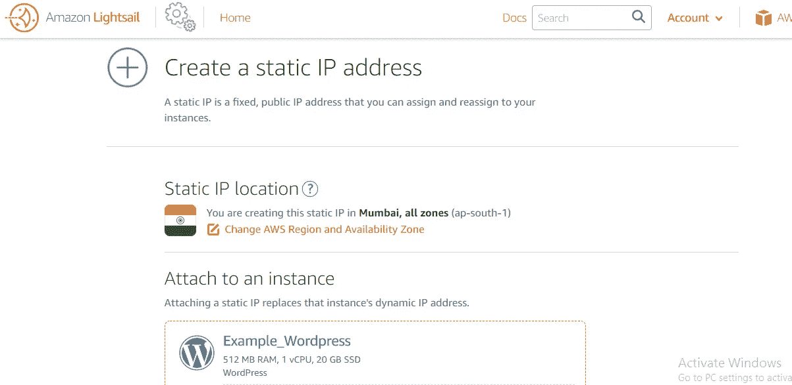
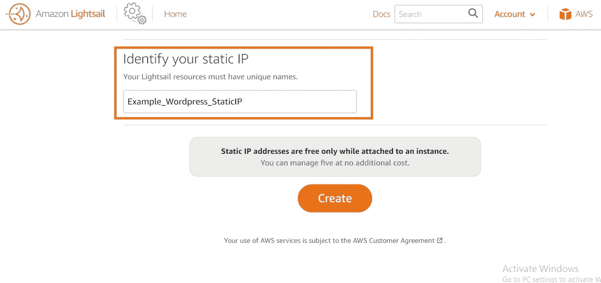
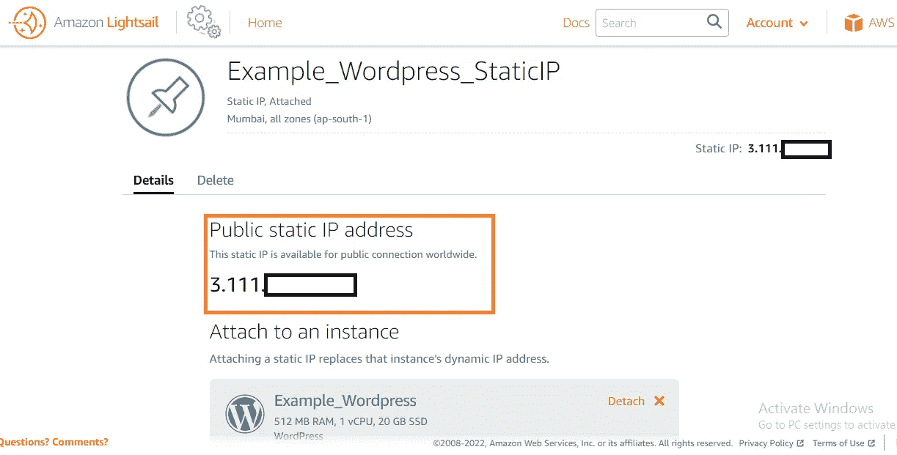
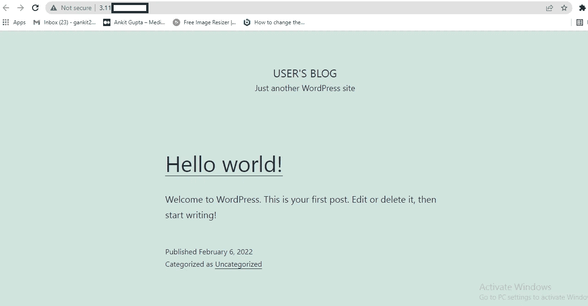

# 从动态 IP 地址设置 Lightsail 静态 IP 地址。

> 原文：<https://medium.com/nerd-for-tech/setting-up-a-lightsail-static-ip-address-from-dynamic-ip-address-4a0628f63c52?source=collection_archive---------3----------------------->

## 逐步|详细(第 3 部分)

**亚马逊光帆 Part3.jpg**

在 AWS Lightsail 上托管 WordPress 网站并在 [**Part-1**](https://aws.plainenglish.io/how-to-host-a-wordpress-website-on-aws-lightsail-8808b70f7f7c) 和 [**Part-2**](https://www.clickaws.com/find-wordpress-password-in-aws-lightsail/) **，**中检索 WordPress 网站仪表板的登录密码后，我们必须再次回到 AWS Lightsail 上从我们实例上的动态 IP 地址设置静态 IP 地址。

如果你对网络概念有新的认识，动态 IP 地址意味着当我们在 AWS Lightsail 中停止和启动我们的实例时，我们的 IP 地址会改变，这称为**动态 IP 地址。欲了解更多信息，请查看本博客(第 3.1 部分)。**

**为什么我们应该从动态 IP 地址设置静态 IP 地址？**

**答:**让我们假设在未来，如果我们必须将 IP 连接到域名或类似的东西，IP 必须相同，否则域名将链接到不存在的 IP 地址。

让我们开始实际的。

**第一步:**登录 AWS 账户后进入 **AWS Lightsail 仪表盘**。

**ClickAWS.com AWS light sail 仪表盘**

**第二步:**点击你需要的**实例**。

**ClickAWS.com 要求的实例**。

**第三步:**去点击**联网**。

**ClickAWS.com 联网**

**步骤 4:** 点击创建**静态 IP。**

【ClickAWS.com 静态 IP

第五步:一个新的页面将被打开。选择您想要的区域。填写一个唯一的名称来识别您的静态 IP，然后点击**创建**。

> **注意**:静态 IP 地址只有在连接到实例时才是空闲的**。
> 
> 您可以管理 5 台，无需额外费用。

**创建**。**作者 ClickAWS.com**

**创建**。**作者 ClickAWS.com**

步骤 6:创建一个**静态 IP** 。

**Clickaws.com 的静态 IP**

第七步:复制**静态 IP** 粘贴到搜索栏，搜索静态 IP。您的静态 IP 与您的实例相连接。

**Clickaws.com 的静态 IP**

欢迎提出建议、改进和疑问。

我希望这个博客能帮助和节省你的宝贵时间，这样你就可以和你爱的人一起度过了。保持微笑，展现爱心！！！

**下面是 AWS Lightsail 上 WordPress 网站托管的详细|一步一步系列的链接:**

**第一部分:** [如何在 AWS LightSail 上托管一个 WordPress 网站。](https://aws.plainenglish.io/how-to-host-a-wordpress-website-on-aws-lightsail-8808b70f7f7c)

**第二部分:** [查找 WordPress AWS Lighstail 的仪表板登录凭证。](https://www.clickaws.com/find-wordpress-password-in-aws-lightsail/)

**第 3 部分:** [从动态 IP 地址设置 Lightsail 静态 IP 地址。](/nerd-for-tech/setting-up-a-lightsail-static-ip-address-from-dynamic-ip-address-4a0628f63c52)

**第 3.1 部分:**AWS light sail 中实例的动态 IP 地址。

**第四部分:** [如何向亚马逊 Web 服务注册域名|使用 AWS Route53 注册域名。](https://aws.plainenglish.io/how-to-register-a-domain-name-with-amazon-80a1bf809859)

**第五部分:** [在 WordPress AWS Lightsail 上设置免费 SSL 证书。](https://www.clickaws.com/how-to-setup-or-enable-free-ssl-certificate-on-your-wordpress-aws-lightsail-instance/)

感谢您的阅读，如果您喜欢，请点击拍手按钮并分享它。

**如果你喜欢以上博客系列请支持我使用**[**Buymeacoffee**](https://www.buymeacoffee.com/AnkitGupta1)**。**

## 其他博客:

 [## 亚马逊推出 Re: Skill Program 2021 |免费亚马逊 t 恤|免费亚马逊课程

### AWS re:技能——赚取奖励。

medium.com](/nerd-for-tech/amazon-launched-re-skill-program-2021-free-amazon-t-shirts-free-amazon-courses-88c4b95c9752)  [## AWS Lightsail 中 WordPress 的登录凭证-第 2 部分| WordPress 密码 Lightsail - CLICKAWS

### 在本文中，我们讨论了如何在 AWS LightSail 中使用 SSH 来查找 WordPress Admin 的登录凭证。这是…

www.clickaws.com](https://www.clickaws.com/find-wordpress-password-in-aws-lightsail/)  [## 在 WordPress AWS Lightsail 上设置免费 SSL 证书。-点击新闻

### 启用 HTTPS WordPress 网站或任何网站保证访问者你的网站是安全的，发送和…

www.clickaws.com](https://www.clickaws.com/how-to-setup-or-enable-free-ssl-certificate-on-your-wordpress-aws-lightsail-instance/) 

## 在 Linkedin 上联系我:

 [## 印度马哈拉施特拉邦 ankit Gupta-Pune |职业简介| LinkedIn

### 我是一个深度学习爱好者/学习者，正在寻找一个可以贡献和提高我技能的机会…

www.linkedin.com](https://www.linkedin.com/in/ankit-gupta2/) 

**参考文献:**

[https://light sail . AWS . Amazon . com/ls/docs/en _ us/articles/Amazon-light sail-editing-WP-config-for-distribution](https://lightsail.aws.amazon.com/ls/docs/en_us/articles/amazon-lightsail-editing-wp-config-for-distribution)

**关注我们了解更多内容。**

**查看** [书呆子科技](https://medium.com/nerd-for-tech) **更多 AWS 相关内容。**