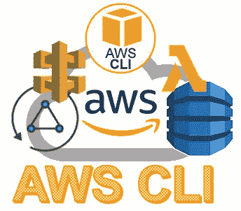
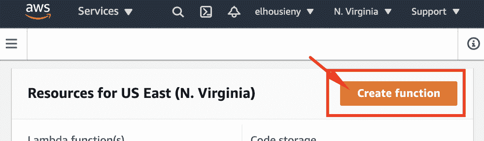
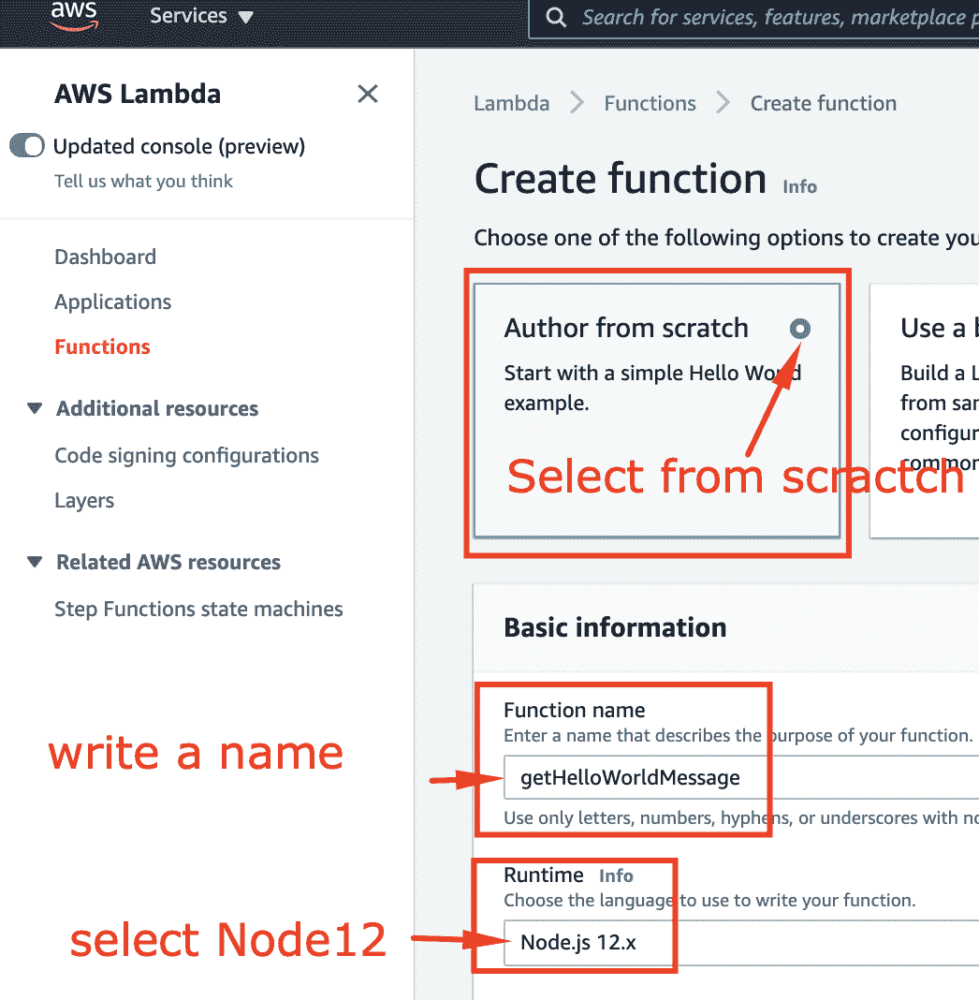
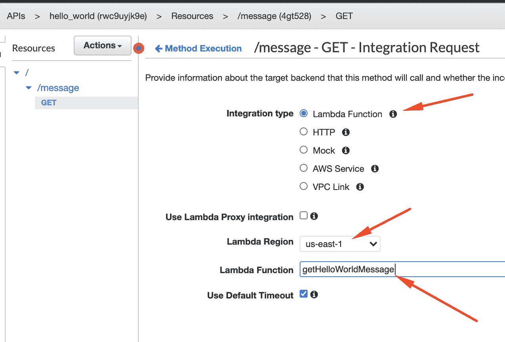

# 为 Mac 设置 AWS 无服务器开发环境

> 原文：<https://medium.com/nerd-for-tech/setting-up-aws-serverless-dev-environment-for-mac-b0164a963406?source=collection_archive---------3----------------------->

本文是解释微服务设计模式系列的一部分

1.  [打造无服务器微服务“Hello World”:一步一步来](https://www.linkedin.com/pulse/create-serverless-microservice-hello-world-step-elhousieny-phd%25E1%25B4%25AC%25E1%25B4%25AE%25E1%25B4%25B0/?trackingId=3xdxZckTF8ML9xqjVXYxLQ%3D%3D)

 [## 创建无服务器微服务“Hello World”REST API:循序渐进

### 基本微服务的基本元素包括一个 API 端点和一个数据库。在这篇文章中，我将…

www.linkedin.com](https://www.linkedin.com/pulse/create-serverless-microservice-hello-world-step-elhousieny-phd%25E1%25B4%25AC%25E1%25B4%25AE%25E1%25B4%25B0/?trackingId=3xdxZckTF8ML9xqjVXYxLQ%3D%3D) 

2.向微服务添加 Lambda

 [## 逐步创建无服务器微服务“Hello World ”:向微服务添加 Lambda

### 本文是解释微服务设计模式 1 系列文章的一部分。创建无服务器微服务“你好…

www.linkedin.com](https://www.linkedin.com/pulse/create-serverless-microservice-hello-world-step-elhousieny-phd%E1%B4%AC%E1%B4%AE%E1%B4%B0-1c/?published=t) 

# **3。[本文]为 Mac 设置 AWS 无服务器开发环境**

 [## 为 Mac 设置 AWS 无服务器开发环境

### 本文是解释微服务设计模式 1 系列文章的一部分。创建无服务器微服务“你好…

www.linkedin.com](https://www.linkedin.com/pulse/setting-up-aws-serverless-dev-environment-mac-elhousieny-phd%25E1%25B4%25AC%25E1%25B4%25AE%25E1%25B4%25B0/?trackingId=2YpjFH5BDk02EyEpp4APwQ%3D%3D) 

完整代码可以在[https://github . com/ranyelhousieny/micro services _ AWS _ server less](https://github.com/ranyelhousieny/Microservices_AWS_Serverless)找到

=====================================

在 AWS 控制台上搜索 Lambda

单击创建函数

请遵循以下步骤

# 将 Lambda 添加到 API 网关

转到 API 网关，从 Mock 切换到 Lambda

现在你可以看到 API 网关与 Lambda 交互，而不是模拟响应

你可以通过点击 test 来测试它，你会收到来自 Lambda 的消息

像以前一样进行部署，并在浏览器上进行测试，以查看以下内容

