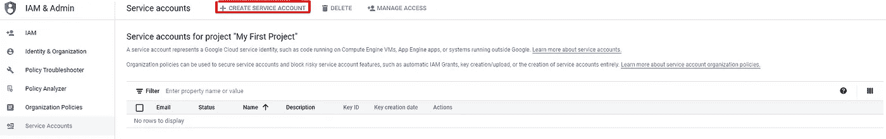
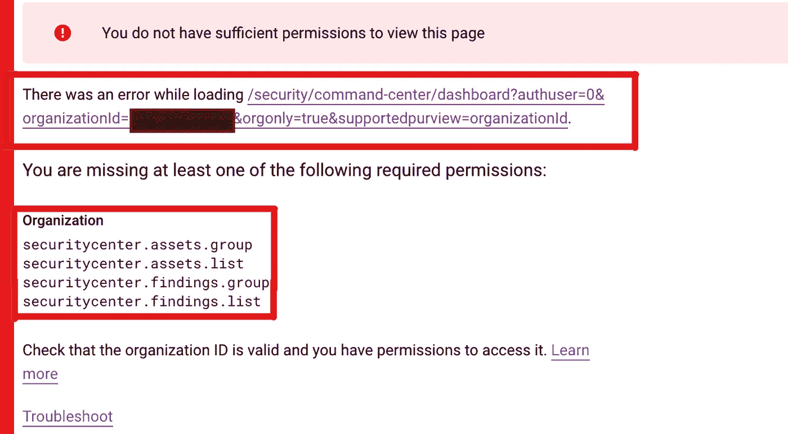

# 如何设置 Cloud Composer、Cloud SQL 和 Google Cloud SDK

> 原文：<https://medium.com/nerd-for-tech/setting-up-cloud-composer-cloud-sql-and-google-cloud-sdk-22f02bc0d1cd?source=collection_archive---------10----------------------->


拉杰什瓦尔·巴楚在 [Unsplash](https://unsplash.com?utm_source=medium&utm_medium=referral) 上的照片

这是设置 Google 服务帐户、Cloud Composer、Cloud SQL 和 Google Cloud SDK 的分步指南。本指南是将 Cloud Composer 连接到云 SQL 的更大指南的一部分:

[](https://dorlabor1.medium.com/connecting-gcp-composer-to-cloud-sql-via-proxy-305743a388a) [## 通过代理将 GCP 合成器连接到云 SQL

### 这是一个非常详细的指南，一步一步地介绍了如何将从 Kubernetes 集群运行的 GCP Composer 连接到 GCP SQL…

dorlabor1.medium.com](https://dorlabor1.medium.com/connecting-gcp-composer-to-cloud-sql-via-proxy-305743a388a) 

这是一个比理论更实用的指南。因此，如果您希望了解这些技术的小细节和架构，您可以随时查看每个部分中的链接。

# 这本指南适合谁？

如果您是第一次使用 Google Cloud Platform，如果您希望将 Cloud Composer 连接到 Cloud SQL，如果您想要相关文档的参考，或者只是希望以快速高效的方式设置这些环境，那么本指南就是为您准备的。

# 我们开始吧！

[](https://cloud.google.com/) [## 云计算服务|谷歌云

### 新客户可以获得 300 美元的免费积分，在谷歌云上消费。所有顾客都可以免费使用 20 多种产品。看…

cloud.google.com](https://cloud.google.com/) 

若要登录，您必须添加免费试用的付款方式。其中包括 300 美元的信用额度，可在未来 90 天内使用。如果您用完了点数，不要担心，除非您打开自动计费，否则不会向您收费。

首先，请登录您的帐户。

选择“转到控制台”按钮->“导航菜单”并按下:

*   我是管理员。
*   API 和服务。
*   Kubernetes 发动机。
*   计算引擎。
*   存储。
*   SQL。
*   作曲家。

如果这是你第一次建立连接，我建议你开一个新账户，这样你就可以选择是否在这项服务上花钱。

# 创建服务帐户—云 IAM 和管理

1.  转到 IAM & Admin。

*   转到服务帐户。



2.创建具有“编辑”权限的服务帐户:

*   在阶段 2 -> "选择一个角色"-> "基本"-> "编辑"。

或者，您也可以:

*   “添加另一个角色”->“选择一个角色”->“云 SQL”->“云 SQL 编辑器”。

在任何缺少权限的情况下，请联系您的经理\admin，告诉他\她为您提供继续操作的特定权限，并向他\她提供红色矩形内的信息。

例如:



这不是我们的情况，但它可以给你一个我所说的感觉。

3.请注意“电子邮件”和“姓名”的详细信息:

*   转到 IAM & Admin-->“服务帐户”。
*   **注意“邮件”和“姓名”的细节。**

我们到了😃。

# 云作曲家

1.创建 Cloud Composer 环境:

[](https://cloud.google.com/composer/docs/how-to/managing/creating?hl=en) [## 创建环境| Cloud Composer | Google 云

### 本页说明了如何创建 Cloud Composer 环境并在…期间覆盖默认气流环境设置

cloud.google.com](https://cloud.google.com/composer/docs/how-to/managing/creating?hl=en) 

*   进入“导航菜单”->“作曲”。
*   单击 Cloud Composer API 下的启用。
*   创造环境。
*   注意你选择的地点、区域和名字。
*   指定“名称”->“位置”->“节点计数”= 3 ->“区域”->“机器类型= " n1-标准-1->“服务帐户”=选择您刚刚创建的帐户。->“镜像版”->“Python 版”->“创建”。
*   系统创建您的环境大约需要 25 分钟。
*   同时，安装谷歌云 SDK。
*   如果你已经有一个作曲家进入“导航菜单”->“作曲家”->点击你的作曲家的名字->“环境配置”-> **注意位置，区域，名称和服务帐户。**
*   请确保您的服务帐户具有您需要的角色(如前所述),并且您已被添加到其中。

# 安装 Google Cloud SDK

[](https://cloud.google.com/sdk/docs/install) [## 安装 Google Cloud SDK | Cloud SDK 文档

### " type": "thumb-down "，" id ":"难以理解"，" label ":"难以理解" }，{ "type": "thumb-down "，" id"…

cloud.google.com](https://cloud.google.com/sdk/docs/install) 

*   下载[云 SDK 安装程序](https://dl.google.com/dl/cloudsdk/channels/rapid/GoogleCloudSDKInstaller.exe)。
*   启动安装程序并按照提示进行操作。
*   云 SDK 需要 Python 支持的版本有 Python 3(首选，3.5 到 3.8)和 Python 2 (2.7.9 或更高)。

安装完成后，安装程序会显示几个选项。确保选择了以下选项:

*   **启动 Google Cloud SDK Shell。**
*   运行 gcloud init。
*   转到代码编辑器(如 Visual Studio 代码)中的终端，运行:

```
gcloud init
```

*   创建新配置->选择名称->选择帐户或“使用新帐户登录”(应该会打开一个网页供您选择电子邮件)->选择您的电子邮件帐户(网页)->确认(网页)->选择云项目(终端)->“配置默认计算区域和分区”( *y* )- >我建议您选择与 composer zone 相同的区域。

运行:

```
gcloud components install kubectl
```

[](https://cloud.google.com/sdk/docs/components) [## 管理 SDK 组件|云 SDK 文档| Google 云

### " type": "thumb-down "，" id ":"难以理解"，" label ":"难以理解" }，{ "type": "thumb-down "，" id"…

cloud.google.com](https://cloud.google.com/sdk/docs/components) 

如果您的 Google Cloud SDK 已经在使用中，请运行以下命令来检查是否有“可用更新”:

```
gcloud components list
```

然后 *:*

```
gcloud components update (it will update everything all at once)
```

或者:

```
run gcloud components remove kubectl
```

并且:

```
gcloud components install kubectl
```

继续创建云 SQL instance✌.

# 创建云 SQL 实例

1.在云 SQL 中创建数据库:

*   进入“导航菜单”->“SQL”。
*   创建实例。
*   选择 PostgreSQL。
*   填写“实例 ID”->“密码”->“数据库版本”= PostgreSQL 13 ->“地区”->“创建实例”。
*   转到 SQL 下主实例中的“概述”->“连接到此实例”-> **注意“公共 IP 地址”和“连接名称”的详细信息。**
*   转到主实例-> **下的“用户”，记下您在创建实例中创建的“用户名”和密码(在选择 PostgreSQL 之后)。**
*   转到主实例-> **下的“数据库”，注意“名称”的详细信息。**

现在，如果需要，您可以继续将 Cloud Composer 连接到云 SQL。

[](https://dorlabor1.medium.com/connecting-gcp-composer-to-cloud-sql-via-proxy-305743a388a) [## 通过代理将 GCP 合成器连接到云 SQL

### 这是一个非常详细的指南，一步一步地介绍了如何将从 Kubernetes 集群运行的 GCP Composer 连接到 GCP SQL…

dorlabor1.medium.com](https://dorlabor1.medium.com/connecting-gcp-composer-to-cloud-sql-via-proxy-305743a388a) 

请继续关注更新和您可能需要的任何其他信息。请对流程中出现的任何问题发表评论。

祝你好运！