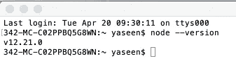
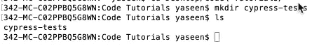
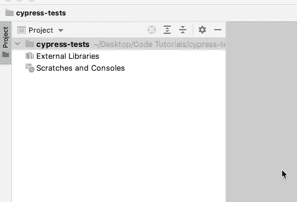
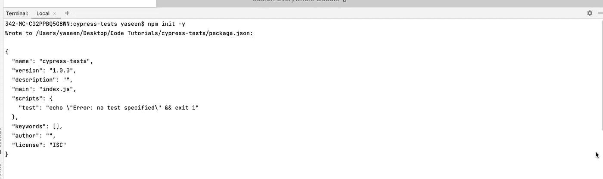
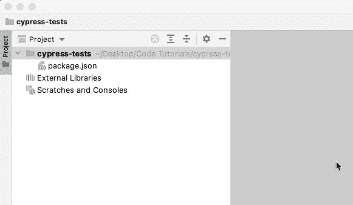
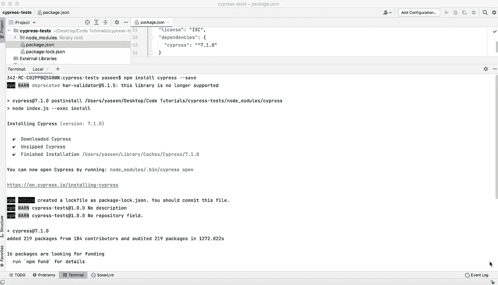
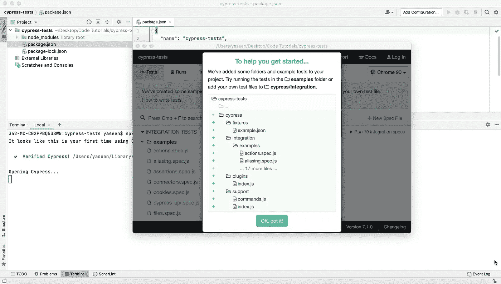
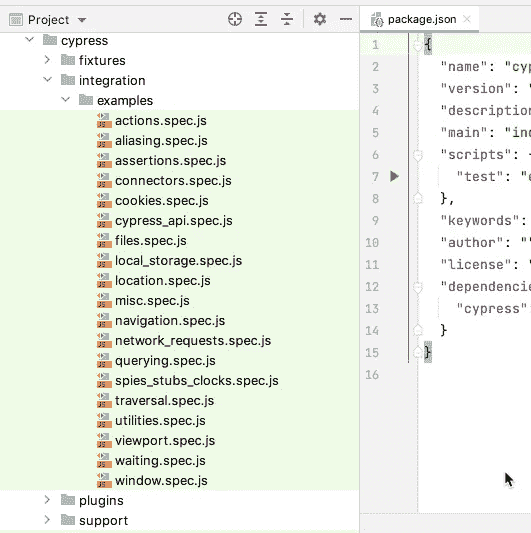
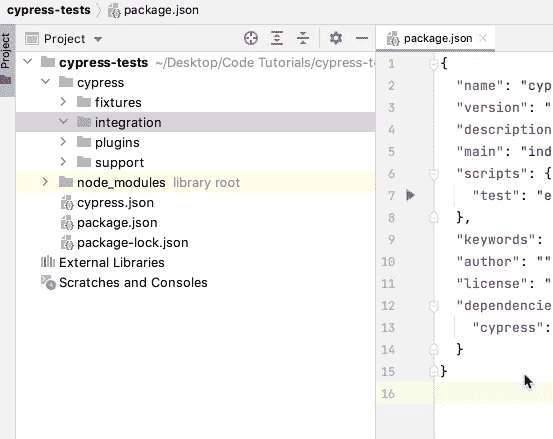

# 树立柏树

> 原文：<https://medium.com/nerd-for-tech/setting-up-cypress-193166f85b33?source=collection_archive---------5----------------------->


**安装先决条件**
我们必须安装几个项目也要安装 Cypress 来进行这个教程:NodeJS 和 NPM。注意，Cypress 是一个 JavaScript 自动化工具，所以我们必须使用现代的 JavaScript 工具包。这个工具包包含了 NodeJS 和 NPM 这样的东西。
(如果您还没有构建 NodeJS，现在是时候这么做了。应该安装 NodeJS 网站的 NodeJS。链接可以在这里找到参考资料:【https://nodejs.org/en/】T4。

如果已经启用了 NodeJS，请确保版本等于或高于 v8。让我们看看怎么做。打开终端窗口并键入:

```
node --version
```



节点版本

我有 12.21.0 节点没关系。任何 8.0.0 版本都可以。

编辑器或 IDE 也是必不可少的。由于它是我最喜欢的编辑器，我将使用 WebStorm 并拥有出色的 Javascript 支持。如果你有另一个编辑，没关系。

**安装柏树**
现在我们已经为柏树安装做好了准备。Cypress 是一个软件 NPM，通常安装在本地，在与测试代码相同的文件夹中，我们安装 NPM 包。我们必须从创建测试代码所在的文件夹开始。你知道，我在命令行上是个怪胎，所以我会在命令行上做这种事情。我展示的所有命令都可以在 Windows、Linux 和 macOS 上运行，所以不要担心——它们会在您身上运行。

现在让我们创建我们的文件夹。让我们把它命名为“柏树测试”。

```
mkdir cypress-tests
```



创建文件夹

我们的文件夹只在要进行测试的地方开发。我只是通过网络风暴打开创建的文件夹，文件夹是空的，你可以看到。



空文件夹

好的，很明显:那里没有创建任何文件！先说 package.json，你想知道 package.json 文件是什么吗？所以，我们来做吧，然后我来演示一下。我将打开终端，在 npm 上运行 init -y。这一次，为了同时执行命令和修改代码，我将在 IDE 中打开一个终端。



创建 package.json

我们使用 npm 命令构建了 package.json，它为 npm 命令初始化文件夹。



文件夹中的 package.json

好了，让我们安装赛普拉斯吧。当使用 NPM 时，所有的安装都是本地的，所以我们将它们安装在我们创建的文件夹中。这很棒，因为它允许各种应用程序拥有不同的 cypress 模型或团队安装的其他包。那就这么办吧！所以，让我们这样做吧！

```
npm install cypress --save
```

几分钟后，基于网络带宽安装了 Cypress。您可以看到 node_modules 文件夹出现在我们的项目文件夹中。package.json 用 cypress 依赖项进行更新。



Cypress 安装成功

现在让我们跑柏树。
好的，我们目前还没有测试，但是我们必须运行一次来构建我们需要的足够的文件夹。让我们运行它，然后。让我们运行它。您必须使用 npx 在本地执行 kit 命令。

```
npx cypress open
```

一个名为“赛普勒斯”的“地方指挥部”安装了赛普勒斯，我和 NPX 一起管理它。我运行 npx cypress，要求一个文件夹结构，用户界面被打开，并被告知它产生了我们。



NPX 被处决后

在我关闭 UI 后，创建了一个名为“cypress”的文件夹，里面有几个子文件夹。“集成”是最关键的事情——这是我们编写测试的地方。它为我们的使用做了示例测试。



生成的文件夹结构

让我们暂时删除示例文件夹，以免分散我们的注意力。



删除示例后的文件夹结构