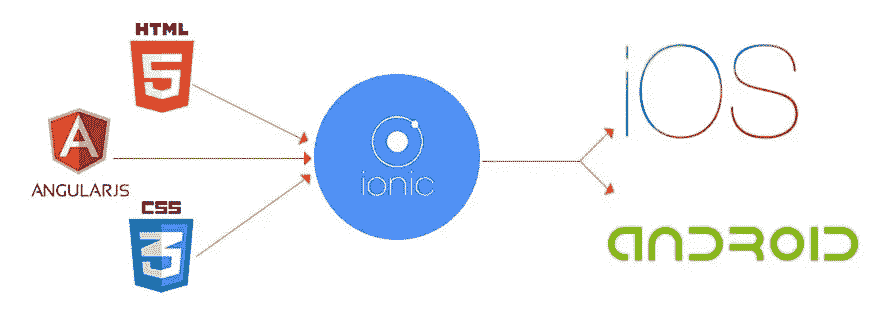

# 建立离子框架

> 原文：<https://medium.com/nerd-for-tech/setting-up-ionic-framework-d28c0cca5be2?source=collection_archive---------0----------------------->

Ionic framework 是一个开源的 UI 工具包，用于构建功能良好(换句话说，功能符合预期)、高质量的**移动应用**、桌面应用和**渐进式 web 应用(** PWAs)。它允许开发者只需构建一次应用程序，就可以在任何地方运行，简单地跨平台运行。

不要对词汇渐进式网络应用抱有太多的想象。PWAs 是普通的应用程序，就像原生手机一样…