# 设置我们的播放器

> 原文：<https://medium.com/nerd-for-tech/setting-up-our-player-part-1-e71c5da808d1?source=collection_archive---------17----------------------->

和大多数游戏一样，我们要做的第一件事就是创建玩家角色。首先，我们将把我们的玩家资产拖到层次结构中:

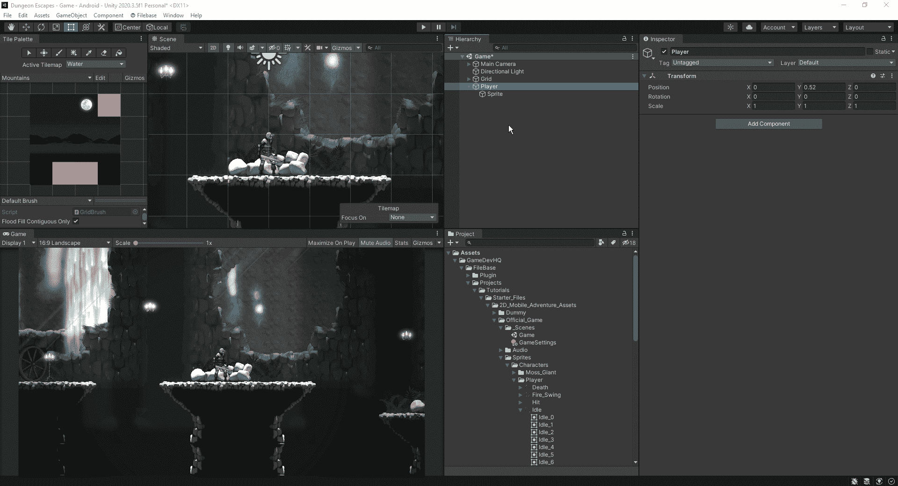

我们在这里所做的是为我们的实际播放器设置精灵，作为它自己的对象，作为播放器对象的子对象。这允许我们在给我们的播放器添加一堆不同的组件时保持检查器更加干净。首先，我们需要为玩家创建一个刚体:

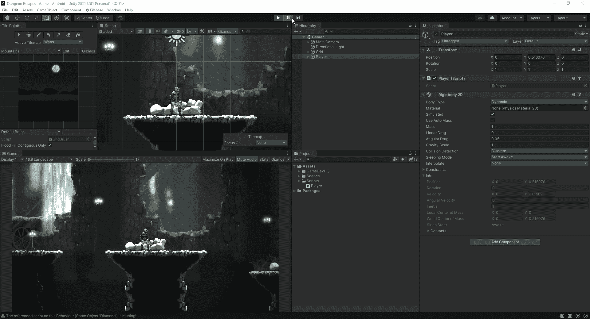

现在的问题是，一旦比赛开始，我们的球员就倒下了。为了解决这个问题，我们想给我们的玩家添加一个碰撞器，但是也对我们的贴图做了一些调整，这样他们也可以内置碰撞器。首先，我们需要添加一个 tilemap 碰撞器:

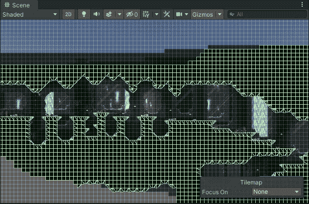

一旦我们在上面添加了 tilemap 碰撞器，我们可以看到在那个区域中被认为是对象的所有东西现在都被赋予了自己的碰撞器。由于我们的部分中有许多不必要的碰撞器，让我们通过添加一个复合碰撞器并调整一些设置来稍微清理一下:

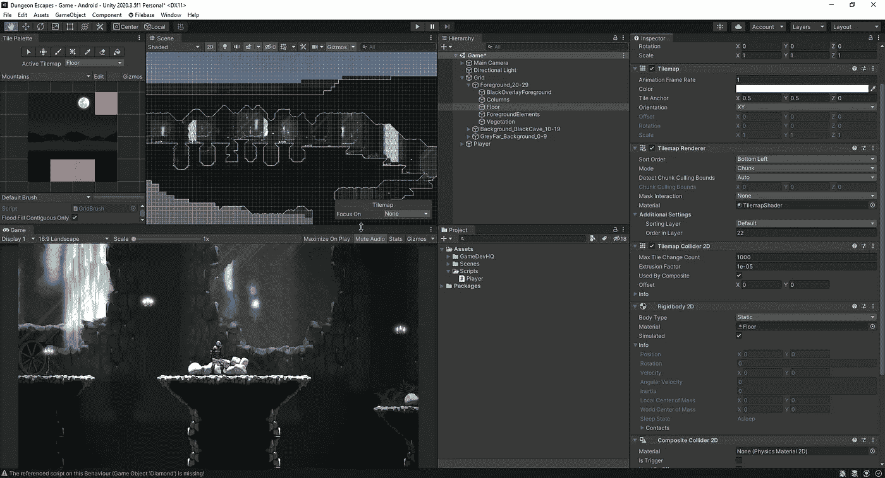

我们在这里所做的是在我们的刚体中，我们将身体类型设置为静态。在 Tilemap 碰撞器中，我们检查了使用复合选项，现在我们得到了一个轮廓清晰的碰撞器。现在我们已经用所需的碰撞器设置好了游戏，是时候进入玩家的脚本并设置运动部分了。至于我们将从什么开始，这将只是我们的基本运动:

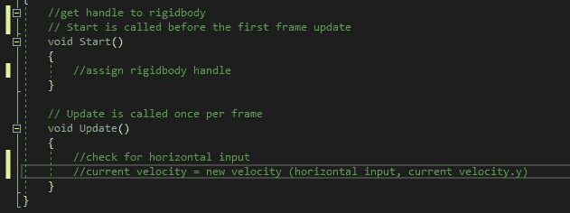

正如我们从伪代码中看到的，我们只是在播放器中创建一些基本的水平移动:

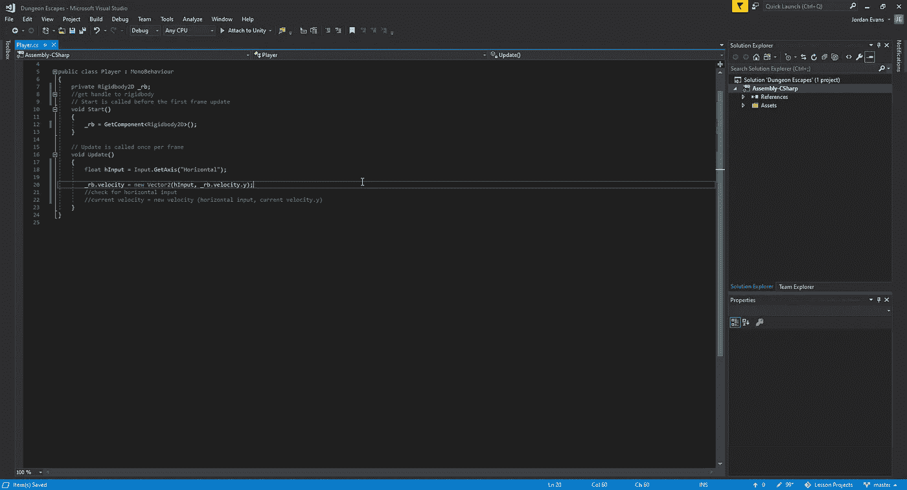

正如我们在上面看到的，我们创建了一个到刚体的连接，这样我们就可以通过它来控制运动。从那里，我们将我们的 hInput 设置为水平键的输入。最后，我们将对象的速度设置为 hInput:

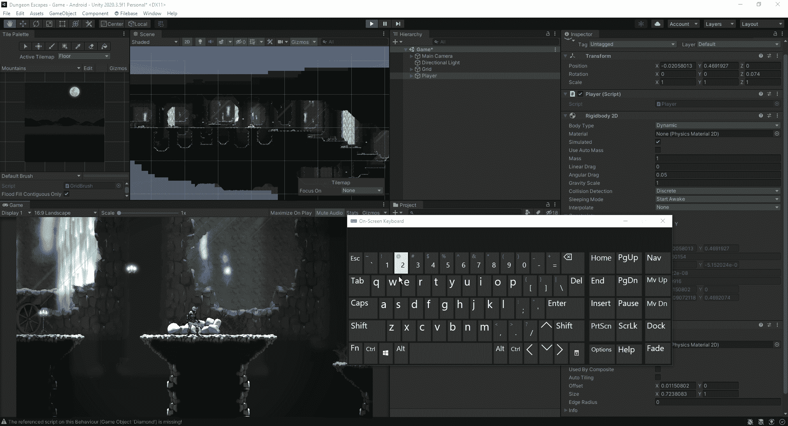

从上面的简短测试中我们可以看出，我们的角色有一点下滑。这是因为 Unity 是如何计算运动的。随着 GetAxis 的设置，unity 缓慢上升到 1，然后缓慢下降到 0。由于这个过程，我们和我们的角色一起经历了一次滑动。为了解决这个问题，我们将对脚本进行快速调整:

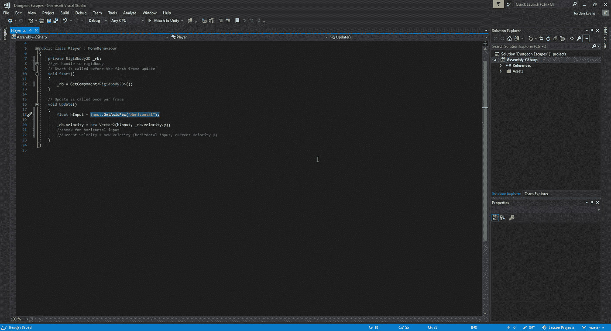

通过使用 GetAxisRaw，输入的值将是整数，而不仅仅是一个逐步攀升的值:

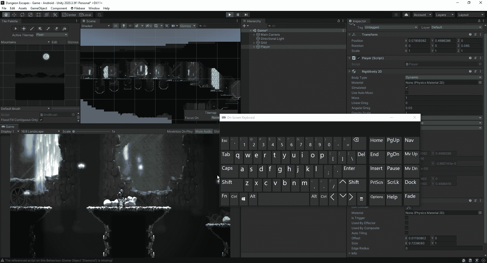

现在我们可以看到这是一个更加平滑的停止，这将有利于我们以后开始为我们的玩家添加不同的动画。
接下来，我们来看看如何让我们的角色跳跃。因为它会有一些与我们的平台相同的方面，我们将在这里使用相同的原则，但在 2D 方面代替:

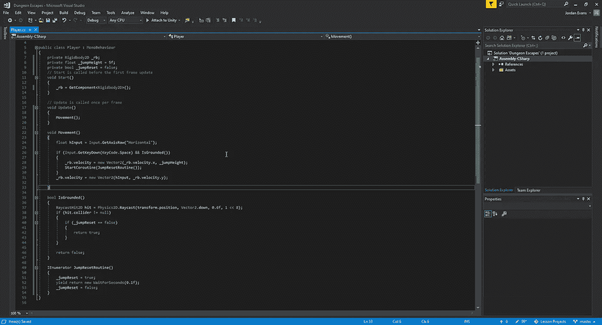

因此，我们在上面所做的是清理我们的更新语句，这样它就有了我们的移动方法作为最佳实践。最好是尽量保持我们的更新方法尽可能的干净，并创造新的空间来运行我们的代码。从那里，我们将创建一个跳转方法，在这个方法中，如果我们按下 Space 键，我们就调用它，同时我们的 IsGrounded void 也被调用。为了让我们的方法调用正确，我们将创建一个快速的协程，允许我们的代码在激活之间稍作喘息，这样就不会在同一个帧中触发它的开启和关闭。至于我们的 IsGrounded 方法，我们必须做的是找到一种方法，让我们的光线只检测地面，而不是球员和场景中的其他一切。为了做到这一点，我们需要利用位移位的方法。这种方法允许我们选择一个图层蒙版，这意味着我们需要将我们所在的楼层分配给一个特定的图层:

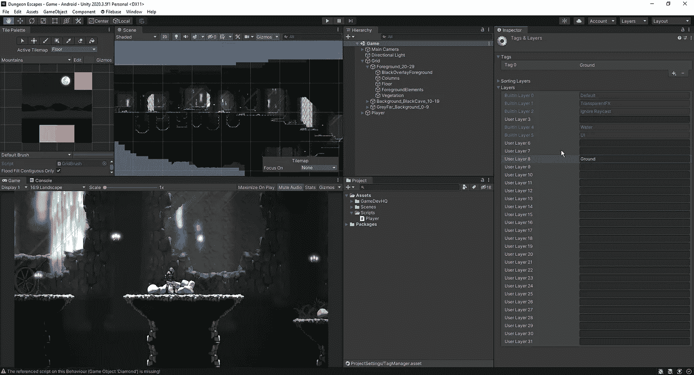

最后，如果它被触发允许我们跳跃，我们将返回我们的代码，否则如果我们试图在不接地的情况下跳跃，bool 将再次运行:

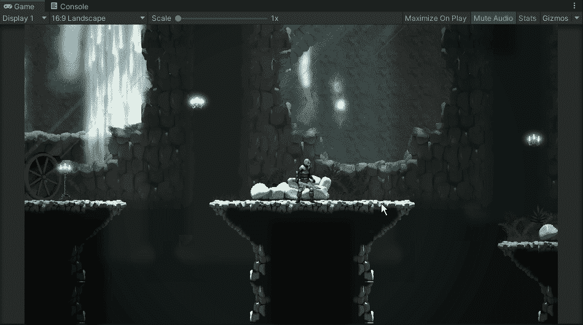

我们基本动作的最后一部分将快速添加一种方式，让我们的球员跑得比他现在的速度更快，我们可以在未来操纵这种方式:

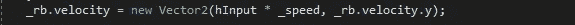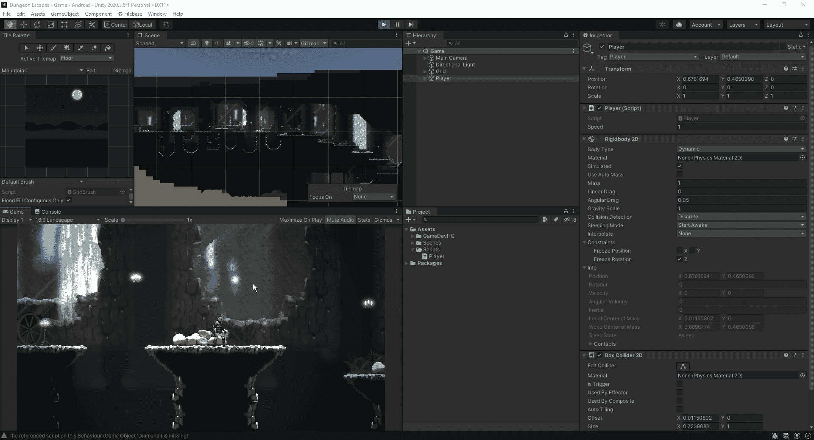

现在我们已经有了角色的基本设置，我们可以看下一部分，并添加一些动画来表现我们的角色在游戏中的行为。