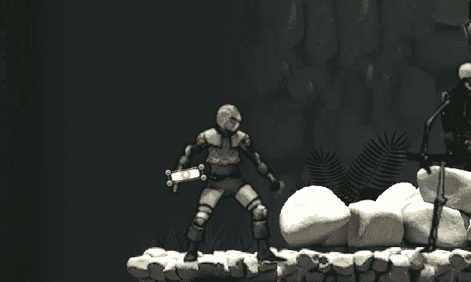

# 为 Hitbox 战斗系统设置玩家攻击脚本

> 原文：<https://medium.com/nerd-for-tech/setting-up-player-attack-script-for-hitbox-combat-system-ef06e8c97c54?source=collection_archive---------8----------------------->

## Unity 中的初级游戏开发

## //清理 hitbox 并设置基本攻击脚本。

玩家在行动中攻击

昨天我们设置了玩家的剑来使用一个碰撞器，当敌人被击中时，它会激活剑来探测。我们今天将对此进行一点扩展，以获得…