# 使用 Visual Studio 代码设置 Python 开发环境

> 原文：<https://medium.com/nerd-for-tech/setting-up-python-development-environments-with-visual-studio-code-d442ef26dc13?source=collection_archive---------0----------------------->

*【更新时间:2021 年 1 月 3 日】*

[Visual Studio Code](https://code.visualstudio.com/) (VS Code)几年来一直是我最喜欢的编辑器。随着微软和社区的活动增强，VS 代码有了许多扩展来满足不同的开发需求。有了远程开发扩展，我现在可以在所有环境中为我的日常工作和开源项目使用 VS 代码。本文是 Python 开发的 VS 代码设置的简短教程——我日常使用的设置。希望本教程可以帮助那些想使用 VS 代码进行 Python 开发的人。此外，VS 代码有大量的文档。更多详情请访问 https://code.visualstudio.com/docs。

# 情节

本教程使用一个简单的 Python 项目来演示在 Windows 10、Windows Subsystem for Linux、remote Linux 和 Raspberry Pi 上进行 Python 开发的 VS 代码设置。

Python 项目具有以下布局:

```
project
  |---- mathlib
  |           |---- __init__.py
  |           |---- compute.py
  |---- test_compute.py
```

`compute.py`和`test_compute.py`的内容是:

compute.py

```
def inc(value: int) -> int:
    """Return the number increased by one."""
    return value + 1

def dec(value: int) -> int:
    """Return the number decreased by one."""
    return value - 1
```

test_compute.py

```
from mathlib import compute

def test_int():
    assert compute.inc(value=5) == 6

def test_dec():
    assert compute.dec(value=5) == 4
```

# Windows 集中安装

虽然 VS 代码可以在不同的平台上运行，例如 Linux 和 macOS，但是本教程使用 Windows 10 作为运行 VS 代码的中心。

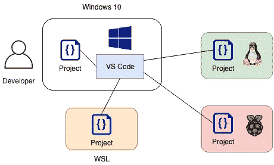

# 假设和要求

本教程中使用的软件有:

*   带有扩展的 Visual Studio 代码 1.52:Python 2020.12、远程开发 0.20.0、Pylance 2020.12.2
*   Python 3.9
*   Windows 10 2004
*   Ubuntu 20.04(用于 WSL 和远程 Linux)
*   树莓 Pi 3 B+上的 Raspbian

典型的 Python 开发包括虚拟环境、林挺、测试和调试。本教程使用:

*   [venv](https://docs.python.org/3/library/venv.html) 创建虚拟环境
*   [pytest](https://docs.pytest.org/en/latest/) 用于单元测试
*   [衬片 8](https://flake8.pycqa.org/en/latest/index.html)
*   [mypy](http://mypy-lang.org/) 用于类型检查
*   [pydocstyle](https://pypi.org/project/pydocstyle/) 用于文档样式检查
*   [黑色](https://black.readthedocs.io/en/stable/)用于代码样式检查

Python 扩展支持上面所有的 linters。https://code.visualstudio.com/docs/python/linting 林挺的更多细节。

# 在 Windows 上安装

由于 Windows 10 是本教程中 VS 代码运行的主机，我们需要在 Windows 主机上安装 VS 代码。

# 安装 VS 代码

1.  从 https://code.visualstudio.com/的[下载 VS 代码。教程写的时候，最新版本是 1.52。](https://code.visualstudio.com/)
2.  双击下载的二进制文件`VSCodeUserSetup-x64-1.52.1.exe`进行安装。

# 安装 VS 代码扩展

VS 代码有成千上万的扩展； [Python](https://marketplace.visualstudio.com/items?itemName=ms-python.python) 和[远程开发](https://marketplace.visualstudio.com/items?itemName=ms-vscode-remote.vscode-remote-extensionpack)扩展是 Python 在 Windows 和远程平台上开发的最小扩展。Pylance 是可选的，但是强烈推荐，它为 Python 提供了快速和功能丰富的语言支持。

*   启动 VS 代码。
*   单击扩展图标


或者键入`Ctrl+Shift+X`打开扩展窗口。

*   在搜索栏上，输入 Python 并安装它。
*   在搜索栏上，键入 Remote Development 并安装它。远程开发扩展还安装远程容器、远程 SSH、远程 SSH:编辑配置文件和远程 WSL。

安装完成后，VS 代码应该如下所示:

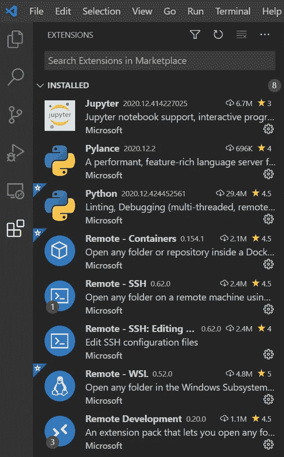

# 同步与代码设置

由于 [VS 代码 1.48](https://code.visualstudio.com/updates/v1_48) ，设置同步功能在稳定版本中可用。该特性允许我们在所有机器上同步 VS 代码设置，比如配置、扩展和按键绑定。当我们有多台设备时，这很方便。强烈建议启用它。看这里的官方文件:[https://code.visualstudio.com/docs/editor/settings-sync](https://code.visualstudio.com/docs/editor/settings-sync)

# 在 Windows 上设置 Python 开发环境

要在 Windows 上运行 Python 代码，我们需要安装 Python

# 安装 Python

我们可以通过 1 安装 Python。[微软商店](https://www.microsoft.com/en-us/p/python-39/9p7qfqmjrfp7#activetab=pivot:overviewtab)，或者 2。 [Python](https://www.python.org/downloads/) 官网。按照说明进行安装。写这篇文章的时候最新的稳定版本是 3.9。

# 创建虚拟环境

假设我们使用`C:\workspace`作为本教程的工作空间，而`working_environment`是我们的虚拟环境。使用`Command Prompt`发出以下命令:

```
C:\Users\user> cd C:\workspace
C:\Users\user> python3.9 -m venv working_environment
```

# 创建项目并设置 VS 代码

现在我们已经准备好用 VS 代码创建项目了。

*   在`C:\workspace\`下创建一个名为`project`的新文件夹
*   启动 VS 代码
*   文件->打开文件夹
*   打开*项目*文件夹
*   添加在**图**部分显示的文件夹和文件，如下所示

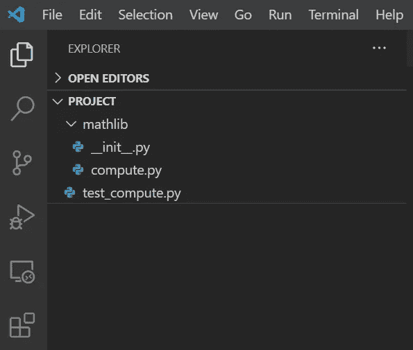

一旦我们添加了一个 Python 文件，VS 代码会自动检测 Python 环境；默认情况下，它选择系统默认的 Python 解释器。


它也可能检测到没有安装的东西，例如 *pylint* 和 *pytest* 。

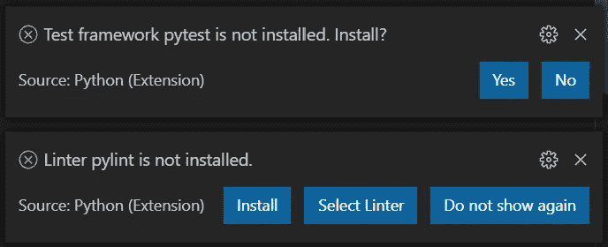

现在忽略它们，因为我们不想将它们安装到系统 Python 解释器中。

*   我们想使用虚拟环境，`working_environment`，我们刚刚为这个项目创建的。为此，我们需要告诉 VS 代码虚拟环境的路径。
*   文件->首选项->设置
*   在顶部搜索栏键入`venv path`，配置选项将会出现
*   如下图所示添加`C:\workspace`

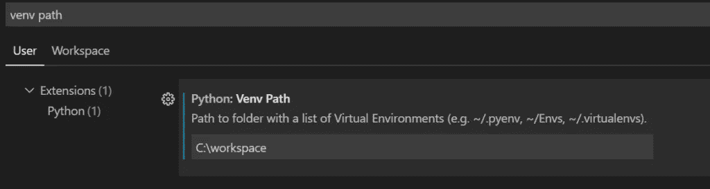

*   点击 Python 解释器图标选择`working_environment`。`working_environment`现在应该有了。如果它没有出现，重新启动 VS 代码。
*   点击图标并选择`working_environment`

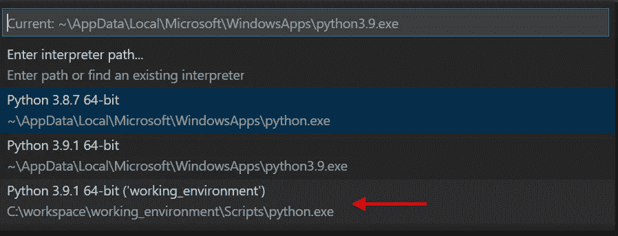

*   一旦我们建立了虚拟环境，如果 VS 代码碰到了建议窗口，我们就可以安装 VS 代码检测到的缺失组件(例如`pytest`)。

(要了解更多关于 Python 虚拟环境的信息，请查看[https://code.visualstudio.com/docs/python/environments](https://code.visualstudio.com/docs/python/environments))

# 配置林挺、类型检查等

默认情况下，VS 代码启用了一些 linters，比如`pylint`。它还允许我们定制我们的林挺配置。本节以`flake8`为例演示定制。

*   文件->首选项->设置，并在顶部搜索栏输入林挺。选项将会出现。

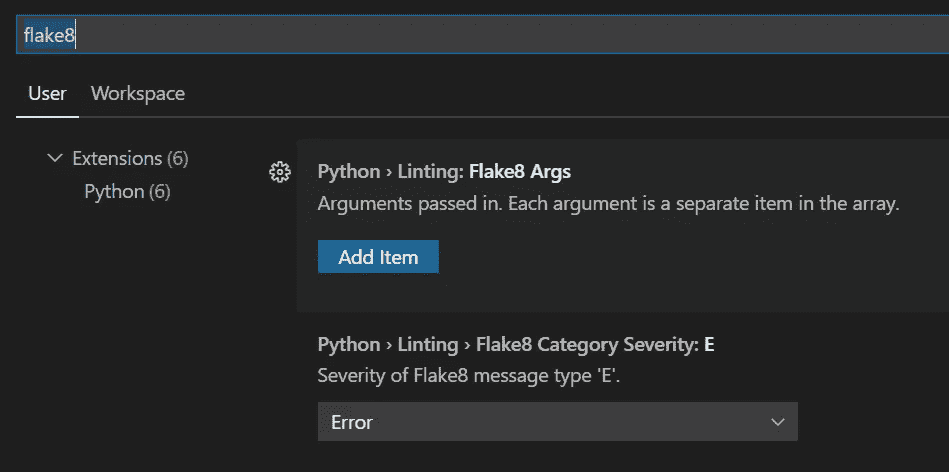

*   启用并安装`flake8`。
*   勾选`flake8`选项框。


*   我们一选中这个框，就会弹出一个安装选项。点击安装`flake8`。如果窗口没有出现，重新加载 VS 代码。

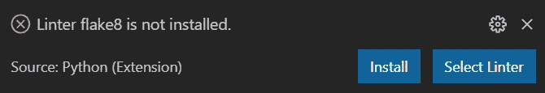

*   如果我们想添加非默认选项`flake8`，点击 Add Item 按钮。

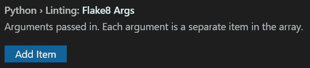

*   添加我们想要的参数。例如，如果我们希望将最大行长度设置为 88，我们可以执行以下操作。

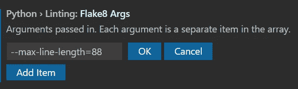

重复相同的步骤配置其他棉条，如`mypy`、`black`和`pydocstyle`。

要了解更多关于林挺配置的信息，请参考 VS 代码文档:[https://code.visualstudio.com/docs/python/linting](https://code.visualstudio.com/docs/python/linting)。

# 测试和调试

对于测试和调试的设置，VS Code 有非常全面的文档。

*   测试:[https://code.visualstudio.com/docs/python/testing](https://code.visualstudio.com/docs/python/testing)
*   调试:[https://code.visualstudio.com/docs/python/debugging](https://code.visualstudio.com/docs/python/debugging)

现在，我们应该有一个使用 VS 代码的 Python 项目的工作环境了。

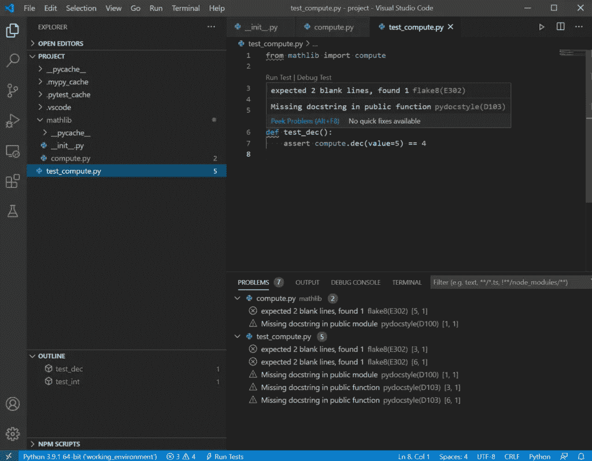

# 通过 SSH 在 Linux 上设置 Python 开发环境

VS Code Remote——SSH 扩展允许我们在运行 SSH 服务器的远程机器上打开远程文件夹，并充分利用 VS 代码，比如自动完成、调试和林挺。

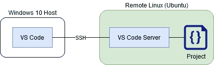

**假设:**本节假设我们有一个启用了 SSH 的远程 Linux (Ubuntu 20.04)。

# 第一步:在 Windows 10 主机上安装 OpenSSH 客户端

要安装 OpenSSH，请执行以下操作:

设置->应用->应用和功能->可选功能->可选功能->添加功能

找到 OpenSSH 客户端，然后单击“安装”。安装完成后，它应该如下所示:

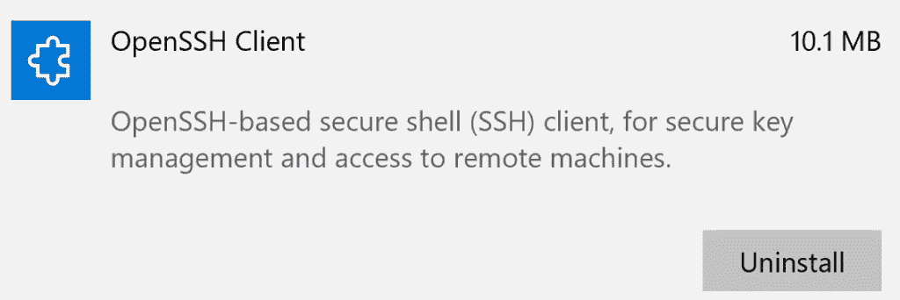

OpenSSH 的更多选项可以在[https://docs . Microsoft . com/en-us/windows-server/administration/OpenSSH/OpenSSH _ install _ first use](https://docs.microsoft.com/en-us/windows-server/administration/openssh/openssh_install_firstuse)找到。

# 步骤 2:设置 SSH 密钥

在 Windows 10 主机上，启动命令提示符并执行以下步骤:

*   生成一个 SSH 密钥对。并接受所有默认值。

```
C:\Users\user> ssh-keygen -t rsa -b 4096
```

将本地公钥的内容(`id_rsa.pub`)添加到 SSH 主机(即远程 Linux)上适当的`authorized_keys`文件中。

```
C:\Users\user> SET REMOTEHOST=your-user-name-on-host@host-fqdn-or-ip-goes-here
```

将本地公钥复制到远程 Linux。

```
C:\Users\user> scp %USERPROFILE%\.ssh\id_rsa.pub %REMOTEHOST%:~/tmp.pub
C:\Users\user> ssh %REMOTEHOST% "mkdir -p ~/.ssh && chmod 700 ~/.ssh && cat ~/tmp.pub >> ~/.ssh/authorized_keys && chmod 600 ~/.ssh/authorized_keys && rm -f ~/tmp.pub"
```

# 步骤 3:连接到远程 Linux 主机

*   在 Windows 10 上启动 VS 代码
*   单击远程开发图标


并选择`SSH Targets`添加一个 SSH 主机。

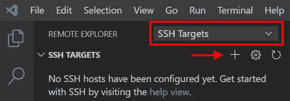

或者键入`Ctrl+Shift+P`启动命令面板，键入`Remote-SSH: Connect to Host...`并选择`Add New SSH Host ...`

*   按照说明添加远程主机，并选择适当的`config`文件进行存储。它可能看起来像`C:\Users\user\.ssh\config`。

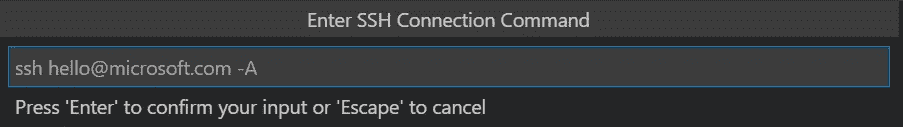

*   我们也可以打开配置文件来检查它的细节并修改它。配置可能看起来像这样

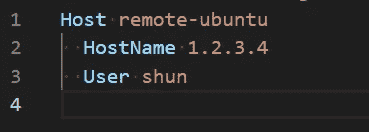

*   单击 connect 图标(在本例中，它的名称是 remote-ubuntu)连接到远程机器。

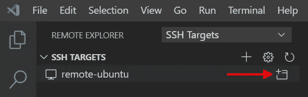

*   将会打开一个新窗口，要求用户选择远程平台并输入密码。选择`Linux`作为远程平台，并输入密码。

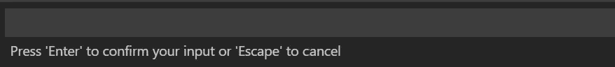

*   一旦连接建立，图标


会出现。

*   在远程 Linux 上安装 Python 扩展。Python 扩展已经安装在 Windows 主机上，但没有安装在远程 Linux 上。为了提供 VS 代码提供的所有 Python 特性，我们需要在远程 Linux 上安装 Python 扩展。
*   单击扩展图标


。它应该显示类似下图的内容

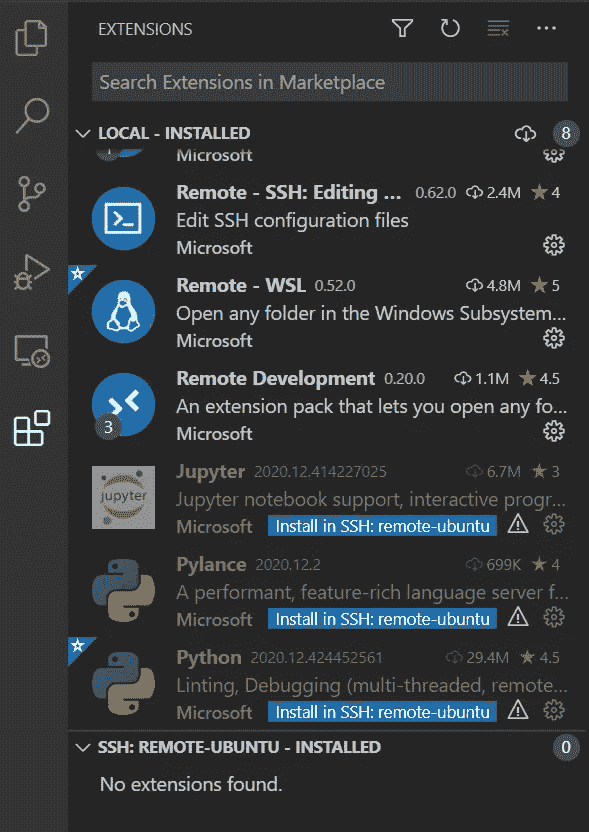

顶部指示安装在本地机器上的扩展，在本例中即 Windows 10。底部显示了安装在远程机器上的扩展，在本例中是 Ubuntu 20.04。现在远程机器没有安装任何扩展。

*   点击`Install in SSH`按钮，在远程机器上安装 Python 扩展。


*   安装完成后，扩展窗口变成

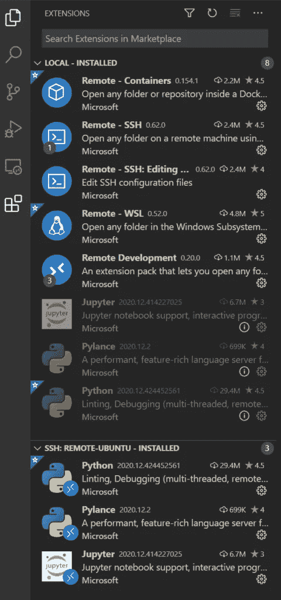

# 步骤 4:设置项目

**在远程 Linux 上**

现在，我们可以在远程 Linux 上创建虚拟环境和 Python 项目。

*   SSH 到远程 Linux 机器。
*   创建工作区文件夹

```
$ mkdir workspace
$ cd workspace/ 
```

*   创建虚拟环境，`working_environment`

```
$ python3.9 -m venv working_environment
```

*   创建项目文件夹

```
$ mkdir project
```

**在 Windows 主机上**

*   如果我们尝试通过 File -> Open Folder 打开一个文件夹，它将显示远程 Linux 文件系统。选择上面创建的项目文件夹。

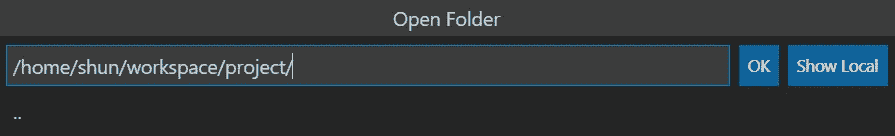

重复一节中提到的步骤:**创建项目并设置 VS 代码**。注意:我们为 Windows 更改的设置是针对每个用户的。这里，我们应该更改**遥控器**的设置。

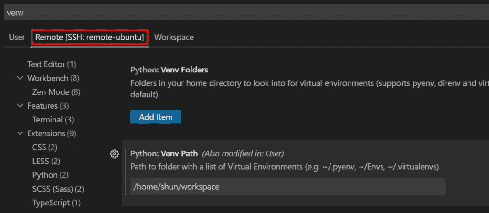

现在，VS 代码应该可以在远程 Linux 机器上进行 Python 开发了。

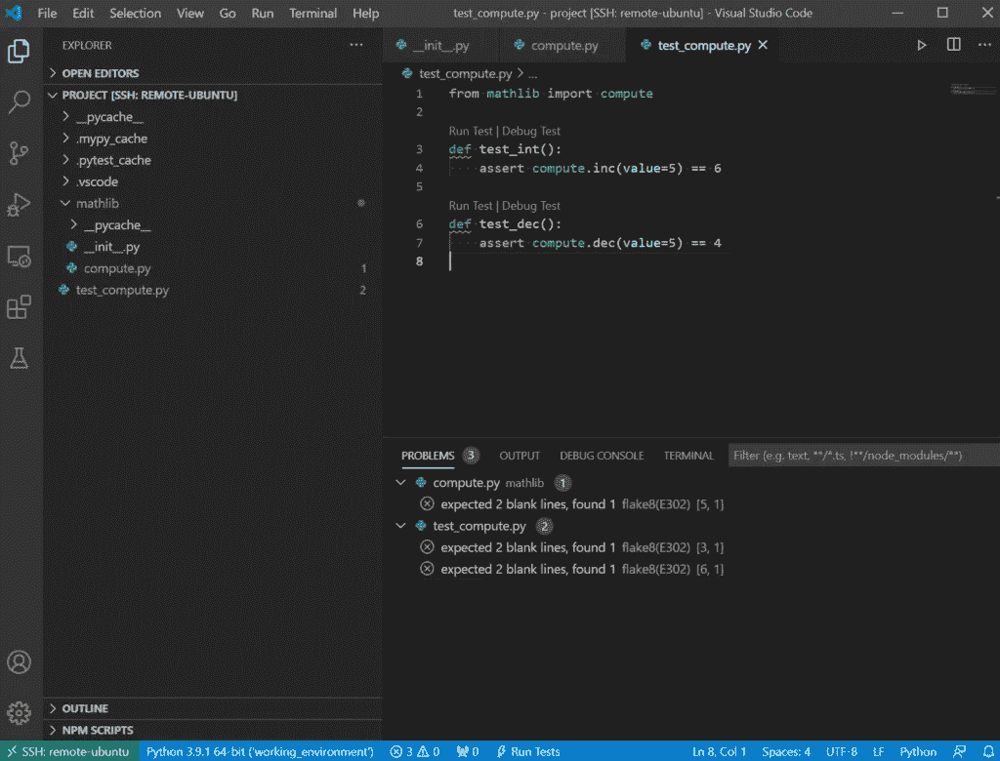

在[https://code.visualstudio.com/docs/remote/ssh](https://code.visualstudio.com/docs/remote/ssh)查看远程开发文档。

# 通过 SSH 在 Raspberry Pi 上设置 Python 开发环境

从 2020 年初开始，VS 代码正式支持 ARM 架构。因此，我们可以像普通远程 Linux 一样在 Raspberry Pi 上设置远程开发。

按照**中提到的步骤，通过 SSH** 在 Linux 上设置 Python 开发环境。步骤是一样的。唯一的区别是远程 Linux 机器在 Raspberry Pi 上变成了 Raspbian。

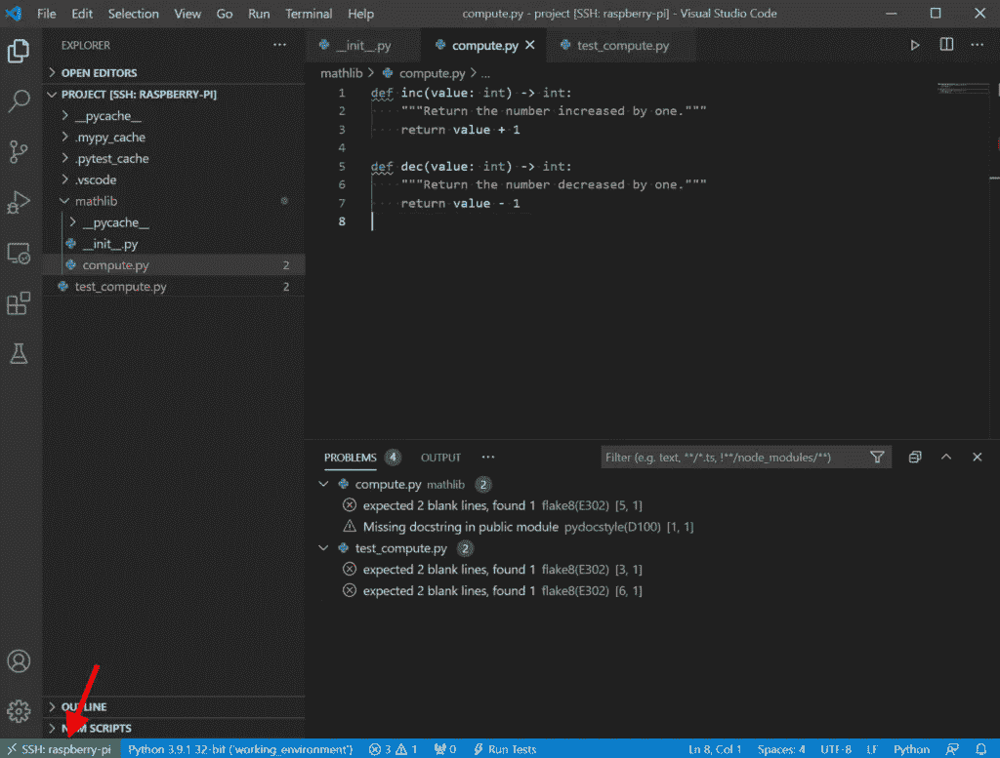

# 用 WSL 设置 Python 开发环境

用于 Linux 的 [Windows 子系统](https://docs.microsoft.com/en-us/windows/wsl/about)让开发人员直接在 Windows 上使用 Linux 环境，而无需使用虚拟机。有了远程开发扩展，我们可以享受 VS Code 的全部特性，并在 Windows 上开发、运行和调试基于 Linux 的应用程序。

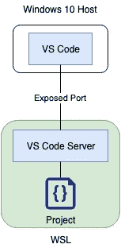

# 步骤 1:启用并安装 WSL

按照说明启用并安装 WSL:[https://docs.microsoft.com/en-us/windows/wsl/install-win10](https://docs.microsoft.com/en-us/windows/wsl/install-win10)

# 步骤 2:创建一个虚拟环境和项目

从 WSL 命令行发出以下命令:

*   创建工作区。

```
$ mkdir workspace
$ cd workspace
```

*   创建虚拟环境，`working_environment`。

```
$ python3.9 -m venv working_environment
```

*   创建项目文件夹。

```
$ mkdir project
```

# 步骤 3:从 VS 代码连接到 WSL

*   启动 VS 代码。
*   单击远程开发图标


并选择 *WSL 目标* s 添加一个 WSL 目标。

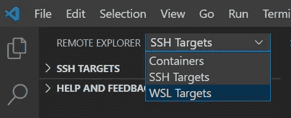

或者键入`Ctrl+Shift+P`启动命令面板，然后键入`Remote-WSL: New Window`

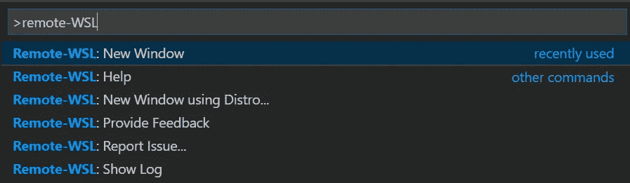

*   选择`Remote-WSL: New Window`后，一个新的 VS 代码窗口将出现并连接到 WSL。在左下方，这个图标


指示 VS 代码已连接到 WSL。

*   与远程 SSH 一样，我们需要在 WSL 上安装 Python 相关的扩展。单击按钮进行安装。


# 步骤 4:设置项目

一旦 VS 代码连接到 WSL，我们就可以用与 Windows 和远程 Linux 项目相同的方式来设置 Python 项目。

*   打开项目文件夹。

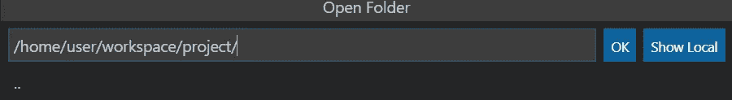

*   重复一节中提到的步骤:**创建项目并设置 VS 代码**。注意:和远程 SSH 一样，对于 WSL，我们要更改**Remote【WSL:Ubuntu】**下的设置。

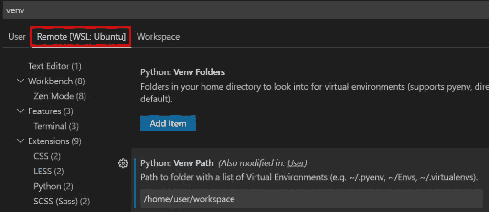

现在，VS 代码应该可以用 WSL 进行 Python 开发了。

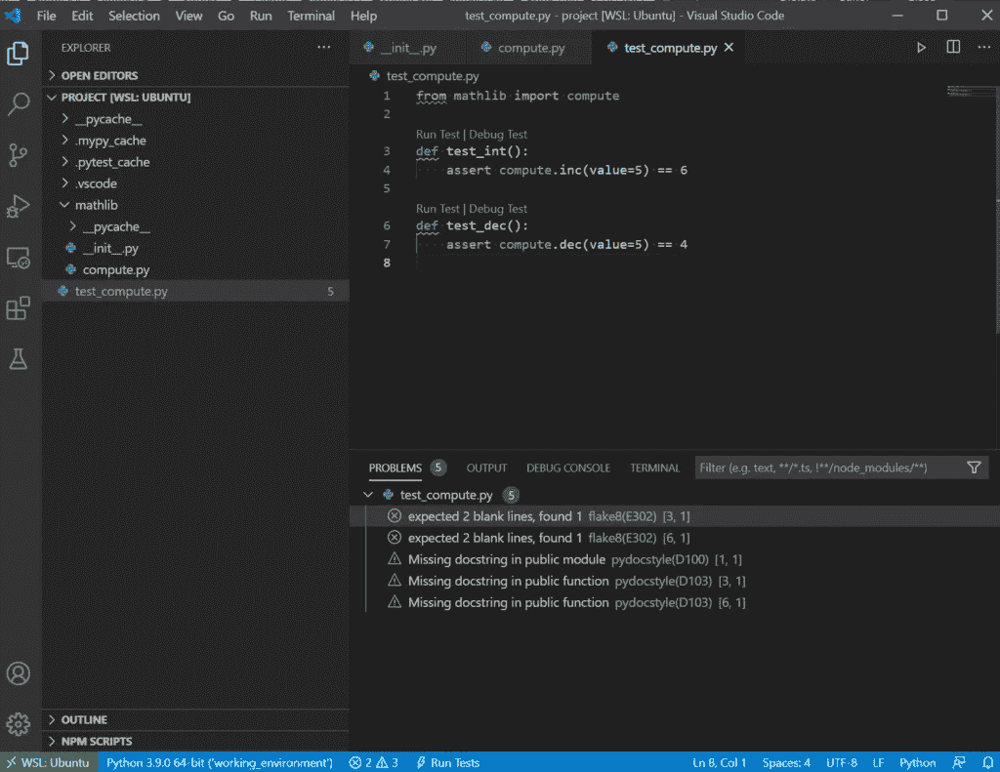

使用 WSL 远程开发的更多细节可以在[https://code.visualstudio.com/docs/remote/wsl](https://code.visualstudio.com/docs/remote/wsl)找到。

# 结论

通过扩展和设置，VS 代码是高度可扩展和可配置的，因此开发人员可以通过扩展添加功能和配置 VS 代码来增强我们的工作流。除了 Python 和远程开发扩展之外，下面是我认为有用并且日常使用的扩展列表。

*   [书签](https://marketplace.visualstudio.com/items?itemName=alefragnani.Bookmarks)帮助浏览代码。
*   [括号对上色器](https://marketplace.visualstudio.com/items?itemName=CoenraadS.bracket-pair-colorizer)高亮匹配的括号。
*   [代码拼写检查器](https://marketplace.visualstudio.com/items?itemName=streetsidesoftware.code-spell-checker)检查源代码的拼写。
*   [GitLens](https://marketplace.visualstudio.com/items?itemName=eamodio.gitlens) 提供无缝导航和探索 Git 库。
*   [Visual Studio IntelliCode](https://marketplace.visualstudio.com/items?itemName=VisualStudioExptTeam.vscodeintellicode) 为 Python 提供 AI 辅助开发特性。

虽然本教程使用 Windows 10 作为 VS 代码的宿主，但是 VS 代码可以在 Linux 和 Mac 上安装运行。我们可以将文章中描述的设置应用于 Linux 和 Mac。希望这篇文章对你有用。

*原载于 2019 年 9 月 4 日*[*https://shunsvineyard . info*](https://shunsvineyard.info/2019/09/04/setting-up-python-development-environments-with-visual-studio-code/)*。*