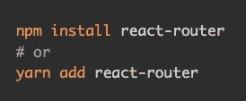
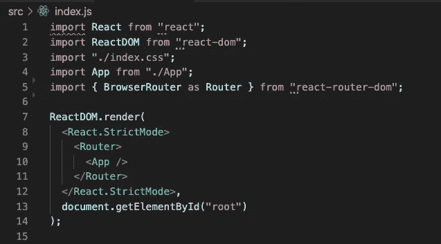
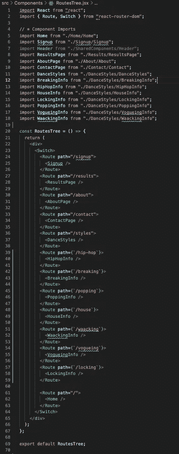
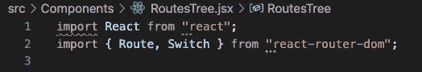
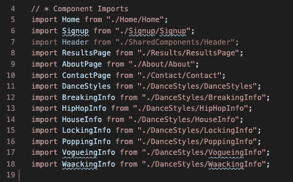
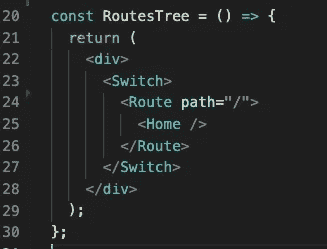
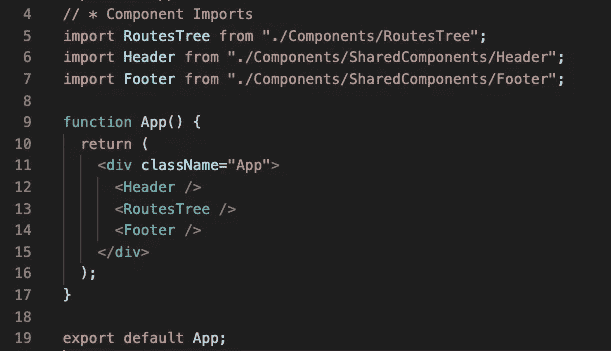

# 在 create-react-app 中设置 React 路由器

> 原文：<https://medium.com/nerd-for-tech/setting-up-react-router-in-your-create-react-app-e00f9e020c08?source=collection_archive---------4----------------------->

如果你正在开发一个有多个页面的 react-app，你会想看看这个整洁的 react 路由器包。

React Router 顾名思义就是管理 React 组件的路由。

在本文中，我们将介绍如何为组件设置基本路由，并从我正在开发的一个 dance 站点中绘制示例。

好了，我们开始吧！

首先，安装反应路由器。

一旦安装了这个包，转到 src 目录下的 index.js 文件，从“react-router-dom”导入 BrowserRouter 作为路由器。

然后继续用路由器组件包装您的应用程序组件。

通过这样做，App 中的所有组件都将能够与路由器通信，并参与其网络。

完成后，您就可以开始创建路线了。

*   此时，您可以在 App 组件中绘制您的路线，但在这种情况下，我有一堆要路由到的页面，我宁愿将它们组织在另一个名为 RoutesTree 的组件中。我也喜欢让我的应用程序组件在代码行数上保持轻盈。

RoutesTree 组件

但是让我们放大。

重要的部分是这个。

从“react-router-dom”导入路由和交换机组件

将最终呈现用户将访问的页面的组件(任何需要路由的组件)导入到文件中。

然后使用 Switch 组件包装所有路由组件。

在开关元件标记中，可以添加任意数量的布线元件。每个路由组件将接受您导入的一个组件以及一个“路径”属性。您可以将 path 属性设置为您选择的任何端点。

你可以继续这样做，直到你有一个和我之前给你看的一样长的列表。

但这里有一些注意事项。

*   两条路由不能有相同的路径
*   如果您希望页眉和页脚在所有页面上都可见，只需将它们拖出 Switch 组件即可

就像我在 App 组件中做的那样。

RoutesTree/Switch 组件外部的页眉+页脚

*   如果您将“主页”组件的路径设置为“/”，请确保将其作为最后呈现的组件放置→否则路由器将立即注册“/”，并呈现“主页”组件，而不是其他页面(如果您愿意，也可以添加“精确”属性)

就这样了，伙计们！超级简单对吧？希望有帮助！

我强烈推荐浏览一下 [React-Router 文档](https://reactrouter.com/web/guides/quick-start),因为它们都有很好的文档记录，而且这个库可以做一些非常好的东西。

现在启动您的服务器，开始陶醉于您的路由能力。

