# 设置安全摄像头

> 原文：<https://medium.com/nerd-for-tech/setting-up-security-cameras-843d49772b57?source=collection_archive---------15----------------------->

现在我们开始着手解决游戏中的下一个障碍。快结束时，我们有一些安全摄像头，我们必须偷偷通过而不被发现。到目前为止，它们只是静止的，但是让我们改变一下。首先，让我们创建一个动画剪辑，就像我们之前对过场动画所做的那样，并为我们的摄像机创建一个 1 秒钟的运动:

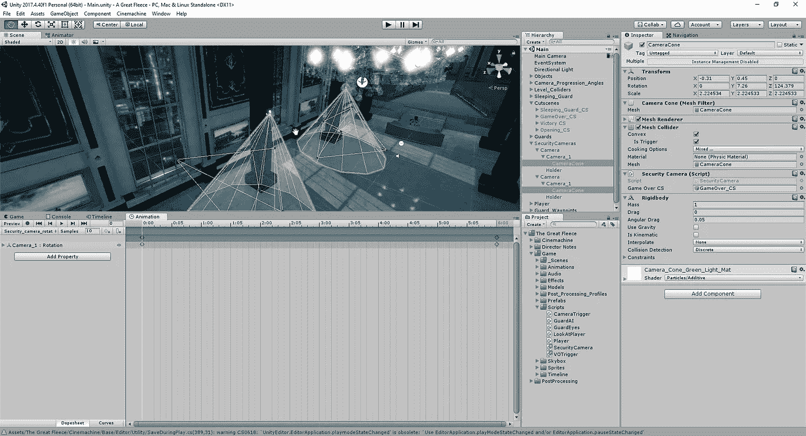

从这里，我们可以进入我们的动画师，做一些调整:

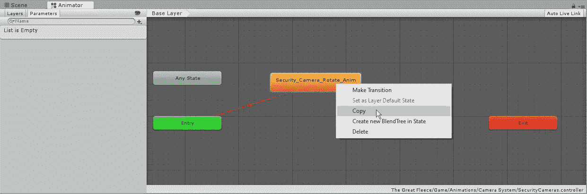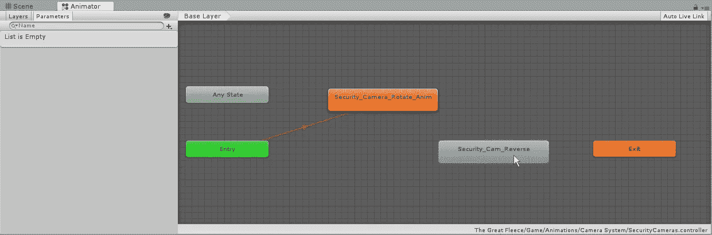

我们在这里做的是创建当前动画的副本。我们要做的是将它的速度调整为-1，因为这将反转动画的方向:

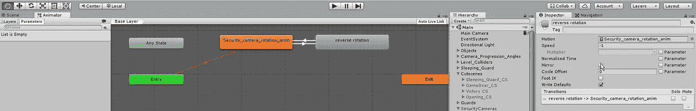

一旦我们在两个方向之间来回转换，我们可以看到我们的摄像机在游戏中来回移动:

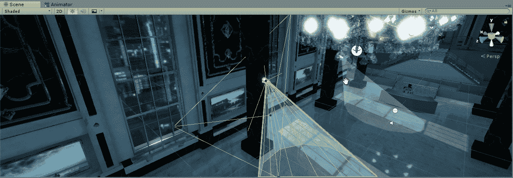

接下来，我们需要为摄像机建立某种检测，以使我们的游戏结束场景。这将是一个过程，就像我们为警卫做的眼睛一样，但由于我们已经有了一个锥体来为我们的相机提供光线，我们可以将它用作我们的探测器:

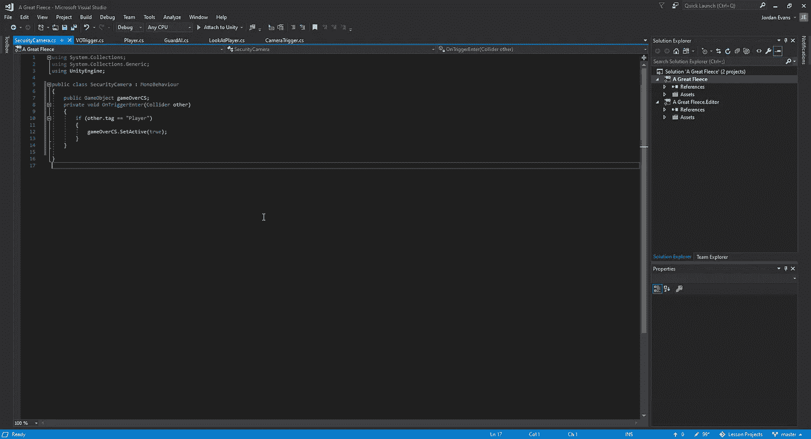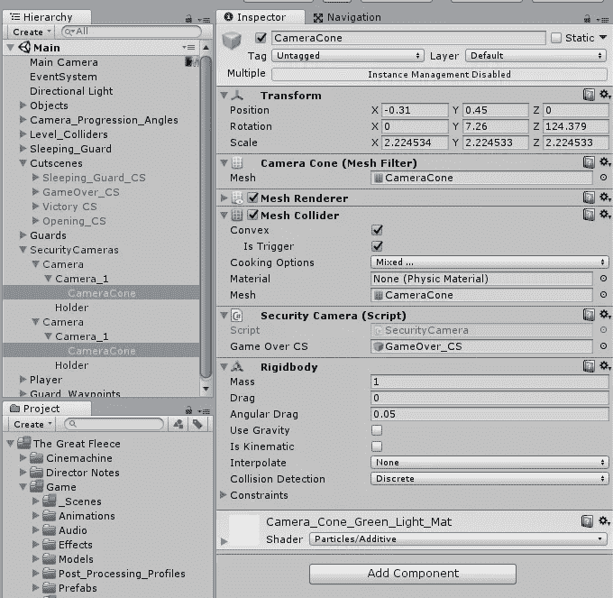

一旦我们将我们的脚本和刚体附加到 Cameracone，我们可以在游戏中测试它，看看它是否切换到我们的过场动画:

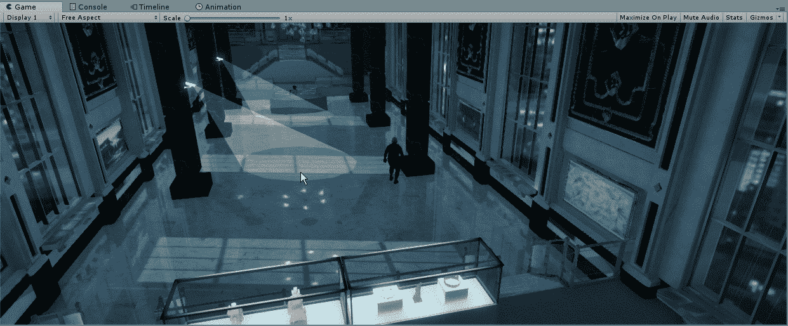

随着我们如何建立过场动画，我们现在有了它，当过场动画中的演员表演场景时，我们的可玩角色将坐在过场动画中。这造成了我们有两个独立玩家的假象。为了解决这个问题，我们将进入过场动画游戏，添加一个新的激活轨道，并让我们的实际玩家在最后一帧重新出现:

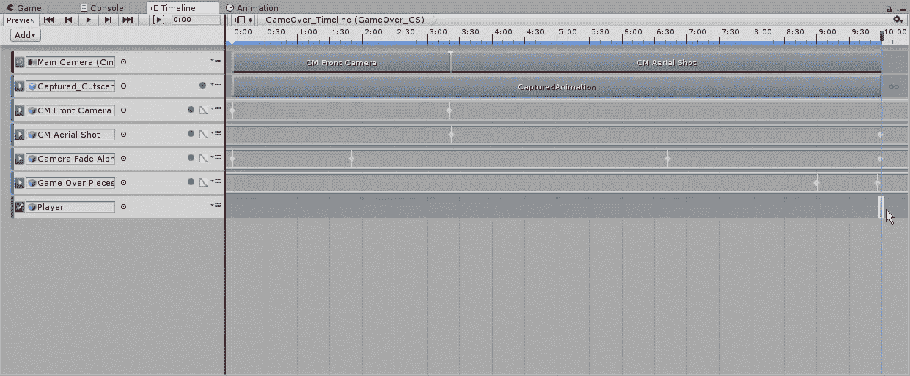

有了这个，我们可以在游戏中测试它，看看玩家是否在被检测到的那一刻就消失了:

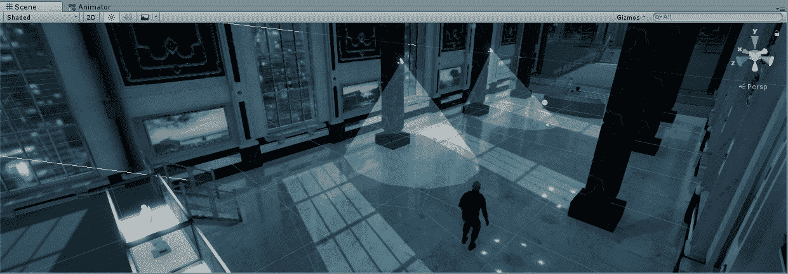

为了完成我们的相机的属性，我们将让它在接触到我们的球员时冻结，并在受到影响时变为红色:

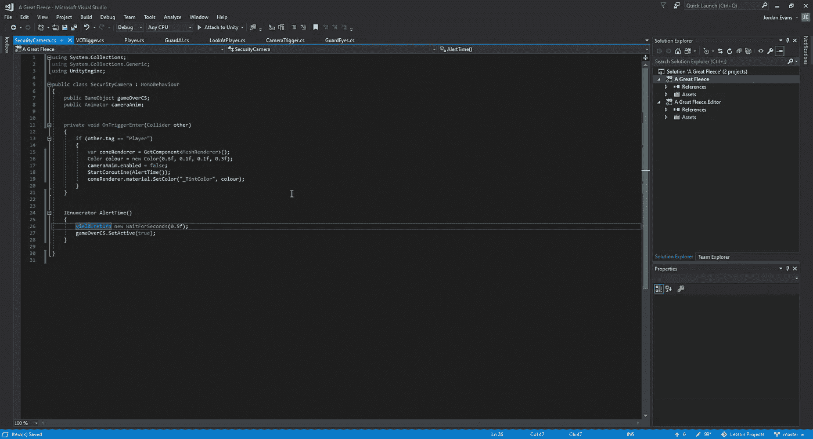

对于冻结效果，我们需要将过场动画的游戏移动到一个协程中，这样我们就可以在过场动画结束之前给游戏一个轻微的暂停。我们还希望将摄像机的动画附加到我们的圆锥体中，这样我们就可以在脚本中提取组件，并在触发时禁用它。最后，对于颜色的变化，我们将希望为我们的对象编码颜色值，因为我们不会在系统中使用预设的颜色。要做到这一点，我们需要得到每个阴影的值，然后用它除以总的值，它可能是:

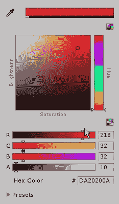

由于 RGBA 的值是从 1 到 255，我们将取我们决定的任何值，然后除以 255，得到我们的值。
一旦我们完成了所有这些工作，我们就可以看到检测到我们的摄像头是否停止工作，同时颜色也会发生变化:

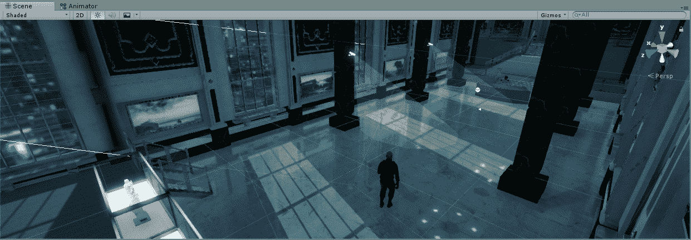

现在我们的摄像机工作了，我们可以进入游戏的下一部分了。