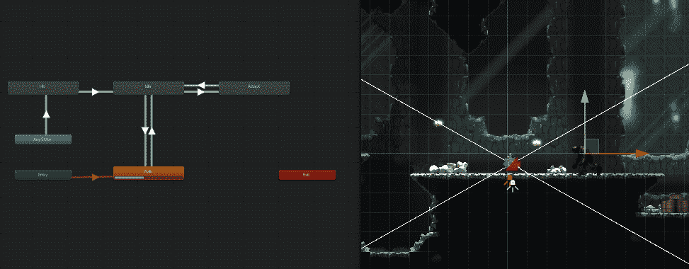
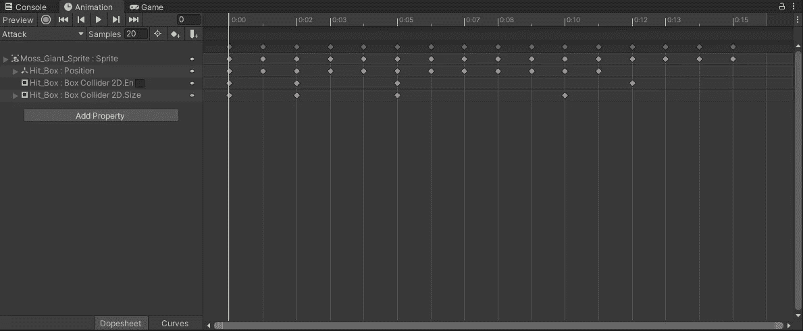
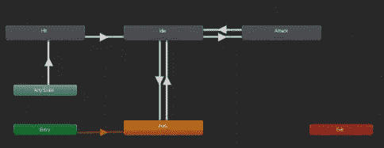
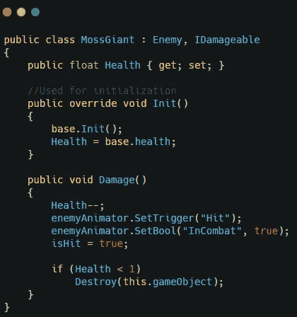
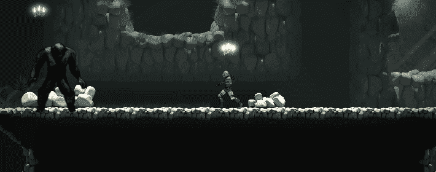

# 在 Unity 中设置莫斯巨人攻击

> 原文：<https://medium.com/nerd-for-tech/setting-up-the-moss-giants-attack-in-unity-67ae6cd0502?source=collection_archive---------15----------------------->

在我的上一篇文章中，我为骨骼设置了攻击方法。现在是时候为苔藓巨人设置攻击了。

就像我对骨骼所做的那样，我使用动画窗口设置了攻击动画和 hitbox。

以与骨骼相同的方式设置动画器。

因为所有翻转敌人的逻辑都在敌人职业中，所以确保苔藓巨人继承了敌人职业。此外，实现 IDamageable 接口和损坏方法的逻辑。

这将允许苔藓巨人攻击和面对玩家。

