# 在 Unity 中设置骨架攻击系统

> 原文：<https://medium.com/nerd-for-tech/setting-up-the-skeleton-attack-system-in-unity-bb8dfb854954?source=collection_archive---------13----------------------->

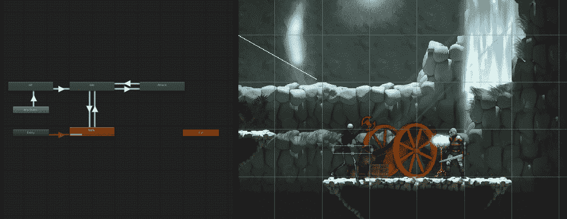

随着玩家现在能够攻击敌人，是时候给敌人一个保护自己的方法了。我从骨架开始。

第一步是将攻击动画添加到骨骼动画中。像其他动画一样，你把它切成正确的大小，然后在一个叫做攻击的新剪辑下录制动画。

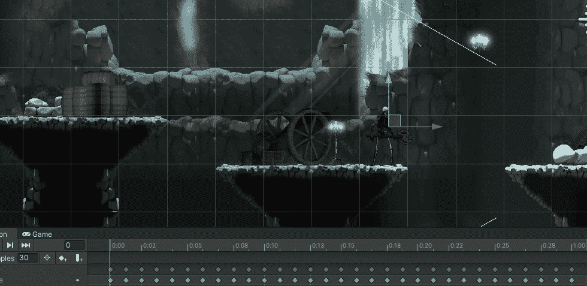

注意:出现的绿框是下一步

现在像玩家一样创建一个生命盒，并在每一帧的武器上记录下来。

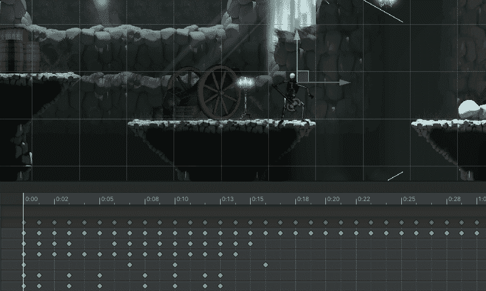

在 animator 中，使用 InCombat 参数设置允许攻击动画播放的逻辑，以允许 animator 从空闲状态进入攻击状态。

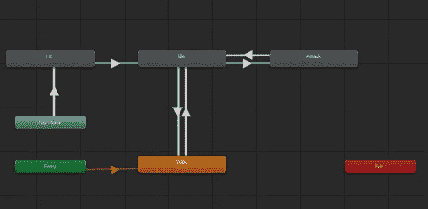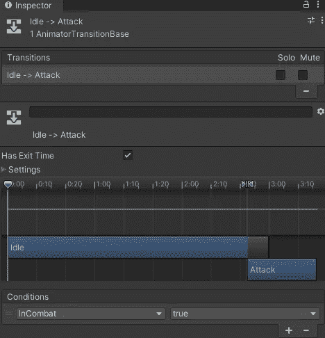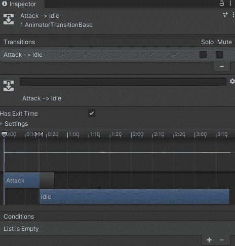

我们创建的攻击脚本是中立的，所以我们可以将它附加到敌人的攻击生命盒中。

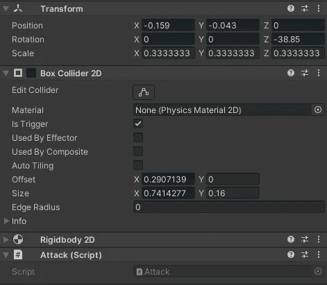

为了让这个脚本工作，玩家需要使用 IDamageable 脚本。将 IDamagable 脚本添加到播放器中，并实现所需的属性。

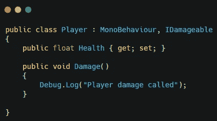

最后要做的是正确地让骨架面向玩家。考虑到玩家击打骨骼时骨骼面对的方向，你会有两套不同的逻辑。

首先，将原来的 FlipSprite 方法更改为玩家现在使用的方法，其中局部比例发生了变化。

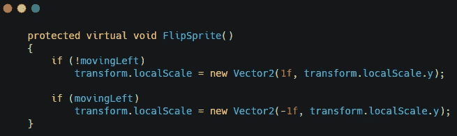

将逻辑添加到移动脚本中，以翻转局部比例来面对玩家。

这将通过从敌人那里获得玩家的方向来实现。如果数字是正数，玩家在右边，如果是负数，玩家在左边。利用这一点，我们将确定骨架应该面向哪个方向。

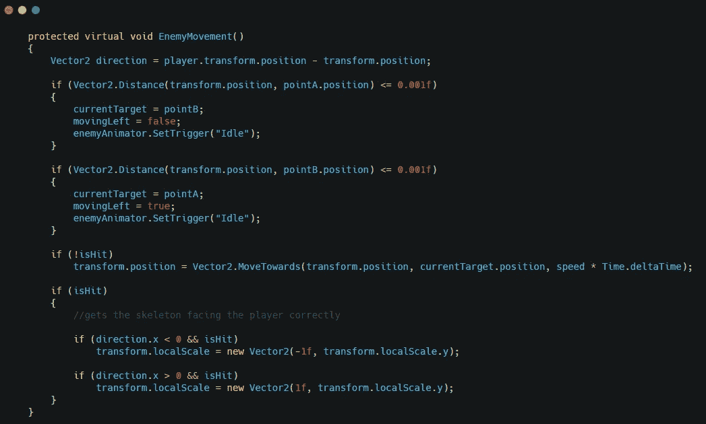

这将使骨骼正确地面向玩家。

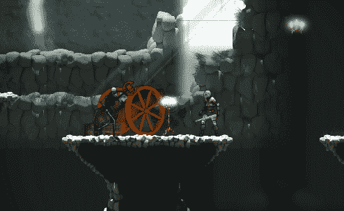