# 在 Unity 中设置蜘蛛攻击

> 原文：<https://medium.com/nerd-for-tech/setting-up-the-spider-attack-in-unity-93912b6214c3?source=collection_archive---------14----------------------->

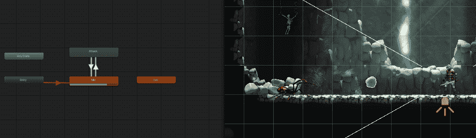

在我的上一篇文章中，我为苔藓巨人设置了攻击。现在我需要为我游戏中的最后一种敌人类型设置攻击。蜘蛛与游戏中的其他敌人不同，因为它有抛射攻击。

首先，我们可以在动画窗口中创建攻击动画。

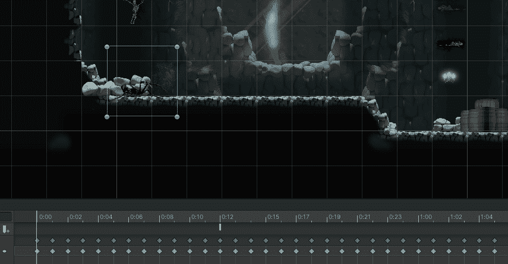

我们还将为蜘蛛将要攻击的抛射体创建动画。这将使用自己的动画。这也将是一个预设，它的设置类似于敌人，你可以得到第一个精灵，然后给它添加动画。

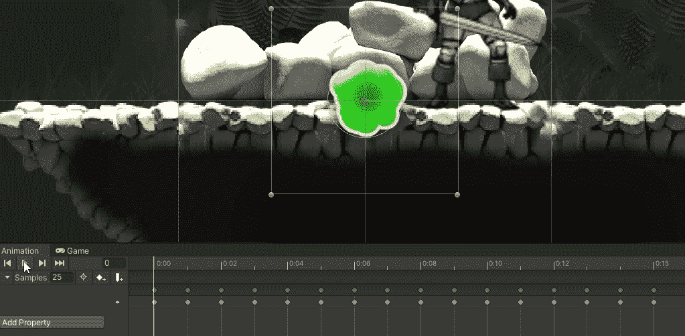

抛射体还将有一个圆形对撞机 2D 和一个刚体 2D。

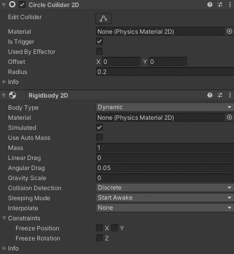

注意:标记为触发器，并将重力设置为零

设置动画师，让攻击动画只在蜘蛛战斗时播放。

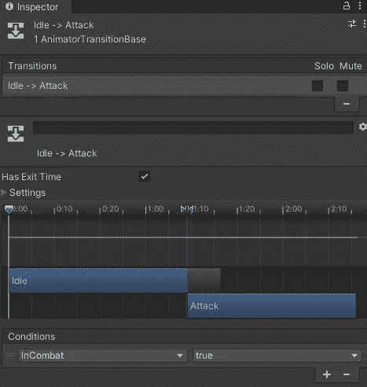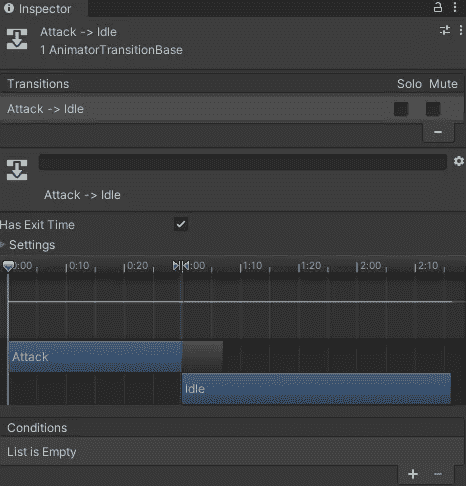

在蜘蛛的攻击动画中，转到蜘蛛发射射弹的地方，并在帧中添加一个事件。

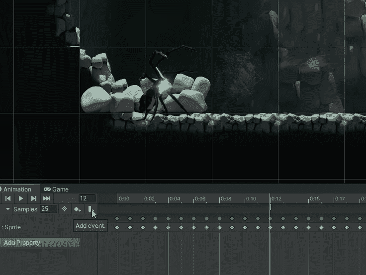

这将为您提供在检查器中选择功能的选项。

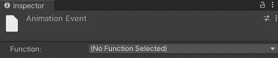

要为此创建一个函数，创建一个新脚本，并向其中添加一个 fire 方法。这将是你如何实例化弹丸。您还需要添加一个对投射体的引用，并在方法中实例化它。

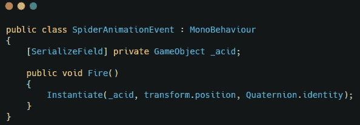

将这个脚本添加到 spider sprite 中，并选择函数的 fire 方法。

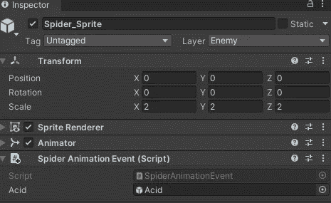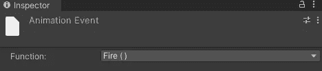

现在，它正在实例化射弹，我们可以给他们方向。

创建一个新的脚本，并将其附加到抛射体游戏对象。这个脚本将有一个 start 方法来设置投射体在五秒钟后销毁，一个 update 方法来将投射体移动到右边，还有一个 **OnTriggerEnter2D** 方法来检测一个 IDamageable 组件来调用 damage 方法。

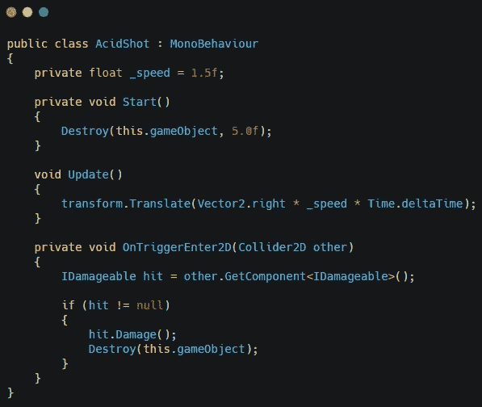

在 spider 脚本中，您将希望覆盖更新和移动方法，使它们对 spider 是唯一的。蜘蛛会保持静止，只有当玩家足够靠近时才会攻击。

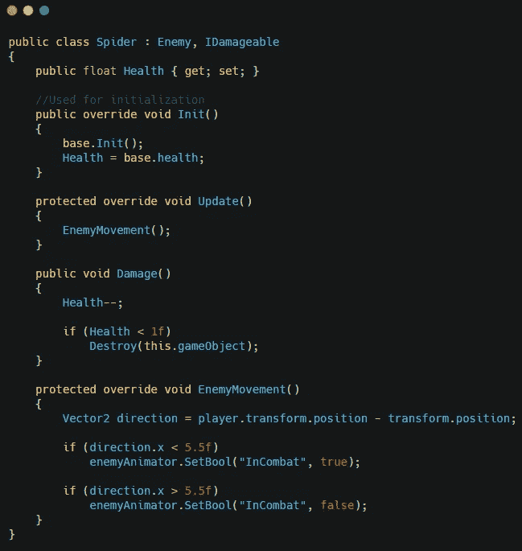

现在确保蜘蛛在敌人层，抛射体在敌人攻击层。

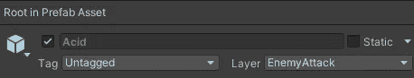

这将给你一只蜘蛛，如果你靠得太近，它就会攻击你。

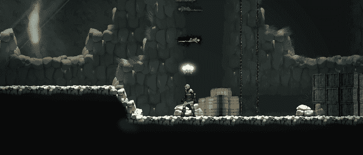