# 在 WSL 上为 Scala 开发设置 VS 代码

> 原文：<https://medium.com/nerd-for-tech/setting-up-vs-code-for-scala-development-on-wsl-258386a31c23?source=collection_archive---------5----------------------->

[Visual Studio Code](https://code.visualstudio.com/) (VS Code)多年来一直是我最喜欢的编辑器。随着大量的扩展和社区支持，VS Code 已经成为最受欢迎的编程编辑器之一。[Linux 的 Windows 子系统](https://docs.microsoft.com/en-us/windows/wsl/) (WSL)让开发者直接在 Windows 上运行 Linux 环境。这两者的强大结合为程序员提供了一个编写软件的好方法。

VS 代码有优秀的语言支持，包括 Scala。大多数 Scala 开发者使用 [IntelliJ](https://www.jetbrains.com/idea/) 作为他们的开发工具。因此，使用 VS 代码作为 Scala 开发工具的教程并不多。这篇文章是关于在 WSL 上为 Scala 编程设置 VS 代码的简短教程。希望它能为设置 Scala 开发环境提供有用的信息。

# 假设和要求

本教程是使用以下设置编写的:

*   Windows 10 2004(主机操作系统)
*   带有扩展的 Visual Studio 代码 1.51:用于 Scala 编程的 Scala (Metals) 1.9.6，以及用于 WSL 远程开发的[远程开发](https://marketplace.visualstudio.com/items?itemName=ms-vscode-remote.vscode-remote-extensionpack) 0.20.0
*   [用于 Linux 的 Windows 子系统 2](https://docs.microsoft.com/en-us/windows/wsl/compare-versions#whats-new-in-wsl-2) (WSL2)
*   [wsl 2 上的 Ubuntu 20.04](https://ubuntu.com/wsl)
*   Java ( [OpenJDK 11](https://adoptopenjdk.net/) )
*   SBT 1 . 4 . 1
*   [Scala 2.13.3](https://github.com/scala/scala/releases/tag/v2.13.3)
*   [mobax term](https://mobaxterm.mobatek.net/)20.5 Windows 访问 WSL2 的增强终端。

# 步骤 1:设置 WSL2

最新的 WSL 版本 WSL2 是用完整的 Linux 内核构建的，由 Windows updates 提供服务。WSL2 不仅提高了文件 IO 性能，还提供了完整的系统调用兼容性。如果你的 Windows 10 比 1903 Build 18362 新，强烈推荐使用 WSL2。

要在 Windows 10 上设置 WSL2，请遵循以下说明:[Windows 10](https://docs.microsoft.com/en-us/windows/wsl/install-win10)的 Windows Subsystem for Linux 安装指南。确保 [WSL2](https://docs.microsoft.com/en-us/windows/wsl/install-win10#step-2---update-to-wsl-2) 已启用。WSL 安装完成后，从 Windows Store 安装 [Ubuntu 20.04](https://www.microsoft.com/en-us/p/ubuntu-2004-lts/9n6svws3rx71?rtc=1&activetab=pivot:overviewtab) 。

# 第二步:在 Windows 10 上安装 VS 代码和相关软件

在 Windows 10 上，安装 VS 代码和 Scala 以及远程开发扩展。

1.  从[https://code.visualstudio.com/](https://code.visualstudio.com/)下载 VS 代码。
2.  按照说明安装 VS 代码。
3.  点击[安装](https://marketplace.visualstudio.com/items?itemName=ms-vscode-remote.vscode-remote-extensionpack)并按照其说明安装远程开发。
4.  执行与上一步相同的操作，安装 [Scala(金属)](https://marketplace.visualstudio.com/items?itemName=scalameta.metals)延长件。

另外，从 MobaXterm 的官方网站[https://mobaxterm.mobatek.net/download-home-edition.html](https://mobaxterm.mobatek.net/download-home-edition.html)安装它。访问 WSL2 的另一个选项是 [Windows 终端](https://docs.microsoft.com/en-us/windows/wsl/install-win10#install-windows-terminal-optional)。本教程使用 MobaXterm。

# 步骤 3:在 Ubuntu 上安装 Java、sbt 和 Scala(wsl 2)

启动已安装的 MobaXterm 并单击 WSL 会话。MobaXterm 自动检测系统中的 WSL。

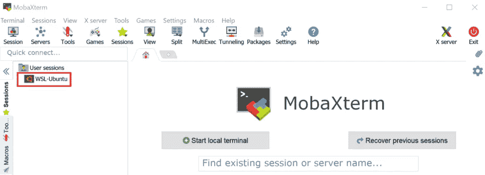

我们应该看到 Ubuntu bash shell。

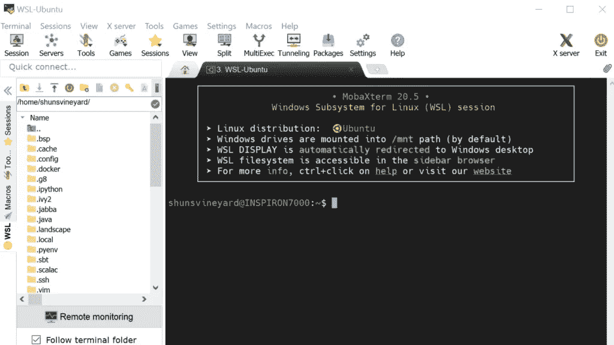

*   安装 OpenJDK 11

```
$ sudo apt install openjdk-11-jdk
```

默认情况下，VS 代码使用`JAVA_HOME`环境变量来定位 *java* 可执行文件。为了确保 VS 代码使用正确的 JDK 版本，建议设置`JAVA_HOME`。给`~/*.bashrc*`加上下面一行。

```
export JAVA_HOME=/usr/lib/jvm/java-11-openjdk-amd64/
```

请注意，如果安装不同的 JDK，路径可能会不同。

*   安装 sbt

```
$ sudo apt install sbt
```

*   安装 Scala

没有必要安装 Scala，因为当我们构建一个 Scala 程序时，sbt 会下载一个合适的版本。然而，如果需要使用 Scala REPL(命令行 shell ),运行下面的命令来安装它。

```
$ sudo apt install scala
```

# 步骤 4:使用 VS 代码创建一个示例项目

教程用于演示的示例项目具有以下布局。

```
scala-sample-code
 ├── .scalafmt.conf
 ├── build.sbt
 ├── project
 │   └── build.properties 
 └── src
     ├── main
     │   └── scala
     │       └── Sample.scala
     └── test
         └── scala
             └── SampleSpec.scala
```

在我们启动 VS 代码之前，使用 mobaXterm Ubuntu shell 在 Ubuntu WSL2 上创建一个项目文件夹。

```
$ cd ~ 
$ mkdir scala-sample-code
```

一旦创建了项目文件夹，我们就可以关闭 mobaXterm 并启动 VS 代码。

点击左下方图标连接 WSL，选择 WSL 中的*打开文件夹，如下图所示，打开我们刚刚创建的`scala-sample-code`文件夹。*

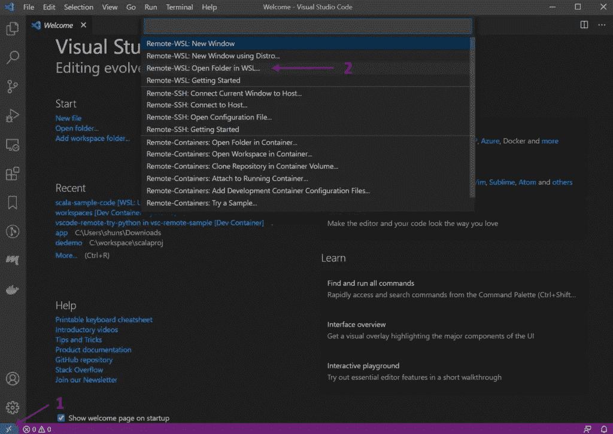

在 VS 代码打开`scala-sample-code`文件夹后，我们可以看到左下角的图标变成了`WSL: Ubuntu,`，我们可以开始创建文件夹和文件。

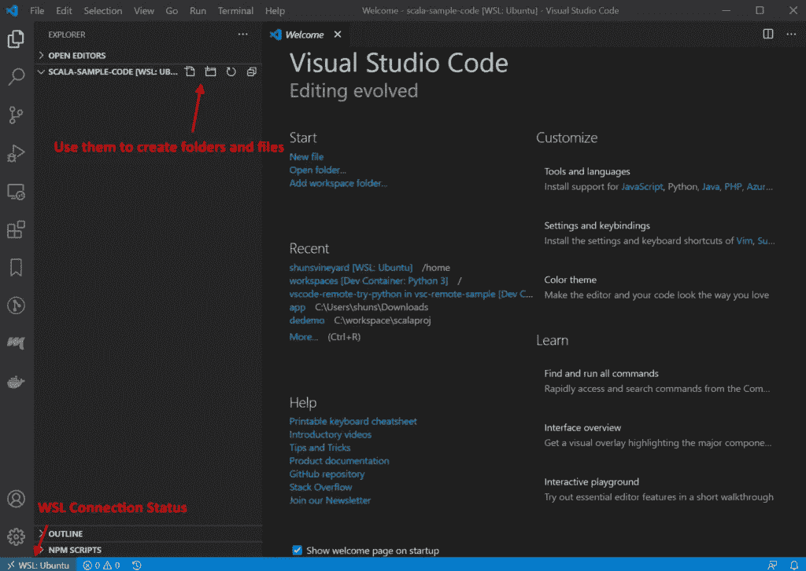

我们首先用以下内容创建`build.sbt`。

```
ThisBuild / scalaVersion := "2.13.3" 
ThisBuild / version := "0.0.1" lazy val sample = (project in file("."))
  .settings(
    name := "Sample Project",
    libraryDependencies += "org.scalatest" %% "scalatest" % "3.2.2" % Test, 
)
```

一旦创建了`build.sbt`文件，VS 代码的 Metals 扩展就会自动检测到这个变化，并弹出一个导入构建的窗口。

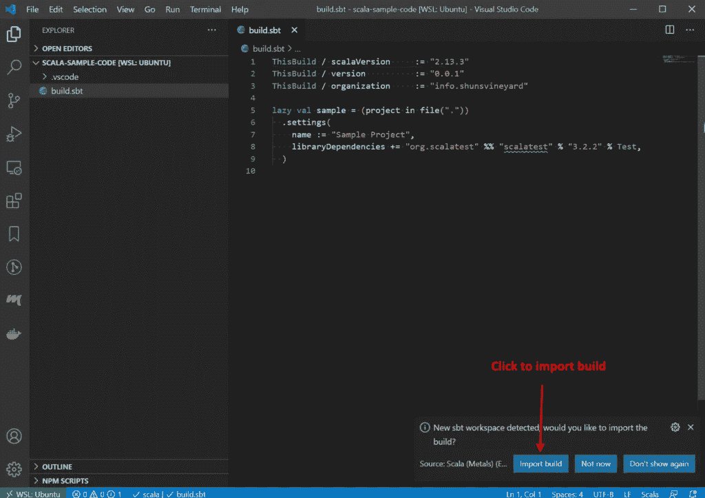

导入过程会自动创建一些 sbt 构建文件夹和文件。我们可以不断地创建我们的项目文件夹和文件。

**.scalafmt.conf**

```
version = "2.7.4" 
align.preset = more 
maxColumn = 100
```

**Sample.scala**

```
object Sample extends Greeting with App {
  println(greeting)
}

trait Greeting { lazy val greeting: String = "hello" }
```

**SampleSpec.scala**

```
import org.scalatest.wordspec._

class SampleSpec extends AnyWordSpec {
  "The sample code" should {
    "say hello" in {
      assert(Sample.greeting.startsWith("h"))
    }
  }
}
```

创建示例项目后，布局看起来像下面 VS 代码中的图片。

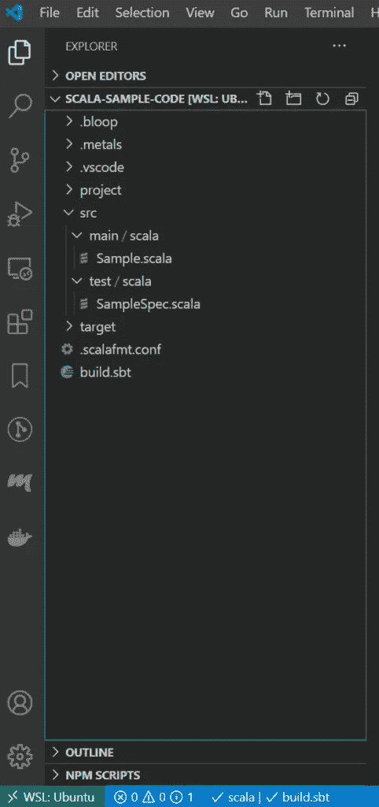

注意`.bloop`、`.metlas`、`.vscode`是由 VS 代码和 Metals 扩展生成的。如果我们使用 Git 这样的版本控制系统，我们应该将这些文件夹添加到`.gitignore`中。

(样本代码也可在[https://github.com/shunsvineyard/scala-sample-code](https://github.com/shunsvineyard/scala-sample-code)获得)

# VS 代码使用

下面的小节展示了使用 VS 代码进行 Scala 开发的一些日常用例。

# 代码格式

Metals 支持 [Scalafmt](https://scalameta.org/scalafmt/) 进行代码格式化。要格式化代码，右击我们想要格式化的 Scala 文件，选择`Format Document`来格式化文件，如图所示。

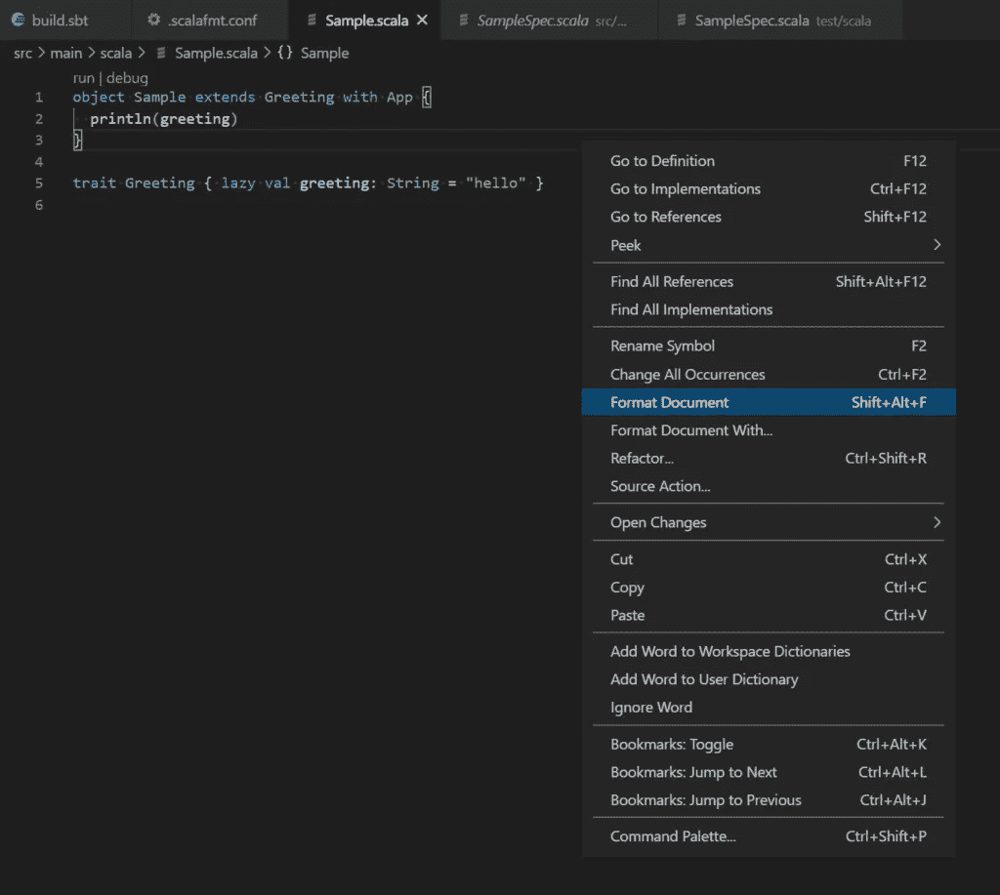

默认情况下，Metals 基于项目目录根目录下的`.scalafmt.conf`文件格式化 Scala 文档。可以从金属延伸配置修改路径。参见**配置**部分更改设置。

# 运行并调试

有两种方法可以运行和调试 Scala 代码。

## 1.使用代码镜头

对于每个主要或测试类别，金属显示主要类别的代码透镜`run | debug`和测试类别的代码透镜`test | test debug`。点击`run`或`test`运行或测试 Scala 程序。

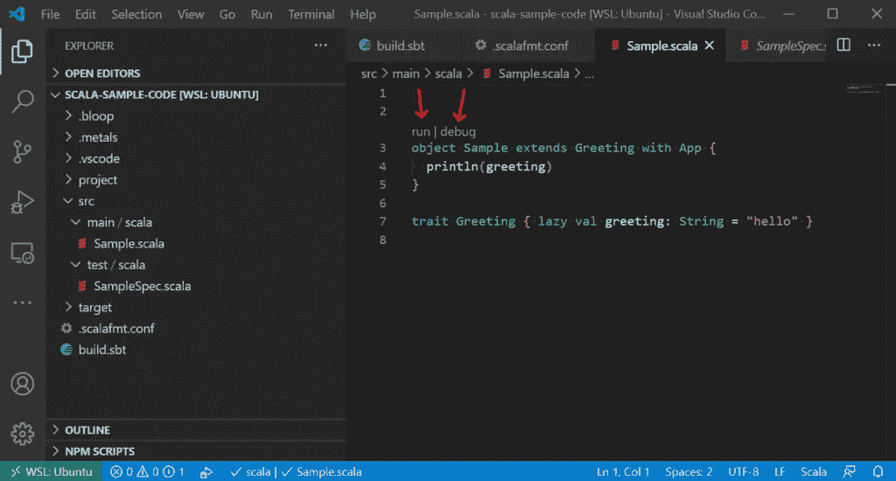

## 2.使用 launch.json 配置

另一种方法是为 VS 代码定义`launch.json`来运行或调试程序。

按照图中的步骤创建`launch.json`配置文件。

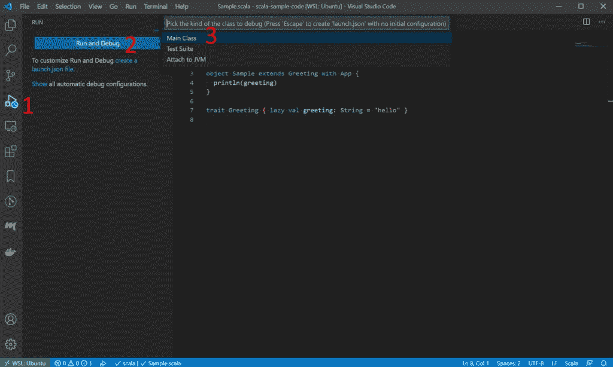

在步骤 3 之后，VS 代码会再问几个问题。我们可以将它们全部留空，并在 JSON 文件创建后编辑`launch.json`文件。创建配置文件后，我们可以填充配置并运行或调试程序。

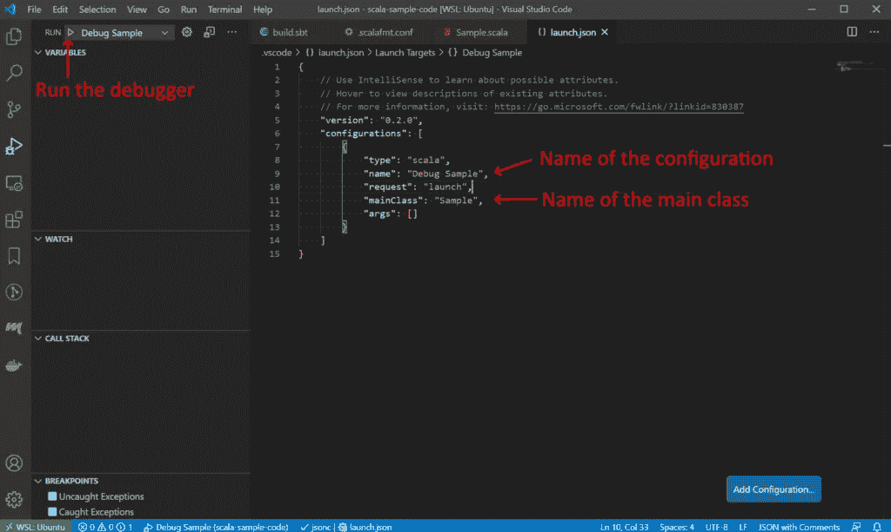

# 配置

除了最常见的用例、代码格式、运行和调试之外，还有许多其他事情我们可以配置 Metals 以我们想要的方式工作。

要打开设置，按`[File -> Preference -> Settings]`打开设置。这些设置有三个范围:用户、远程和工作区。选择适合我们需要的。并选择`Extensions -> Metals`来修改设置。

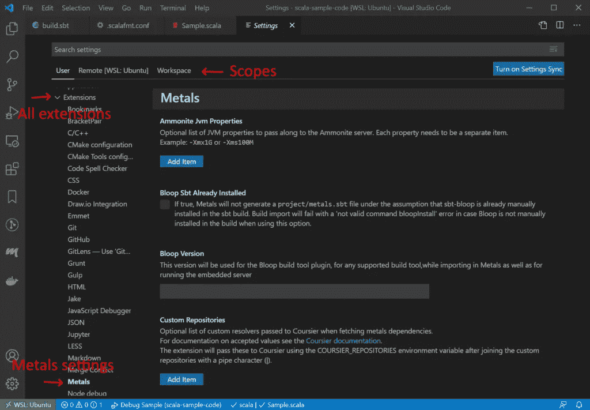

# 解决纷争

有时金属扩展可能无法正常工作。我们可以检查 Metals 的输出，以获得更多的信息来解决它，或者至少向 google 发送更好的错误消息。

例如，如果我们安装的 JDK 版本不支持 JDI(这将导致调试器不工作)，当我们尝试运行调试器时，将会得到以下错误消息。

```
Couldn't find a debug adapter descriptor for debug type 'scala' (extension might have failed to activate)
```

不幸的是，错误消息没有给出关于这个问题的足够信息。在这种情况下，我们可以检查金属产量。见下图。

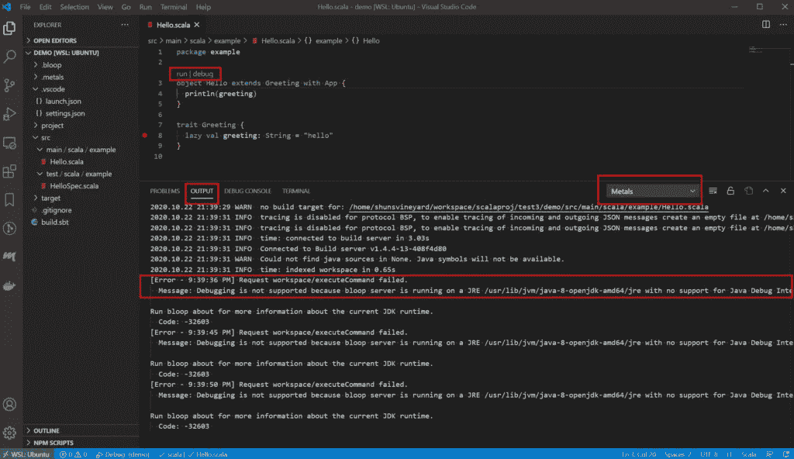

它给了我们更多关于这个问题的信息。

```
Message: Debugging is not supported because bloop server is running on a JRE /usr/lib/jvm/java-8-openjdk-amd64/jre with no support for Java Debug Interface: 'JDI implementation is not provided by the vendor'. To enable debugging, install a JDK and restart the bloop server.
```

所以，我们知道 JDK 是问题所在，需要解决。

# sbt 命令的终端

值得一提的一个有用的 VS 代码特性是集成终端。通过集成的终端，我们可以在 WSL 上运行 shell。对于 Scala 开发，终端提供了一种在 VS 代码中运行 sbt 命令的便捷方式。

使用`Ctrl+Shift+P`调出`Command Palette`并键入`terminal`。它应该显示一些终端选项。选择`Create New Integrated Terminal (In Active Workspace)`。

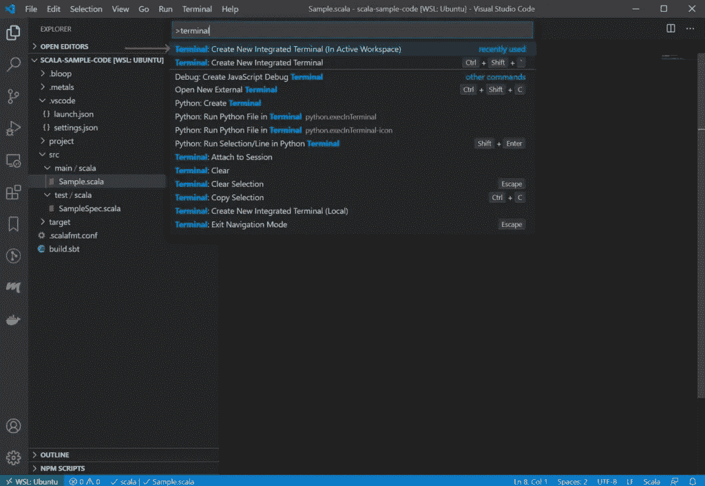

这将在项目目录中打开 WSL shell。

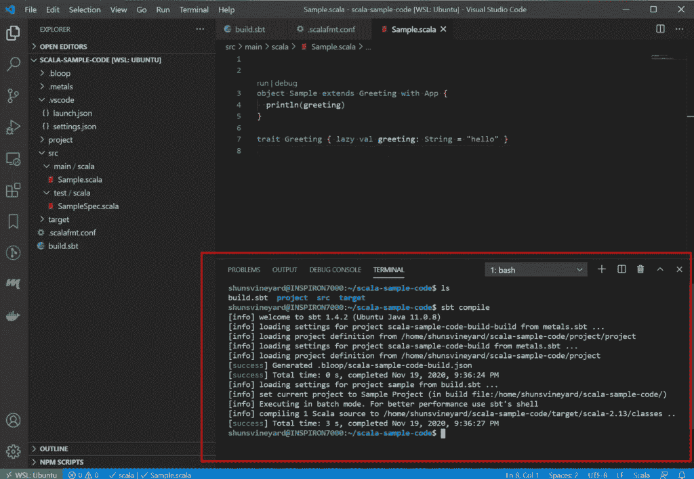

有了这个功能，我们就可以不用 Windows 终端或 MobaXterm 等外部工具来使用终端了。

# 结论

本文提供了使用 VS 代码编写 Scala 代码的基本设置和常见用例。虽然它演示了 Linux 的 Windows 子系统上的配置，但是 **VS 代码使用**部分也适用于 Windows、Linux 和 MacOS。

VS 代码可能不是 Scala 编程最流行的编辑器，但是有了 Metals 等强大的扩展支持，VS 代码可以成为 Scala 开发的有用工具。特别是对于使用多种语言的人来说，VS 代码可能是满足你所有需求的。

*原载于 2020 年 11 月 20 日*[*https://shunsvineyard . info*](https://shunsvineyard.info/2020/11/20/setting-up-vs-code-for-scala-development-on-wsl/)*。*