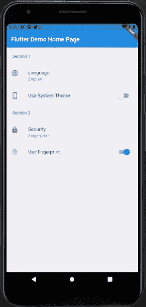
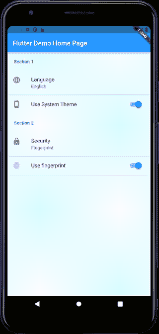

# 在 Flutter 中轻松设置 UI

> 原文：<https://medium.com/nerd-for-tech/settings-ui-with-ease-in-flutter-74c3a425fc99?source=collection_archive---------0----------------------->

## *包* —设置 _ui

**想在 Flutter 中实现快速设置页面？**

几乎所有 app 都需要设置页面。

同样，我们可以使用 package — [settings_ui](https://pub.dev/packages/settings_ui) 来避免设置 ui 对齐所需的时间。

下面是这个包的基本实现-

*安装步骤-*

1.  使用 Flutter 运行以下命令:

```
$ flutter pub add settings_ui
```

或者将其添加到您的包的`pubspec.yaml` 文件中:

```
dependencies:settings_ui: ^1.0.0
```

2.安装软件包

```
$ flutter pub get
```

3.现在，在您的 Dart 代码中，您可以使用:

```
import 'package:settings_ui/settings_ui.dart';
```

**编码部分-**

在我们的页面中添加`SettingsList()`，该页面接受我们设置的*部分*的列表。
现在，在我们的`SettingsSection()`中添加`*tiles:*`列表。
此时，您可以使用`SettingsTile.switchTile()`给*普通设置*或*拨动选项设置*。

*结果:*



但是**黑暗模式**呢？

别急，在`MaterialApp()`里加上`*darkTheme:*` 就行了。



目前就这些。感谢您阅读这篇文章。

下次见👍。