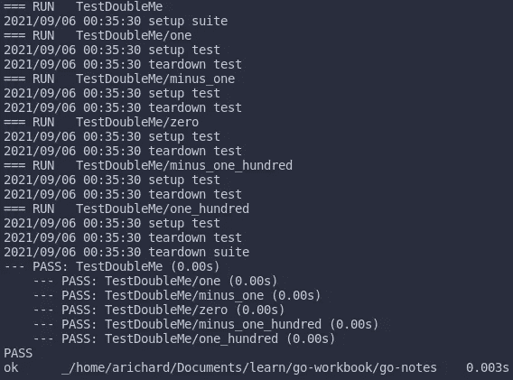

# Go 中的设置和拆卸单元测试

> 原文：<https://medium.com/nerd-for-tech/setup-and-teardown-unit-test-in-go-bd6fa1b785cd?source=collection_archive---------0----------------------->

使用 Go 的标准库进行单元测试

照片由[阿尔方斯·莫拉莱斯](https://unsplash.com/@alfonsmc10?utm_source=medium&utm_medium=referral)在 [Unsplash](https://unsplash.com?utm_source=medium&utm_medium=referral) 上拍摄

我记得我的一个同事对我说，“一个有用的依赖是好的，不使用一个更好”。在这种情况下，他谈论的是使用标准库来解决常见问题。有时，因为我们不想重新发明轮子，让我们的工作更容易，我们马上开始添加额外的依赖。甚至没有考虑语言提供的其他选择。这可能会导致性能问题和版本问题。

幸运的是，Go 为我们提供了一些有用的标准库，其中之一就是`testing`。我们将讨论如何使用 Go `testing`库，包括如何设置和拆卸单元测试。让我们从基础开始。

# 基础知识

从 Go 中的单元测试基础开始。假设我们在`main.go`文件中有我们的代码，那么我们在同一个包中的`main_test.go`中编写测试是合适的。请注意，关于在代码库中构建单元测试，您可以遵循几个约定。希望这篇文章能帮助你理解:

 [## Go 中的结构化测试

### 我如何在 Go 中组织我的测试

medium.com](/@benbjohnson/structuring-tests-in-go-46ddee7a25c) 

让我们编写极其简单的代码:

如果我们生活在同一个宇宙，我们会有同样的结果。如果我们给`doubleMe`函数赋值 5，那么我们得到 10。清晰简单！现在，让我们开始编写测试，以确保我们生活在同一个宇宙中:)

如果`doubleMe`是一个正确的函数，那么所有的测试用例都会通过。谢天谢地，的确如此！

# 简单地说，安装和拆卸

当我们编写单元测试时，我们经常需要在每个测试(或者一组测试)之前和之后做一些事情。出于同样的原因，这就是单元测试中的设置和拆卸。所以，让我们写另一个简单的安装和拆卸单元测试的例子。

我们仍然使用相同的`doubleMe`函数，但是在单元测试中做了一些调整。注意，我为 setup 和 teardown 函数提供了参数`tb`，以防我们需要来自`testing`库中的东西。所以如果你想的话，你可以让这个函数不带任何参数。现在，如果您通过运行命令`go test -v`来运行测试，您将在您的终端上看到类似的结果。

作者形象

安装套件仅在所有测试开始时运行一次，而拆卸套件在所有测试都有机会运行后运行。同时，在测试运行之前和之后，安装和拆卸测试在每个测试中运行。

# RestAPI 应用程序的单元测试

好了，到目前为止，我们已经明白了如何只使用 Go 的标准库来编写单元测试。但是我们真的能在日常实践中使用它吗？当然可以。现在，让我们编写另一个 RestAPI 应用程序的简单示例。

这里，我没有使用任何额外的依赖项来创建 RestAPI 应用程序。为了使事情简单并支持我在引言中提到的观点。

您可以通过进入 [http://localhost:8080？x=1。](http://localhost:8080?x=1.)然后，你会得到这个回复`{“message”:”Hello!”,”result”:2}`。

现在，单元测试:

这里，与前面的代码相比，我对代码做了一些修改。套件的设置和拆卸保持不变。在`setupTest`函数中，它以`tb`和`x`作为参数，然后返回 teardown 函数和`httptest`响应记录器，因为我们想测试它给我们的结果。在代码的下面，我们测试所有情况，并确保我们给它的每个输入都给我们 HTTP 状态 OK 和预期的响应体。

注意，我们从上面的代码中得到的单元测试模式被称为**表驱动测试**。在这种情况下，我们以表格的形式提供名称、输入和预期输出，然后为每个测试遍历这个表格。这种模式允许我们拥有我们正在寻找的安装和拆卸功能。这是另一个有助于你了解更多关于**表驱动测试的资源。**

 [## 首选表格驱动测试

### 我是测试的忠实粉丝，特别是单元测试和 TDD(当然是正确的)。这种做法已经发展到…

dave.cheney.net](https://dave.cheney.net/2019/05/07/prefer-table-driven-tests) 

# 结论

我们必须记住的事情是，不要重新发明轮子，不要通过使用不必要的依赖关系使我们的项目变得太复杂。通过这样说，我并不反对某些第三方库，它们确实使我们的生活变得更容易。我确实使用那些有用的库，但是我想在使用它们的时候保持足够的智慧。请随时使用它们，并通过为项目做贡献来帮助社区。

如果你想加快游戏进度，并了解 evidence(一个有用的围棋测试库)。然后你可以看看我的另一篇文章

 [## 测试 REST API 在 Go 中的验证和模拟

### "当低价的甜蜜被遗忘后，劣质的苦涩依然久久不散."—本杰明·富兰克林

medium.com](/nerd-for-tech/testing-rest-api-in-go-with-testify-and-mockery-c31ea2cc88f9) 

感谢您的阅读和快乐编码！