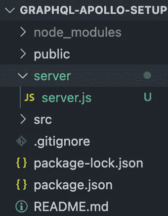
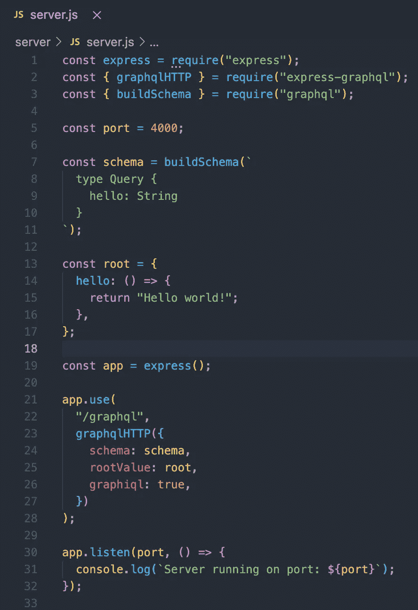
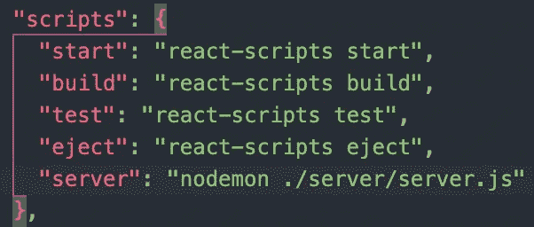
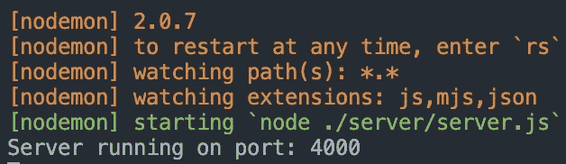
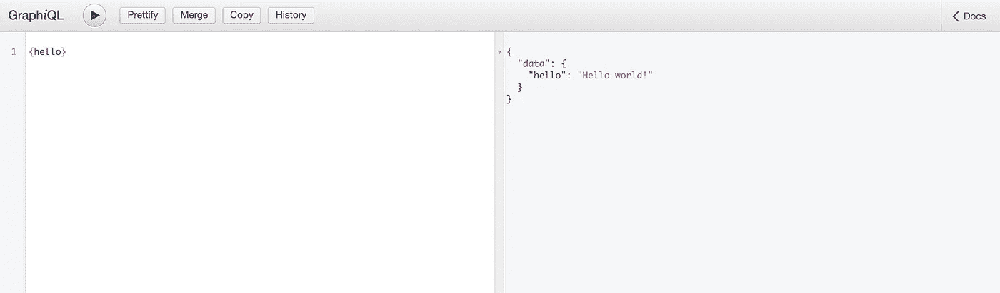
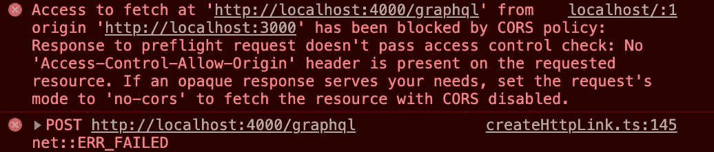
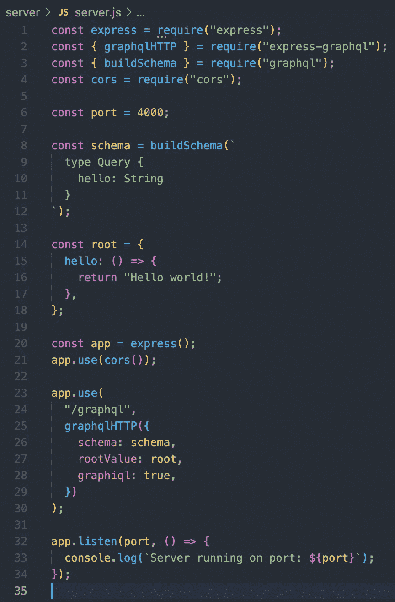
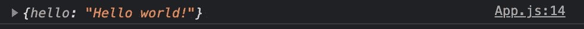
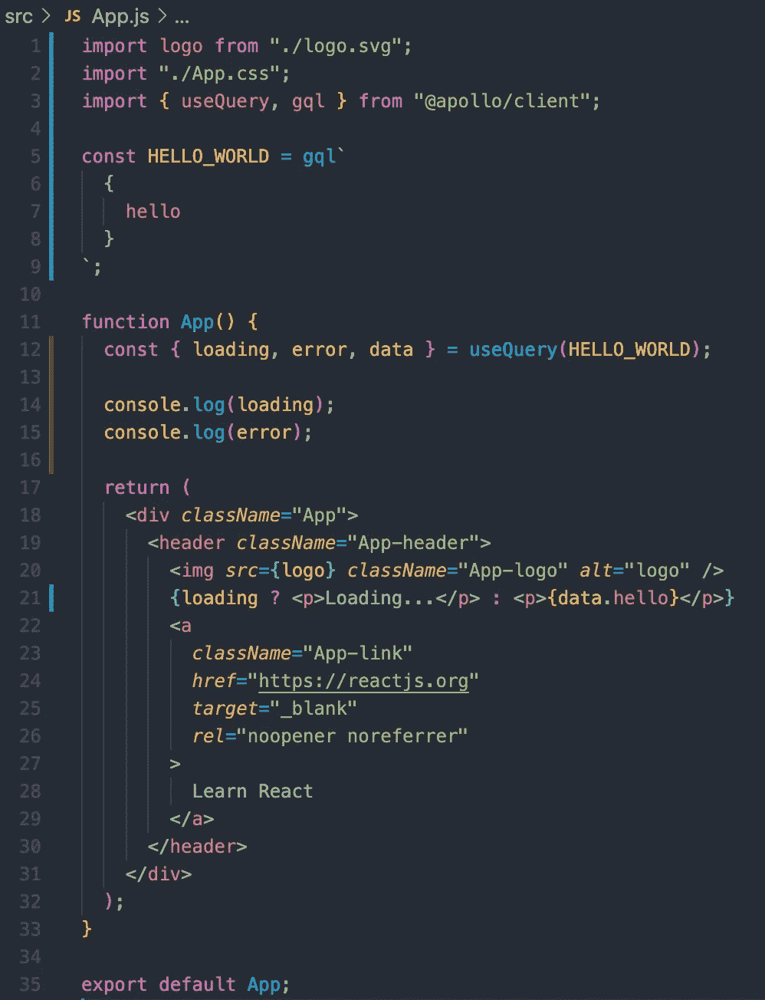
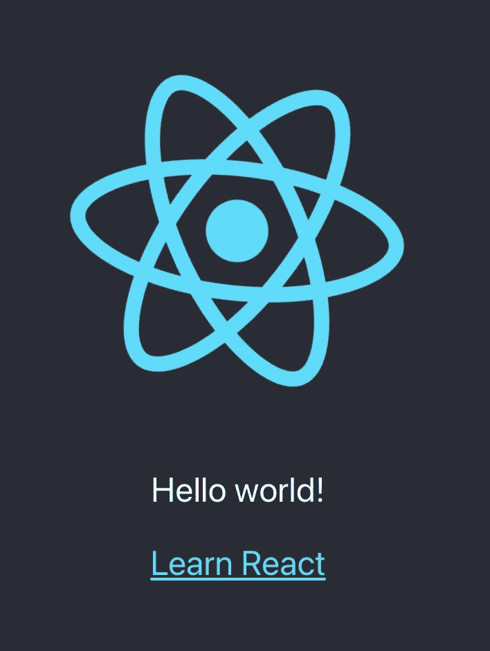

# 安装指南:GraphQL+React+Apollo 客户端

> 原文：<https://medium.com/nerd-for-tech/setup-guide-graphql-react-apollo-client-636d6ec05c50?source=collection_archive---------5----------------------->


照片由 [Florian Olivo](https://unsplash.com/@florianolv?utm_source=medium&utm_medium=referral) 在 [Unsplash](https://unsplash.com?utm_source=medium&utm_medium=referral) 上拍摄

将 GraphQL 与 Apollo Client 结合使用使得从后端获取数据变得轻而易举。GraphQL 允许您根据自己的需要编写查询，这使得它成为传统 REST API 的一个强有力的替代品。此外，GraphQL 使用起来非常有趣。Apollo 客户端将位于您的前端，并帮助您从后端检索数据。接下来是如何安装和运行这个 power-trio 的指南！💻🔥

*注意:您可以简单地使用 axios 或您最喜欢的工作工具进行 https 请求，而不是设置 Apollo 客户端——这样，本指南也可以作为 GraphQL 设置。*

# React 和服务器设置

我们将从在终端中运行以下命令开始。

`npx create-react-app your-app-name --use-npm`

*如果您在这里遇到问题，请参考 create-react-app 上的文档:*[https://create-react-app.dev/docs/getting-started/](https://create-react-app.dev/docs/getting-started/)

接下来，我们在首选的文本编辑器中打开新创建的 React 应用程序，并开始创建我们的后端。让我们创建一个新文件夹来保存我们后端的代码。让我们将它命名为 server，并在其中创建一个名为“server.js”的文件。



您的文件树现在看起来像这样。

# 添加 GraphQL 作为中间件

让我们安装服务器运行所需的依赖项。要安装所需的依赖项，您将运行以下命令:

`npm install express express-graphql graphql --save`

该命令安装所有必需的依赖项，以启动和运行我们的 GraphQL 服务器。

接下来，我们设置一个 Express 服务器并添加 GraphQL 作为中间件。



# 启动我们的服务器！💯

让我们检查一下我们的 GraphQL 服务器是否正在监听我们指定的端口。但是首先让我们安装 nodemon。当检测到变化时，Nodemon 将自动重启我们的节点应用程序。

`npm i nodemon`

接下来，让我们进入 package.json 并创建一个脚本来运行我们的服务器。

`"server": "nodemon ./server/server.js"`



如果您使用不同的文件结构，只需指向服务器监听的文件。

让我们看看我们的服务器是否在运行。

`npm run server`



我们的服务器现在正在监听端口 4000！💯

# 编写您的第一个查询

现在，如果我们访问“localhost:4000/graphql ”,我们应该看到 graphql 操场，我们可以在那里测试我们的查询。这是可行的，因为我们在服务器设置中指定了 graphiql 为 true。

```
graphiql: true,
```

我们可以通过运行在 server.js 中编写的“hello”查询来测试我们的查询。



瞧，我们的查询成功了！🤌

# 前端设置✍️

接下来，我们将使用 Apollo 客户端从前端获取这些数据，但首先让我们在一个单独的终端中启动我们的前端:

`npm start`

这在本地主机中启动了我们的 create-react-app。这里需要注意的重要一点是，它运行在与我们的 express 服务器不同的端口上。


# 设置 Apollo 客户端🚀

现在是时候安装我们的 Apollo 客户机并从我们的后端获取数据了。为此，我们在终端中运行以下命令:

`npm install @apollo/client`

在 index.js 中，我们将创建新的 ApolloClient，它将帮助我们从前端向后端运行查询。我们将从 Apollo 客户端导入 ApolloClient 和 InMemoryCache，并实例化一个新的客户端。我们将把“uri”指向我们的**服务器**当前运行的端口。

```
import { ApolloClient, InMemoryCache } from "@apollo/client"; const client = new ApolloClient({uri: "http://localhost:4000/graphql",cache: new InMemoryCache(),});
```

为了将您的组件连接到您的 Apollo 客户机，我们需要导入一个“提供者”。这可能会让您想起 React 的上下文提供者。我们将在 ApolloProvider 中包装我们的应用程序，以提供对所有组件数据的访问。首先，我们将导入以下内容:

`import { ApolloProvider } from '@apollo/client/react';`

然后，我们将把我们的应用程序与提供者包装在一起，并传递我们的“客户端”。

```
ReactDOM.render(<React.StrictMode><ApolloProvider *client*={client}><App /></ApolloProvider></React.StrictMode>,document.getElementById("root"));
```

现在我们已经准备好从前端查询数据了！我们将从 App.js 进行第一次查询，我们将使用检索到的数据并在浏览器中呈现它。我们能够使用与在 graphiql playground 中相同的查询语言，所以首先在那里测试您的查询是一个好主意！

现在，在 App.js 中，我们将导入以下内容:

`import { useQuery, gql } from '@apollo/client';`

“useQuery”是一个钩子，它将让我们访问错误、加载和数据，gql 将让我们像在操场上一样编写查询。

接下来，我们编写第一个查询。

```
const HELLO_WORLD = gql`{hello}`;
```

在我们的应用程序组件中，我们将使用“useQuery”钩子从 GraphQL 服务器获取数据。

```
const { loading, error, data } = useQuery(HELLO_WORLD);
```

现在，我们非常接近在前端显示数据。让我们看看此时我们正在获取哪些数据(如果有的话)。现在，如果我们尝试运行我们的查询，我们将得到以下错误。❌



我们需要允许跨产地资源共享

出现此问题是因为我们试图从不同的来源(localhost:3000)获取数据。这可以防止其他网站下载恶意资源，但对于开发人员来说，处理起来可能会很麻烦。幸运的是，我们可以用 Express 设置一些中间件来解决这个问题。是时候安装另一个依赖项了。

```
npm i cors
```

Cors 是“跨源资源共享”的缩写，将其设置为 express 中间件将允许我们的前端调用我们的后端。

现在，我们导入新安装的包。

```
const cors = require('cors')
```

然后我们写下下面一行:

```
express.use(cors())
```

现在，这个顺序在某些情况下可能很重要，所以您最好确保在创建 express 服务器之后立即放置这个行。

您的服务器代码现在看起来像这样:



让我们在我们的应用程序组件中记录“数据”,看看我们现在是否返回任何数据！哇，我们是！😎



在本安装教程的最后一部分，我们将在浏览器中显示这一信息，从而完成从后端到前端的往返过程。

我们将使用“useQuery”钩子的“loading”中存储的数据来确保我们的数据已经完成加载。“加载”只是一个布尔值，不加载时为假，加载时为真。我们可以利用这一点来确保我们不会告诉 React 渲染尚不存在的东西。

```
{loading ? <p>Loading...</p> : <p>{data.hello}</p>}
```

我们的 App.js 现在看起来像这样:



如果我们运行我们的应用程序，我们现在应该已经完成了一次完整的往返——从我们的后端获取数据并在我们的前端显示它。💯



大获成功！🔥

您可能会发现本安装指南对您有用。我计划制作第 2 部分，将这个设置连接到一个实际的数据库，并更深入地研究 GraphQL。

# 如果你对此感兴趣，请务必订阅并留下一些掌声！如果有任何不清楚的地方，请在评论中告诉我！✍️🧘🏼‍

# 非常感谢您的阅读。🙏

最后，感谢 graphql.org 和 apollographql.com。这篇文章只是试图为那些想同时使用这两个库的人提供一个指南，并对一个新开发人员在尝试设置这两个库时可能遇到的一些问题提供一些启发。以下链接:

[](https://graphql.org/graphql-js/running-an-express-graphql-server/) [## 运行 Express GraphQL 服务器

### 运行 GraphQL API 服务器最简单的方法是使用 Express，这是 Node.js 的一个流行的 web 应用程序框架

graphql.org](https://graphql.org/graphql-js/running-an-express-graphql-server/) [](https://www.apollographql.com/docs/react/get-started/) [## 开始

### 你好！这个简短的教程让你开始使用 Apollo 客户机。有关整个的更完整介绍…

www.apollographql.com](https://www.apollographql.com/docs/react/get-started/)