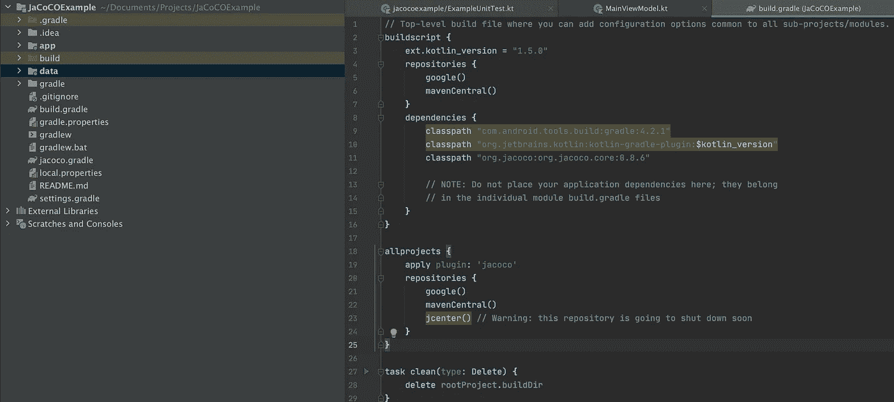
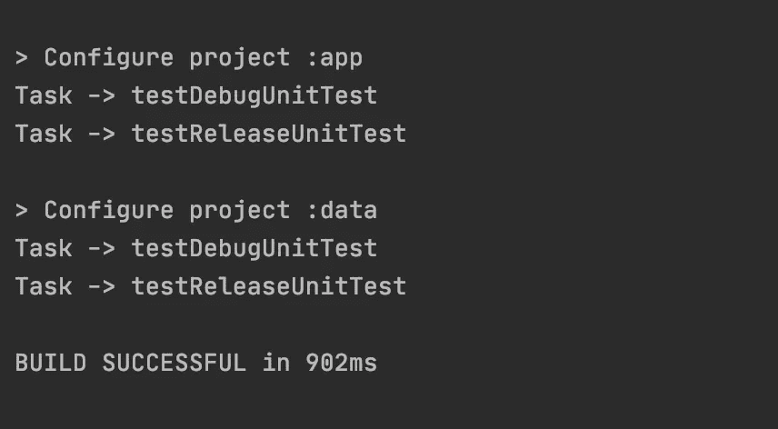
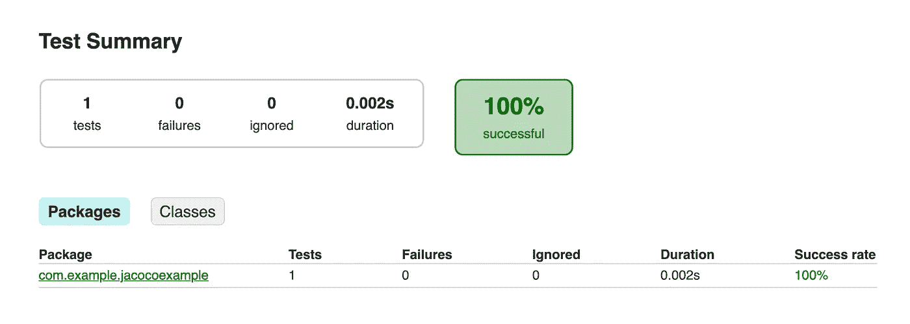
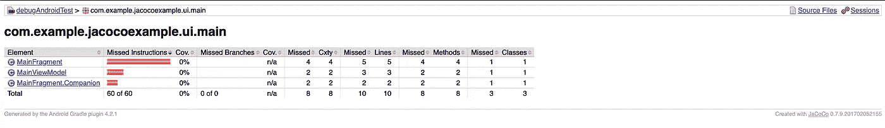

# 使用多模块 Android 应用 Kotlin 设置 JaCoCo 代码覆盖率

> 原文：<https://medium.com/nerd-for-tech/setup-jacoco-code-coverage-with-your-multimodule-android-app-kotlin-a0f82573a1?source=collection_archive---------0----------------------->

在我们上一篇[文章](https://ashish-uniyal.medium.com/setup-ktlint-with-your-android-app-and-using-github-hooks-2cfc42a2cf2)中，我们讨论了如何在我们的 android 项目中设置 ktlint。希望对你有帮助。如果你还没有尝试过，一定要尝试一下，因为这是你做项目时最基本的要求之一。

现在我们来谈谈代码覆盖率。我们想检查编写的代码是否没有错误。但是，我们如何检查代码的真实性呢？在来救援单位测试的情况下。也许改天我们会讨论使用 Mockk 或 Mockito 的单元测试实现，但是今天我们将讨论检查你写的测试用例的覆盖率。为此，我们将使用众所周知的代码覆盖库 [JaCoCo](https://github.com/arturdm/jacoco-android-gradle-plugin) 。照章办事，这就是 Jacoco:

> *JaCoCo 应该为基于 Java VM 的环境中的代码覆盖分析提供标准技术。重点是提供一个轻量级的、灵活的、文档完善的库，以便与各种构建和开发工具集成。*

理论到此为止。现在让我们开始为 kotlin 中的多模块 android 应用程序进行设置。

# 第一步

在项目 gradle 文件中添加 jacoco 依赖项，即 *build.gradle.*

`classpath "org.jacoco:org.jacoco.core:0.8.6"`

在所有项目下，为多模块项目应用插件。

```
allprojects {
   ...
   apply plugin: 'jacoco'
   ...
}
```



项目分级文件

# 第二步

下面的设置可以在项目 gradle 文件中完成，但是为了更简洁，让我们创建一个 *jacoco.gradle* 文件并开始添加所有需要的配置。此外，应用于应用程序中的所有模块也更容易。使用文件的以下内容:

您可能需要检查上述目录中的 fileFilter 内容。根据使用的依赖注入框架和其他生成的类进行修改。

# 第三步

现在，在每个模块 *build.gradle* 中，将 *jacoco.gradle* 应用为:

`apply from: "$project.rootDir/jacoco.gradle"`

现在，当您同步您的项目时，您将会看到所有生成的任务，您可以为这些任务测试代码覆盖率。下面是我的项目的一个例子。



仅此而已。现在，您应该能够通过简单地运行下面的命令来生成测试覆盖报告。

`./gradlew testDebugUnitTest`

或者，如果您想单独生成模块级别，请使用下面的命令:

`./gradlew :module:testDebugUnitTest`

这将在*构建/报告/测试*下生成报告，如下所示。



要检查覆盖率报告，请运行以下命令

`./gradlew createDebugCoverageReport`

这将在*构建/报告/覆盖*下生成类似下面的报告



这就对了。！！。我们已经完成了设置，现在您也可以将它与 Sonarqube 集成。如果你有任何建议，请随时联系我。

[](https://github.com/ashishuniyal90/JacocoTestCoverage) [## ashishuniyal 90/JacocoTestCoverage

### 设置 jacoco 测试覆盖率的存储库。为 ashishuniyal 90/JacocoTestCoverage 开发做出贡献，创建一个…

github.com](https://github.com/ashishuniyal90/JacocoTestCoverage)