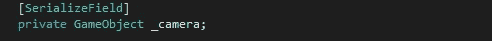
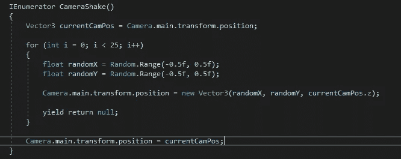
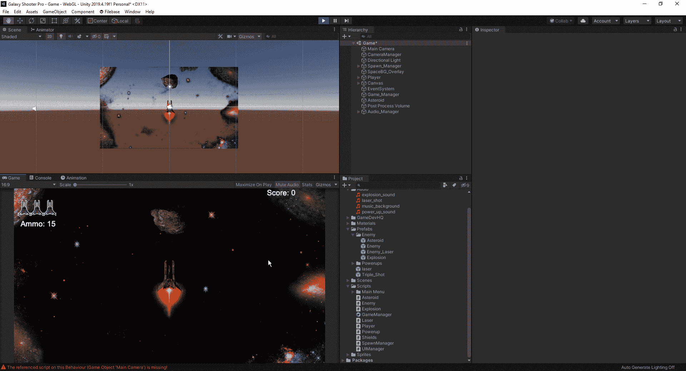

# 在我们的相机里晃动东西

> 原文：<https://medium.com/nerd-for-tech/shaking-things-up-in-our-camera-9bdadc31fde9?source=collection_archive---------20----------------------->

今天，我们将着眼于创造一个指标，当我们的球员采取除了燃烧推进器的损害。我们要实现的是一个相机抖动方法。首先，让我们转到我们的播放器脚本，并创建一个新的变量来连接我们的摄像机:

从这里开始，我们将在我们的播放器脚本中创建一个新的协程来执行我们的相机抖动:

首先，我们将输入一个向量 3，一旦我们完成了 shake 方法，我们的摄像机将重置为这个向量。在这种情况下，我们将使用 for 循环来创建 shake。从这里，我们将输入我们的相机抖动距离，以在 x 轴和 y 轴上工作。在我们关闭这个方法之后，我们将希望确保把摄像机的位置放回我们的主位置，否则我们的游戏摄像机将偏离中心，并且在我们游戏区域的两端将会出现黑边。一旦我们把这些都放进去，我们就可以回到我们的游戏，看看它看起来怎么样，如果我们想让它或多或少有些震撼，就调整我们的价值观:

