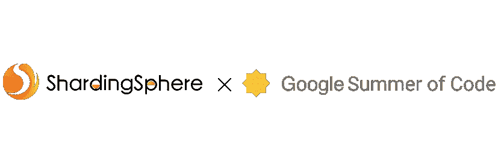
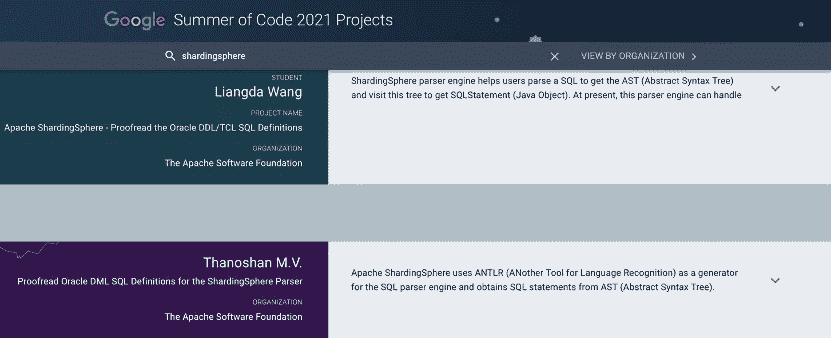

# ShardingSphere x Google 代码之夏:同学们，你们的开源体验如何？

> 原文：<https://medium.com/nerd-for-tech/shardingsphere-x-google-summer-of-code-students-how-was-your-open-source-experience-cd1a635e8882?source=collection_archive---------5----------------------->

最近，ShardingSphere 社区有幸为谷歌代码之夏(GSoC)做出了贡献，并指导下一代开源创新者。我们的项目被选为这个辉煌而长期的项目的一部分，为来自世界各地的学生提供开源软件的体验。

Thanoshan 和梁达是在最近的 GSoC 期间与 Apache ShardingSphere 导师一起工作的学生，并且从那时起继续为该项目做出贡献。

他们非常友好地同意接受 ShardingSphere 委员会成员和社区经理之一 Yacine 的电话采访，分享他们对 GSoC 申请流程、加入 Apache ShardingSphere 项目以及未来计划的看法和经验。

# **学生介绍:**

**名称:**塔诺山

**国家:**斯里兰卡

**大学:** Sabaragamuwa 大学**专业:**计算&信息系统

**姓名:**梁达

国家:德国

**学校:**曼海姆大学

**专业:**商业信息学

# **问&答**

> 你是如何进入软件开发的？

**Thanoshan:** 基本上我的学位和软件开发有关。我个人对这个领域非常感兴趣。甚至在开始上大学之前，我就对它充满热情。

梁达:主要是通过我目前的学习。在高中期间，我对商业和计算机科学都感兴趣，然后我决定学习商业信息学，这是两个学科的结合。那是我编码和软件开发之旅的开始，在那里我学习了 Java、C++、Python 和设计模式等。

> 你是怎么想到申请谷歌代码之夏的？

在这里，在斯里兰卡，我的许多前辈已经参加了谷歌代码之夏。他们强烈建议我看看这个机会，告诉我一定要试试。所以，我研究了 GSoC 项目，比如“关于什么？我该怎么做呢？”。

**梁达:**我第一次知道 GSoC 是在去年的夏天，我在网上冲浪，无意中发现了一个博客分享了一些 GSoC 的经验和申请技巧。我真的被这个节目迷住了。但那时候开源对我来说完全是新鲜事物，我还不够自信。然后在 2020 年冬天，我有机会在大学担任研究助理，从事一个使用 Rasa 的聊天机器人项目，Rasa 是一个开源的对话式人工智能框架。那是我第一次如此深入地进入开源框架并与开源社区互动。对我来说这是一次很棒的经历。我想到了这个主意，为什么不利用 GSoC 的机会去了解更多关于开源世界的知识。

> W **这个项目到底有什么了不起的？**

**梁达:**我认为 GSoC 为感兴趣的学生提供了一个非常好的平台，让他们深入开源社区，学习最新的技术。有将近 200 个开源组织参与了 GSoC，每个组织都提出了几个项目，这些项目需要不同种类的堆栈和技术，从初学者到专业人员都有。所以，我相信，每个学生都可以找到一个合适的项目，如果他们花足够的时间和精力。另一方面，GSoC 为开源社区带来了新鲜血液。所以，这对学生和组织都有好处。

> GSoC 期间你参与了哪个项目？

**thano shan:**sharding sphere 的 ANTLR 项目。我对 Java 和 Java 相关技术非常感兴趣，这是我最喜欢的语言之一。此外，我非常热爱开源软件开发。所以，我想在 Java 和开源方面做些事情，从其他人那里学到更多，让我可以与其他人合作。与 Java 相关的技术是主要的动机，它实际上驱使我参与这个项目。

**梁达:**我的 GSoC 项目致力于 Apache ShardingSphere 的解析器引擎，该引擎处理不同的数据库 SQL，如 MySQL、PostgreSQL、Oracle 等。而我则专注于校对 DDL(数据定义语言)和 TCL(事务控制语言)的 Oracle SQL 定义。

> 你是如何开始对 ShardingSphere 做出贡献的？有什么特别的事情让你开始做出贡献吗？

梁达:这是个有趣的故事。当我找到需要 Java、数据库 SQL 和 Antlr 知识的 ShardingSphere 项目时，我觉得我终于找到了与我的技能和知识相匹配的那个。然而，当我进入吉拉的页面时，那里列出了项目的细节。我注意到从一月份开始，已经有另一名学生在研究这个问题了——thano shan，GSoC 的另一名学生。

那时，他已经提交了几份项目建议书，并取得了良好的进展。所以，我觉得我在这里没有机会，我离开了，并寻找其他组织。三月份的一天，我回到 Apache 软件基金会项目列表，令人惊讶的是，Apache ShardingSphere 添加了一个新项目，但这一次，没有学生参与其中！所以，我觉得这是我的机会，我应该抓住这个机会。然后我就开始着手前期的工作。

> 现在如何与 ShardingSphere 合作？入门有多容易？

**Thanoshan:** 在开始使用 ShardingSphere 时，实际上当时我并不熟悉 ANTLR 项目(另一个语言识别工具)和 ANTLR 的工作，但后来我的导师 Trista 创建了一个问题，这是一个很好的初学者友好问题。

她列出了我们必须完成的任务和要遵循的流程。所以，我按照这些步骤，练习，最后我也学会了 ANTLR，这并不难。其实感觉就像中级水平，但是导师的帮助和支持让它变得很容易。所以，我从我的导师那里学到了很多，因为实际上他们每个人都帮助我完成了任务。导师是 100%有帮助的，我有三个导师，包括 Trista 和其他人，我现在不知道他们的名字，但他们非常友好。他们帮了我很多。我从他们身上学到了很多东西。

**梁达:**刚开始的时候我很难上手，因为我没有很强的计算机科学背景，而且这是我第一次从事如此大规模的项目。我花了几个小时的时间来设置这个包，在最初的几次拉取请求中，我确实遇到了一些问题。

然而，Apache ShardingSphere 是一个友好的社区，我的问题得到了回答，我也从其他贡献者那里得到了很多帮助。我觉得我在这个社区受到了热烈欢迎。这也是我决定向 Apache ShardingShpere 投稿的原因之一。

> 作为 GSoC 的学生，你的体验如何？

梁达:这真是一次非常棒的经历。该计划组织良好，有明确的时间表和时间表。我能够学到很多关于开源开发的知识，提高我的技能和知识。节目最后的 GSoC 学生峰会也非常有趣，内容丰富。

> 为了被 ShardingSphere 选为 GSoC 成员，你做了哪些与众不同的事情？

**梁达:**我认为我真的很有动力，我能够深入我所面临的问题，找到根本原因。如果我自己不能解决这个问题，我不怕直接在 GitHub 上询问。这让我很快上手。

在我熟悉我的项目后，我也主动回答问题，审查拉动请求，并解决其他小问题。除此之外，当我在写我的项目建议书时，我定期与我的导师沟通，并寻求早期反馈。了解导师的期望很重要。

> 你有什么想对那些期待与 GSoC 的 ShardingSphere 一起工作的学生说的吗？或者你有什么建议给他们吗？

**Thanoshan:** 我想会有一些项目由导师和 ShardingSphere 社区指定。因此，学生们必须在 GSoC 之前就加入社区。

学生甚至可以在项目开始前就接触 ShardingSphere 社区，并参与一些与 GSoC 主要任务相关的初步任务，这无疑将有助于他们在选拔过程中竞争。所以，我认为他们应该尽早接触 ShardingSphere 社区。

**梁达:**是的，我强烈推荐它，它肯定会是一次很棒的经历。有一些问题被标记为“良好的第一期”或“志愿者招募”。赶紧去试试吧！最简单的入门方法是边做边学。如果你觉得被封锁了，不要害怕提问和表达你的想法！我们都在这里支持你！

> 你有什么改进 ShardingSphere 的建议吗？

**Thanoshan:** 改善 ShardingSphere？我的意思是这是一个巨大的项目。我在这里看到的优点是文档。太棒了。所以，说实话，我学到了很多关于 SQL 的知识。我参与了该项目的 SQL 解析器引擎部分，因此我在 ShardingSphere 项目中学习了 SQL 解析器引擎的概念。对于改进，我目前没有看到任何具体的东西。事实上，ShardingSphere 是一个很棒的游戏。我真的很喜欢与 ShardingSphere 社区合作。在 ShardingSphere 文档的帮助下，我能够非常容易地理解这些概念。我还看到许多社区贡献者提交了改进文档的请求。我是一个好奇的人，所以我总是在 ShardingSphere 文档和代码、支持、请求和问题中寻找答案。所以，当我第一次设置项目时，我没有这个设置指南。尽管我使用了 JDK，并且设置正确，但当时我没有支持。

很高兴看到 ShardingSphere 目前已经添加了设置指南，这样新的贡献者可以很容易地跳转到该文档，阅读并理解他们必须做的事情。所以，这是一件很棒的事情。我为此感到高兴。

**梁达:**总的来说，我和 ShardingShpere 度过了一个美好的夏天。

我很乐意与导师和其他学生进行一些视频通话，以便在社区联络期间更多地了解彼此。

> 人们热衷的事情有助于成就他们。你热衷的那些事情是什么？

**Thanoshan:** 我非常热爱开源。我为斯里兰卡一家名为 99X 的公司的项目做了贡献。他们支持一些开源项目，所以我至少为他们的五个项目做出了贡献，只是简单的贡献，比如添加一个自述文件、贡献者指南、改进文档和修复一些小错误等等。所以那是我的起点，我真正对开源感兴趣的地方。

**梁达:**我对建设社区充满热情。例如，我是曼海姆中国学生学者协会的主席，该协会帮助中国学生学习和就业。我们也促进与德国文化和社会的交流。在 GSoC 之后，我变得对开源社区充满热情！很高兴看到世界各地的人们一起努力改进产品并相互支持。

> 你明年的路线图是什么？

明年，将是我大学的第四年。因此，我将计划完成我的本科学业，并希望从事更多的开源项目，与社区合作。

**梁达:**从 10 月份开始，我将开始在慕尼黑工业大学攻读硕士学位，我将领导该大学的谷歌开发者学生俱乐部，这是另一个很棒的社区！我将为对谷歌技术感兴趣的学生组织技术活动和研讨会。我真的很期待接下来的挑战。同时，我仍将是开源社区和 ShardingSphere 的一员。也许明年我会再次参加 GSoC！

> 你有什么问题要问我或者你想知道的吗？

**塔诺山:**只有一个问题。那么你能给我一些积极贡献 ShardingSphere 并产生重大影响的建议吗？

好的，当然。所以，有很多方法。其中之一就是问题。我们有问题，你可以帮忙。或者像你提到的，文档是我们正在做的事情。我已经看出你是一个好作家。我读了你在 Medium 上的文章，如果你愿意的话，这是你可以帮忙的。此外，你的文章有很多读者，所以它有助于社区建设。

可以通过多种方式做出贡献。有代码贡献，也有非代码贡献。这些也同样受到社区的赞赏。我不确定你是否希望有一天成为 Apache 社区的提交者，但是有一个投票过程，投票时会考虑这种类型的贡献。我不确定你是否希望有一天成为 Apache 社区的提交者，但是有一个投票过程，投票时会考虑这种类型的贡献。

那是我的目标之一！毕业后，我肯定想成为一名委员，这是我为自己设定的目标。

**雅辛:**实际上，我最近刚刚在讨论 PMC 沙丁球的椅子时就谈到了这个问题。他提到，ShardingSphere 社区赞赏代码贡献，但即使有人仍在学习，并表现出帮助社区、与社区一起学习和成长的愿望，这也是 ShardingSphere 社区高度赞赏的。如果你想成为提交者，有一个投票过程，如果你对我们和这个项目满意，等等。，你一定能做到。

# **结论**

Thanoshan 和梁达分享了他们在 GSoC 和 ShardingSphere 项目和社区中的许多经验。我们的社区非常感谢他们的努力。这两位 GSoC 的学生在 GSoC 和 ShardingSphere 上有着非常好的经历，在这个社区中，他们可以在导师和社区成员的帮助下成长，也可以为一个大型项目做出贡献。所以不要怕入门！

ShardingSphere 社区欢迎所有技能水平和不同技能组合的人，他们不一定是编码技能，加入并帮助社区发展。

如果您对 Apache ShardingSphere 项目感兴趣，请随时联系我们的 socials(下面的链接)或查看我们的 GitHub 页面。

# **ShardingSphere 社区:**

**sharding sphere Github:**[https://github.com/apache/shardingsphere](https://github.com/apache/shardingsphere)

**sharding sphere Twitter:**[https://twitter.com/ShardingSphere](https://twitter.com/ShardingSphere)

**沙丁球松弛通道:**[apacheshardingsphere.slack.com](http://apacheshardingsphere.slack.com/)

# 作者

> 亚辛·西·塔耶布

*Apache ShardingSphere 贡献者*

*spherex 国际运营经理*

Yacine 对技术和创新充满热情，他搬到北京攻读工商管理博士学位，并对当地的初创企业和技术领域充满敬畏。到目前为止，他的职业道路是由技术和商业交汇处的机遇塑造的。最近，他对 ShardingSphere 数据库生态系统的开发和开源社区建设产生了浓厚的兴趣。

**Yacine 的 LinkedIn:**【https://www.linkedin.com/in/yacinesitayeb/】T2

【https://twitter.com/RedVega11】Yacine 的推特:

> **徐洛梅**

感谢徐洛梅在采访转录过程和本文准备过程中提供的帮助。

**徐洛梅的领英:**[https://www . LinkedIn . com/in/% E9 % AA % 86% E6 % A2 % 85-% E5 % BE % 90-b 796461 b 9/](https://www.linkedin.com/in/%E9%AA%86%E6%A2%85-%E5%BE%90-b796461b9/)