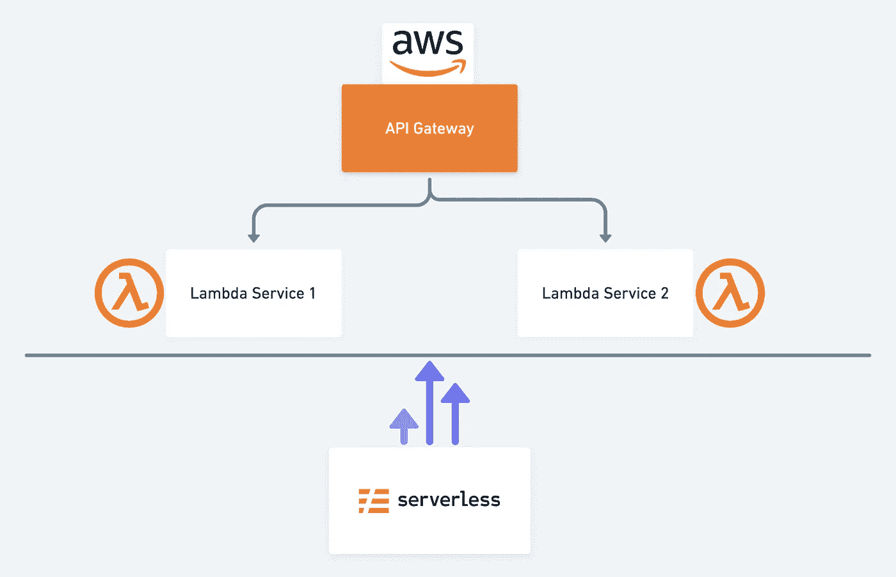
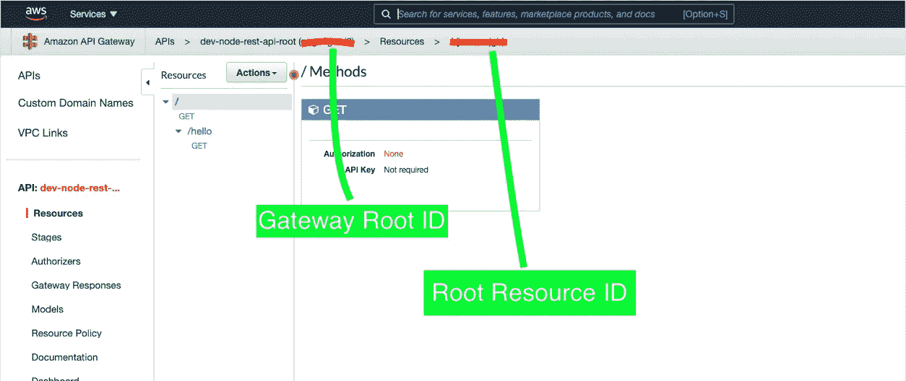
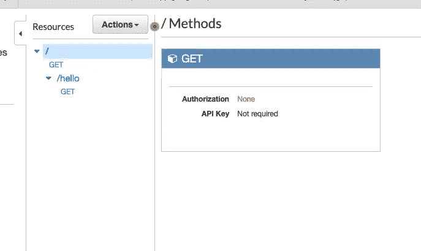

# 多个服务之间的共享 API 网关

> 原文：<https://medium.com/nerd-for-tech/shared-api-gateway-between-multiple-services-719e66a84415?source=collection_archive---------8----------------------->

在本文中，让我们看看如何在多个服务之间共享一个 AWS API 网关。

**TechStack** : AWS API Gateway，AWS Lambda，无服务器框架，JavaScript

**先决条件**:

*   本地安装和配置的 AWS:[指南](https://docs.aws.amazon.com/sdk-for-java/v1/developer-guide/setup-credentials.html)
*   全球安装无服务器:[指南](https://www.serverless.com/framework/docs/providers/aws/guide/installation/)

假设您已经在本地机器上完成了上述设置，让我们开始吧。

**创建根 API 网关**

继续创建一个你选择的单独的目录，我们称之为，`rest-api-root`然后`cd`到创建的目录中，然后创建下面的文件，

首先，为主 lambda 创建一个简单的处理程序，如下所示，

现在创建下面的 serverless.yml 配置

现在我们已经完成了无服务器配置和根 API 的基本处理程序，让我们开始部署吧。

因为您已经全局安装了无服务器，所以您可以运行下面的命令来部署这个简单的服务。

`sls deploy -v`

一旦命令执行完毕，它应该已经在幕后提供了必要的资源，并最终公开了一个 API 网关端点 URL，如下所示，

`[https://{SOME-ID}.execute-api.us-east-1.amazonaws.com/dev/](https://qugc3gxwi8.execute-api.us-east-1.amazonaws.com/dev/)`

如果您访问这个 URL，您将能够看到如下所示的输出，

`**{**"message": "Go Serverless!"**}**`

现在我们已经用一个简单的服务创建了根 API 网关，让我们继续创建另一个 Lambda 服务，它将共享上面提供的相同 API 网关。

**创建一个共享上述 API 网关的子服务**

在`rest-api-root`之外单独创建一个目录，称之为`lambda-service1`。

在`lambda-service1`目录中，创建以下文件。

为该服务创建处理程序，

现在，在我们创建 serverless.yml 配置文件之前，我们需要知道两件事，

1.API 网关 ID

2.API 网关根资源 ID

以上两种可以使用 AWS 控制台找到，一旦你登录到控制台，访问 AWS API 网关

正如你在上面的截图中看到的，你需要获取这两个 id，并把它们放在下面的 Lambda 服务的无服务器配置中。

一旦这也完成了，现在我们可以部署我们的第二个 lambda 服务，它将使用我们之前创建的相同的 API 网关。

`sls deploy -v`

*重要:请注意，一旦部署完毕，您将看到生成的端点输出将在 URL 的末尾包含`/hello`,因为我们已经为这个 lambda 服务定义了一个新的方法路由。

`events:` T5`- http:` T6`path: /hello`

现在，如果您在控制台上转到 API Gateway，您会注意到它已经在同一个网关上创建了一个新路径来映射新的 lambda 服务，如下所示，

您将能够适当地扩展这个解决方案，以支持可以使用一个根 API 网关的多个服务。这使得管理变得更加容易和简单。

*原载于 2021 年 7 月 10 日 https://dilushagonagala.com**[*。*](https://dilushagonagala.com/share-api-gateway-between-multiple-services/)*