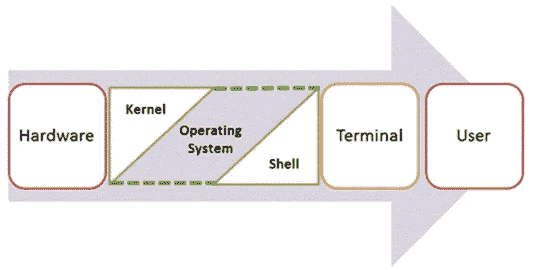
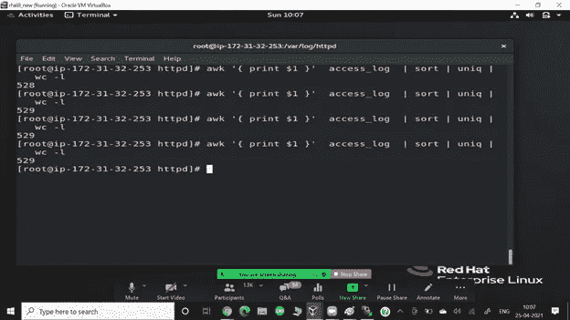
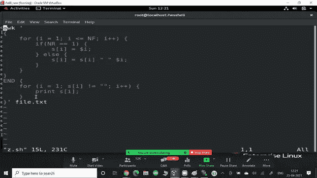
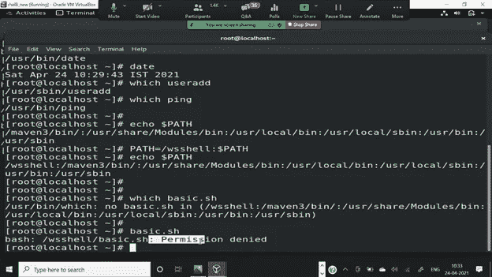

# 外壳脚本

> 原文：<https://medium.com/nerd-for-tech/shell-scripting-e95af96aed1b?source=collection_archive---------5----------------------->


你可能会多次遇到“脚本”这个词，但是脚本的含义是什么呢？基本上，脚本是包含一系列要执行的命令的程序。这些命令由解释程序执行。任何可以放入命令行的东西，都可以放入脚本。而且，脚本非常适合自动化任务。如果你发现自己经常重复一些命令，你可以，更确切地说，你应该创建一个脚本来完成它！

*   **最后附上两个特别的剧本。**

## 什么是 CLI 和 GUI？

CLI 是命令行界面。该用户界面使用户能够给出与设备交互的命令。

GUI 是一种图形用户界面。该用户界面使用户能够借助图形图标和可视指示器与设备进行交互。

## 为什么我们要使用 CLI 而不是 GUI？

*   CLI 为用户提供了更好的控制。
*   对于使用更多编程语言的专业人员来说，CLI 是最佳选择。
*   与 GUI 相比，它需要更少的内存。
*   CLI 的速度比 GUI 快。

## 壳牌是什么？

**Shell** 是一个 UNIX 术语，指用户和操作系统服务之间的接口。Shell 为用户提供了一个界面，接受人类可读的命令并执行这些命令，这些命令可以自动运行，并在 shell 脚本中给出程序的输出。

经营由许多部分组成，但它的两个主要部分是

*   核心
*   壳



**Shell Scripting** 是一个开源的计算机程序，旨在由 Unix/Linux shell 运行。Shell 脚本是一个编写一系列命令供 shell 执行的程序。它可以将冗长和重复的命令序列合并成一个简单的脚本，可以随时存储和执行，从而减少编程工作量。

*   /bin/bash 和/bin/sh 是交互式 shell
*   /sbin/nologin shell 是非交互式 shell

## Shell 提示符

提示符 **$** 称为**命令提示符**，由 shell 发出。当提示符显示时，您可以键入命令。

在你按下**回车**后，Shell 读取你的输入。它通过查看您输入的第一个单词来确定您想要执行的命令。单词是一组完整的字符。空格和制表符分隔单词。

下面是一个简单的 **date** 命令的例子，它显示当前的日期和时间

```
$ date
```

## 如何确定外壳

您可以使用以下命令获得您的 shell 提示符的名称:

```
$ echo $SHELL
```

$符号代表一个 shell 变量，无论您输入什么，echo 都会返回文本。

## 让我们写我们的第一个剧本

```
#!/bin/bash
echo "My First Script!"
```

要运行它，

```
$ chmod +x script.sh
$ ./script.sh
```

## 事情

你可能已经注意到在上面的脚本中，它以`#!/bin/bash`开始，这被称为 shebang。基本上是将路径提交给解释器。有很多解释器，其中一些是:bash，zsh，csh 和 ksh 等。


生活中所有优秀的人似乎都喜欢 LINUX。—史蒂夫·沃兹尼亚克

使用 bash: `#!/bin/bash`
使用 zsh: `#!/bin/zsh`
使用 ksh: `#!/bin/ksh`
使用 csh: `#!/bin/csh`

**为什么舍邦？** `#`常被称为 sharp，`!`被称为 Bang，故名 sharp bang，但一般人说它 **shebang** 而不是 sharp bang。

**Note*** 如果一个脚本不包含 shebang，那么命令将使用您的 shell 来执行，因此代码可能会正常运行，但是这仍然不是正确的做法！

**注释** 注释以一个`#`符号开始，该行井号之后的任何内容都被忽略。

## 外壳的类型

Linux 中有两个主要的 shells:

**1** 。伯恩外壳(Bourne Shell):这个外壳的提示符是$并且它的派生如下:

*   POSIX shell 也称为 sh
*   光辉国际也被称为上海
*   又称为 bash(最流行的)

**2。****C shell**:这个 shell 的提示是%，它的子类是:

*   C shell 也称为 csh
*   托普斯-C-壳牌公司也被称为 tcsh

## 基本命令

列出一个目录的内容。

打印工作目录。

cd:更改目录

cat:连接并打印文件内容

tac:连接并打印 reverese 中的文件内容。

rev:反转文件的行

man:显示命令的手册页

cp:复制文件或目录

移动或重命名文件或目录

rm:删除文件或目录

mkdir:创建目录

rmdir:删除“空”目录

日期:打印或设置系统日期和时间。

触摸:更改文件时间戳。如果文件不存在，将会被创建。

更多:一次一屏打印文件内容。

less:类似于 more，但允许在文件中向前和向后移动。

seq:打印开始和结束之间的数字序列。

回显:将文本行打印到标准输出(屏幕)。

显示日历(一个月或一整年)

清除:清除终端屏幕。

# 系统管理员日常使用 Shell 脚本的例子

*   监控您的 Linux 系统。
*   数据备份和创建快照。
*   转储 Oracle 或 MySQL 数据库进行备份。
*   创建基于电子邮件的警报系统。
*   找出哪些进程正在消耗您的系统资源。
*   找出可用和空闲内存。
*   找出所有登录的用户和他们在做什么。
*   查明所有必要的网络服务是否正在运行。例如，如果 web 服务器出现故障，则通过寻呼机或电子邮件向系统管理员发送警报。
*   找出所有失败的登录尝试，如果从同一个网络 IP 重复登录尝试，自动阻止所有这些 IP 通过防火墙访问您的网络/服务。
*   根据您自己的安全策略进行用户管理。
*   找出有关本地或远程服务器的信息。
*   服务器配置。

# GREP 命令

grep 过滤器在文件中搜索特定的字符模式，并显示包含该模式的所有行。在文件中搜索的模式称为正则表达式(grep 代表全局搜索正则表达式并打印输出)。

```
**$ grep [options] pattern [files]****Options Description**
**-c** : This prints only a count of the lines that match a pattern
**-h :** Display the matched lines, but do not display the filenames.
**-i :** Ignores, case for matching
**-l :** Displays list of a filenames only.
**-n :** Display the matched lines and their line numbers.
**-v :** This prints out all the lines that do not matches the pattern
**-e exp :** Specifies expression with this option. Can use multiple times.
**-f file :** Takes patterns from file, one per line.
**-E :** Treats pattern as an extended regular expression (ERE)
**-w :** Match whole word
**-o :** Print only the matched parts of a matching line,
 with each such part on a separate output line.**-A n** **:** Prints searched line and nlines after the result. **-B n :** Prints searched line and n line before the result.
**-C n :** Prints searched line and n lines after before the result.
```

# 一起运行多个命令

使用&&例如:日期&&呼叫。我们也可以使用||。

# 如何创建多个文本文件和目录？

要创建多个文本文件，使用触摸文件名命令

《出埃及记》假设我们想要创建 4 个文件，然后我们键入#touch filename{1..4}

使用{文件名}命令创建多个目录 mkdir

《出埃及记》假设我们想要创建 4 个目录，然后我们键入 mkdir filename {1..4}

# 头尾命令有什么用？

Head 命令用于显示开始的 10 行

Tail 命令用于显示开始的 10 行

# 如何找到你正在使用的当前 shell？

$echo $SHELL 命令用于查找当前 SHELL。

# 如何在您的系统中找到可用的 shell？

cat/etc/shell 命令用于查找系统中可用的 shell。

# 在 Linux 中，如何传递和访问脚本的参数？

对于脚本“scriptname arg1 arg2 arg3 …”中的传递参数

对于访问，脚本中的参数可以在脚本中以“$1，$2..$n "

# $#的意义是什么？

它表示由字符串传递的参数总数。

# $*和$@有什么区别？

$*将整组位置参数视为单个字符串，但$@将每个带引号的参数视为单独的参数。

# Shell 脚本中使用了哪些不同类型的变量？

**系统定义变量**:OS 自己创建的系统定义变量。这些变量通常用大写字母来定义。可以通过“set”命令查看。

**自定义变量**:由系统用户创建。可以使用“echo $variablename”命令查看变量值。

# =和==有什么区别？

=用于给变量赋值

==用于字符串比较

# 什么是外壳变量？

变量以字符和数字的形式存储数据。类似地，shell 变量用于存储信息，并且只能由 Shell 使用。

例如，以下代码创建一个 shell 变量，然后打印它:

```
variable ="Hello"
echo $variable
```

下面是一个使用变量的小脚本。

```
#!/bin/sh
echo "what is your name?"
read name
echo "How do you do, $name?"
read remark
echo "I am $remark too!"
```

**注意:**我们也可以把一个命令的输出赋值给一个变量比如:`LIST=$(ls)`，再比如:`SERVER_NAME=$(hostname)`

**一些有效的变量名:**

```
THIS3VARIABLE=”ABC”
THIS_IS_VARIABLE=”ABC”
thisIsVariable=”ABC”
```

**一些无效的变量名:**

```
4Number=”NUM”
This-Is-Var=”VAR”
# No special character apart from underscore is allowed!
```

# 只读变量

Shell 提供了一种通过使用 read-only 命令将变量标记为只读的方法。变量被标记为只读后，其值不能更改。

例如，以下脚本在尝试更改 NAME 的值时会生成错误

```
#!/bin/shNAME="Vimal Daga"
readonly NAME
NAME="Preeti Daga"
```

上述脚本将生成以下结果

```
/bin/sh: NAME: This variable is read only.
```

# 取消设置变量

取消设置或删除变量会指示 shell 从它跟踪的变量列表中删除该变量。一旦取消设置变量，就不能访问变量中存储的值。

以下是使用**取消设置**命令取消设置已定义变量的语法

```
unset variable_name
```

上面的命令取消已定义变量的值。下面是一个简单的例子，演示了该命令是如何工作的

```
#!/bin/shNAME="VD"
unset NAME
echo $NAME
```

# 特殊变量

**$** 字符代表当前 shell 的进程 ID 号或 PID

```
$echo $$
```

上述命令写入当前 shell 的 PID。

*   **$0 :** 当前脚本的文件名。
*   **$n :** 这些变量对应于调用脚本时使用的参数。这里 **n** 是一个正十进制数，对应一个自变量的位置(第一个自变量是$1，第二个自变量是$2，以此类推)。
*   **$# :** 提供给脚本的参数个数。
*   **$* :** 所有的参数都用双引号括起来。如果脚本接收两个参数，$*相当于$1 $2。
*   **$@ :** 所有的参数都分别用双引号引起来。如果脚本接收两个参数，$@相当于$1 $2。
*   **$？:**最后执行的命令的退出状态。
*   **$$ :** 当前 shell 的进程号。对于 shell 脚本，这是它们执行时使用的进程 ID。
*   **$！:**最后一个后台命令的进程号。

# 用户输入

`read`命令接受标准输入(标准输入)

```
read -p "PROMPT MESSAGE" VARIABLE
```

此时，“提示信息”将被提示到屏幕上，无论用户下一步输入什么，都将被存储在`VARIABLE`中

```
#!/bin/bash
read -p "Please Enter You Name: " NAME
echo "Your Name Is: $NAME"
```

# 外壳阵列

如果您使用的是 **bash** shell，下面是数组初始化的语法

```
array_name=(value1 ... valuen)
```

## 访问数组值

设置任何数组变量后，可以按如下方式访问它

```
${array_name[index]}
```

*   **打印所有数组索引:**

```
$ echo ${!array[@]}
```

*   从 id 为 3 的数组中移除元素

```
$ Unset array[3]
```

# 测试操作员

测试用于决策。`[ condition-to-test-for ]` **举例:** ` `[ -e /etc/passwd ]`

1.  **文件测试操作**

```
-d FILE_NAM  # True if FILE_NAM is a directory
-e FILE_NAM  # True if FILE_NAM exists
-f FILE_NAM  # True if FILE_NAM exists and is a regular file
-r FILE_NAM  # True if FILE_NAM is readable
-s FILE_NAM  # True if FILE_NAM exists and is not empty
-w FILE_NAM  # True if FILE_NAM has write permission
-x FILE_NAM  # True if FILE_NAM is executable
```

**2。字符串测试操作**

```
-z STRING  # True if STRING is empty
-n STRING  # True if STRING is not empty
STRING1 = STRIN2 # True if strings are equal
STRING1 != STRIN2 # True if strings are not equal
```

**3。关系运算符**

```
var1 -eq var2  # True if var1 is equal to var2
var1 -ne var2  # True if var1 not equal to var2
var1 -lt var2  # True if var1 is less than var2
var1 -le var2  # True if var1 is less than or equal to var2
var1 -gt var2  # True if var1 is greater than var2
var1 -ge var2  # True if var1 is greater than or equal to var2
```

# 决策

就像任何脚本一样，shell 脚本可以根据条件做出决策。我们可以使用 If-Else(或者，If-Elif-Else)和 case 语句进行决策。

1.  **`**if**`**报表****

```
if [ condition-is-true ]
then
  command 1
  command 2
    ...
    ...
  command N
fi
```

****if-elif 阶梯****

```
if [ condition-is-true ]
then
  command 1
elif [ condition-is-true ]
then
  command 2
elif [ condition-is-true ]
then
  command 3
else
  command 4
fi
```

****2。Case 语句** case 语句是 if 语句的替代语句，比复杂的 if elif 语句更容易阅读。如果您发现自己使用 If 语句来比较相同的变量和一些不同的/离散的值，您可以使用 case 语句来代替 if-elif 梯形。**

****语法:****

```
case "$VAR" in
  pattern_1)
    # commands when $VAR matches pattern 1
    ;;
  pattern_2)
    # commands when $VAR matches pattern 2
    ;;
  *)
    # This will run if $VAR doesnt match any of the given patterns
    ;;
esac
```

****例如:****

```
#!/bin/bash
read -p "Enter the answer in Y/N: " ANSWER
case "$ANSWER" in
  [yY] | [yY][eE][sS])
    echo "The Answer is Yes :)"
    ;;
  [nN] | [nN][oO])
    echo "The Answer is No :("
    ;;
  *)
    echo "Invalid Answer :/"
    ;;
esac
```

# **迭代语句:循环**

**循环可以多次执行一个代码块，主要用于执行迭代。**

****1。For 循环****

```
for VARIABLE_NAME in ITEM_1 ITEM_N
do
  command 1
  command 2
    ...
    ...
  command N
done
```

**例如:**

```
#!/bin/bash
COLORS="red green blue"
for COLOR in $COLORS
do
  echo "The Color is: ${COLOR}"
done
```

**for 循环的另一种用法是:**

```
for (( VAR=1;VAR<N;VAR++ ))
do
  command 1
  command 2
    ...
    ...
  command N
done
```

**这里有一个例子，说明了如何创建一个脚本来重命名每个文件。txt 格式到新- <old-name>。文本文件（textfile）</old-name>**

```
#!/bin/bash
FILES=$(ls *txt)
NEW="new"
for FILE in $FILES
do
  echo "Renaming $FILE to new-$FILE"
  mv $FILE $NEW-$FILE
done
```

****2。While 循环****

**只要给定的条件为真，While 循环就重复一系列命令。**

```
while [ CONNDITION_IS_TRUE ]
do
  # Commands will change he entry condition
  command 1
  command 2
    ...
    ...
  command N
done
```

**条件可以是任何测试或命令。如果测试/命令返回 0 退出状态，这意味着条件为真，命令将被执行。如果命令返回非零退出状态，循环将停止迭代。如果条件最初为假，那么循环中的命令将永远不会执行。**

****示例:**逐行读取文件**

```
#!/bin/bash
LINE=1
while read CURRENT_LINE
do
  echo "${LINE}: $CURRENT_LINE"
  ((LINE++))
done < /etc/passwd
# This script loops through the file /etc/passwd line by line
```

# **嵌套 while 循环**

**可以将 while 循环用作另一个 while 循环体的一部分。**

# **句法**

```
while command1 ; # this is loop1, the outer loop
do
   Statement(s) to be executed if command1 is truewhile command2 ; # this is loop2, the inner loop
   do
      Statement(s) to be executed if command2 is true
   doneStatement(s) to be executed if command1 is true
done
```

# **例子**

**这是一个简单的循环嵌套的例子。让我们在您用来数到 9 的循环中添加另一个倒计时循环**

```
#!/bin/sha=0
while [ "$a" -lt 10 ]    # this is loop1
do
   b="$a"
   while [ "$b" -ge 0 ]  # this is loop2
   do
      echo -n "$b "
      b=`expr $b - 1`
   done
   echo
   a=`expr $a + 1`
done
```

**这将产生以下结果。这里需要注意的是 **echo -n** 是如何工作的。这里的 **-n** 选项让 echo 避免打印新的一行字符。**

```
0
1 0
2 1 0
3 2 1 0
4 3 2 1 0
5 4 3 2 1 0
6 5 4 3 2 1 0
7 6 5 4 3 2 1 0
8 7 6 5 4 3 2 1 0
9 8 7 6 5 4 3 2 1 0
```

****注意:**
`continue`语句用于将流程控制到下一次迭代。命中 continue 语句后的任何语句都不会被执行，控制流将转移到下一次迭代。
`break`语句可以在 while 循环(或其他类似 for 循环的循环)中用来结束循环。一旦 break 语句被命中，控制流将移出循环。**

# **位置参数**

**当我们调用脚本时，可以传递一些参数。
例如:`$ ./script.sh param1 param2 param3 param4`**

**所有参数将存储在各种变量中:**

```
$0 -- "script.sh"
  $1 -- "param1"
  $2 -- "param2"
  $3 -- "param3"
  $4 -- "param4"
  $@ -- array of all positional parameters
```

**就像任何其他全局变量一样，可以在脚本中的任何地方访问这些变量。**

# **退出状态**

**每个命令返回一个退出状态，也称为返回代码，范围从 0 到 255。退出状态用于错误检查。**

*   **0 表示成功**
*   **除 0 之外的任何代码都意味着错误情况。**

**要了解命令的退出状态意味着什么，可以使用`man`或`info`命令查找文档或手册。
`$?`包含先前执行命令的返回代码。**

****示例:**使用 ping 命令打印`Reachable/Unreachable`主机/服务器的脚本。**

```
#!/bin/bash
HOST="google.com"
ping -c 1 $HOST     # -c is used for count, it will send the request, number of times mentioned
RETURN_CODE=$?
if [ "$RETURN_CODE" -eq "0" ]
then
  echo "$HOST reachable"
else
  echo "$HOST unreachable"
fi
```

****自定义退出状态** 退出命令用于显式定义返回代码。如果我们没有明确定义 shell 脚本的退出状态，那么默认情况下，最后执行的命令的退出状态将被视为脚本的退出状态。我们可以在脚本中的任何地方使用 exit 命令，一旦遇到 exit 命令，shell 脚本将停止执行。**

```
exit 0
  exit 1
  exit 2
    ...
    ...
  exit 255
```

# **功能**

**一组指令，当需要这些指令时，可以从主程序中随时重用或调用。考虑这样一种情况，你有一个特定的模块做特定的工作，现在让我们假设这个工作在主程序中要做 20 次(比如说)，例如计算一个数字数组中的最大数。现在，如果你为此写 20 次代码，你的代码会变得很大，但是，如果我们为此写一个函数，并在需要的时候调用这个函数，代码会很短，容易阅读，而且更加模块化。**

**使用函数减少了脚本的总长度/大小。此外，函数使程序更容易维护，因为它们将代码分成模块，在出现错误/错误时提供特定的地方进行编辑和故障排除。**

****注意:**
——每当你发现自己在重复一组指令的时候，就为它创建一个函数。(函数必须在使用前定义)。
-在启动主程序或主指令之前，最好在顶部定义所有功能。**

****语法:****

```
function function_name() {
    command 1
    command 2
    command 3
      ...
      ...
    command N
}
```

****调用一个函数:**只需在脚本中的一行写下它的名字。**

```
#!/bin/bash
function myFunc () {
    echo "Shell Scripting Is Fun!"
}
myFunc
```

# **向函数传递参数**

**您可以定义一个在调用函数时接受参数的函数。这些参数将由 **$1** 、 **$2** 等表示。**

**下面是一个例子，我们传递两个参数 *Zara* 和 *Ali* ，然后我们在函数中捕获并打印这些参数。**

```
#!/bin/sh# Define your function here
Hello () {
   echo "Hello World $1 $2"
}# Invoke your function
Hello vimal daga
```

**执行后，您将收到以下结果**

```
$./test.sh
Hello World vimal daga
```

**要从 shell 中删除函数的定义，请使用带有- **f** 选项的 unset 命令。该命令也用于删除外壳中变量的定义。**

```
$ unset -f function_name
```

# **函数中的位置参数**

**就像 shell 脚本一样，函数也可以接受参数。第一个参数存储在$1 中，第二个参数存储在$2 中，依此类推。$@包含所有参数。
**注意:** $0 还是脚本本身的名字，不是函数的名字。
要提供参数，只需将它们写在函数名之后，中间留一个空格。`myFunc param1 param2 param3 ...`**

****变量范围****

****全局范围:**默认情况下，所有变量都有全局范围。具有全局范围意味着可以从脚本中的任何地方访问该变量的值。变量必须在使用前定义。
**局部范围:**局部变量只能从函数内部访问。使用关键字`local`创建局部变量，只有函数可以有局部变量。将函数中的变量保持在局部是一个好习惯。**

# **通配符**

**用于匹配文件名和目录名的字符或字符串模式称为通配符。用于将通配符模式扩展为文件和/或目录(或基本路径)列表的过程称为 Globbing。
通配符可用于大多数需要文件/目录路径作为参数的命令。(例如 ls、rm、cp 等)。**

# **一些常用的通配符**

***** =匹配零个或多个字符** 例如:`*.txt` `hello.*` `great*.md`**

****？=恰好匹配一个字符** 例如:`?.md` `Hello?`**

****[ ] =一个字符类** 该通配符用于匹配方括号内的任何字符(只匹配一个字符)。
举例:`He[loym]`，`[AIEOU]`**

****【！] =不包括在括号** 内的匹配字符它只匹配一个字符。
示例:匹配辅音:`[!aeiou]`**

****预定义的命名字符类****

*   **[[:alpha:]]**
*   **[[:alnum:]]**
*   **[[:空格:]]**
*   **[[:upper:]]]**
*   **[[:更低:]]**
*   **[[:digit:]]**

****匹配通配符:**如果我们必须匹配通配符本身，如`*`或`?`，我们可以使用转义符- `\` **例如:**`*\?`–>将匹配所有以问号结尾的文件。**

# **排除故障**

**bug 是计算机程序/软件中的一个错误，导致它产生一个意想不到的或不正确的结果。大多数错误都是由代码和设计中的错误引起的。要修复错误，请尝试找到意外行为的根源。**

**bash shell 提供了一些选项，可以帮助您调试脚本。您可以通过更新脚本的第一行来使用这些选项。**

****部分选项:****

****1。-x 选项**
它在命令和参数执行时打印它们。它被称为打印调试、跟踪或 x 跟踪。我们可以通过修改第一行`#!/bin/bash -x`来使用它**

****2。-e 选项** 代表“出错退出”。如果命令以非零退出状态退出，这将导致脚本立即退出。**

****3。-v 选项** 它在读取时打印 shell 命令/输入行。**

****注意*** 这些选项可以组合使用，一次可以使用多个选项！**

```
#!/bin/bash-xe
#!/bin/bash-ex
#!/bin/bash-x-e
#!/bin/bash-e-x
```

# **外壳输入/输出重定向**

## **输出重定向**

**通常用于标准输出的命令输出可以很容易地转移到文件中。这种能力被称为输出重定向。**

**如果将符号> file 附加到任何通常将其输出写入标准输出的命令，则该命令的输出将被写入文件，而不是您的终端。**

**检查以下 **who** 命令，该命令将命令的完整输出重定向到用户文件中。**

```
$ who > users
```

**请注意，终端上没有输出。这是因为输出已经从默认的标准输出设备(终端)重定向到指定的文件中。您可以检查用户文件以获得完整的内容**

```
$ cat users
```

**如果一个命令将其输出重定向到一个文件，而该文件已经包含一些数据，那么这些数据将会丢失。考虑下面的例子**

```
$ echo line 1 > users
$ cat users
line 1
```

**您可以使用>>运算符将输出附加到现有文件中，如下所示**

```
$ echo line 2 >> users
$ cat users
line 1
line 2
```

## **输入重定向**

**就像命令的输出可以重定向到文件一样，命令的输入也可以从文件重定向。由于**大于号>** 用于输出重定向，所以**小于号<** 用于重定向命令的输入。**

**通常从标准输入中获取输入的命令可以通过这种方式从文件中重定向其输入。例如，要计算上面生成的文件 *users* 中的行数，可以执行如下命令**

```
$ wc -l users
2 users
```

**执行后，您将收到以下输出。您可以通过从文件*用户*重定向 **wc** 命令的标准输入来计算文件中的行数**

```
$ wc -l < users
2
```

**请注意，两种形式的 wc 命令产生的输出是不同的。在第一种情况下，文件用户的名称与行数一起列出；在第二种情况下，就不是了。**

**在第一种情况下，wc 知道它正在从文件用户那里读取输入。在第二种情况下，它只知道从标准输入中读取输入，所以不显示文件名。**

## **从文件的每一行获取第 5rd 元素**

```
$ awk ‘{print $5}’
```

## **从给定的文件名中找出包含单词“ABC”的行数:**

```
$ grep –c “ABC” filename
```

## **从文件的每一行获取第三个元素/列**

```
$ awk '{print $3}' $1
```

## **打印系统上所有用户的登录名:**

**/etc/shadow 文件列出了所有用户。**

```
$ awk –F ‘:’ ‘{print $1}’ /etc/shadow|uniq –u
```

## **在文件的每 50 行插入一行“ABCD”**

```
$ sed ’50i\ABCD’ filename
```

## **从任何文件中剪切任何字段**

```
$ cut -f 6 -d “:” /etc/passwd
```

**f 代表字段，d 代表字段分隔，etc/passwd 是一个 one 文件。**

# **AWK 司令部**

****awk 命令**用于 Linux 中的**文本处理**。虽然，sed 命令也用于文本处理，但是它有一些限制，所以 awk 命令成为文本处理的一个方便的选项。它提供了对数据的强大控制。**

**Awk 是一种强大的脚本语言，用于**文本脚本**。它搜索和替换文本，并对数据库进行排序、验证和索引。**

**它是程序员使用最广泛的工具之一，因为他们以语句的形式编写按比例缩小的有效程序来定义文本模式和设计。**

**它在 Linux 中充当**过滤器。在 Linux 中也被称为 **gawk (GNU awk)** 。****

## **AWK 是怎么命名的？**

**这个命令是用三个人名字的第一个字母命名的，他们在 1977 年编写了这个命令的最初版本。他们的名字是**阿尔弗雷德·艾侯、彼得·温伯格、**和**布莱恩·克尼根**，他们来自& T 贝尔实验室的**。****

## **AWK 司令部的特点**

**Awk 命令的各种功能如下:**

*   **它逐行扫描文件。**
*   **它将一个文件分割成多个字段。**
*   **它比较输入文本或文本文件的一部分。**
*   **它对文件执行各种操作，比如搜索指定的文本等等。**
*   **它格式化输出行。**
*   **它执行算术和字符串操作。**
*   **它将条件和循环应用于输出。**
*   **它转换指定结构上的文件和数据。**
*   **它生成格式报告。**

****语法:****

**Awk 命令的用法如下:**

```
$ awk options ‘selection _criteria {action }’ input-file **>** output-file
```

**这些选项可以是:**

*   ****-f 程序文件:**它读取写在 awk 命令上的脚本的源代码**
*   ****-F fs:** 用作输入字段分隔符。**

```
$ awk --help
```

**执行这段代码时，您会得到以下结果**

```
Usage: awk [POSIX or GNU style options] -f progfile [--] file ...
Usage: awk [POSIX or GNU style options] [--] 'program' file ...
POSIX options : GNU long options: (standard)
   -f progfile                --file=progfile
   -F fs                      --field-separator=fs
   -v var=val                 --assign=var=val
Short options : GNU long options: (extensions)
   -b                         --characters-as-bytes
   -c                         --traditional
   -C                         --copyright
   -d[file]                   --dump-variables[=file]
   -e 'program-text'          --source='program-text'
   -E file                    --exec=file
   -g                         --gen-pot
   -h                         --help
   -L [fatal]                 --lint[=fatal]
   -n                         --non-decimal-data
   -N                         --use-lc-numeric
   -O                         --optimize
   -p[file]                   --profile[=file]
   -P                         --posix
   -r                         --re-interval
   -S                         --sandbox
   -t                         --lint-old
   -V                         --version
```

****Awk 中的内置变量****

**Awk 的内置变量包括字段变量——1 美元、2 美元、3 美元等等(0 美元是整行)——这些变量将一行文本分成称为字段的单个单词或片段。**

****NR:** NR 命令保存当前输入记录的数量。记住记录通常是行。Awk 命令对文件中的每个记录执行一次模式/操作语句。**

****NF:** NF 命令记录当前输入记录中字段的数量。**

****FS:** FS 命令包含字段分隔符，用于分隔输入行上的字段。默认为“空白”，即空格和制表符。FS 可以被重新分配给另一个字符(通常在 BEGIN 中)来改变字段分隔符。**

****RS:** RS 命令存储当前记录分隔符。因为默认情况下，输入行是输入记录，所以默认的记录分隔符是换行符。**

****OFS:** OFS 命令存储输出字段分隔符，当 Awk 打印它们时，它分隔字段。默认为空格。每当 print 有几个用逗号分隔的参数时，它将打印每个参数之间的 OFS 值。**

****ORS:** ORS 命令存储输出记录分隔符，当 Awk 打印输出行时，分隔符将输出行分开。默认为换行符。print 会在任何要打印的内容的末尾自动输出 ORS 的内容。**

*   **为了在运行时传递值，我们必须以非交互的方式发出命令。例如:passwd 需要密码。于是，echo<password>| passwd bob * awk“{ Print NR }”my . txt→打印记录号</password>**
*   **awk '{ print $(NF-1) }' my.txt →当数据是非结构化时非常有用。它从每行中检索倒数第二个值。**
*   **awk 有 END 选项来打印最后的输出。**
*   **awk 有 BEGIN 关键字，我们可以在那里写更多的脚本，例如:for 循环等等。**

****

# **使用 AWK 转置函数**

****

# **编写命令以获取错误客户端命中的总数。**

**错误客户端命中的总数:AWS ' $ 9 = = 404 { print $ 0 ' access _ log | sort | uniq-c | WC-l**

# **如何从日期输出中获取过滤器 dd:mm:yy？**

**使用日期+%e : %b : %G 筛选 dd:mm:yyyy**

# **如何对线路日志文件进行排序和统计？**

**awk“{ print $ 1 }”access _ log | sort | uniq-c | sort-n-k1**

# **观察命令**

**`watch`用于定期运行任意命令，并在终端窗口显示命令的输出。**

**当您必须重复执行一个命令并观察命令输出随时间的变化时，这很有用。例如，您可以使用`watch`命令来监控系统正常运行时间或磁盘使用情况。**

**`watch`实用程序是`procps`(或`procps-ng`)包的一部分，几乎所有的 Linux 发行版都预装了这个包。**

## **如何使用`watch`命令**

**`watch`命令的语法如下:**

```
watch [OPTIONS] COMMAND
```

****每 2 秒运行一次命令****

**默认情况下，watch 命令每 2 秒钟运行一次，并在终端上显示输出。它会一直运行，直到被用户中断。**

```
watch date
```

****每 N 秒运行一次命令****

**可以覆盖监视命令更新间隔。这意味着您可以将更新间隔从 2 秒更改为您想要的间隔。**

```
watch -n <interval-in-seconds> <command>
```

****突出显示更新之间的差异****

**您还可以突出显示先前输出和当前输出之间的差异。因此，您可以关注变化，而不是读取整个输出。**

```
watch -d <command>
```

****隐藏输出中的标题****

**Watch 命令输出显示一个标题，其中包含时间间隔、命令、系统名称和系统日期。但是，如果您不想看到这一部分，也可以将其隐藏。**

```
watch -t <command>
```

****变更时退出****

**默认情况下，watch 命令会一直运行，直到被用户手动中断。但是，如果它也发现了输出中的变化，您可以让它退出。**

```
watch -g <command>watch -n 10 -g date
```

# **Linux 中的路径**

**PATH 是一个环境变量。它是一个用冒号分隔的目录列表，当您输入命令时，您的 shell 会在其中进行搜索。所有可执行文件都保存在 Linux 和 Unix 等操作系统的不同目录中。**

****

# **Linux sed 命令| Linux 流编辑器**

**Linux 'sed '命令代表流编辑器。它用于使用正则表达式编辑流(文件)。但是这种编辑不是永久的。它只是显示出来，但实际上，文件内容保持不变。**

**它主要用于文本替换；此外，它还可以用于其他文本操作，如插入、删除、搜索等。sed 命令允许我们在不打开文件的情况下编辑文件。正则表达式支持使它成为一个更强大的文本操作工具。**

**语法:sed[OPTION]…{ script-only-if-no-other-script }[输入文件]…**

**这听起来可能很疯狂，但是 Linux `sed`命令是一个没有界面的文本编辑器。您可以从命令行使用它来操作文件和流中的文本。**

****sed 的威力****

**命令有点像国际象棋:学习基础知识需要一个小时，掌握它们需要一生的时间(或者，至少需要大量的练习)。我们将向您展示在`sed`功能的每个主要类别中选择的开场策略。**

**`sed`是一个流编辑器，处理管道输入或文本文件。然而，它没有交互式文本编辑器界面。相反，当它在文本中工作时，你提供指令让它遵循。这在 Bash 和其他命令行 shells 中都有效。**

**使用`sed`，您可以执行以下所有操作:**

*   **选择文本**
*   **替代文本**
*   **向文本添加线条**
*   **从文本中删除行**
*   **修改(或保留)原始文件**

**例如:**sed-I ' 63s/bash/sh/g '/etc/passwd****

**如果我们在函数中使用，g 代表全局。63 是记录号，在发现 bash 替换为 sh 的地方必须更新。-i 选项更新文件。**

# **奖金！**

# **项目**

> ****1。用户脚本****
> 
> **特点:**
> 
> *** useradd:添加新用户**
> 
> *** userdel:删除现有用户**
> 
> ***用户锁定和备份:锁定用户的帐户，并创建用户工作区的备份**
> 
> ****2。拒绝服务攻击检测预防****
> 
> **特点:**
> 
> ***分析 httpd 服务器日志**
> 
> ***检测是否有人试图执行拒绝服务攻击，如果是，它可以采取适当的行动对付它。**

## **GitHub URL:[gursimarh/shell-scripting(github.com)](https://github.com/gursimarh/shell-scripting)**