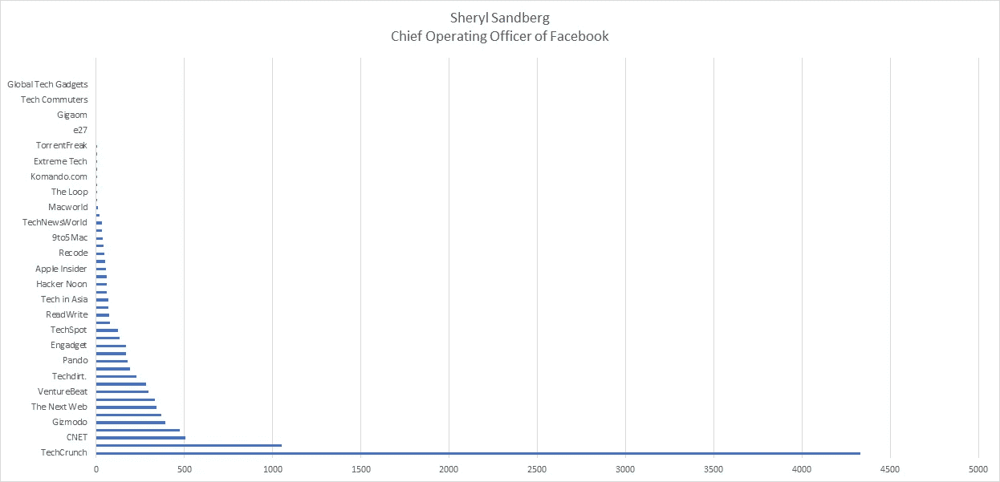
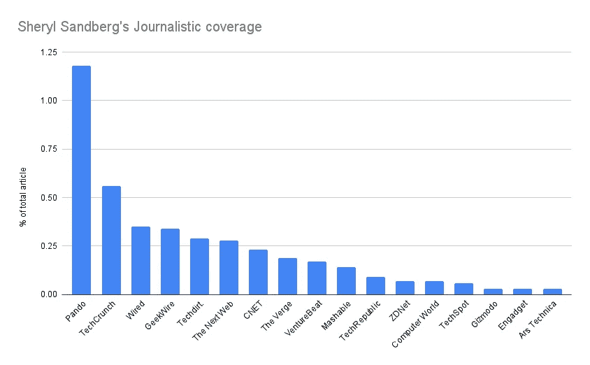
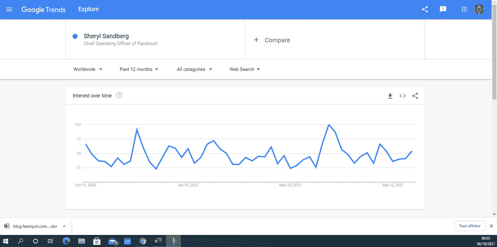
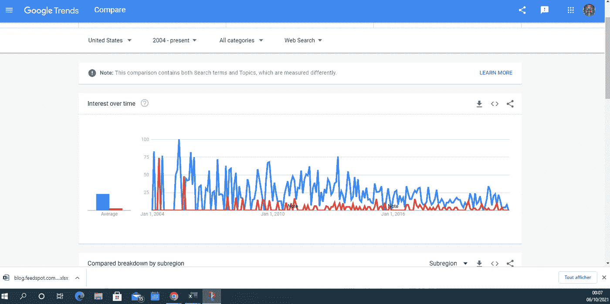

# 雪莉·桑德伯格的新闻报道

> 原文：<https://medium.com/nerd-for-tech/sheryl-sandbergs-journalistic-coverage-c17cddccd0bf?source=collection_archive---------1----------------------->

## 脸书的首席运营官如何被 50 个科技博客覆盖

雪莉·桑德伯格和这 21 名软件工程师一样，都是 Greyio heart Experiment 的一篇文章的主题，这是一项关于揭示在科技行业从事重要工作的女性的出版实验。碰巧的是，谢丽尔是第一位在世界上最大的科技公司之一担任重要职位的女性，我也是第一次写她。谢丽尔是脸书的首席运营官，我写了一些关于商业运作的文章，商业运作是推动每个公司前进的三个核心基本要素之一。另外两个是金融和营销，公司的其他特定领域都是这三个组成部分之一的孩子，但这篇文章不是关于商业管理知识，而是另一个名为单词和度量的出版实验的一篇文章，它提供了关于主题的单词度量，还有像 Sheryl，Seth 和 Scott 等人的个性，这些将在未来的文章中涉及。但是由于程爽是一名女性，这篇文章也可以被看作是一篇突出女性伟大工作的文章，就像格雷尼奥心脏实验的文章一样。脸书及其社会责任是一个非常大的争论，不是本文的主题。那么，我应该告诉你，我很抱歉不能进入 facebook 的传播或指责政治内容和其他关键内容的责任。这篇文章旨在让你了解 50 家科技博客是如何在他们发表的文章中报道雪莉·桑德伯格的名字的，正如我在其他[的文字和指标文章](https://mkrdiop.medium.com/list/words-metrics-0f50785757d8)中解释的那样，你应该知道这些指标来自一个代理，我不能透露，但请知道标签之间的趋势和差异是一致的。真正的价值观。

这张图表显示了雪莉·桑德伯格成为话题的大概次数，或者在这 50 个科技博客的文章中被引用的大概次数，就像你现在正在阅读的这个一样。

从图表中可以清楚地看到，在这 50 个科技博客中，TechCrunch 对雪莉·桑德伯格的报道最多，人们可以猜测脸书也应该有同样的报道水平，就像它在媒体上发表的文章的报道水平一样高，我们已经通过这篇题为[科技公司名称指标](/predict/metrics-of-names-of-tech-companies-d7e4d3275cfb)的文章发现了这一事实。

但是我上面给你看的这张图表只是考虑了一个指标，就像计算雪莉·桑德伯格的名字在这 50 个科技博客的文章中出现的次数。为了更好地判断，考虑这些科技博客发表的所有文章，并计算这些文章中关于谢丽尔或引用谢丽尔的比例，可以给你一个更好的观点。同样，用于获得这些比率的文章总数是一个近似值，使用一个代理作为测量手段。这是图表，但由于时间限制，我只考虑了 16 个科技博客。

你可以看到在第一个图表中排名第七的 Pando 现在在覆盖率方面领先 peloton，因为这个技术博客的文章总数比其他博客少，但相对于文章总数，引用 Sheryl 的次数更多。除此之外，根据雪莉·桑德伯格名字的覆盖率，科技博客的排名相当稳定，因为 [Techcrunch](https://techcrunch.com/tag/sheryl-sandberg/) 、 [Wired](https://www.wired.com/tag/sheryl-sandberg/) 、 [Geekwire](https://www.geekwire.com/tag/sheryl-sandberg/) 、 [Techdirt](https://www.techdirt.com/blog/?tag=sheryl+sandberg) 等是覆盖脸书首席运营官最多的科技博客。 这一发现是了解技术行业空间的人在获得这些数据之前应该预料到的，这一发现也将决定我在本文中写的关于技术新闻的这个[技术支持平台](/nerd-for-tech/this-journalistic-tech-enabled-and-data-driven-platform-e43998f66690)将如何设计和构建。 您可以将这篇文章作为开发这个技术支持平台之前的准备工作，更多类似的文章将很快在这里发表。

为了完成这篇文章，我认为包括雪莉·桑德伯格的谷歌趋势图可能是有趣的，即使你可能使用这个[谷歌的公共服务](https://trends.google.com/trends/explore/TIMESERIES/1633478400?hl=en-US&tz=0&q=%2Fm%2F05hjzw&sni=3)获得这个数据。

**PS:** 这是另一个图表，我将很快撰写并发表，但这个是关于创新和搜索的扩散，如果你想阅读它，请下次访问[我的媒体简介](https://mkrdiop.medium.com/)或订阅我的邮件列表以获得收件箱。

