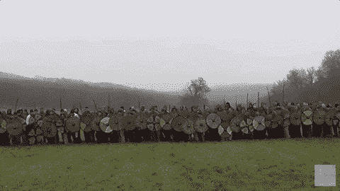
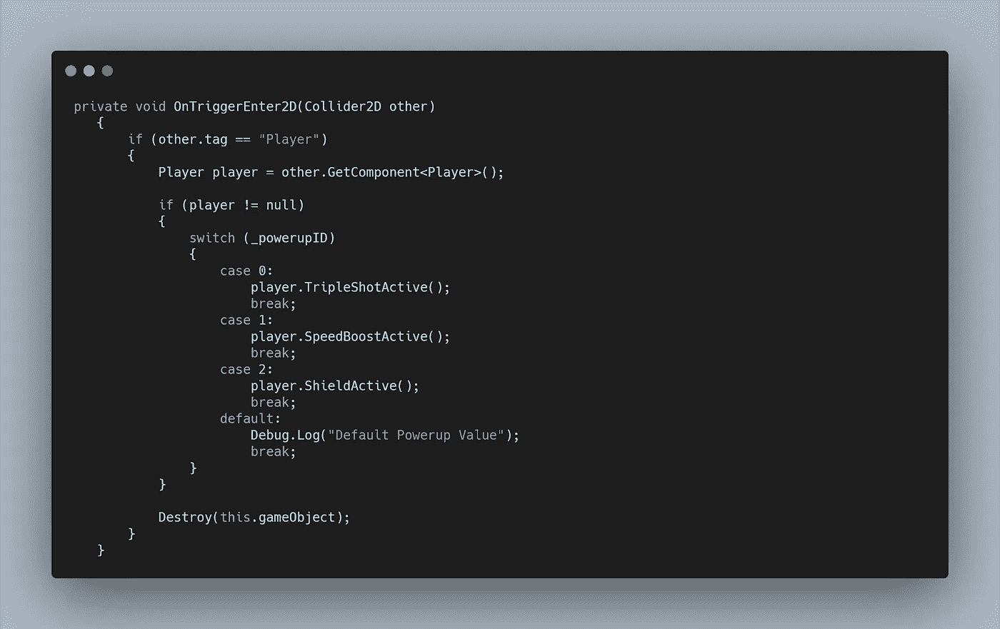
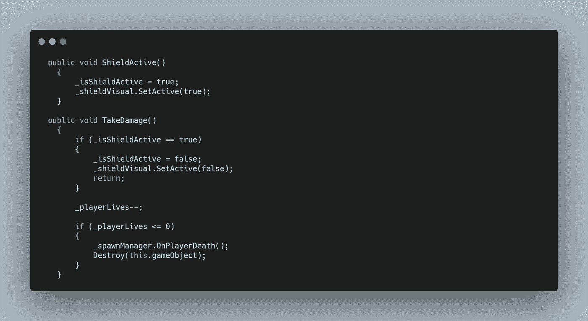
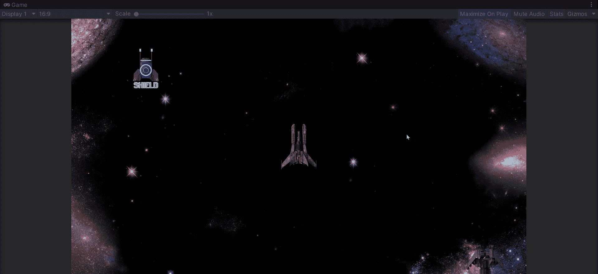

# 护盾！

> 原文：<https://medium.com/nerd-for-tech/shields-8df15247d9e4?source=collection_archive---------22----------------------->

# 将陈述转换为救援

在进入**用户界面**之前，我们想要为我们的核心游戏添加的最后一个**能量**是一个盾牌。要为我们的新**加电**创造除功能之外的一切，请看昨天的文章。

不过有一个小问题。在我们的**加电脚本**中，我们现在在我们的 **OnTriggerEnter2D 方法中添加多个 **if else 语句**。**做起来还可以，但是占了很多空间，读起来就变得有点乱。这就是 **switch 语句**可以拯救我们的地方。

**Switch 语句**允许我们取一个**变量，**并遍历每个值的条件。如果我们的**三连拍**的 **_powerupID** 为 0。**情况 0** 将允许我们为**三重拍摄调用一个函数。**

正如你所看到的，事情看起来干净多了，当我们添加更多的**电源时，添加更多的**外壳**会更好。**赢得胜利的模块化系统！**开关语句**也可以有一个**默认情况**用于输入不同的值。

现在让我们看看如何创建我们的盾牌。

首先，在我们的**播放器脚本**中创建一个**公共方法**，以匹配我们在上面的**案例 2** 中调用的方法。然后我们可以创建一个名为 **_isShieldActive** 的 **bool** ，默认情况下它被设置为 false，但是在我们的新**方法**中我们可以将其设置为 Active。

当**护盾**激活时，我们希望**玩家**能够受到**敌人**的打击而不损失**一条生命。**为了实现这一点，我们可以在 **TakeDamage 方法**中创建一个 **if 语句**，当其为真时，我们将 **bool** 设置回 false，并简单地调用 **return。这阻止我们继续使用**承受伤害法，**因此不会减少我们的生命值。**

我们有 **shield** 功能，但是我们可能需要一些视觉表现。在**文件库**资源包中，**盾牌**精灵是动画。就像我们的**加电**一样，我们可以创建一个简单的动画循环。如果我们添加**盾**作为我们**玩家**的**子**，我们可以使用脚本来打开和关闭它，同时它会随着**玩家的移动而移动。**

我们需要创建一个**游戏对象变量**来存储我们的**盾牌**，在我们的**启动方法**中，我们应该使用**来确认它是不活动的。set active(false)；**

现在在我们的 **ShieldActive 方法**中，我们可以将值改为 **true** ，打开我们的屏蔽视觉。在我们的 **TakeDamage 方法**中，我们想把它设置回 false。

这样，我们现在在一个**模块化系统**中有了三个功能**电源**，为进一步添加做好了准备。接下来我们需要添加**用户界面**。

