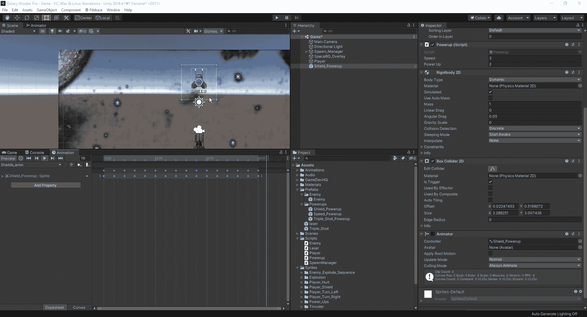
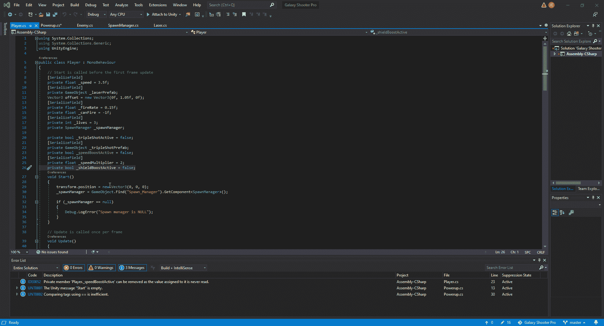
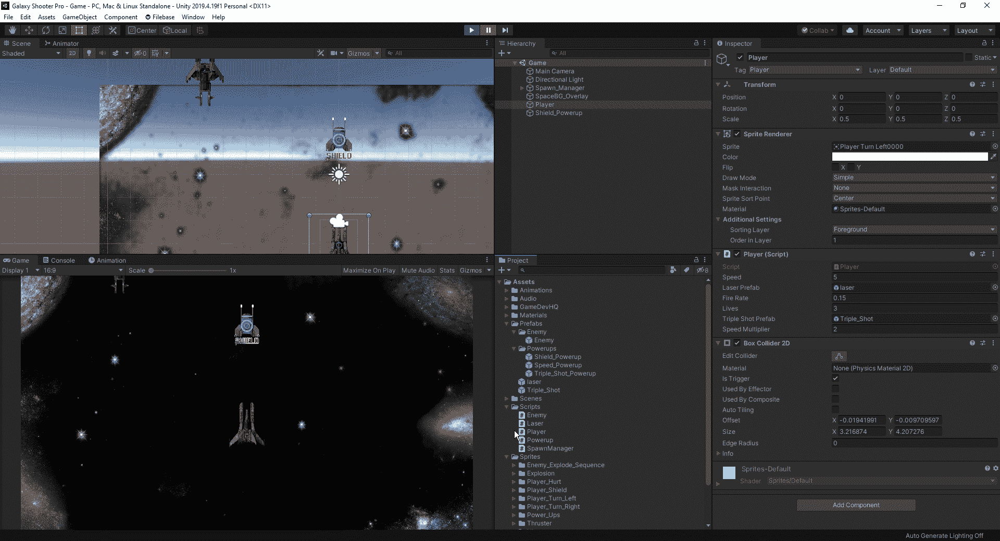
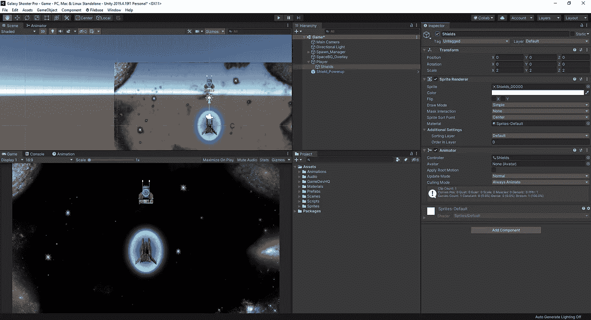
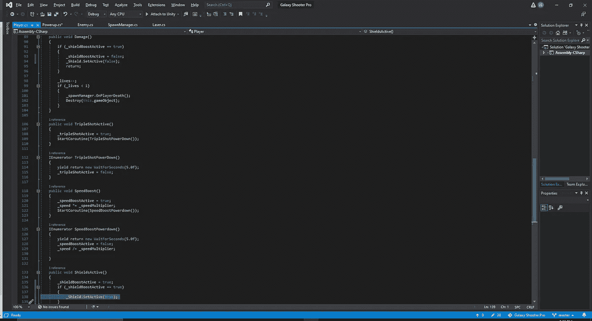
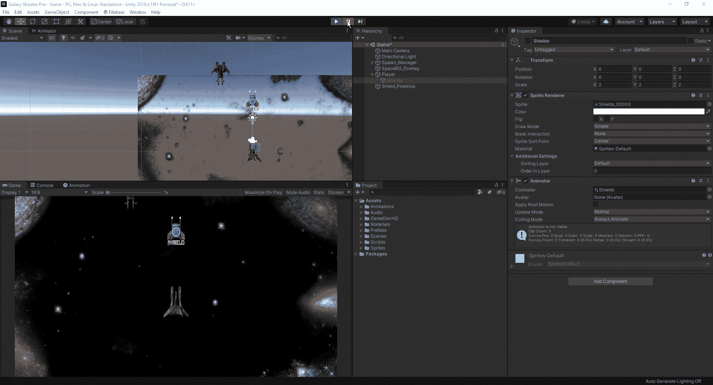

# 升起护盾。

> 原文：<https://medium.com/nerd-for-tech/shields-up-10bf97d47ecb?source=collection_archive---------27----------------------->

现在我们有了三倍射击和速度提升，是时候让我们的护盾开始工作了。这一次，我们不仅要制作一个适合我们的精灵，还要给我们的玩家一个视觉上的增强，以显示我们有一个主动护盾。对于我们的基础，我们将从与速度提升相同的过程开始，将我们的精灵放入层级中，然后将所有需要的组件附加到我们的精灵中。那些是刚体，盒子碰撞器(或者你喜欢的圆圈)，启动脚本和动画。

有了精灵，是时候给我们的护盾编码了，这样我们就不会在接受能量的时候受到伤害。首先，我们需要创建一个盾牌，然后调整玩家的伤害部分，这样如果我们激活了盾牌，我们不会受到任何玩家伤害，然后它会终止能量，这样我们就不会有一个无限的盾牌。

接下来，我们需要切换到我们的 powerups 脚本，让我们的盾牌效果连接到我们新制作的精灵，并链接到播放器脚本，以便当我们收集精灵时，我们激活我们的盾牌。一旦这些都完成了，我们就可以快速运行我们的游戏，看看护盾是否能防止我们的玩家失去一条生命。

正如我们所看到的，一旦玩家收集了盾牌精灵，我们在击中敌人时不会失去一条生命。同样，我们的玩家在第一次攻击中失去盾牌后继续失去生命。
现在，如果我们的盾牌没有一些实际的视觉效果，那它是什么呢？为此，我们将拖动一个盾牌精灵到我们的层次结构中，并将其作为玩家的孩子。

现在，我们的盾牌放在我们的球员身上，我们现在必须创建一个代码，这样当我们的盾牌被激活时，我们将有我们的蓝色场出现在我们的球员周围。为此，我们必须使用 setactive 代码。有了这一行代码，我们可以选择激活一个特定的游戏对象或停用该对象。

我们将在我们的护盾激活中添加设置激活代码为真，然后在我们的伤害无效中，一旦我们受到伤害，我们将把护盾设置为假。现在我们已经将这一点构建到我们的脚本中，我们可以在我们的游戏中测试它。

现在我们已经设置好了盾牌的能量，我们可以继续为我们的游戏建立一些用户界面，让我们在玩游戏的时候对游戏的状态有一个更好的了解。