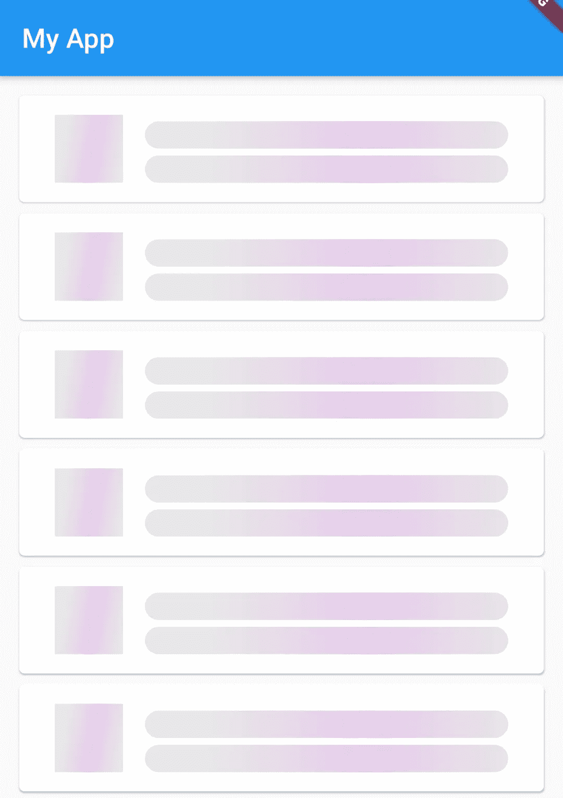
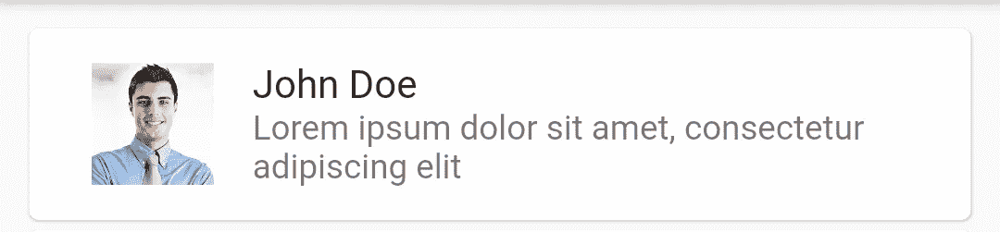
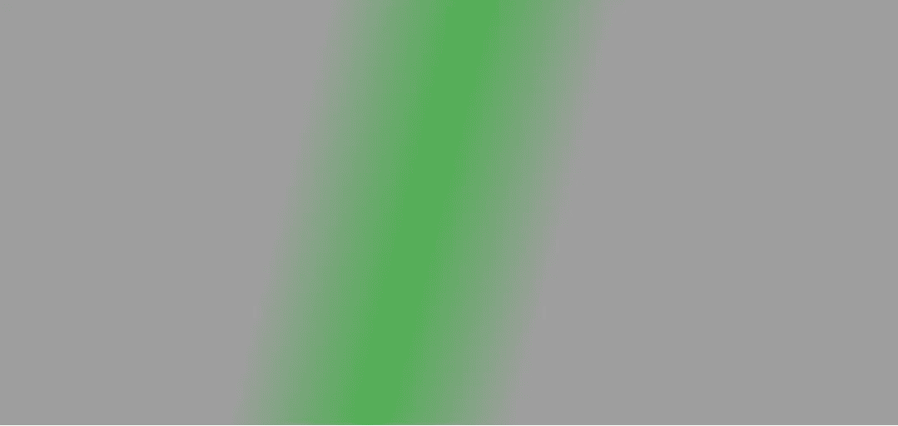

# 微光效应:停止使用无聊的渐进指示器

> 原文：<https://medium.com/nerd-for-tech/shimmer-effect-stop-using-boring-progressindicators-4e44fc132936?source=collection_archive---------5----------------------->

如果你想让用户知道有东西在加载，你该怎么做？如果你的答案是`**CircularProgressIndicator**` 是时候改变了。除了使用 boring loading spinner 之外，用户还可以使用`shimmer`包，它可以产生微光效果，让用户体验更好。因为我们可以给用户一个在屏幕加载后屏幕外观的概览。即使我们需要写一些额外的代码来完成它，这也是值得的。



将 shimmer 包添加到您的 pubspec.yaml 中

```
dependencies:
 **shimmer: ^2.0.0**
```

如何使用 Shimmer Widget？

**1。创建目标小部件的框架。**

> Skeleton widget:一个类似于真实 widget 的 widget，但是没有内容。

**2。用 Shimmer.fromColors()** 包装骨架小部件

## 1.创建骨架

我们首先需要创建一个模仿小部件的框架容器。

假设这是我们想要模仿的小部件，



ListView 中的 ListItem

列表项代码

要创建上述列表项的框架，我们需要创建精确的小部件，但其中没有内容。

我们列表项的框架

如您所见，该结构与原始列表项相同，但其中没有内容，只有固定大小和颜色的空容器。

> 为什么颜色很重要？*微光效果* ***只影响【child】的不透明区域*** *，透明区域在应用微光效果时仍然保持透明。*

为了使我们的容器不透明，我给了一个颜色。稍后我会告诉你为什么我选择了`Colors.white24`。

## 2.用 Shimmer.fromColors()包装骨架小部件

创建了 skeleton 小部件之后，是时候用 *magic* Shimmer 小部件包装它了。但是我们需要遵循一些准则来防止微光效果被渲染而没有任何奇怪的副作用。相信我，这个很重要。

> *1。骨架部件应该由基本和简单的部件组成，比如容器、行、列，以避免副作用。
> 2。使用一个[微光]来包装[Widget]的列表，而不是许多[微光]的列表*

如果你遵循这些规则，shimmer 包将按照我们希望的那样运行。

让我们创建我们的 Shimmer 小部件，

我们来分析一下，

**1.shimmerBuilder(小部件子部件)**

这是一个自制的函数，会返回一个`Shimmer` widget。

baseColor 和 highlightColor 用于创建线性渐变。它在引擎盖下的实现方式是，

```
gradient = **LinearGradient(**
   begin: Alignment.*topLeft*,
   end: Alignment.*centerRight*,
   colors: 
   **[baseColor,baseColor,highlightColor,baseColor,baseColor]**,
   stops: const <double>[0.0,0.35,0.5,0.65,1.0])
```

这是上面配置的线性梯度的样子，



if base color = colors . grey & highlight color = colors . green

这个 LinearGradient 将被混合到骨骼部件上，以产生微光效果。

**2。骨架部件颜色**

我使用`Colors.white24`作为框架部件的原因是它和我的基色(灰色)&荧光色(紫色)很好地融合了。

如果你使用其他颜色(如黑色、绿色等)，它将与线性渐变结合，产生不同的颜色。(我们不希望这样)

即使是纯白色对我的颜色组合(灰色和紫色)来说也很奇怪。因此，为你的框架部件尝试不同的颜色，找到最佳匹配。

> 你可以用 shimmer 小部件包装整个小部件，而不是每个单独的小部件(就像我做的那样)，但是当你试图用 Card 这样的复杂小部件包装它时。它不能正确渲染微光效果。
> 
> (参见我上面提到的两条指导方针)

最后，您可以使用单独的 ShimmerListItems 创建一个 LoadingList

把我们能做的所有事情放在一起，

最终输出看起来像这样，

我已经把标题和副标题的角弄圆了(如果 gif 太长，抱歉)

您甚至可以自定义微光效果，

*   **方向** : c *控制微光效果的方向。默认值为[ShimmerDirection.ltr]*

```
*/// * [****ShimmerDirection.ltr****] left to right direction
/// * [****ShimmerDirection.rtl****] right to left direction
/// * [****ShimmerDirection.ttb****] top to bottom direction
/// * [****ShimmerDirection.btt****] bottom to top direction*
```

*   **周期** : C *控制微光效果的速度。默认值为 1500 毫秒。*
*   使用径向渐变或其他渐变效果。你可以使用默认的构造函数`Shimmer()`

```
return Shimmer(
    child: child,
     **gradient**: **RadialGradient**(
         ...
     ),
);
```

希望你会在你的下一个 project🥳中使用这个令人敬畏的装载效果，但是一定要遵循前面提到的指导方针。感谢阅读。拍手声👏如果你喜欢这篇文章。