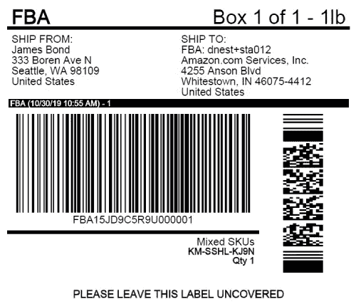
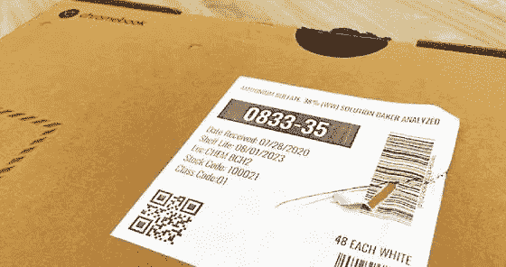

# 用于简化运输和接收任务的运输标签扫描仪

> 原文：<https://medium.com/nerd-for-tech/shipping-label-scanners-for-streamlining-shipping-and-receiving-tasks-abc106e85d84?source=collection_archive---------10----------------------->

必须有效地扫描运输标签，以节省时间并防止出错。在节假日和季末销售等高峰期，速度在运输和接收过程中变得更加重要。依赖过时的技术和设备只会让事情变得更具挑战性。

投资购买正确的运输标签扫描解决方案以降低成本和减少错误、加快交付速度和改善客户服务至关重要。

# 发货和收货过程中的条形码扫描

发货和收货流程从履行中心开始，到最后一英里交付结束，产品需要到达最终目的地。在每个步骤中，条形码扫描都至关重要，因为它通过确保一切就绪来帮助简化工作流程。

# 履行中心的订单提货和包装

订单执行流程包括存储、组装和挑选订单，然后将它们运送和交付给各自的客户，以及支持这些任务的其他功能。

条形码有助于消除人为错误，从而改善仓库管理和内部物流运作，并有助于满足日益增长的电子商务需求。条形码扫描解决方案在交付阶段也至关重要，用于读取运输标签，同时根据标签中包含的信息识别产品。

# 配备条形码扫描仪的体积测量和称重机器

在配送中心，包裹穿过传送带系统，通过体积测量和称重机器进行分拣，这些机器有助于获取包裹、箱子、纸箱等的重量和尺寸。，以及标签上的条形码。智能体积测量和称重扫描系统支持读取线性和二维条形码。

# 卡车司机用移动标签扫描仪

产品包装好后，仓库会将它们装入卡车进行运输。可以使用运输标签扫描仪来使装载过程无误且快速，因为手动这样做只会增加所涉及的时间。使用[基于移动的条形码扫描](https://www.dynamsoft.com/blog/imaging/barcode/scan-barcode-mobile-browsers/)而非手持式条形码扫描仪，进一步消除了投资专用设备的需求，并提高了合规性。

# 最后一英里递送

发货和收货流程的最后一步是将产品交付到目的地。[条形码扫描解决方案](https://www.dynamsoft.com/barcode-reader/overview/)增加了灵活性，确保包裹被发送到正确的位置，并满足工作流程需求。

强大的[移动条形码扫描](https://www.dynamsoft.com/codepool/category/mobile-barcode-scanner/)有助于提供实时可见性，允许最后一英里交付提供商在运输途中跟踪交付状态，并检测司机绩效问题，如错过时间窗口、库存损坏等。，用于快速解决问题。

# 运输标签上的条形码格式

每个运输标签都包含独特的信息，这些信息对于将包裹从一个地方运输到另一个地方至关重要。无论是 UPS 运输标签、FedEx 运输标签还是 USPS 运输标签，所有运输标签都必须包含此数据。

大多数运输标签包含以下信息:

*   货物类型
*   跟踪号码
*   出发地和目的地的邮政编码
*   出发地和目的地的地址
*   国家
*   日期和重量
*   货物的紧急程度- 24 小时交货、当天交货、快递等。

下面列出了运输和接收中最常用的条形码类型。

# 扫描运输条形码时面临的挑战

在运输和接收过程中，产品必须经过很长的距离，并经受各种条件。特别是当货车装载量非常高时，条形码标签的质量可能会在装卸过程中受到影响，这对大多数运输标签扫描仪来说是一个挑战。

以下是在运输和接收产品时扫描条形码所面临的一些常见挑战。

*   坚固的条形码:由于下雨而损坏的条形码可能会让普通的条形码扫描仪很难使用。其他具有挑战性的条形码可能难以读取，例如扭曲、污损、起皱或印刷不良。弱条形码扫描仪可能无法扫描运输标签上的此类条形码。
*   缓慢而繁琐的过程:为了迎合竞争激烈的交付市场的需求，选择普通的条形码扫描仪并不是最好的主意。大多数条形码扫描仪不能一次读取多个条形码。由于处理速度慢，这种扫描仪可能会在负载非常高的高峰时间导致严重的损失和延迟交付。
*   不支持重要的条形码类型:普通手持条形码扫描仪仅限于扫描线性条形码。有些可能支持常见的二维符号体系，如 [PDF417 条形码](https://www.dynamsoft.com/barcode-reader/barcode-types/pdf417/)。但是，其他运输条形码，如 MaxiCode、USPS 智能邮件、UPS code 等又如何呢？？

# Dynamsoft 如何帮助解决这些问题？

Dynamsoft 条形码阅读器是一款企业级[条形码扫描仪 SDK](https://www.dynamsoft.com/web-twain/overview/) (软件开发套件)，让您只需几行代码就可以将条形码扫描功能嵌入到 web、桌面或移动应用程序中。它可以集成到运输和管理软件中，用于流程中涉及的不同操作。它有助于减少对专用设备的依赖，将台式机和移动设备转变为强大的运输标签扫描仪。

了解 Dynamsoft 条形码阅读器 SDK 如何帮助解决运输和接收过程中面临的所有问题。

*   在所有平台上快速集成:从体积测量和称重机器到最后一英里交付解决方案，Dynamsoft 条形码阅读器 SDK 可以使用最少的编码轻松集成到新的或现有的软件中。
*   支持多种条形码符号的能力:Dynamsoft 条形码阅读器 SDK 支持解码一维条形码、二维条形码、复合条形码、美国邮政智能邮件、英国皇家邮政等。因此，您无需费力扫描任何[标准条形码符号](https://www.dynamsoft.com/barcode-reader/barcode-types/)。
*   能够阅读难读的条形码:运输标签上的条形码可能会因下雨或处理不当而损坏。无论条形码是不完整的、破损的、污染的还是扭曲的，Dynamsoft 条形码阅读器 SDK 都可以读取所有此类代码。
*   快速在一次扫描中读取多个条形码:速度在运输和接收中至关重要。普通的手持式条形码扫描仪不能一次扫描多个条形码。另一方面，Dynamsoft 条形码阅读器 SDK 可以在单次扫描中扫描多个条形码，也可以在任何方向和旋转角度扫描。更不用说，它一分钟能读取 500 多个条形码！
*   卓越的准确性和识别率:企业级条形码检测算法、OCR 功能以及摄像头增强功能的添加，为顺利扫描运输标签提供了卓越的识别率和准确性。

# 开始使用 Dynamsoft 条形码阅读器 SDK

为您的企业寻找企业级运输标签扫描仪？查看[在线条形码扫描仪演示](https://demo.dynamsoft.com/barcode-reader/)，了解 Dynamsoft 条形码阅读器的运行情况。如果您想彻底检查它的所有功能，并找出它是否适合您的业务需求，[下载 30 天免费试用版](https://www.dynamsoft.com/barcode-reader/downloads/)。从数百种 API 中进行选择，以满足您的特定需求。

如果您有任何疑问或疑问，请随时[联系我们](http://support@dynamsoft.com/)。如有销售方面的疑问，请致电 sales@dynamsoft.com[与我们联系。](mailto:sales@dynamsoft.com)

*原载于 2022 年 9 月 18 日***。**