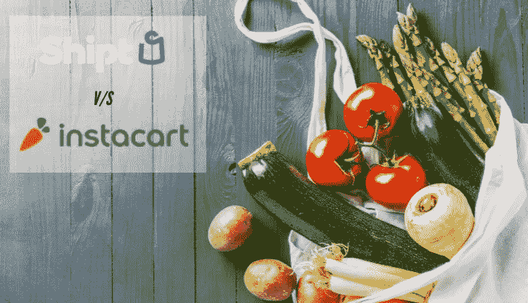
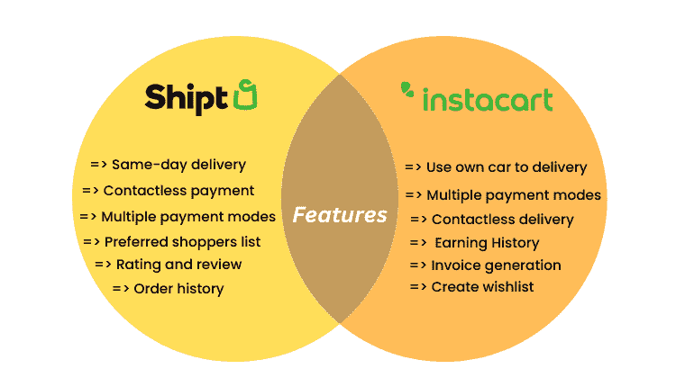

# Shipt vs Instacart:哪个是最好的杂货配送应用？

> 原文：<https://medium.com/nerd-for-tech/shipt-vs-instacart-which-is-best-grocery-delivery-app-160987785a79?source=collection_archive---------3----------------------->

Shipt 客户服务:当我们谈到提供优质杂货配送服务的供应商时，有两个名字占据了突出的位置。一个是 Shipt，一个是 Instacart。这得益于这些平台提供的快速杂货配送服务。

这种与便利性相关的因素是这两种解决方案在食品杂货递送业务领域获得狂热地位的原因。

当您阅读本文时，您将获得关于这些解决方案的实际信息。这包括它们所具有的功能。有了对这两个应用的全面了解，你将能够[开发像 Shipt](https://www.groceryappclone.com/blog/launch-grocery-delivery-app-like-shipt-in-sanfrancisco/) 和 Instacart 这样的杂货应用。

## 关于 Shipt 应用程序

Shipt 成立于 2014 年，是一款位于美国的流行杂货交付应用程序，旨在帮助生活在美国的客户只需轻点几下，即可获得快速、简化的杂货交付服务。

该应用程序具有一些最好的功能，如多种支付模式、多地点交付等，这反过来也是解决方案不断增长的重要原因。

另外，它的操作非常简单，这使得它的受欢迎程度稳步上升，尤其是在那些计划将杂货店数字化的人当中。

## 关于 Instacart 应用程序

Instacart 于 2012 年推出，是一款位于美国的流行杂货交付应用程序。多年来，该应用程序已使其产品在加拿大可用，从而使那里的杂货配送服务也变得容易利用。

谈到该应用程序及其 USP，它通过与代表客户购物的个人购物者联系，为客户订购食品杂货提供支持。

除了这个 USP，该应用程序还具有简单的操作，为踏上建立 Instacart 这样的杂货应用程序并赚取巨额利润和财富之旅的企业家负责。

根据您对这两种解决方案的判断，让我们了解它们的全球市场统计数据，以了解它们的突出性质。

## 美国杂货交付应用的全球市场份额

下面这些吸引人的事实和数字引用了 Shipt 和 Instacart 等杂货应用程序的突出性质，将帮助您理解为什么这些解决方案首先取得了如此突出的地位。

*   2021 年，Instacart 的收入为 18 亿美元
*   2020 年，使用 Instacart 的用户数量为 960 万
*   2021 年，杂货交付应用的市场价值为 2857.0 亿美元
*   2022 年至 2030 年间，市场将以 25.3%的 CAGR 扩张
*   2030 年，该市场的收入预测将达到 21585.3 亿美元

现在你已经对这两个应用的市场统计有了一个概念，让我们来比较一下这两个应用，看看哪一个是最好的。

## Instacart 和 Shipt 之间的差异

查看下面的指针，亲自了解 Instacart 和 Shipt 之间的区别。

**1。应用程序操作**

像 Shipt、Instacart 这样的杂货类 app，操作简单。顾客只需在应用程序上点击几下，就可以轻松找到他们想要的商品。此后，他们可以订购，并让他们送货上门。

然而，使 Instacart 等杂货应用程序的运营与前者不同的是，该应用程序允许客户雇佣一名私人购物者来购买他们的商品，并在此后将商品交付给他们。

**2。它们包含的特性**

这两个应用程序拥有一些最多样化的功能，这反过来也是它们日益突出的原因。

**下面来看看。**

**3。购物和顾客体验**

在分别谈到 Instacart 和 Shipt 这样的杂货 app 时，两者都有最独特的接触客户的方法。

像 Shipt 这样的杂货应用程序允许客户与购物者实时沟通，以协助后者购物。

然而，当我们谈论 Instacart 时，他们让客户接触到市场、品牌等。以便购物和送货成为定制和个性化的体验。

## 这意味着什么？

如果你对这两个杂货交付应用有所了解，你就能理解这两个应用如此受欢迎的原因。这尤其是在那些计划数字化他们的杂货店经营的人当中。因此，他们接受杂货交付应用程序开发服务。

他们可以访问现成的杂货交付应用程序，也称为杂货应用程序克隆，以便快速业务可见性，随后是可扩展性，并轻松实现增长。这是解决方案可修改的结果。

因此，越来越多的杂货递送初创公司正在利用这一优势。特别是当他们计划在 Shipt 和 Instacart 的基础上建立一个应用程序时，像 Shipt 和 Instacart 克隆应用程序这样的杂货交付克隆应用程序是变相的恩惠。他们帮助杂货店在合理的短时间内吸引更多的游客和顾客。

如果你是其中之一，也就是说，你正在经营一家线下杂货店，在开发解决方案的过程中，你必须记住这几点。

## 如何开发像 Instacart 和 Shipt 这样的杂货配送 app？

要开发像 Instacart 和 Shipt clone 这样的现成杂货交付应用，请记住以下几点。

1.通过研究竞争对手和目标市场来研究你的应用需求。

2.评估应用程序设计策略。

3.从佣金、订阅费等不同的收入来源中选择合适的收入模式。通过你开发的杂货递送应用程序来获利。

4.与在开发 Instacart 和 Shipt clone 应用程序等现成杂货交付应用程序方面有经验的海外专门合作伙伴联系，以便您可以实现快速的业务可见性和增长。

现在，您已经了解了开发解决方案的技巧，我们相信您一定有这样的疑问:在这两个应用程序中，哪一个是最好的杂货交付应用程序？

答案是两者都有其独特的功能和特性。然而，当谈到选择最好的，特别是当你经营一个离线杂货店，你需要评估你的业务需求和客户需求。这反过来会使选择更加合理。

## 立即联系杂货交付应用程序开发公司

像 Shipt 和 Instacart 这样的杂货应用程序通过其为客户提供的便利程度，在美国的杂货市场中创造了一场数字革命。这是为了确保他们通过连接到个人购物者，按照预定的时间在家门口获得他们订购的商品。

然而，两者都有一系列的差异，这反过来为他们提供了竞争优势，这在很大程度上提高了他们的受欢迎程度，特别是在离线杂货店老板中。因此，如果你正在运行一个，并希望[现成的杂货交付应用](https://www.groceryappclone.com/)给你的商店带来应用优势，那么就联系一家离岸的杂货交付应用开发公司。观察他们在开发杂货交付克隆应用程序方面的专业知识，并研究他们的产品组合。此后，看看你的应用程序的想法，帮助你获得回报。