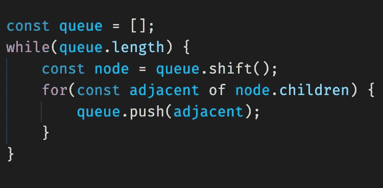

# 应该用 const 吗？

> 原文：<https://medium.com/nerd-for-tech/should-i-use-const-593d4ab07529?source=collection_archive---------13----------------------->

写 JavaScript 的时候经常用`const`。

在`const`和`let`的技术差异方面，差别很小。有些人认为`const`不应该经常使用。我推荐阅读这些作品:

 [## 一个他妈的咆哮关于他妈的 const vs 他妈的 let

### 我不想成为写这篇文章的人，但我是，因为克里斯告诉我去责怪那个该死的家伙。我是受害者…

杰米。建立](https://jamie.build/const) [](https://github.com/getify/You-Dont-Know-JS/blob/2nd-ed/scope-closures/apA.md#const-antly-confused) [## getify/你不知道

### 现在，我们将围绕本书正文中涵盖的许多主题探讨一些细微差别和边缘。这个…

github.com](https://github.com/getify/You-Dont-Know-JS/blob/2nd-ed/scope-closures/apA.md#const-antly-confused) 

但是我很喜欢用`const`，我一直在想为什么。



# 团队风格指南

在工作中，大家一致同意`const`只能用于“实际常数”。如果一个值发生突变，应该用`let`来定义。

```
let arr = [];    // arr is mutated, so we use let
arr.push(3);
```

按照这个想法，任何使用`const`的地方都应该是*一个实际的常数。与其尽可能盲目地使用`const`，不如使用`const`作为一种开发者交流意图的方式。我喜欢这个原则。*

# 我为什么喜欢康斯特

为什么我这么经常用`const`？有两个答案引起了我的注意。

首先，我倾向于用函数式风格编写代码。我更喜欢用`map`和`filter`而不是`push`。在用函数式方式思考时，我使用常量变量，这表明了我的意图。

在所有值都不可变(或者至少被视为不可变)的函数式代码中，我不认为这有什么特别的争议。

但是考虑到我使用 const 的其他原因，我想更仔细地研究一下样式指南。

# 关于突变的想法

在我的工作中，我写了很多我们称之为工作流的东西。例如，对于申请延长截止日期的流程，工作流将管理申请在不同审批者之间的传递。这基本上是作为一个状态机来建模的。

工作流的每个特定实例由一个对象表示，按照惯例称为`M`。我从来没有听到有人质疑过在代码中使用`const`这样的用法:

```
const M = workflow.instanceForRef(ref);
```

我只对一个特定的工作流实例感兴趣，所以我不打算重新分配`M`，所以`const`在技术上是有意义的。但是风格呢？

每个工作流实例都有一个`state`属性，将工作流的状态表示为字符串，不能直接修改。像基本状态机一样，`state`是通过转换来改变的。例如:

```
const M = workflow.instanceForRef(ref);
console.log(M.state);    // "wait_submit"
M.transition("submit");
console.log(M.state);    // "wait_approval_supervisor
```

根据对风格指南的严格阅读，`M`是变异的，所以我不应该使用`const`。但是，至少对我来说，`const`感觉传达我的想法是正确的，而且我以前没有听到任何人质疑它。

每个工作流都有一个惟一的 ID，在这段代码中，我只对一个特定的工作流实例感兴趣。尽管它的状态可能会改变，`M`在我的函数中总是引用同一个工作流实例。`const`是我用来交流的工具。

因此，我似乎有一个没有争议的例子，可以不遵循风格指南的字面意思。有什么方法可以让我们清楚地定义什么时候规则可以被忽略？

我想到的另一个例子是使用数据结构，比如 JavaScript 的 Map 和 Set。在我看来，在这里使用`const`是有意义的:

```
const uniqueNames = new Set();
for(const person of people) {
    uniqueNames.add(person.name);
}
```

`uniqueNames`正在变异，但对我来说有意义的是，集合整体上是一个不变的概念，而不是一个变化的值。

有趣的是，对我来说，这比这样的事情更有意义:

```
const results = [];
results.push(something());
if(condition) {
    results.push(somethingElse());
}
results.push(yetAnotherThing());
if(skipFirstResult) {
    results.shift();
}
return results;
```

我会(按照风格指南的指示)使用`let result = [];`来代替。

我想知道一个重要的区别是变量看起来是否代表一个具体的概念(这似乎是一个很难定义的特征)。`M`指一个特定的工作流实例(具有唯一的、不可变的 ID)。`uniqueNames`是目前看到的所有名字的集合。`result`只是我正在收集的结果列表。

在前两个例子中，`const`变量是远离我的代码实现的某个类的实例，它有一个明确定义的接口和一个隐藏的实现。我在想`M`的时候，不去想移动状态的确切步骤；我考虑文档中的`transition`方法。当我想到数组`results`的时候，我会想到在末尾粘贴更多的元素。

如果我有某种队列结构，用一个空数组实现，会怎么样？

```
const queue = [];
while(queue.length) {
    const node = queue.shift();
    for(const adjacent of node.children) {
        queue.push(adjacent);
    }
}
```

这里，`push`和`shift`是与`results`例子中完全相同的方法，但是它们看起来更有意义。用不同的数组替换`queue`是没有意义的:队列是算法的主要部分。

在队列的例子中，我认为`const`更有意义，但是这不符合风格指南的字面意思。

我想知道:

*   风格指南该不该改？
*   如果改了，应该怎么改？
*   风格指南中的规则能考虑到开发人员想要表达想法的每一种方式吗？
*   花时间思考这个问题有多大价值？与之前版本的风格指南相比，当我们一直使用`let`时，我们失去了或获得了多少价值？

我没有答案。但是我倾向于同意丹·阿布拉莫夫的观点:选择一种风格(作为一个团队)，然后一起工作。