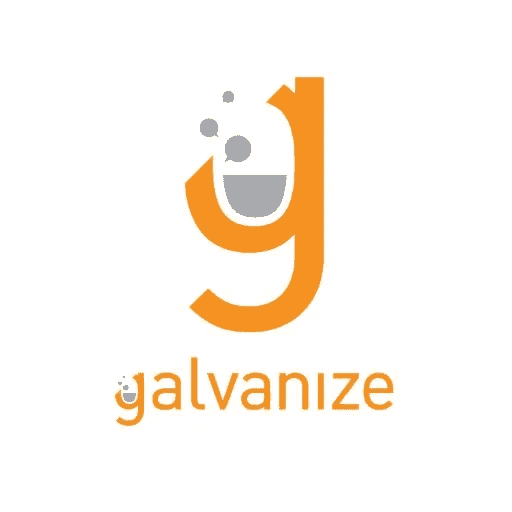
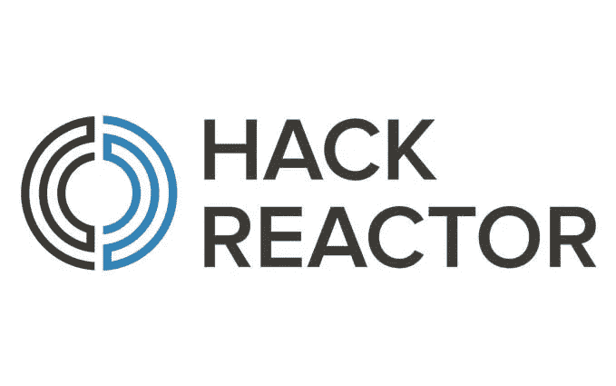
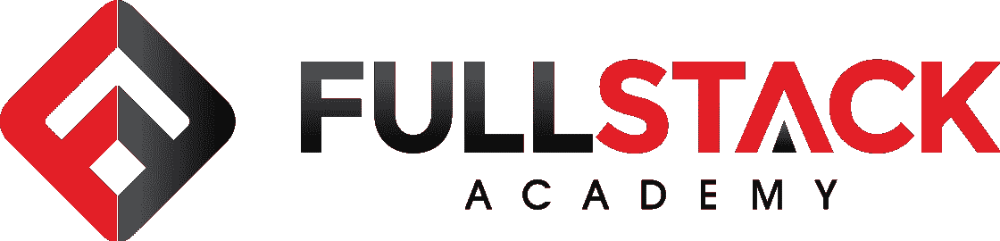
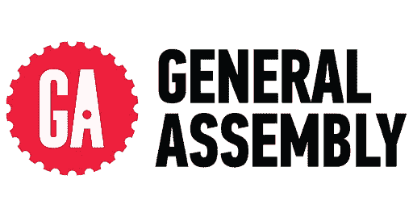
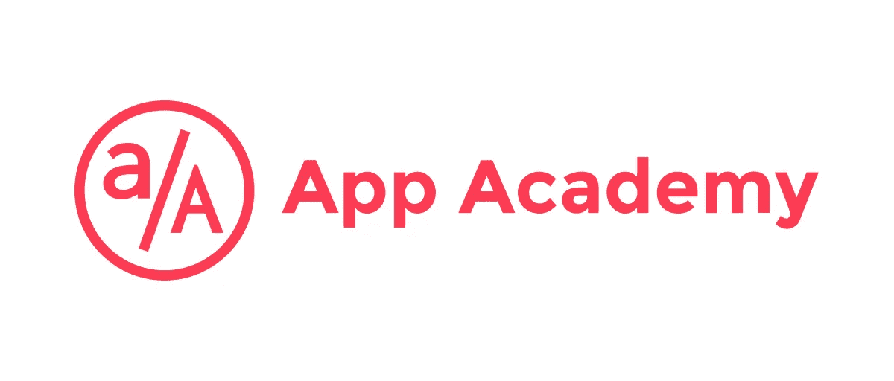
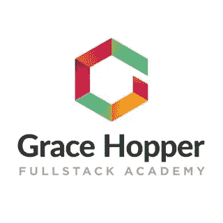

# 你应该加入编码训练营吗？

> 原文：<https://medium.com/nerd-for-tech/should-you-join-a-coding-boot-camp-384fa52791c9?source=collection_archive---------5----------------------->

你可能已经看到 LinkedIn 上的帖子或者 Instagram 上的招聘广告，以及他们对你下一份工作 7 万多美元的承诺。这让你想到，“也许我应该。”

那是我。

11 月一个多事之夜的凌晨 2 点，我看到一位熨斗学校的校友在 LinkedIn 上发布了他的经历。那时，我在花旗银行工作，是一名抵押贷款处理员，某种东西告诉我要面对我过去的恐惧——编码。

所以当晚我报名了熨斗学校。我面试并加入了 2021 年 1 月 11 日的队列(#Annabooleans)。我在六月初完成了这项工作，并在开始熨斗的最后一个项目前几周拿到了一份工作。到最后一个模块时，大约 50%的原始群组已经退出或落后。

在你承诺之前，这里有一些我认为有人应该加入的理由，有人不加入的理由，以及一个训练营的列表。

# 加入的六大理由

1.  大多数训练营会给你指派一名教练并指导你。总会有人问你问题。
2.  你有一群人会有同样的冒名顶替综合症的想法。很多支持和爱！我遇到了我的同伴中一些非常棒的人！
3.  大多数训练营围绕着帮助你制作作品集的想法来创建他们的课程。熨斗学校有五个模块，所以你将有五个项目展示在你的简历上。
4.  如果你需要一个更灵活的时间表，通常有多种选择。你可以参加非全日制或全日制，也可以在校园或网上学习。
5.  有些训练营在你找到工作之前是不会收费的！我预先支付了所有费用，但我只知道大多数训练营通常都有选择。
6.  你会得到找工作的帮助。Flatiron 有一个职业服务项目，可以帮助你浏览 LinkedIn，拓展你的人际网络。我没有机会使用这个功能，但它绝对值得使用！

# 不加入的六个理由

1.  编码可以免费学。让我们现实一点。外面有无数的免费资源。[ [freecodecamp](https://www.freecodecamp.org/learn) 、udemy 课程、YouTube 频道如 [Web Dev Simplified](https://www.youtube.com/channel/UCFbNIlppjAuEX4znoulh0Cw)
2.  训练营教授的语言可能不是你想学的。Flatiron 教 Ruby，但是我现在的雇主不用 Ruby。
3.  教师的教学风格可能与你的学习风格不一致。这肯定会让新程序员望而却步。
4.  老师不得不担心不止一个学生，所以你可能不总是有优先权。
5.  您可以更自由地用任何您想要的框架/语言创建自己的项目。
6.  你可以制定自己的时间表，需要休息多久就休息多久，不会有任何后果。

# 训练营列表

肯定有更多的训练营，但这里有一些。

*   [熨斗学校](https://flatironschool.com/)

*   [镀锌](https://www.galvanize.com/web-development)

*   [黑客反应堆](https://www.hackreactor.com/)

*   [富栈学院](https://www.fullstackacademy.com/)

*   [总装配](https://generalassemb.ly/)

*   [App 学院](https://www.appacademy.io/)

*   [格蕾丝·赫柏](https://www.gracehopper.com/)

让我知道是否有其他原因加入或不加入训练营！