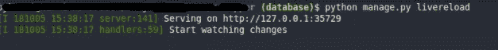
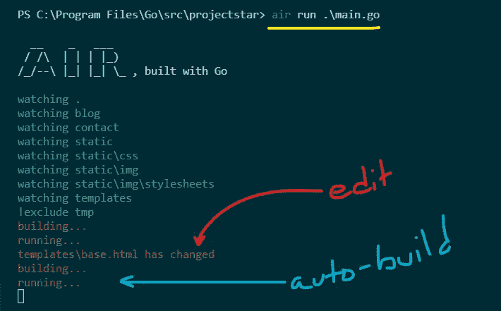
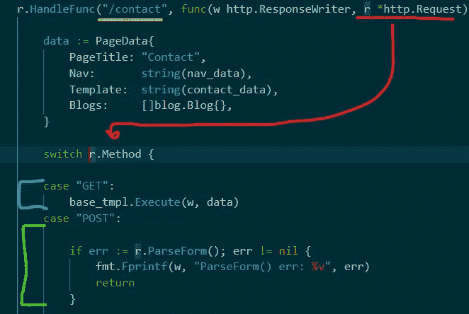
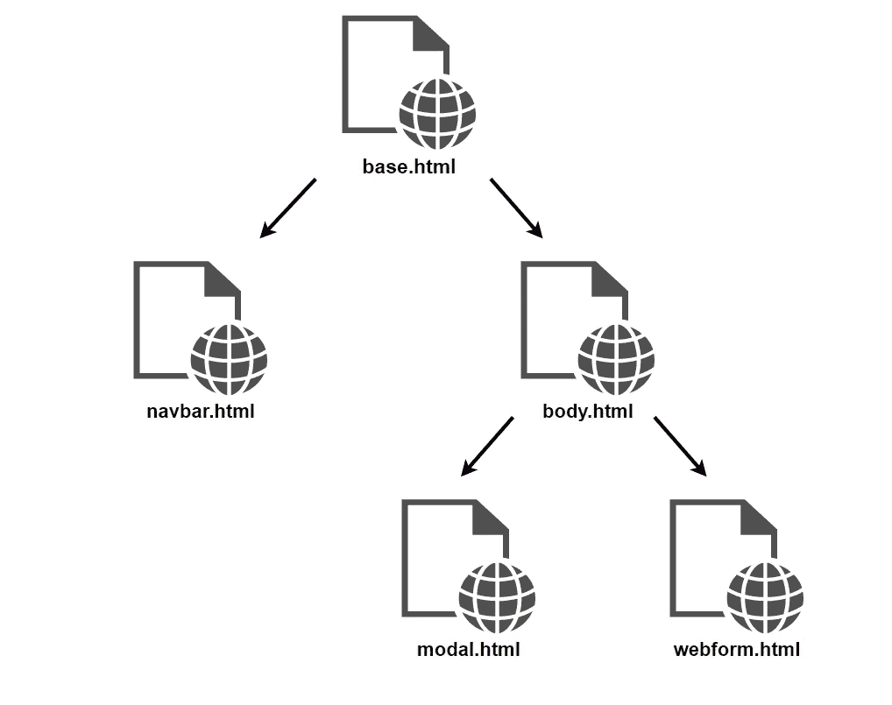
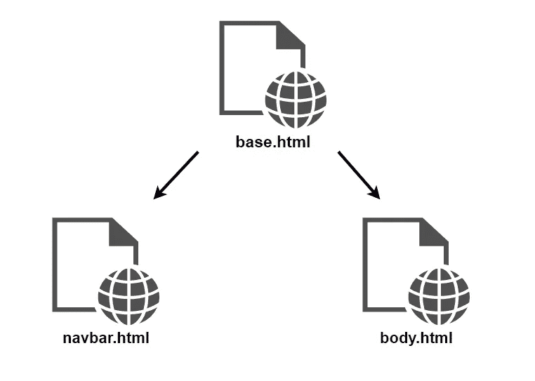
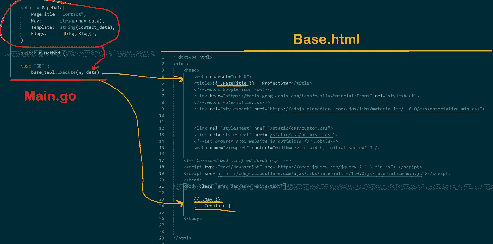

# 应该用 Golang 做动态网站吗？

> 原文：<https://medium.com/nerd-for-tech/should-you-make-dynamic-websites-in-golang-631b2ef71ec0?source=collection_archive---------1----------------------->

## Golang 是制作简单网站的最佳平台吗？


# 介绍

上个月，我决定拓展业务，学习一项新技能。我想重建一个过时的网站，并把它放在云上，这听起来像是一个学习 Golang 的好机会，同时还可以做一些很酷的事情！

为了澄清事实，是的！在 Golang 创建网站是 100%可行的，创建的网站可以在这里找到[如果你想看一看。我更想解决的问题是:“*用 Go 创建一个网站值得你花时间吗？”*](https://projectstar.io)

## **Golang 的主要用例。**

Go 是一种相对较新的编程语言，在 2009 年成为一个开源项目。使用 Golang 的顶级公司有谷歌、优步和 Twitch。关于其[官网](https://golang.org)上的文档:

> “Go 富有表现力、简洁、干净、高效。它的并发机制使编写充分利用联网机器的程序变得容易”

**下面列出了一些用例:**

*   先进的网络性能和多核机器的充分利用
*   Go 是一种编译语言，并赋予 Go 类似于 C 和 C++的速度性能。
*   如果您熟悉 C、C++或其他 OOP 语言，那么语法相对容易掌握。

*如此充分的披露，接下来发生的一切只是我的看法！*

# 项目:一个动态网站

在 Go 中开发网站的一个 5 部分系列！由你的真心打造。

该项目的目标是创建一个个人网站，可以展示一些关于我自己的相对基本的信息，通过 post 请求发送 SMTPS 电子邮件，并动态展示以前写的博客！我通常用 python 的 [Django](https://www.djangoproject.com/) 和 [Flask](https://flask.palletsprojects.com/en/2.0.x/) 框架来写网站，所以你会注意到我用这些框架进行了反向比较！

## 缺点:开发过程

我对 Golang 的第一个体会是*语言本身没有实时重载。*



图 1.1 Django 实时重载示例

实时重载允许对 html、css 和源文件进行修改，而无需重新编译应用程序。这在 web 开发中非常有用，正如你所想象的，“啊啊……如果那张图片再偏右一点就好了……”当我沮丧的时候，我在 Google 上搜索“ *live reloading in Golang* ”然后看！一些开发人员实际上制作了一个名为 [**air**](https://github.com/cosmtrek/air) 的包，它将为您处理这些功能！



图 1.2 在 Golang 使用空气

如您所见，代码`air run .\main.go`运行我们的 web 服务器，随着存储库中的更改，应用程序会自动重建和部署。所以在安装了一些第三方的包之后，Golang 就可以配置使用 Live reloading 了。

## 优点:处理 Get 与 Post 请求

在 go 中处理 HTTP 请求是一次相当愉快的经历。在 web 服务器上有`handler`函数处理指向给定 URL 的任何 web 请求。



图 2.1 解释联系页面的 Get 和 Post 请求

在上面的示例代码中，我们的处理程序正在监听地址`“127.0.0.1:80/contact"`，通过使用`http.Request.Method`字段，我们可以利用 switch 语句来确定哪个请求正在到来。超级容易！

## **缺点:HTML 模板继承**

这可能是我在用 go 编程时经历的最令人失望的事情之一，缺少可以利用的 HTML 模板继承。



图 3.1 Django 中的模板继承

在我熟悉的 web 框架中，人们通常可以利用模板继承。这是准多态性，但对于 HTML 文件。从本质上说，不是每个网页都有一个大的 html 文件，而是可以有许多 HTML 文件连接在一起构成一个单独的网页。这有助于组织你的 html 代码。

另一方面，Golang 只支持一个级别的模板继承。



图 3.2 Golang 中的模板继承

这是为什么呢？这种语言非常依赖于结构。在 Golang 中执行网页时，可以将数据结构传递给网页。传递的 HTML 数据属于`string`类型，这意味着你可以将一段硬编码的 HTML 注入到网页中。但是，如果您想要注入的数据是动态的(比如说，另一个包含动态博客列表的网页)，那么该数据将被逐字解释，而不是动态解释。这是一个 Golang 工作代码的例子:



图 3.3 从 main.go 文件向 Base.html 传递数据

正如你所看到的，我们有一个类型为`PageData`的`data`对象，它包含几个要在 base.html 网页上显示的字段。当网页在 GET 方法中执行时，您可以访问通过以下方式传递的变量:

```
{{ .<field name> }} 
```

为了让您信服，这些变量用黄色下划线标出！根据您的使用情况，这对于您的 web 开发来说可能已经足够了。

# 结论

总而言之，Golang 编程非常有趣，与其他语言相比，我非常喜欢它处理网络和套接字功能的方式。语法并不太难掌握，我肯定会在将来更多地使用它来制作微服务。

也就是说，每种语言/技术都是软件工程师工具带中的一个工具。如果我能回到过去，我不会**推荐**使用 Golang 进行简单的网站开发。

事实上，这就像试图用勺子而不是锤子将钉子敲进木头。行得通吗？当然，但是它可能需要你多一点努力。如果你想做一个简单的静态或动态网站，我未来的首选仍然是 Django。

## 请评论你们对 Golang 的看法，以及你们是如何利用它的——或者不同意我的观点？让我知道为什么！