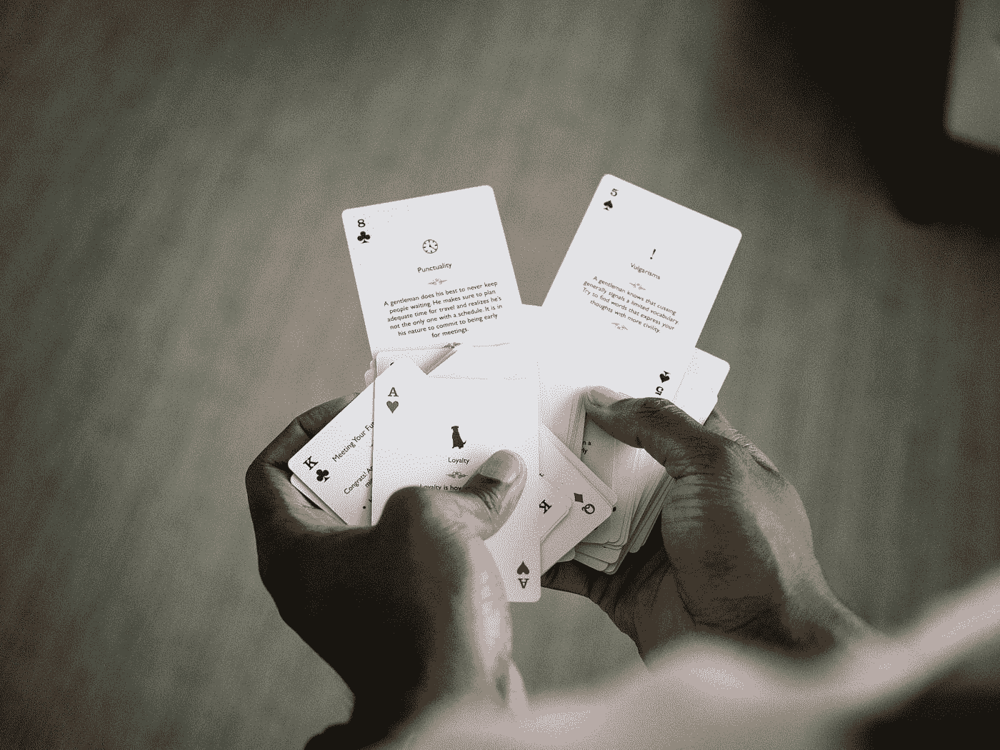
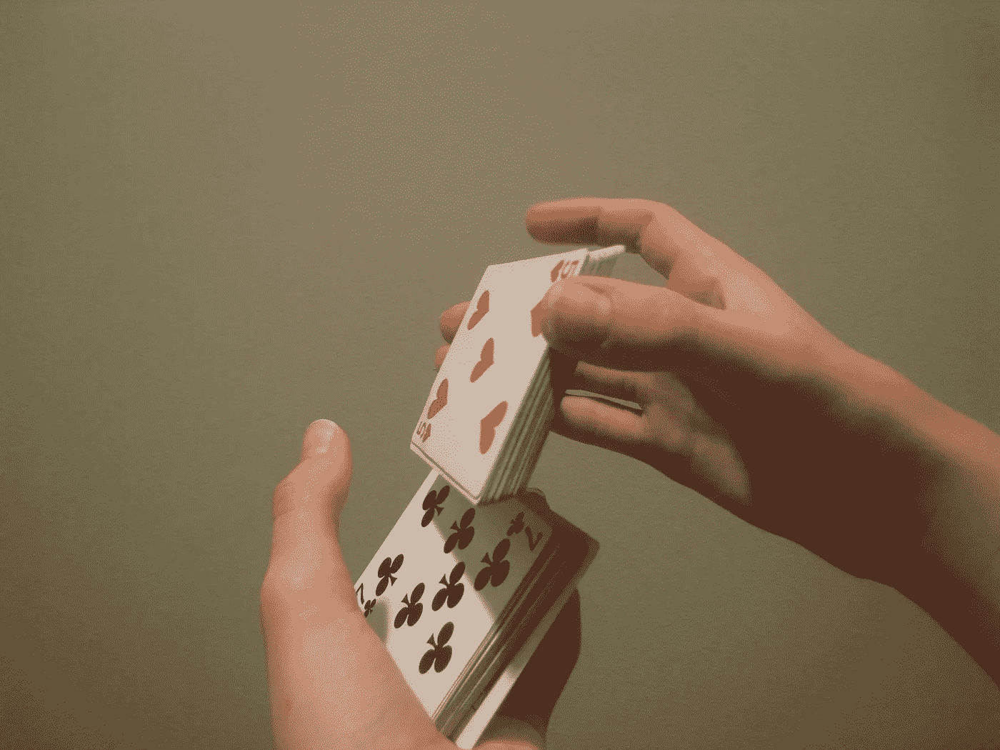
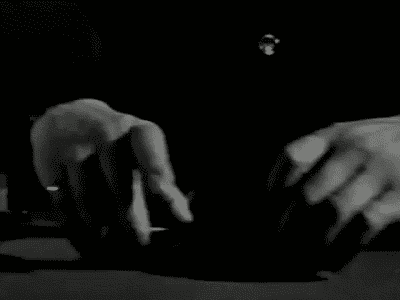
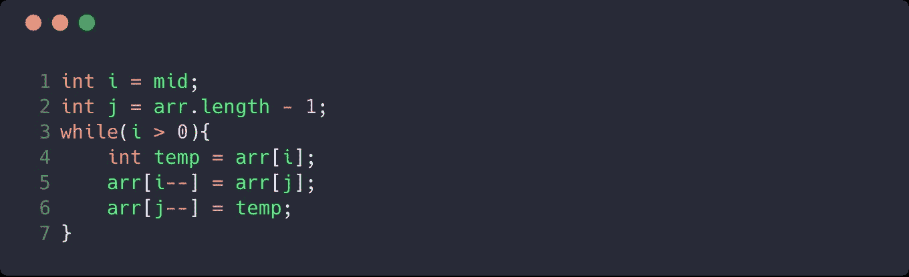
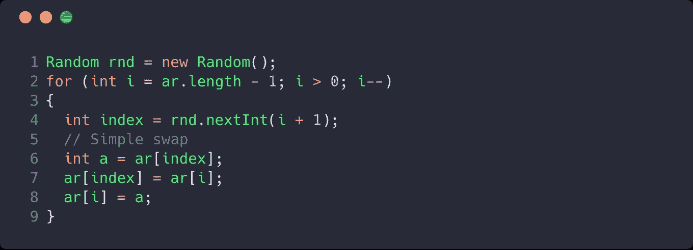
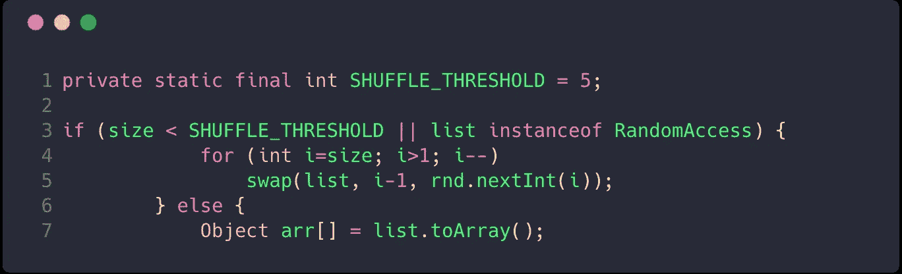

# 洗牌算法和随机化，以提高算法的运行时间。

> 原文：<https://medium.com/nerd-for-tech/shuffling-algorithms-and-randomization-to-improve-algorithm-s-runtime-47f7fc705df?source=collection_archive---------0----------------------->



照片由[在](https://unsplash.com/@creativeexchange?utm_source=medium&utm_medium=referral) [Unsplash](https://unsplash.com?utm_source=medium&utm_medium=referral) 上的创意交流

洗牌是每一个纸牌游戏的重要组成部分。洗牌的技术有很多，但上手洗牌和随机洗牌是最受欢迎的。

**上手洗牌**

在这种洗牌中，一组牌从牌的底部转移到牌的顶部，同样的过程被递归地执行。



一副牌本质上是长度为 52 的固定大小的阵列。上手洗牌将一组牌从数组的末尾放到数组的开头。这个过程重复进行，以获得良好的洗牌。

**重复洗牌**



这涉及到把牌切成两半，这样我们就有了两套牌，然后把它们重新洗牌，这样最后两半牌就交错在一起了。



riffle 洗牌的快速实现。

现有的洗牌算法运行速度更快，并给出一致的结果。这些算法依靠随机化来在每次迭代中生成唯一的随机数。

根据维基百科

> 如果一台计算机可以访问纯随机数，它就能够产生“完美洗牌”。

**Fisher-Yates** shuffle 就是这样一种使用随机数发生器实现完美洗牌的算法。算法是以罗纳德·费雪和弗兰克·耶茨的名字命名的，他们在 1938 年的书中首次描述了这种算法。后来，姜懿翔·克努特和理查德·德斯滕费尔德在 1964 年引入了该算法的改进版本。

与交换两个不同索引的项目不同，该算法在数组内的元素范围之间生成一个随机数 k。每次迭代更新范围内的最后一个元素，因此随机生成器每次迭代都在新的范围内工作，并且每次都生成一个唯一的数字。



Knuth 洗牌。

上述算法在线性时间内工作，比 riffle shuffle 更快。为 100 个整数的数组设置两种混洗算法的时间会产生以下结果。

```
************** Riffle Shuffle *************** 
Time Taken is-: 45298827 
*************** Knuth Shuffle ************** 
Time Taken is-: 1325950
```

编程语言在其内置的 shuffle 方法实现中使用类似的算法。Java 的 shuffle 方法的实现可以通过调用

为了混洗一个不允许通过索引访问对象的链表，Java 首先把它转换回数组，这样就可以进行随机访问，混洗后再转换回链表。



Java 文档中 Shuffle 方法的实现

## 随机化能提高算法的运行时间吗？

一个好的洗牌算法有一个函数，它始终产生一个唯一的随机数。快速排序在排序后的数组上给出二次时间性能，它通过先将排序后的数组随机化，然后将其送入快速排序算法，可以产生一致的 O(nlogn)结果。

有两种不同类型的随机化算法，即**拉斯韦加斯**和**蒙特卡洛**算法。IMHO，对于洗牌算法来说，没有比拉斯维加斯更好的名字了:)

**拉斯韦加斯**算法保证以时间复杂度为代价给出结果，而**蒙特卡洛**通过在没有找到期望输出的情况下提前退出来折衷结果保证。如果我们必须在数组中搜索一个条目，拉斯维加斯算法将一直执行，直到找到期望的条目，而蒙特卡洛将执行几个周期，如果没有找到条目就停止。Rabin Karp 字符串搜索算法使用 Las Vegas 算法来查找输入字符串中所有匹配的子字符串。

# 应用程序

随机化算法在需要一致的好结果而不管算法的输入的应用中是有用的。火箭、卫星、飞机、密码术中的软件利用随机化在算法上获得好结果的高概率

# 资源

[](https://en.wikipedia.org/wiki/Fisher%E2%80%93Yates_shuffle) [## 费舍尔-耶茨洗牌-维基百科

### 费希尔-耶茨洗牌是一种算法，用于生成一个有限序列的随机排列-在平原的话…

en.wikipedia.org](https://en.wikipedia.org/wiki/Fisher%E2%80%93Yates_shuffle) [](https://www.geeksforgeeks.org/randomized-algorithms-set-2-classification-and-applications/) [## 随机算法|第二集(分类和应用)- GeeksforGeeks

### 我们强烈建议将下面的帖子作为先决条件。随机化算法|第一集(介绍和…

www.geeksforgeeks.org](https://www.geeksforgeeks.org/randomized-algorithms-set-2-classification-and-applications/) 

图片取自谷歌。

# 结论

关于洗牌算法和随机化，有太多的东西需要学习和书写。在我的下一篇文章中，我们将使用语言中内置的排序函数对洗牌后的卡片进行排序。

敬请期待:)