# 团结中简单的敌人行为

> 原文：<https://medium.com/nerd-for-tech/simple-enemy-behaviour-in-unity-b38f88009635?source=collection_archive---------4----------------------->

你已经创建了一个[玩家移动](https://sidthakur3519.medium.com/restricting-player-movement-83f8540a792f)，并且确保你的[玩家发射了一束激光](https://sidthakur3519.medium.com/instantiating-and-destroying-game-objects-in-unity-c6cc7c83fc42)，但是仍然缺少了一些东西，也就是说，你没有东西可以射击，或者没有东西可以靠近或远离，所以让我们做点什么吧。

***第一阶段***

让我们从创建一个敌人预设开始(要了解更多预设[点击这里](https://sidthakur3519.medium.com/basic-overview-of-prefabs-c938a7088792))。

完成后，让我们给预设一些颜色。

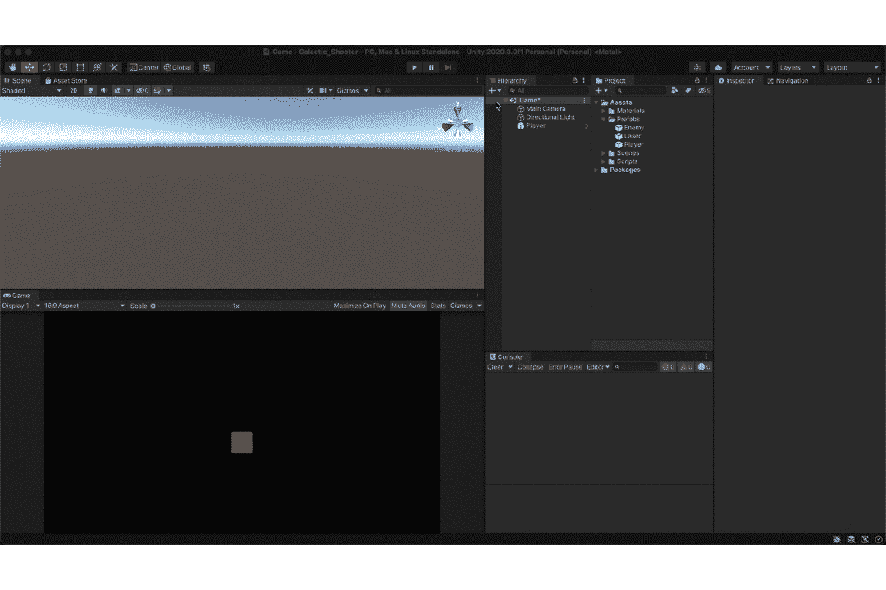

如果愿意，可以编辑对象的比例。

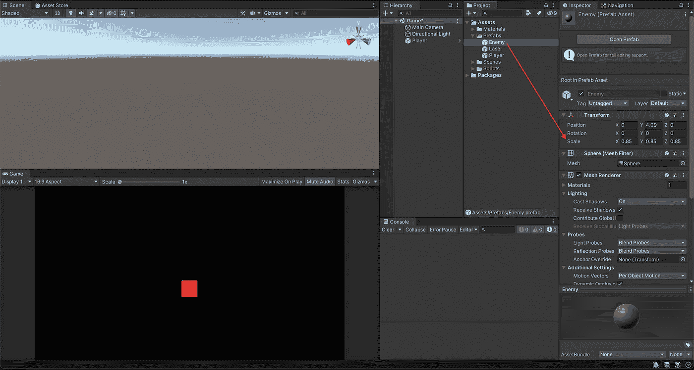

***二期***

给敌人预设添加动作。

正如在[激光发射文章](https://sidthakur3519.medium.com/instantiating-and-destroying-game-objects-in-unity-c6cc7c83fc42)中所讨论的，每当有一个对象需要一个行为，我们就通过创建它自己的行为脚本来添加它。

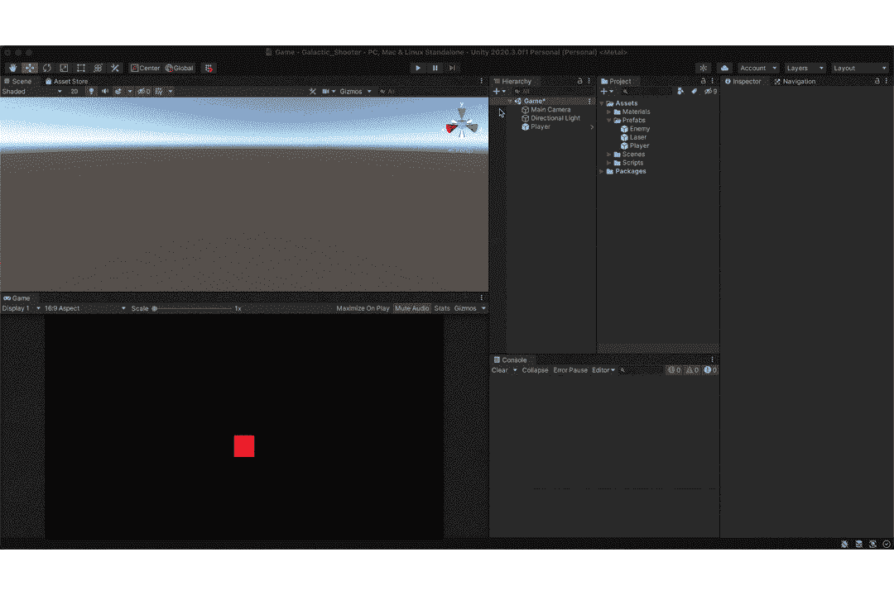

让我们开始添加一些垂直运动。

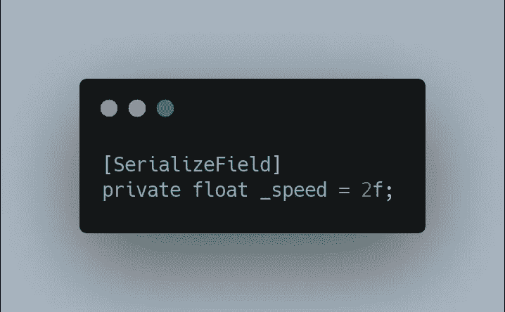

敌人倒下的速度。它是序列化的，因此设计者可以通过编辑器更改值。

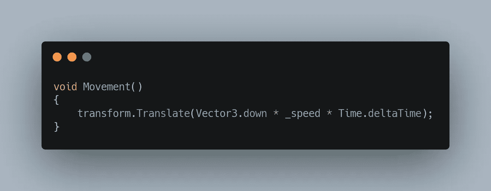

Vector3.down 等效于 new Vector3(0，-1，0)。

*务必将* ***运动()*** *添加到您的* ***更新()*** *。*

这将为您提供以下内容。

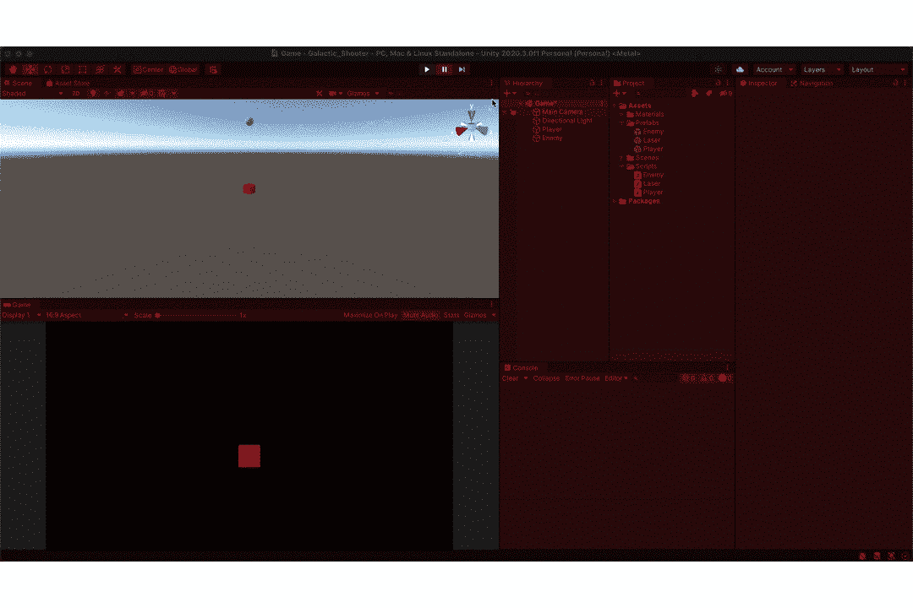

上面的实现有一个小问题，我们注意到敌人一直在向下移动。解决这个问题的一个简单方法是将敌人的位置重置为向下移动之前的位置。但是在这样做的时候，另一个问题出现了，敌人总是在同一个地方循环它的运动。

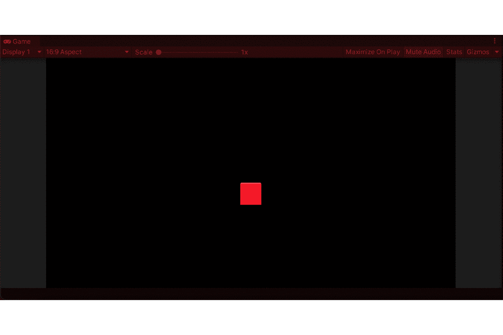

为了解决这个问题，我们可以改变敌人在 X 轴上的变形，让它在 X 轴上的任意点上繁殖。

在我们可以使用的范围内选择随机值。

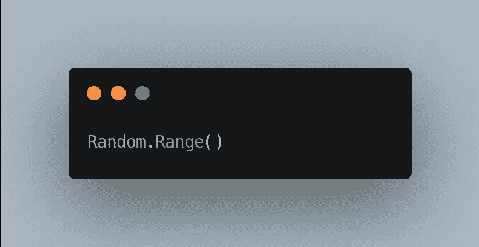

这需要两个参数，最小值和最大值(都包括在内)。

有了这个，我们可以通过以下操作来改变位置。

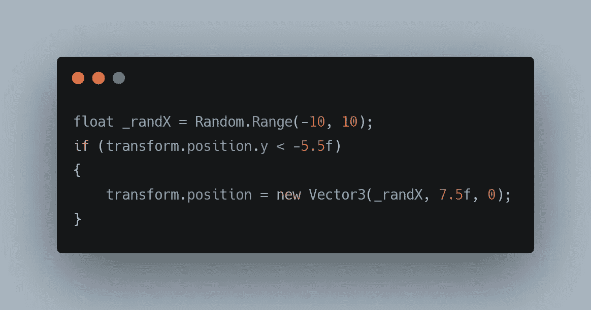

其中 _randX 是我们用来繁殖敌人的随机 x 轴值。if()语句检查我们是否离开了屏幕，如果是，我们将位置重置为(RandomX val，OriginalY val，0)。

这给了我们，

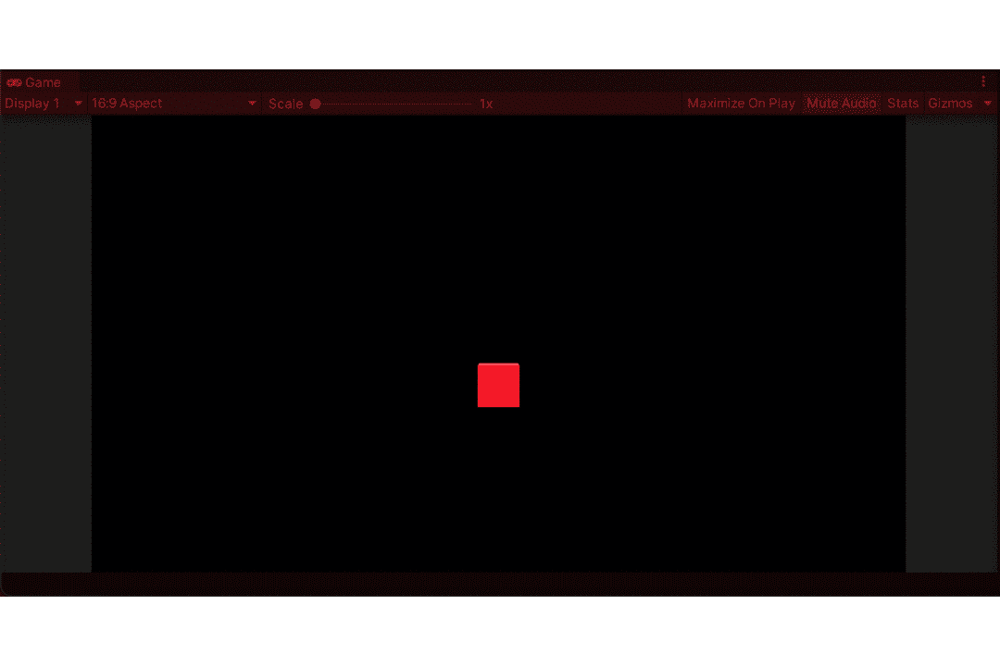

***三期***

随着敌人的移动，我们现在终于可以在游戏中加入碰撞了。在这种情况下，我们将敌人设置为一个触发器，让玩家和敌人的刚体都关闭**使用重力**。要了解更多关于触发器[的信息，点击这里](https://sidthakur3519.medium.com/unity-development-collisions-vs-triggers-740d455757bf)，要了解刚体的[点击这里](https://sidthakur3519.medium.com/unity-development-introduction-to-physics-65ef7e08519c)。

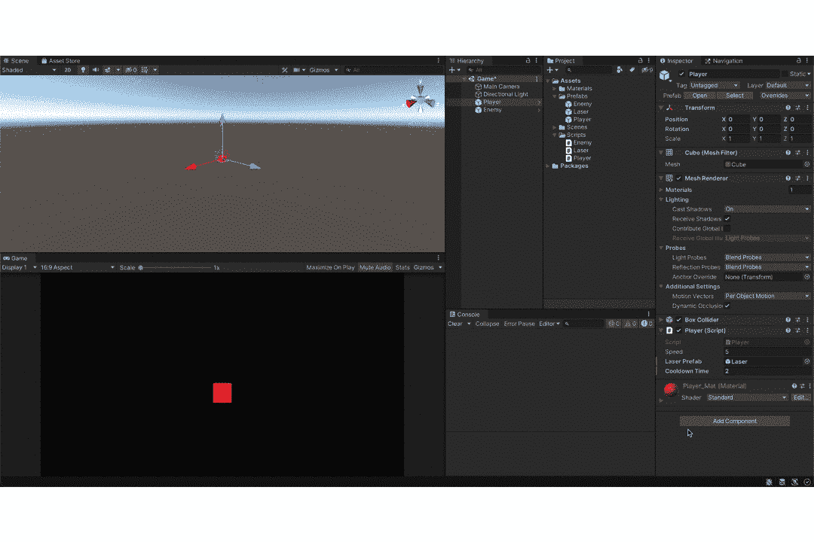

为了检测与触发器的冲突，我们可以使用下面的方法，

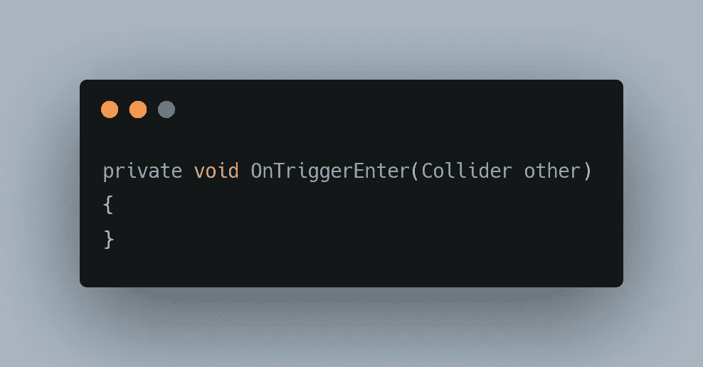

其中“**其他**存储与敌方对撞机发生碰撞的对撞机信息。

所以在做以下事情时，

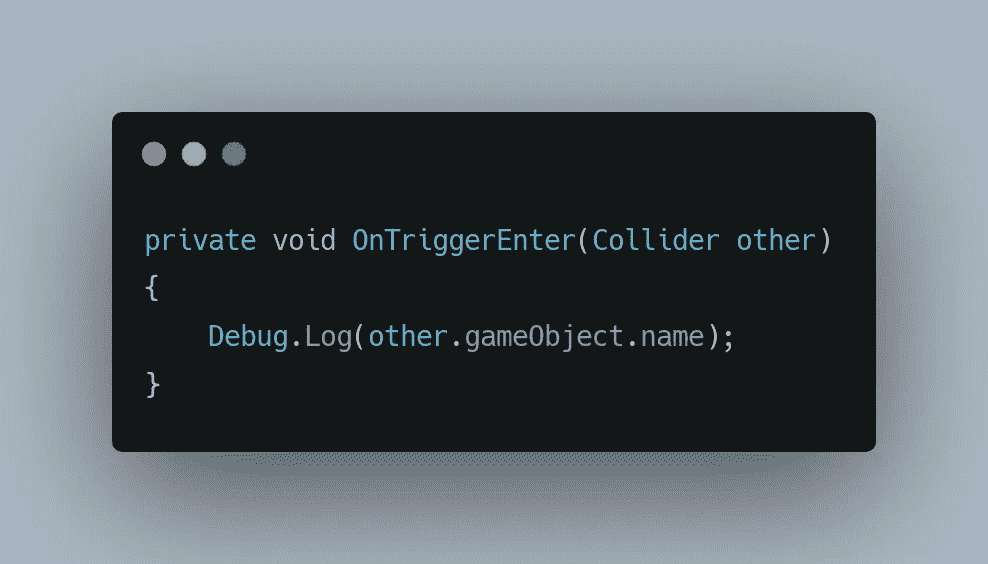

这应该打印出与触发器碰撞的游戏对象的名称。

我们得到，

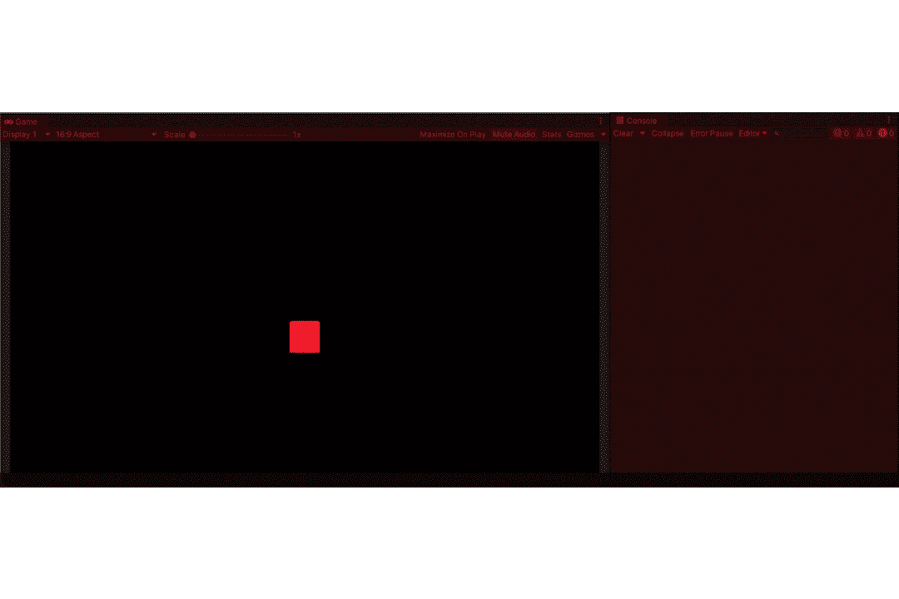

我们可以看到与触发器接触的对撞机的名称。

现在我们要做的就是在游戏物体互相接触的时候摧毁它们。这可以通过以下方式实现，

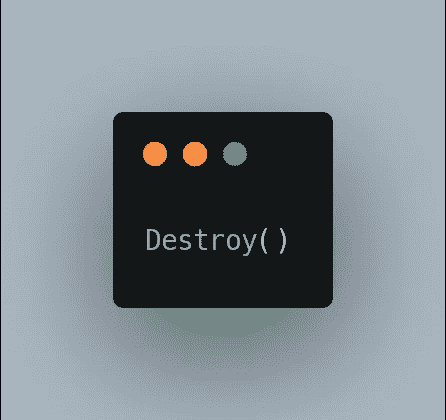

有了这个，我们可以做以下事情，

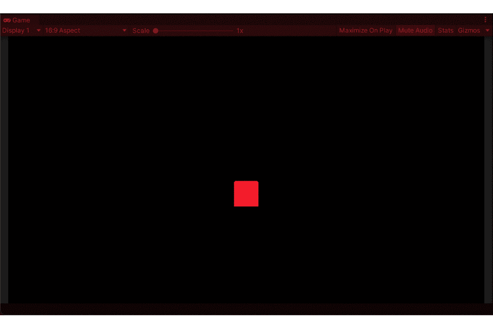

但是我暂时不会破坏玩家的游戏物品。

这样我们就有了一个基本的敌人行为。这种敌对行为是通过以下方式实现的。

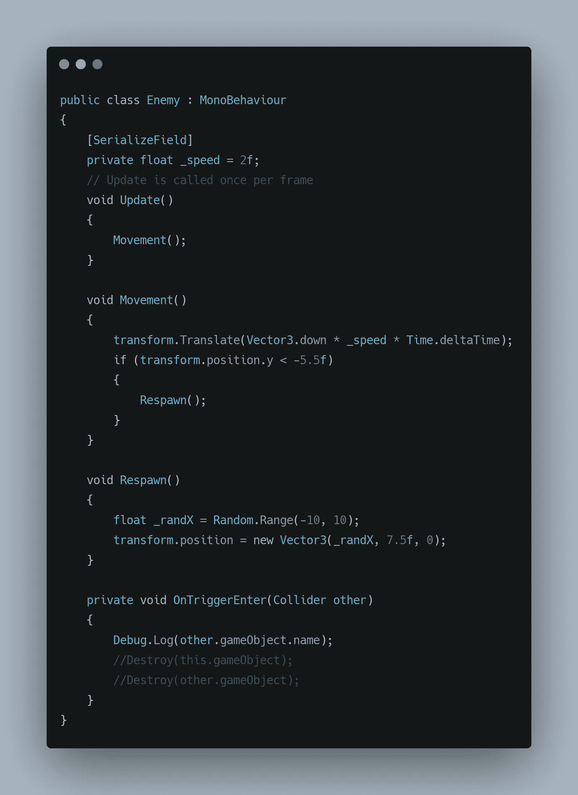

随着我对产卵对象的了解越来越多，以后还会有更多。