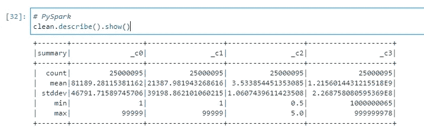
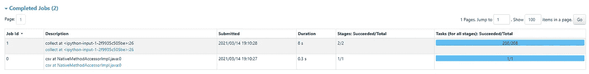
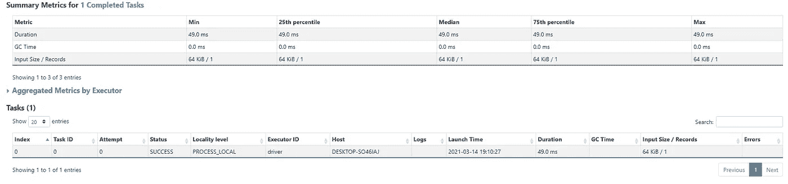
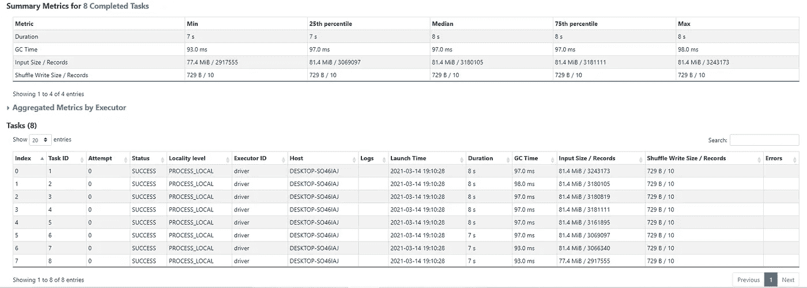
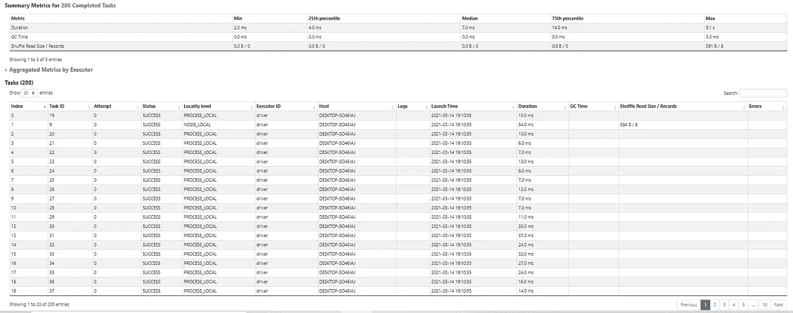
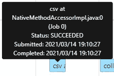
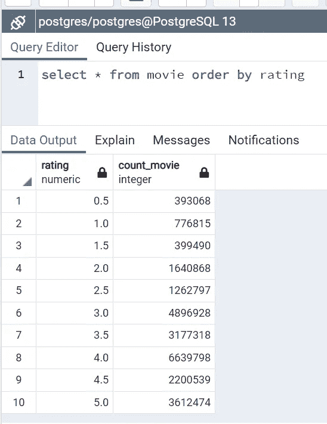

# 使用 Apache Spark 和 PostgreSQL 的简单 ETL

> 原文：<https://medium.com/nerd-for-tech/simple-etl-using-apache-spark-postgresql-9f759351872b?source=collection_archive---------2----------------------->

Spark & PostgreSQL

Apache Spark 是一种快如闪电的集群计算技术，专为快速计算而设计。它基于 Hadoop MapReduce，并扩展了 MapReduce 模型，以有效地将其用于更多类型的计算，包括交互式查询和流处理。

通过这次练习，我想证明 apache spark 有多棒。

1.  **导入我们需要使用的所有库**。

*从 pyspark.sql 导入 SparkSession
从 pyspark.sql 导入 SQLContext
导入 psycopg2*

**2。创建到 PostgreSQL 的连接。**

*conn = psycopg 2 . connect(host = ' localhost '，database='postgres '，user ='postgres '，password = ' postgres ')
cur = conn . cursor()*

**3。加载数据。**

*sqlctx = SQLContext(sc)
pop _ data = sqlctx . read . CSV(' ratings . CSV ')*

**4。在 PostgreSQL 中创建表。**

*cur.execute(" "创建表格电影
(rating numeric 不为空，
count_movie integer 不为空
)；"”)*

**5。做一些转换，在这种情况下，我只是使用数据与 _c0 不等于'用户 ID '和计数电影组的评级。**

*clean = pop _ data[pop _ data[' _ c0 ']！= ' userId ']
a =[tuple(x)for x in clean . group by(" _ C2 ")。计数()。collect()]
b = '，'。join(['%s'] * len(a))*

6。最后，将数据插入表中，不要忘记提交。

*q = "插入电影(分级，计数 _ 电影)值{} "。format(b)
cur.execute(q，a)
conn.commit()*

在这种情况下，我使用清理后的 25000095 行数据。

图片(作者)

Spark 将作业拆分为 2 个作业，作业 id = 0 的作业仅创建 1 个阶段和 1 个任务，作业 id = 1 的作业创建 2 个阶段和 208 个任务。

图片(作者)

作业 id = 0 的汇总指标。

图片(作者)

作业 id = 1 的阶段 1 有 8 个任务。

图片(作者)

具有 208 个任务的作业 id = 1 的阶段 2。

图片(作者)

对于作业 id = 0(加载 csv 文件)，需要 0，3s。

图片(作者)

对于 job id = 1，进行一些转换并将数据插入 PostgreSQL 需要 8s。

图片(作者)

结果为 PostgreSQL。

图片(作者)

**结论**

本练习概述了使用 PySpark 从单一数据源到数据库的基本 Apache Spark ETL 过程。根据我的经验，与 SSIS 或 ADF 或使用。RedHat 中的 sh 文件可能需要 8，3 s 以上的时间，但是与一个复杂的情况相比是非常有趣的。在这个实践中，我只使用了 2 个代码(1 个代码用于清理，1 个代码用于转换)，并且我很有兴趣尝试另一个转换。

**参考**

[创建 Apache Spark ETL:简单指南—学习| Hevo(hevodata.com)](https://hevodata.com/learn/create-an-apache-spark-etl/)

[Apache Spark —简介—教程要点](https://www.tutorialspoint.com/apache_spark/apache_spark_introduction.htm)