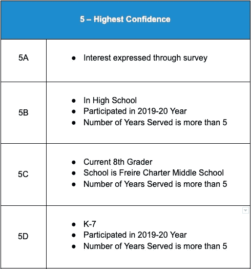
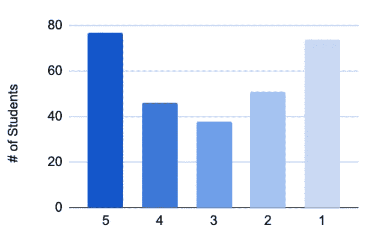
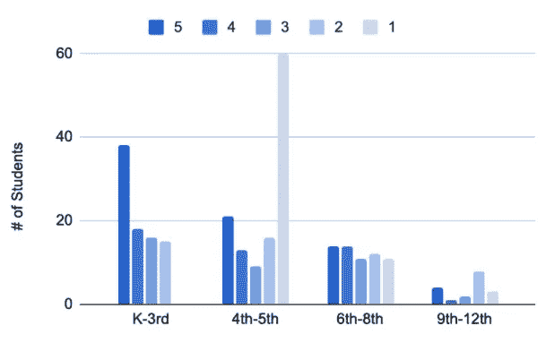
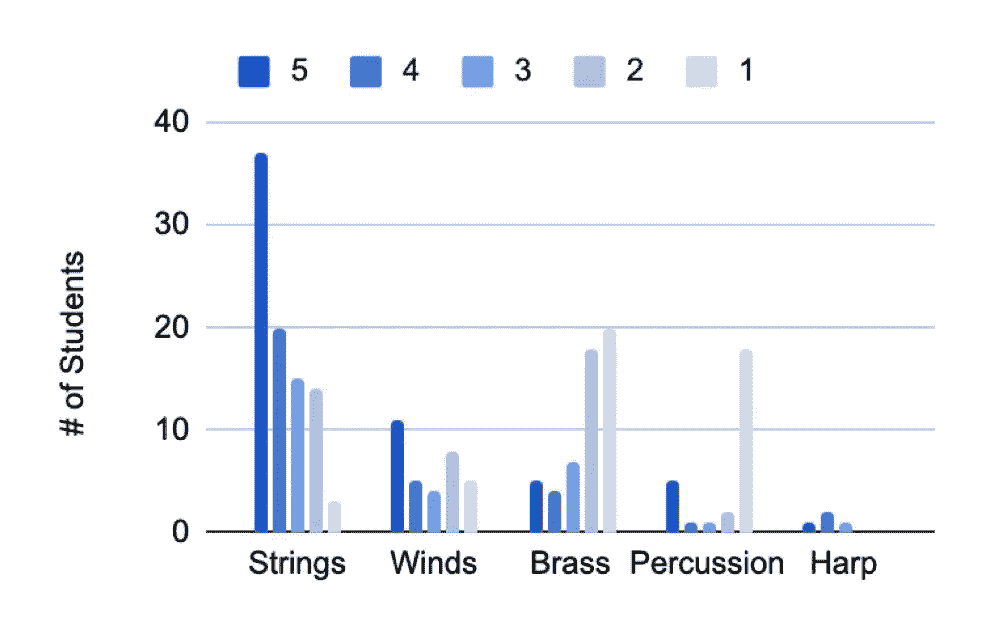

# 简单的图表，更好的图表

> 原文：<https://medium.com/nerd-for-tech/simple-graphs-1d0bf2613b5f?source=collection_archive---------17----------------------->

达里安·沙姆卡利在 [Unsplash](https://unsplash.com/s/photos/geometric-pattern?utm_source=unsplash&utm_medium=referral&utm_content=creditCopyText) 上拍摄的照片

我最近在纽约客上读到一篇关于图表历史的[故事。当人们第一次遇到条形图时(1786 年，在威廉·普莱费尔的《商业和政治地图集》中)，他们发现条形图难以理解。只有通过不断的接触，人们才能熟练掌握图表，并理解它们与有意义的价值之间的对应关系。](https://www.newyorker.com/magazine/2021/06/21/when-graphs-are-a-matter-of-life-and-death)

即使没有这段历史，很明显在显示数据时越简单越好。观众可能不习惯更复杂的可视化，或者他们对潜在概念的适应可能有限(更不用说能力不同的人，他们可能使用屏幕阅读器或其他辅助工具)。

我在一家 [**音乐教育非营利机构**](http://playonphilly.org) 工作。在这艰难的一年后，面对令人生畏的招生项目，我想生成一个可以预测入学人数的模型。我们系统中的每个学生将被分配到五个组中的一个，这与我对他们将被录取的信心相对应:

*   **5 —最高置信度**
*   **4 —高可信度**
*   **3 —中等信心**
*   **2 —一些信心**
*   1 —缺乏信心

我为每个置信水平制定了标准:

第 5 类新兵的标准。每个类别都根据不同的标准分为多个子组。

当标准应用于每个学生时，我分析数据以找到有用的模式，并在一系列条形图中显示结果。**我让可信度与越来越暗的蓝色阴影相对应:**

按置信水平分列的预计学生入学人数

当数据被进一步分解时，这些颜色有助于照亮更多的图案。按级别范围查看数据使我能够战略性地制定招聘目标:

按年级范围分列的预计学生入学人数

无论在哪个领域，我都不太自信，那就是我打算加强努力的地方。类似地，通过按乐器家族分类，我可以为我们需要填充的乐器槽做准备(请多放些双簧管！):

按仪器系列划分的预计学生注册人数

通过保持这些图表的简单，我能够发现数据中的模式，否则很难发现。有鉴于此，我对我的策略进行了重大修改，我的团队在亲眼目睹了相关数据后，对这个策略更有信心了。

如果我能分享简单和平易近人的视觉效果，我工作的任何团队都将获得更好的信息，拥有更大的凝聚力，并最终拥有更有效的战略。