# 第一个物联网应用。

> 原文：<https://medium.com/nerd-for-tech/simple-internet-of-things-application-44a27fe0c25?source=collection_archive---------24----------------------->

## 。Net + MQTT。

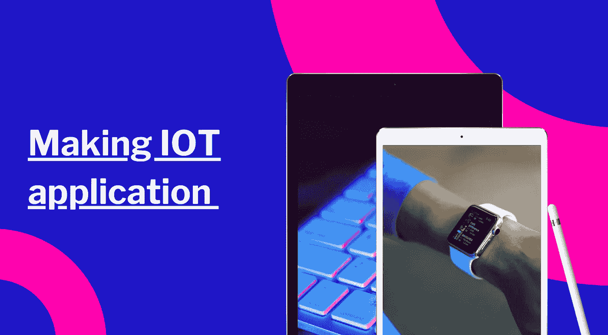

第一步是为 mqtt 安装 nuget 包。MQTTnet，MQTTnet . extensions . managed client。

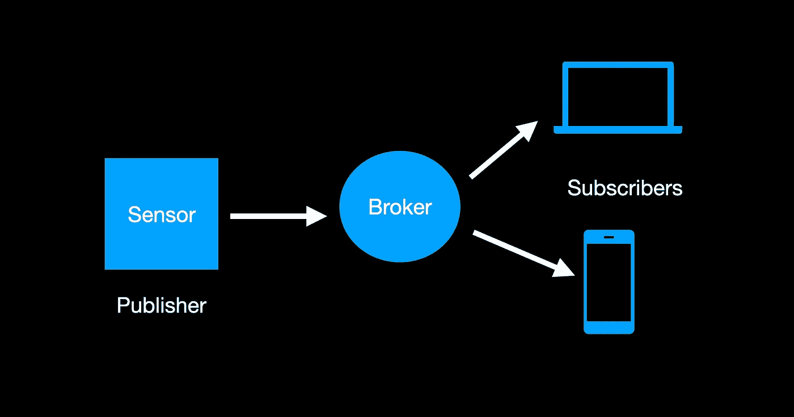

Mqtt 有三个组件:代理、订阅者和发布者。我们有两种方式来运行 broker。做一个小的控制台应用或者用代理服务器运行 docker。我更喜欢跑 [docker](https://hub.docker.com/_/eclipse-mosquitto/) 。默认为监听端口 1883，我们的发布者和订阅者将与此端口进行交互。

让我们写代码。基本上，我们正在创建一个库，我们在 mqtt 上的包装器，我们可以从外部设置连接选项、凭证和日志。

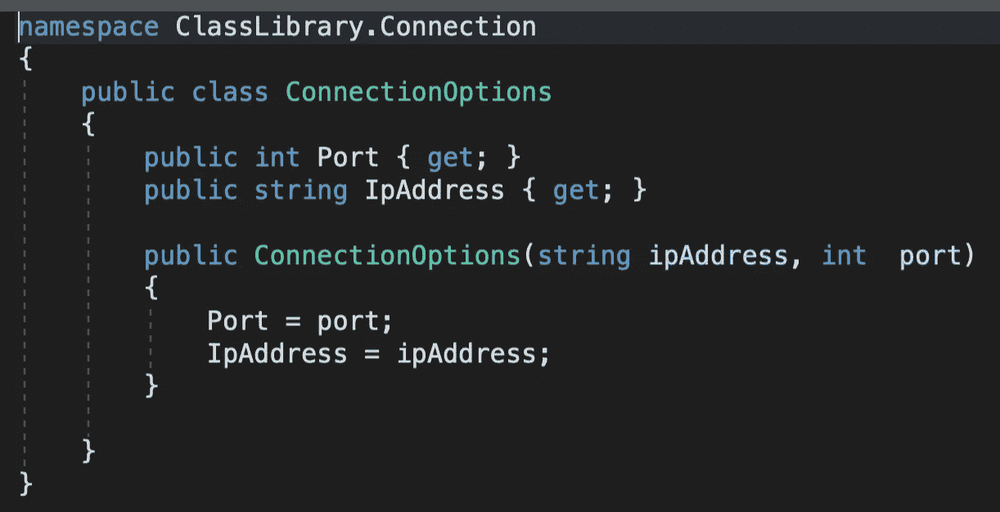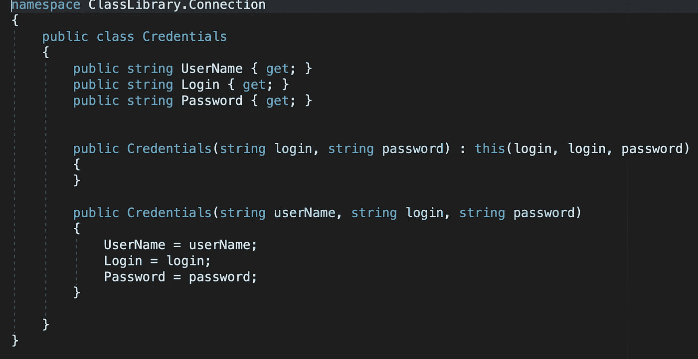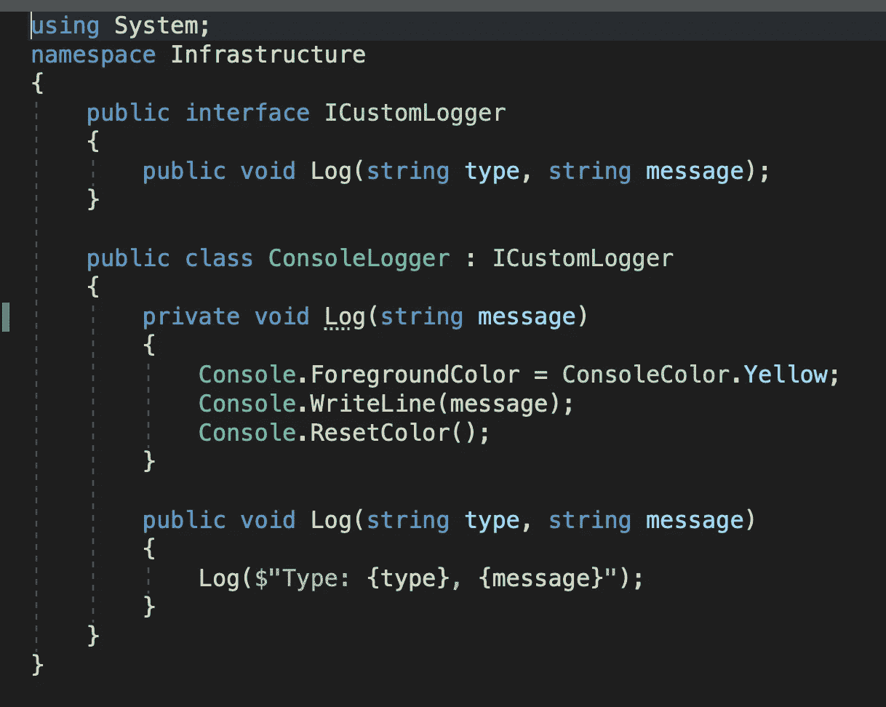

我们还是会做自己的经纪人。Broker 会给我们关于截取数据的通知，以及何时有人会与 broker 建立连接。

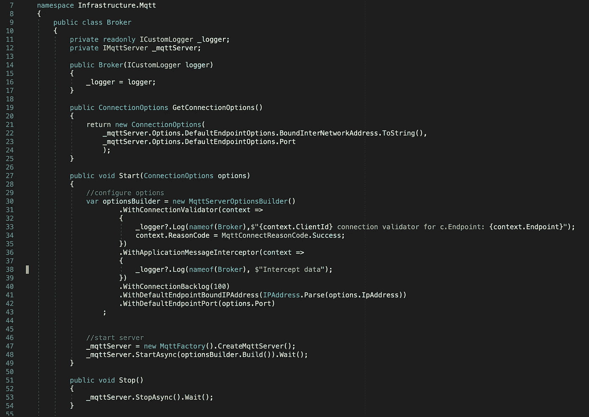

订阅者和发布者具有相同的代码。唯一的区别是发布者知道如何发布消息。

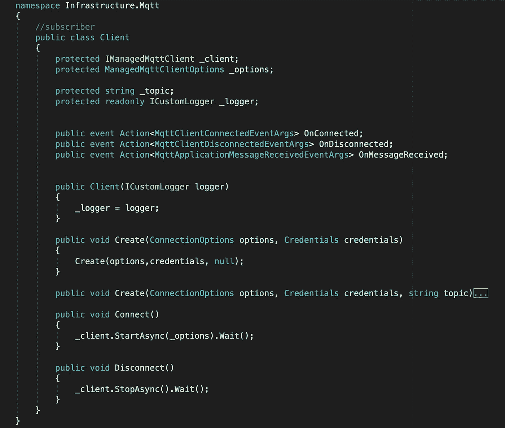

我们在 create 方法中使用的所有魔法。我们在 Connect OnDisconnect 上创建了几个事件，并订阅了一个主题。

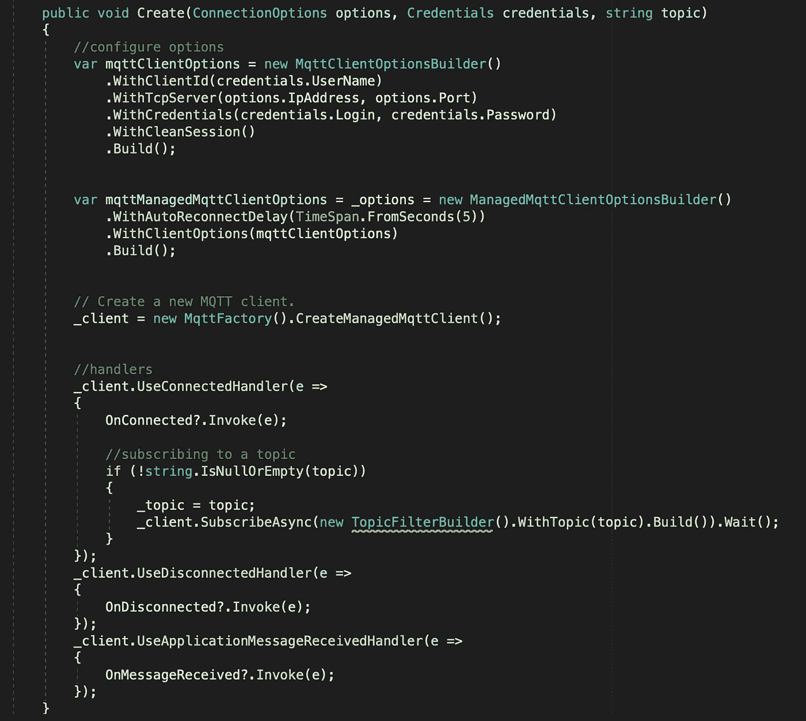

与其复制粘贴，不如继承订阅和方法发布消息的所有代码。

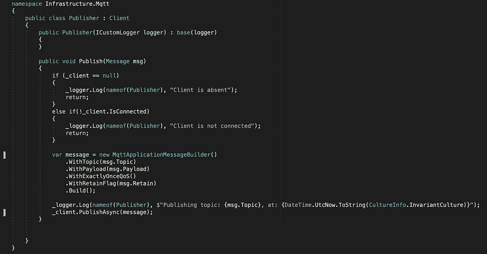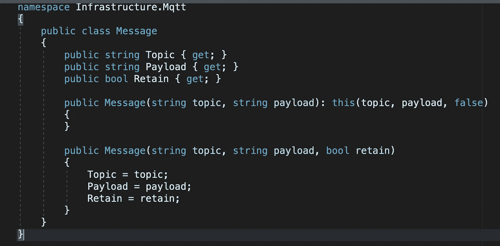

**控制台 app**

是时候测试做一个主机应用了。我们的订户使用我们在其中定义的事件，最重要的是 onMessageReceived。在这里，我们创建了一个与运行在 docker 中的代理的连接，在这个连接中，我们放置了一个代理地址和我们想要收听的主题。

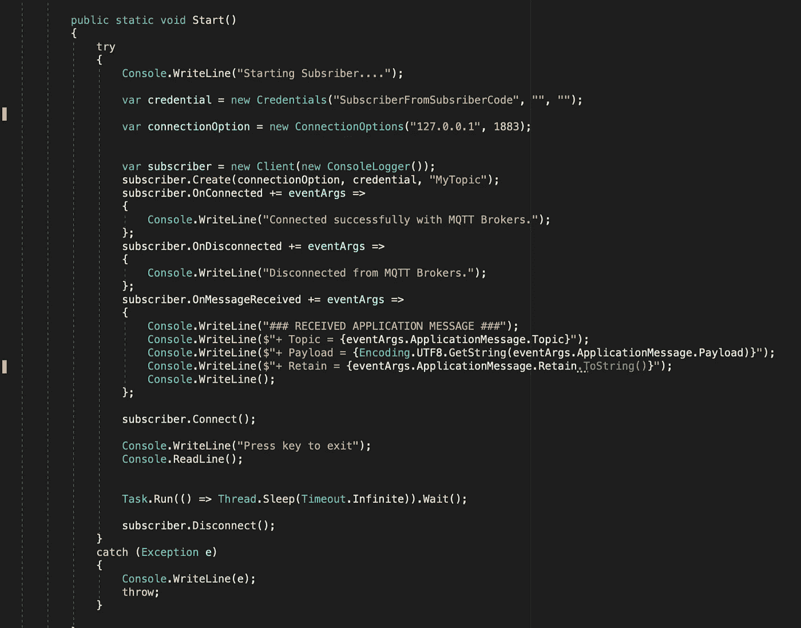

在发布者中，我们使用相同的事件来理解我们何时连接到代理。这是发布消息的最重要的方法。

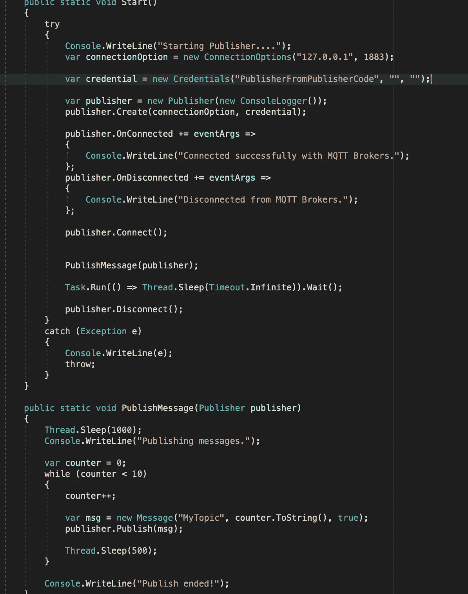

现在你知道了如何使用. net 开发一个物联网应用。如果你需要进一步了解[项目，这里有链接。](https://github.com/8Tesla8/Mqtt-console)

*原载于 2021 年 4 月 25 日 http://tomorrowmeannever.wordpress.com**[*。*](https://tomorrowmeannever.wordpress.com/2021/04/25/fisrt-internet-of-things-application-using-mqtt/)*