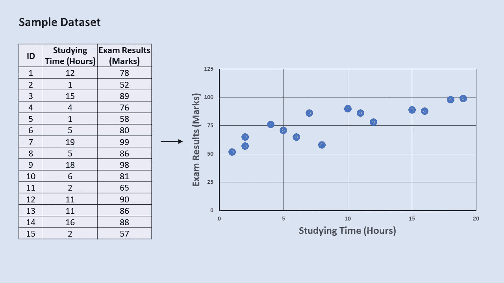
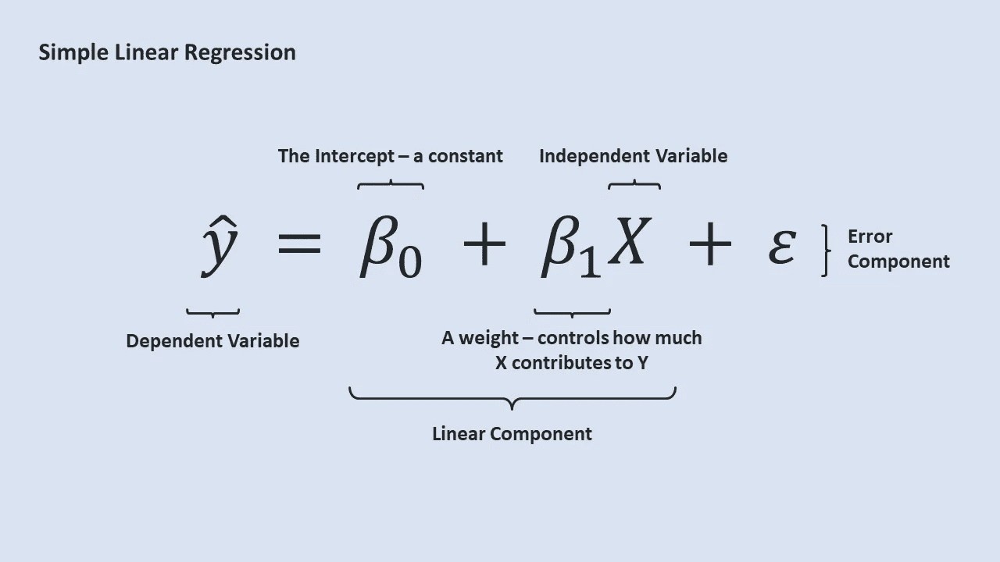
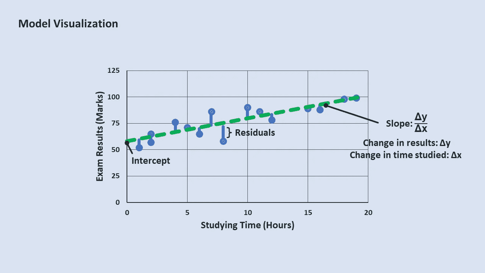
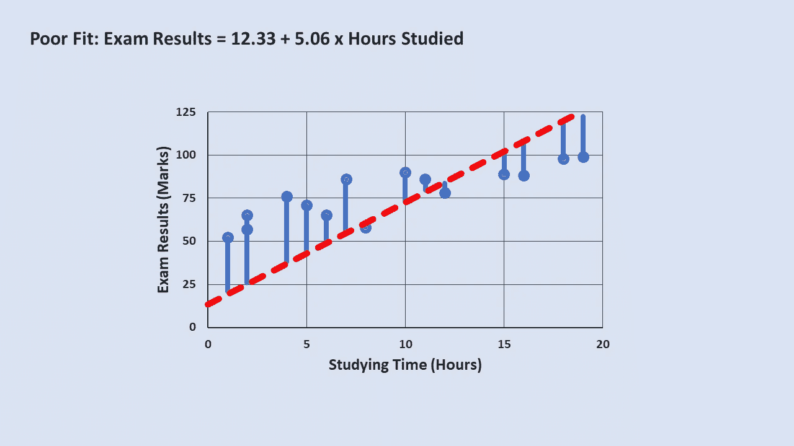
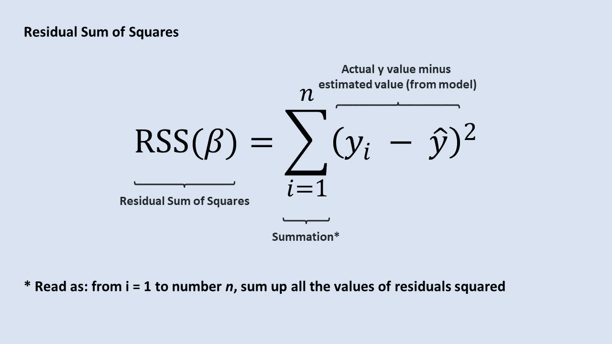
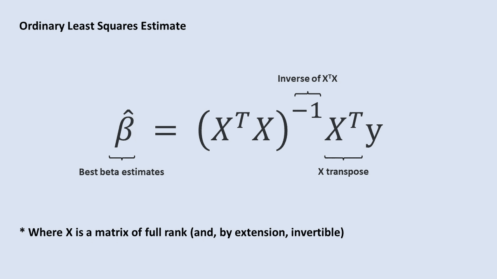

# 简单线性回归:外行人的解释

> 原文：<https://medium.com/nerd-for-tech/simple-linear-regression-a-laymans-explanation-d60f1f2fc41b?source=collection_archive---------6----------------------->

## 分解回归技术背后的基本概念

# 介绍

机器学习和统计学在商业和社会科学中有许多应用。然而，这一理论往往令人生畏，不易理解。在这一系列文章中，我的目的是从线性回归开始，揭开数据科学和机器学习中常用工具背后的概念。

# **概述**

线性回归是一种统计方法，允许我们描述变量之间的关系(可以测量或记录的不同事物，如身高、体重和头发颜色)。它是**一般线性模型**的扩展，这是一个描述如何使用其他预测变量对感兴趣的变量建模的框架。

***数据=模型+误差***

在简单线性回归(SLR)中，我们关注两个连续变量 x 和 y 之间的关系(**因此，简单的**)。

x 和 y 有许多可互换的术语:y 可以被称为**响应、依赖、结果或目标**，而 x 可以被称为**预测器、独立、解释性或特征**。

为了一致起见，我将 x 和 y 分别称为自变量和因变量。记住哪一个是被依赖者的一个有用的方法是，把被依赖者 y 想成“依赖于”独立者 x，而 x 不受 y 的影响，因而是“独立的”。例如，我们可以假设考试成绩取决于花在学习上的时间(注意，这种关系不是反过来的)。

# 案例研究:考试

我们先前的假设似乎直觉上说得通；为了测试这种关系在现实世界中的存在，我们可以收集一些数据，并尝试使用 SLR 对这种现象进行建模。

一般来说，如果你有两个连续的变量，并且你想知道它们之间是否有联系，SLR 是一个有用的起点。

在运行任何类型的模型之前，最好绘制数据图，以便直观地检查数据中的异常值和趋势。使用 15 名学生的样本数据集，我们可以使用散点图直观地表示我们的数据。

即使没有 SLR，我们也可以确定一个线性的积极趋势:根据我们的样本数据集，似乎学习更多的学生可能会做得更好。注意，在剧情中，我设置了 y =考试成绩，x =学习时间。习惯上把因变量标在 y 轴上。

虽然很难从数字中找出学习时间和考试成绩之间的任何关系，但一旦这些数字被绘制出来，这种关系就会变得更加明显

由于考试和学习时间之间的关系呈线性，单反是一个很好的候选对象。如果散点图揭示的关系似乎不是线性的，我们可以考虑使用非线性模型或转换变量。

# 模型分解

我们可以用下面的等式来表示简单的线性回归:

如果这看起来很可怕，请记住，我们实际上只关注三个主要成分——我们的 y 相关(**数据**)、线性成分(**模型**)和误差成分(**误差**)

让我们从左到右分解这个等式。

我们感兴趣的是估计 y。我们给 y 戴上帽子，是因为我们根据现有数据对 y 进行了有根据的猜测(用统计学的话说，我们是从样本中估计总体均值)。

等式中那些长相怪异的 *βs* ？这些被称为贝塔。背后的直觉可以用我们对考试结果和学习时间影响的案例研究来解释。记住 SLR 的目标是量化两个变量之间的关系。我们可能会认为，花更多时间埋头读书的学生往往会在考试中取得更好的成绩，但是从到**有多少**？β_1 本质上回答了这个问题:星等越大，x 和 y 之间的关联越强。

当 x 为 0 时， *β_1* 乘以 x 得到 0，因此 *β_0* 描述了一个基线期望。在我们的案例研究中， *β_0* 描述了假设一个人根本不学习，他应该得到多少分。

给定 *β_0* 和 *β_1* ，我们可以绘制一条在 *β_0* 处与 y 轴相交并且斜率为 *β_1 的直线。*

这条线(下面用绿色表示)是我们的考试结果模型相对于学习时间的直观表示，计算如下

***考试成绩= 57.46+2.18×学时***

另一种表述问题的方式是:假设 x 增加一个单位(**多学习**一个小时)，一个人应该期望他们的考试成绩平均提高多少？

最后，我们得出 SLR 方程中的误差分量(ε)。需要注意的是，数据点并不正好位于直线上。在处理真实世界的数据时，这并不奇怪:不是每个为考试学习 10 小时的人都会得到相同的分数。可能还有其他因素，如个人记忆信息的能力或前一天晚上的休息时间，可能会在最终决定考试结果方面发挥作用。

这些因素没有包含在我们的线性分量中，构成了我们的ε的一部分，它还包括其他随机或无法解释的变化和测量误差。

**ε *=测量误差+遗漏变量+随机变化***

本质上，误差项描述了我们的模型离现实有多远。较差的模型拟合会导致较大的误差

# 普通最小二乘法

概括地说，我们有 y(考试结果)和 x(学习时间)的值。给定我们的数据，我们估计 *β_0* 和 *β_1 的值。*我们如何选择“理想”的价值观？我们想要最小化残差平方和(RSS)的 *βs* 。我们可以使用以下公式计算模型的 RSS:

术语时间-这种拟合模型的方法被称为**普通最小二乘法(或 OLS)。在某些假设下，** OLS 将为 SLR 提供最好的估计。使用这种方法的模型拟合也被称为最佳拟合的**线。**

使用线性代数也有一个方便的解决方案来寻找来自 OLS 的最佳 *β* 估计值:

在矩阵形式中，最佳 *β* 估计值等于 X 转置乘以 X 的倒数乘以 X 转置乘以 y

随着统计软件的广泛使用，我们通常不会手动计算 *βs* 。

# 解释模型结果

回想一下，单反坚持的是一般线性模型的框架。在哪里

***数据=模型+误差***

由于数据中的变化可以大致分为由模型“解释”的变化和无法解释的变化，我们可以使用一种称为 R 的统计来量化我们的模型强度。

R 是一个拟合优度指标——它是一个使用我们的独立变量的预测与我们的真实世界数据拟合程度的指标。R 通常在 0 到 1 之间，1 表示我们模型的预测完美地解释了数据中的所有变化。相反，低 R 值表明一个模型可能有更多无法解释的变异，导致更宽的置信区间和我们预测中更多的不确定性。

R 通常用于验证我们的模型的“强度”，因为它量化了一个模型与基线“模型”相比有多好(使用依赖 y 的平均值估计值)。然而，拟合优度只是验证我们模型的一种方式——高 R 并不自动意味着我们的模型是好的。在模型评估过程中，考虑背景和假设也很重要。如果从模型结构和导出的 *β* 值得出的推论没有意义，那么 R 为 0.98 的模型就没有用。

# 回顾

*   现实世界的关系通常不是完美的线性关系。然而，平均而言，它们可能是线性的。
*   我们可以通过建立最佳拟合线来量化这种关系，该模型可以用数学方法表示为:

*   *β_0* 和 *β_1，*分别是直线的截距和斜率，通过最小化模型的残差平方和(RSS)来估计——这种估计 *βs* 的方法被称为普通最小二乘法。
*   在任何形式的分析中,“相关性并不意味着因果关系”这句格言都适用——在选择 x 和 y 并确定因果关系时要谨慎。

***延伸阅读***

[1]欲了解更多关于 GLMs 和 OLS 简单解释的信息，请查看斯蒂芬妮·格伦关于 statisticshowto.com 的文章

[2]为了更深入地探究这个主题，请查阅宾夕法尼亚州立大学关于应用回归分析的免费笔记

[3]关于 OLS 回归假设的更多信息，请查阅吉姆·弗罗斯特的这篇文章