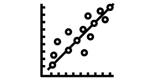
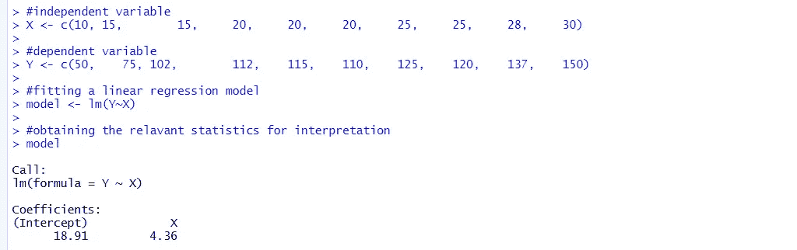
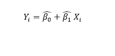
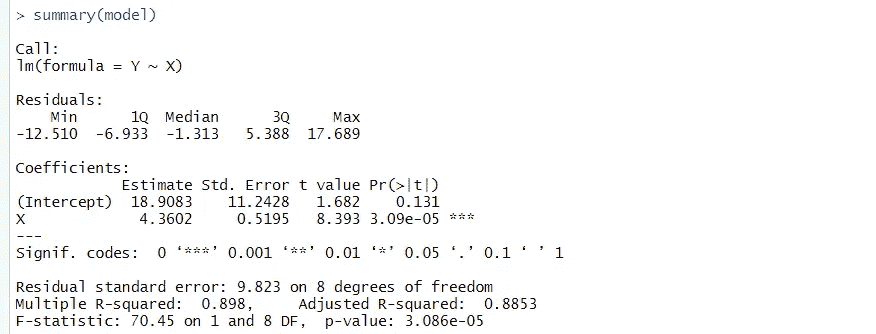

# 简单线性回归建模-第 1 部分

> 原文：<https://medium.com/nerd-for-tech/simple-linear-regression-modeling-part-1-1ae3b59c6ab5?source=collection_archive---------7----------------------->

回归分析是公认的最有用的统计工具之一。这是理解某些变量之间关系的最有效的方法之一，同时能够对未来做出逻辑预测。

让我们通过一个例子和 R 代码来理解简单的线性回归。但首先，我们应该知道为什么它被称为“简单”线性回归。这是因为我们将只研究两个变量之间的关系，一个因变量和一个自变量(*用下面的例子*清楚地解释了)。

**示例** 考虑下面给出的示例:
假设我们希望研究纸张中硬木纸浆的量对其抗张强度的影响。

为了开始数据分析，我们首先要确定我们要处理的每个变量的类型。在此基础上，我们可以看到哪个变量影响另一个变量，或者哪个变量影响另一个变量，但它本身是独立的。这个变量叫做自变量。在这个例子中，因为我们要研究纸张中硬木纸浆的百分比对抗张强度的影响，所以纸张中硬木纸浆的百分比是我们的独立变量*(或回归变量)*通用符号 X *。*另一方面，因变量*(受自变量影响)*称为回归量，一般符号为 y。

接下来，我们运行以下 R 命令，以获得 Y 对 X 的模型拟合摘要。这是因为，我们的因变量(Y，此处为纸张的抗张强度)会随着自变量(X，此处为纸张中硬木纸浆的百分比)的变化而变化，因此用 X 表示 Y 将有助于我们直观地了解这两个变量之间的确切关系。

> *线性回归的 R 码:
> >*#自变量
> > X < - c(10，15，15，20，20，20，25，25，28，30)
> >#因变量
> > Y < - c(50，75，102，112，115，110，125，120，137
> 
> > #拟合一元线性回归模型
> >模型< - lm(Y~X)

简单的线性回归模型如下所示

线性回归模型的一般方程

这是线性回归模型的一般形式。这里，RHS 由截距估计、斜率估计和 Xi 的相关值组成。模型的总体参数(截距和斜率)实际上是不可能找到的，因此我们用它们的无偏估计代替它们并形成一个模型。
因此模型变成:

一旦我们有了这些估计值，我们就可以对 X 的各种值进行预测(假设回归具有统计显著性和逻辑性)。

根据上面的输出快照，模型的截距估计值等于 18.91，斜率估计值等于 4.36。因此，我们线性回归的拟合方程为 Y = 18.91 + 4.36 X

# 其他重要统计数据

在运行下面给出的 R 代码时，我们得到了一些非常重要的统计数据，这些数据有助于我们更好地理解模型的有用性。

*R 代码:
>* 型号
>概要(型号)

以上 R 命令的输出快照

需要观察的事项:

1.  回归模型的显著性
    当然，像任何其他估计一样，我们总是要检验观察值的显著性，看看结果是否符合逻辑解释，或者只是出于偶然。
    这里，最后一个 p 值，对应于输出的最后一行中的 F 测试，是我们所关心的。从理论上讲，就像对平均值的显著性进行 t 检验一样，我们必须进行 f 检验来检验回归的显著性。

假设:
H0:回归是显著的。H1:回归是微不足道的。

回归的 f 检验的 p 值是 3.086e^(-5) < 0.05 (alpha). Hence, we reject H0 and conclude that the regression is significant.

2\. The significance of the Estimates of the Population parameters
获得这些值是不够的，如果这些值不显著，模型就变得无用。这些参数显著性的 t 检验的 p 值以系数下的表格形式给出。

假设:
H0:参数是显著的。H1:这些参数无关紧要。

我们看到，截距参数显著性的 t 检验的 p 值为 0.131 > 0.05(α)。这里，我们接受 H0，并得出结论，截距参数的估计是微不足道的，可以排除。

此外，斜率参数显著性的 t 检验的 p 值为 3.09e(-5)< 0.05(alpha)。这里，我们拒绝 H0，并得出结论，估计斜率参数是有意义的。

因此，我们修改后的模型变成:

我们可以用这个等式进行预测。对于纸张中不同百分比的硬木纸浆(X ),我们可以获得纸张抗张强度的估计值(Y)。

> 进一步的讨论主题

在下一篇文章中，我们将讨论帮助我们理解拟合模型的有用性和预测能力的各种其他因素。