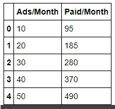
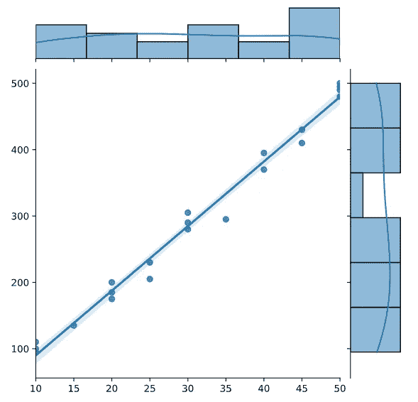
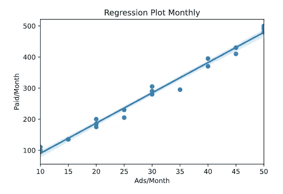
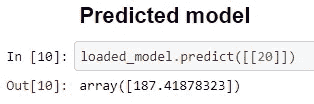
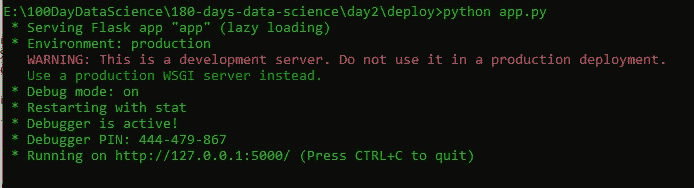
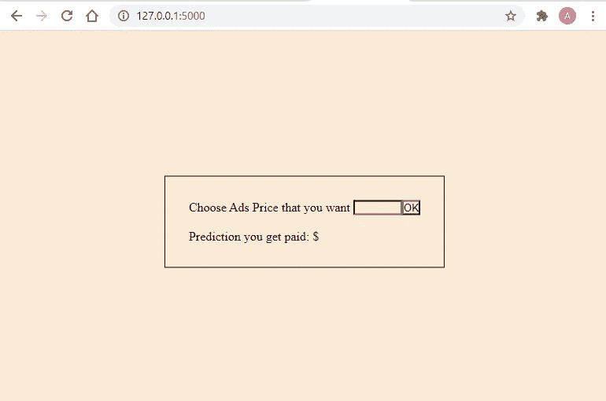

# 使用 Flask 构建简单的线性回归部署模型

> 原文：<https://medium.com/nerd-for-tech/simple-linear-regression-with-deployment-using-flask-cafbf85fa96f?source=collection_archive---------5----------------------->


豪伊·梅普森在 [Unsplash](https://unsplash.com/?utm_source=unsplash&utm_medium=referral&utm_content=creditCopyText) 上拍摄的照片

简单线性回归(SLR)是一种统计模型，可用于处理一个因变量和一个或多个因变量之间的关系。这是机器学习中的一种回归算法。就像它的名字“简单”一样，我认为你应该把这个模型作为你 ML 道路的开始。

在这篇文章中，我想分享如何制作一个单反模型，然后将其部署到 web 服务器上。你认为，为什么我们需要部署它？嗯，因为你不能只用你的数据来告诉你的潜在客户。你必须用一个产品告诉他们。也许，这篇文章是你成为数据科学家的良好开端。

# 1.模型

首先，我们需要建立一个机器学习模型。这个模型就像我们的大脑一样工作，它处理部署中需要的所有计算。

## 导入库

从上面的代码中，我们需要从 Python 导入一些库。Sklearn 用于实现线性回归算法。Matplotlib 和 seaborn 用于可视化数据，pandas 和 numpy 用于处理数据，joblib 用于保存已经建立的模型。

## 构建数据集

好了，让我们建立数据。假设你是一家广告公司的销售人员，该公司的广告租金在 10 美元到 50 美元之间。因为，公司已经比较大了，他们通过使用广告服务从老消费者那里得到了关于他/她的收入的数据。所以，让 X 作为广告价格，Y 作为收入。你的任务是预测收入，如果有人租用服务。

通过使用 numpy，我们可以创建 X 和 Y 的序列，然后使用 pandas，我们将 X 和 Y 组合成数据帧，并将其保存到变量中。下一次使用。我们展示简单的数据集。输出将是这样的



我们制作了简单的数据集。事实上，你可以创造任何你感兴趣的东西。

## 可视化数据

为了提高我们对数据集是如何编程的理解，我选择先将其可视化，如果您愿意，可以跳过这一步。在这一步中，我使用 seaborn jointplot 来绘制 X 和 Y 之间的相关性，代码如下。

我用 kid='reg ',因为我想用回归方法画一个图。输出是这样的。



从上图中，你可以看到每个点都用 X 和 y 表示。这条线是回归线。所以这个预测，会显示在线条附近。如果你看到我的数据，那里没有异常值，所以它可以更容易地处理它。

> 离群点是离回归线很远的点

没有标签的图片，将无法理解。所以让我们在标签上再画一次图。

这是输出



从图中，我们可以得出结论，广告越贵，消费者得到的报酬(收入)就越多。理解了这个概念之后，我们来做回归模型。

## 制作线性回归模型

这是我们模型的大脑。我们使用 sklearn 类 LinearRegression()在我们的数据集中实现 SLR。我们需要做的第一件事是改变 X 值的形状，因为这个数组需要是二维的。

## 保存模型

使用 joblib.dump 将模型保存到你想要的任何地方，这里我将它保存为`model.sav`通常模型会与你的程序保存在同一个目录

## 负载模型

要加载模型，您可以使用 joblib.load，如果您想要预测您的模型，这将非常有用

## 预测

让我们通过 X 的 put 值来测试我们的模型

因为我用笔记本，输出会显示出来，像这样



从模型中我们得到 Y 值 187.42，如果 X 是 20。请记住，它可能与您的不同，这取决于我们的数据集。

# 2.部署

Flask 是连接 Python 程序和 Web 应用程序的 Python 框架之一。在这篇文章中，我不会把重点放在 Flask 上，但我会试着向你解释它。如果你有任何问题，就问它。

## 目录结构

机器学习最重要的是模型。从第一步开始，记住我们有`model.sav`。将它移动到名为 deploy 的新目录中，并在 deploy 目录中创建一个名为`app.py`的 Python 文件。最后，在 deploy 中重新创建新目录，命名为 web。在 web 目录中创建一个 html 文件并保存为`home.html`。

```
E:\...\deploy
  |
  |-- web
  |    |--home.html
  |
  |-- app.py
  |-- model.sav
```

## 烧瓶文件(App.py)

下面是 app.py 的代码

我想我不会试图向你解释一切，我会让你自己去理解。

## 模板文件

请记住，我们已经制作了 web 目录，在目录中我们有一个文件`home.html`。该文件被 Flask 框架用作路由文件。这是 home.html 的代码

## 操作程序

因为，我们使用 flask，我们不是从 HTML 而是从 Python 运行代码，你可以使用这个命令来运行它



如你所见，有一个链接`[http://127.0.0.1:5000/](http://127.0.0.1:5000/)`，从任何网络浏览器访问它，你将得到这个显示



## 测试数据

最后，让我们通过在盒子里放入任何值来测试我们的工作。


# 结论

恭喜你，你用线性回归完成了你的第一个机器学习项目。你也可以改进它，用你想要的任何东西或者设计更漂亮的网站。我只希望一件事，如果你读到最后

> 只有实践，你才能做某事。

所以，请不要只是复制粘贴我的代码，自己写，一个一个理解。是的，这个过程在开始时很可能是缓慢的，但从长远来看，这是值得的

谢谢

# 源代码

实际上，这是我早期的数据科学之旅，我已经公开发表了。这个项目实际上是我 180 天数据科学的第二天。如果你愿意，你可以跟着去

[](https://github.com/theDreamer911/180-days-of-data-science/tree/main/day2) [## 911/180 天数据科学梦想

### 就像它的名字一样，让我们在新的一年里再见吧——梦想者 911/180 天的数据科学

github.com](https://github.com/theDreamer911/180-days-of-data-science/tree/main/day2) 

这个项目的想法是从[这里](/@986110101/cara-men-deploy-model-machine-learning-sederhana-menggunakan-flask-a7fc0ac15aad)

最后，
祝✌代码愉快