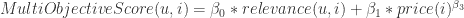
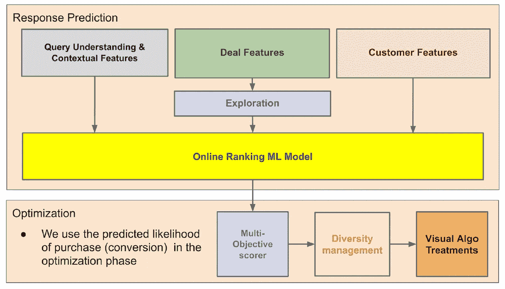
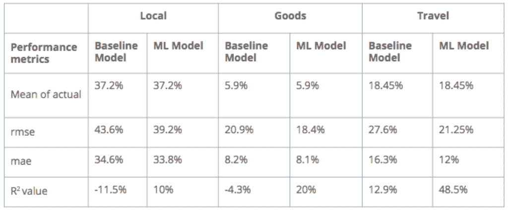
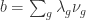

# 简单的目标效果更好，Groupon

> 原文：<https://medium.com/nerd-for-tech/simple-objectives-work-better-groupon-3c5a2830a67d?source=collection_archive---------17----------------------->

## 论文说明

一个更简单的目标函数公式能为在线市场带来更好的结果吗？像 Groupon 这样的在线市场有多个利益相关者，需要解决每个利益相关者的目标。Groupon 的研究人员发现，简化他们的目标函数将转换率提高了 1.56%，将业务的运营价值提高了 1.43%。

在本帖中，我们将首先介绍什么是多利益相关者系统中的多目标建议，然后深入探讨本文的内容。

# 多利益相关方系统和多目标建议

**在线市场:**在线市场是商家和顾客见面并进行在线交易的平台，对双方都有利。根据业务的不同，除了客户和商家之外，还可能有系统的其他利益相关者。亚马逊、Instacart、E-bay 是市场的常见例子。

**单目标和多目标推荐:**最流行的推荐方法，例如协同过滤，通过优化项目的点击或转换，只关注用户相关性。单一目标推荐是对多利益相关者系统中问题的狭隘看法，因为它只关注客户，而忽略了其他利益相关者。显然，从长远来看，这对这个体系是不健康的。

解决其他利益相关者目标的一种直观和流行的方法是从用户相关性模型中获取分数，并修改它以适应其他利益相关者的需求。结果，你得到了一个新的相关性分数，它解决了多个目标。具体来说，举个例子，当你在电子商务平台上向用户推荐商品时，你要考虑收入。您可以修改项目的用户相关性分数，

其中 u 是用户，I 是项目，betas 是调整参数。这些参数也可以被认为是控制多目标分数计算中每个分量的贡献的杠杆。

现在我们有了足够的背景来继续讨论论文[简单的目标效果更好](http://ceur-ws.org/Vol-2440/paper5.pdf)。

# Groupon 推荐

Groupon 的搜索和推荐引擎叫做“相关性”,它负责为顾客找到最好的交易，同时满足所有利益相关者的目标。当前的多目标计分器结合了加权因子，每个因子代表一些利益相关者。在论文中，他们描述了当前的目标函数和简化，从而提高了转换和操作价值。

# 排名管道

Groupon 的排名管道如图 1 所示。它由两个模块或阶段组成:

1.  响应预测:一个 ML 模型，根据点击概率或转换/购买概率来预测交易与用户的相关性。
2.  优化:该模块采用响应预测模块的输出，并使用多目标计分器修改该分数以使其具有多目标意识。最后，多样性管理负责预测的多样性和公平性。然而，该论文中没有描述涉及多样性和公平性的方法。

图 Groupon 的排名管道

通常，推荐的多样性确保用户有不同的相关选择，而公平性确保推荐不会只偏向少数受欢迎的商家，而忽略其他商家。

论文中没有描述视觉算法处理，但我认为它可能是某种仪表板，允许调整建议中的杠杆。

用于排名/预测的 ML 模型(在本文中)是梯度推进机器(GBM)。

# 当前多目标计分器

Groupon 中的当前多目标评分者计算 eCVR、预计预订量和预计价值的加权和。

*得分= a * eCVR + b * eBooking + c * eValue*

在哪里，

*电子书= eCVR * price^{priceExponent}*

*evalue = ecvr * margin percentage * price^{priceexponent}*

记分员的条件是，

eCVR:用户交易的估计转换率。

电子记账:调整后的交易预期记账价值(美元)。

eValue:调整后的交易预期运营价值(美元)。

上述调整与价格指数有关，以减少高价交易的过度影响。a、b 和 c 是赋予每个分量相对重要性的参数。该论文提到这些值是归一化的，因此很可能 0 <= a, b, c <= 1 and a + b + c = 1\. For new and anonymous users b = c = 0 and therefore the focus is entirely on conversions.

**该目标函数的缺点:**虽然这种方法很灵活，并提供了调整分数的杠杆，但根据作者的说法，它缺乏数学上的严谨性，并要求人们在选择参数 a、b 和 c 的正确值时做出复杂的决策。这很复杂，因为不同参数选择之间的权衡很难衡量。

# 简化公式

简化公式将每笔交易的投标价值或预期收益估计为对单个目标有贡献的价值的加权组合。权重是实现目标的概率。更具体地说，目标函数的简化公式是，

其中，g 是目标，lambda 是实现目标 g 的概率，nu 是以美元为单位的目标值。

目标的例子有激活、转化、价值和参与。

而转化、价值和参与是众所周知的术语；激活是一个有趣的问题。如果你有一个新用户，最重要的目标之一是帮助用户进行第一次交易或在平台上被激活。然而，激活也可能意味着推动已经在平台上休眠了一段时间的客户的转化。

简化公式的有趣之处在于，

1.  投标价值给出了每笔交易的预期价值，同时考虑了按实现目标的可能性加权的不同目标的价值贡献。如果在实现不同目标的可能性之间存在权衡，这将直接反映在投标价值上。但是，必须确保一个目标不会压倒其他目标，并且这种权衡确实存在。然而作者并没有谈论它。
2.  简化目标的组成部分由 ML 模型预测。因此，简化的目标本质上是非线性组合的模型集合。(因产品项而呈非线性)

## 预测简化配方的成分

**实现目标的概率(λs)**

Lambda 是预测实现目标概率的模型。这实际上很简单。如果目标是点击或购买，那么它是一个二元分类模型。论文提到这些 ML 模型是 GBM 的。

这给我们留下了目标价值。

**目标值**

目标的价值由运营价值来评估。

运营价值=单位售价*数量+费用—公开折扣—关闭折扣—运输成本—交易成本

公开折扣是平台上用户可用的折扣，封闭折扣是只对部分用户可用的折扣。我认为这也是公平的假设关闭折扣是有针对性的折扣，通过电子邮件或通知发送给用户。

作者提到，开放折扣和封闭折扣是这种运营价值计算中的移动部分，需要从 ML 模型中估计。因此，他们训练 ML 模型来预测每天的每笔交易，

1.  交易的未结折扣订单的百分比
2.  交易的已结折扣订单的百分比

使用该预期未结折扣和每笔交易的预期已结折扣可以很容易地计算出来，

每笔交易的 OD = min(cost _ to _ user ***OD %**，OD$ cap) * OD 订单/订单总数
每单位 CD = cost _ to _ user ***CD %**

其中 CD% =结算折扣金额/总金额

粗体百分比是 ML 模型预测的百分比。这些模型的特点包括:

1.  滞后(过去的行为)
2.  垂直的
3.  垂直子类别
4.  今天过得好不好
5.  星期几
6.  周数

为了训练 GBM 模型，数据被分成训练(70%)、验证(15%)和测试(15%)数据集。

# 结果

**OD %和 CD%的离线结果**

**基线模型是根据历史数据估计的 OD%和 CD%。表 1 中示出了基线和 ML 模型在不同垂直市场的测试集上的比较。**

****

**表 1:基线模型和 ML 模型的比较**

**在该论文中不太清楚该表是否结合了 OD%和 CD%模型的结果。如果它只包括其中之一，那么它更有可能是基于实际%数的平均值的 OD%。无论是哪种情况，都可以清楚地观察到 ML 模型给出了相对更好的结果。**

****A/B 实验结果****

**A/B 实验是用每个变体的 50%群体进行的。变量是当前的多目标计分器和简化公式。现有客户的目标只是基于运营价值最大化和新用户的转化/激活最大化。结果是，**

*   **转换升力:1.56%**
*   **OV 电梯:1.43%**

# **总结和结束语**

**本文的主要思想是简化当前的多目标评分函数，该函数使用加权因子的和，并且包括诸如 a、b、c 和价格指数的参数，这些参数需要由排名系统的用户来判断。**

***评分= a * eCVR+b * eBooking+c * eValue* 【当前多目标评分功能】**

**简化的评分函数也是因子的加权和。然而，权重(实现目标的概率)和因子(目标的值)都来自 ML 模型，因此减少了人工判断和调整工作。**

****

**简化计分功能**

**该文件还详细谈到了未来的方向，我在这里省略了。**

**在多利益相关者推荐和推荐的多目标优化领域有很多有趣的文献。本文采用的方法是模型集合。该领域中的原则性技术使用约束优化来计算(客户，项目)对的得分。进一步阅读[点击整形优化多个目标](https://arxiv.org/pdf/1708.00651.pdf)是一篇强烈推荐的论文。**