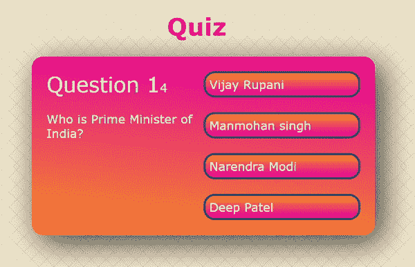
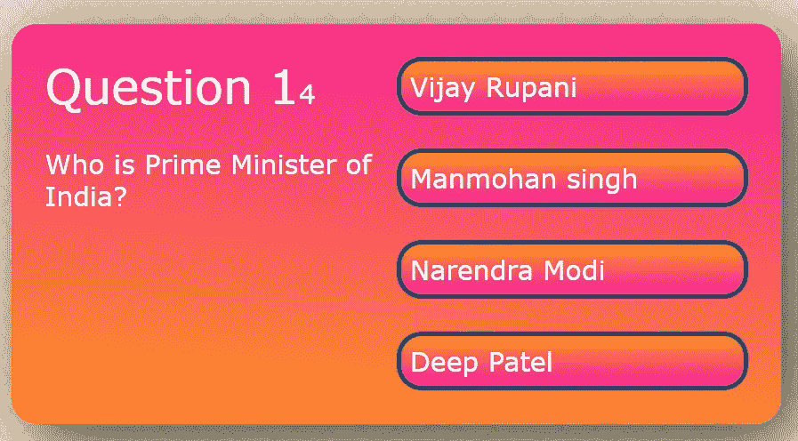

# 简单的反应测验应用程序。

> 原文：<https://medium.com/nerd-for-tech/simple-react-quiz-application-b9ac808e6100?source=collection_archive---------2----------------------->



[**竞猜 App**](https://deep-0301.github.io/Quiz/)

所以，你想在 React 里做一个问答应用？厉害！

在线测验应用程序可以快速、轻松地用手或电子方式评分。它为学生提供了以各种方式展示知识、技能和能力的机会。

在 GitHub 上下载代码: [react-quiz-app](https://github.com/deep-0301/Quiz) 。这里演示:[点这里](https://deep-0301.github.io/Quiz/)。参考:[克里斯·布莱克利](https://medium.com/u/c53e5899da09?source=post_page-----b9ac808e6100--------------------------------)

# **让我们开始**

为了信息的准确性，我在写这篇文章时使用了一个新的 React 应用程序。所以，你和我一起踏上了这段旅程！

使用以下命令创建一个新的 React 项目。

```
npx create-react-app quiz
```

创建 react app 后，在 VS 代码中打开这个文件夹。

# **CSS 文件:**

我们添加 css 样式表为 [index.css](https://github.com/deep-0301/Quiz/blob/master/src/index.css) 并从 App.css 中移除内置 CSS 在此下载 CSS 文件: [index.css](https://raw.githubusercontent.com/deep-0301/Quiz/master/src/index.css) 。

我使用谷歌的字体风格，从:[https://fonts.google.com/](https://fonts.google.com/)搜索布里衬线，并选择这种风格。我们将作为 CSS 样式导入，所以我们使用导入 URL。

```
@import url("https://fonts.googleapis.com/css2?family=Bree+Serif&family=Caveat:wght@500&display=swap");
```

# App.js:

我只为测验应用程序创建了一个 App.js 文件。其中包含一些问题文本，答案文本，是问题变量中的正确项。

App.js

# 代码解释:

**问题数据:**

const questions = []有两个主要属性。

1.  questionText:包含问题。
2.  answerOptions:包含 answerText 和 isCorrect 属性。在 ansewerText 4 选项和 isCorrect is 工作中显示答案是真还是假。

**表头:**

```
<h1 className='header'>Quiz</h1>
```

**分数段:**


我们在 State 中使用 showScore，默认情况下 showScore 值设置为 false。所以 score-section 显示 showScore 何时为真。

**问题-部分:**



在问题部分，我把第一个问题分为两个部分，第一个问题是计数，第二个问题是正文。currentQuestion 是一种状态，其初始值为 0，并因 onClick 事件而改变。对于按钮，当它被点击时，我们使用 handleAnswerButtonClick 函数。

**handleAnswerButtonClick:**

这个函数有一个不正确的参数。如果 isCorrect 为真，则我们递增分值。单击任何选项后，我们将 currentQuestion 加 1，并将其存储在 nextQuestions 中。如果 nextQuestions 小于问题的长度，那么我们将当前问题设置为 nextQuestions。否则，我们将 showScore 设置为 true。

完成 App.js 的代码后，只需运行下面的命令。

```
npm start
```

# 输出:

**参考:**[https://www . freecodecamp . org/news/how-to-build-a-quick-app-using-react/](https://www.freecodecamp.org/news/how-to-build-a-quiz-app-using-react/)

感谢你阅读这篇文章，如果你喜欢这个博客，或者它对你有任何帮助，请鼓掌并与他人分享。

**类似其他 React 项目:**

1.  [用 React 实现自定义搜索栏](/geekculture/implementing-a-custom-search-bar-with-react-c09cba90ae99)

2.[带 React 和 Firebase 的 Todo 应用](/geekculture/ill-be-building-a-todo-app-with-one-of-the-most-popular-web-application-frameworks-react-and-75ffe4b32dc4)

3.[使用 React 和 Material-UI 的多步表单](https://javascript.plainenglish.io/multi-step-form-using-react-and-material-ui-29ff7f7cf049)

*更多内容请看*[*plain English . io*](http://plainenglish.io/)