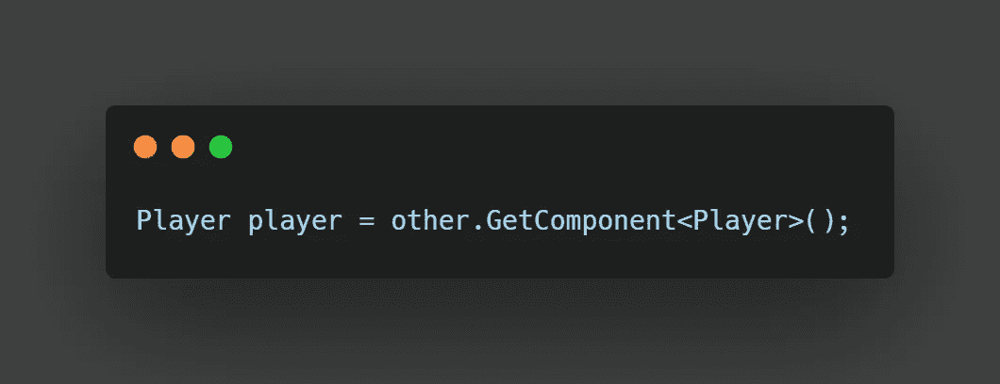
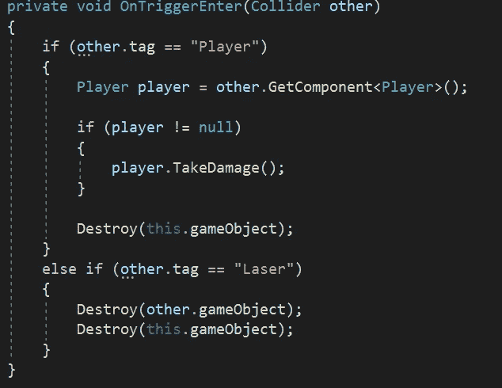

# Unity 中的简单脚本通信

> 原文：<https://medium.com/nerd-for-tech/simple-script-communication-in-unity-199d25dd64c?source=collection_archive---------23----------------------->

**脚本通信**用于访问多个游戏对象之间的函数。

继续昨天关于物理学的文章，创建我们的激光和敌人碰撞的功能，让我们看看当敌人和玩家碰撞时我们想要发生什么。我们可以在我们的**控制输入方法**中添加一个 **else if 语句**，并检查 **other.tag == "Player "。**

如果敌人击中了玩家。我们要从玩家身上扣除一条命。首先，我们需要创建这个**变量**。储存在玩家行为而非敌人内部是有意义的。但是我们的**对敌人的**方法是发生在敌人身上的。现在我们可以交换一下，但这是练习**脚本交流**的好机会。

首先让我们在玩家脚本中创建一个**方法**来扣除一条生命。这就是我们想要使用**公共属性**的地方，这样其他的**游戏对象**就可以访问这个**方法**。在我们的方法中，让我们简单地扣除我们生命的价值。我们也可以检查我们是否没有生命，然后通过函数调用**游戏，现在让我们**摧毁**玩家。**

现在在我们的**敌方脚本中，我们的**内的**检查**中的**玩家标签**，让我们访问**‘其他’碰撞器**，接下来我们要**获得那个对象的一个组件**。我们的脚本名为 **Player** ，因此我们的代码如下所示:

我们需要将它附加到**玩家类**的一个变量上。

现在我们有了一个对存储在**变量播放器中的**播放器脚本**的引用。**

为了防止任何错误发生，让我们遵循良好的实践，检查标记为“播放器”的**碰撞器上是否存在**播放器脚本**。为此，我们使用一个 **if 语句来进行空检查。**如果脚本不等于 **null** 并因此存在，我们可以跟踪并访问我们在**玩家类中创建的**伤害方法**。****

别忘了还有**消灭**敌人！

这就是基本的**脚本通信**实现。通过使用标签，我们可以很容易地访问其他游戏对象，我们也可以访问脚本之外的其他组件。请记住，我们要调用的方法需要是公共的，以便跨脚本访问，并且总是用**空值检查**来防止错误！