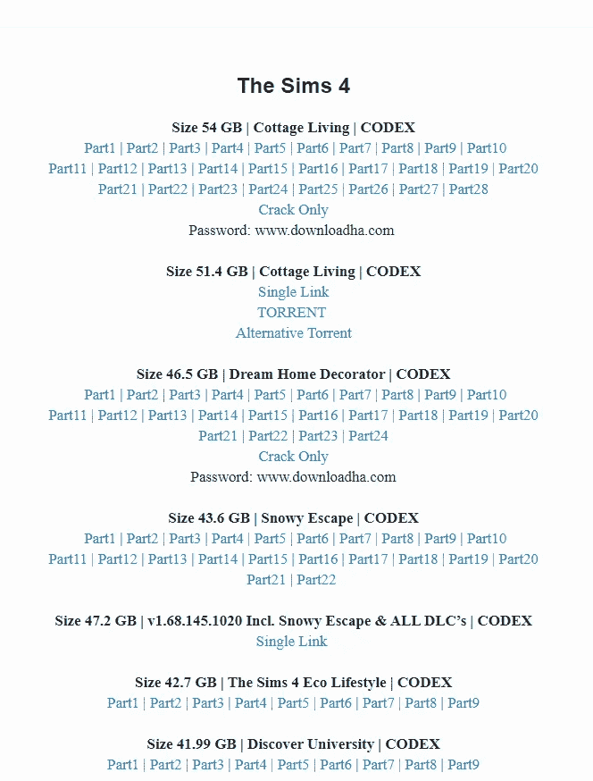
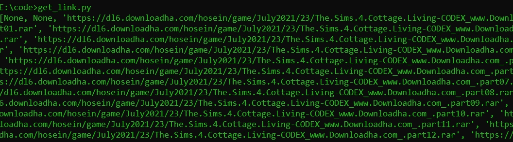
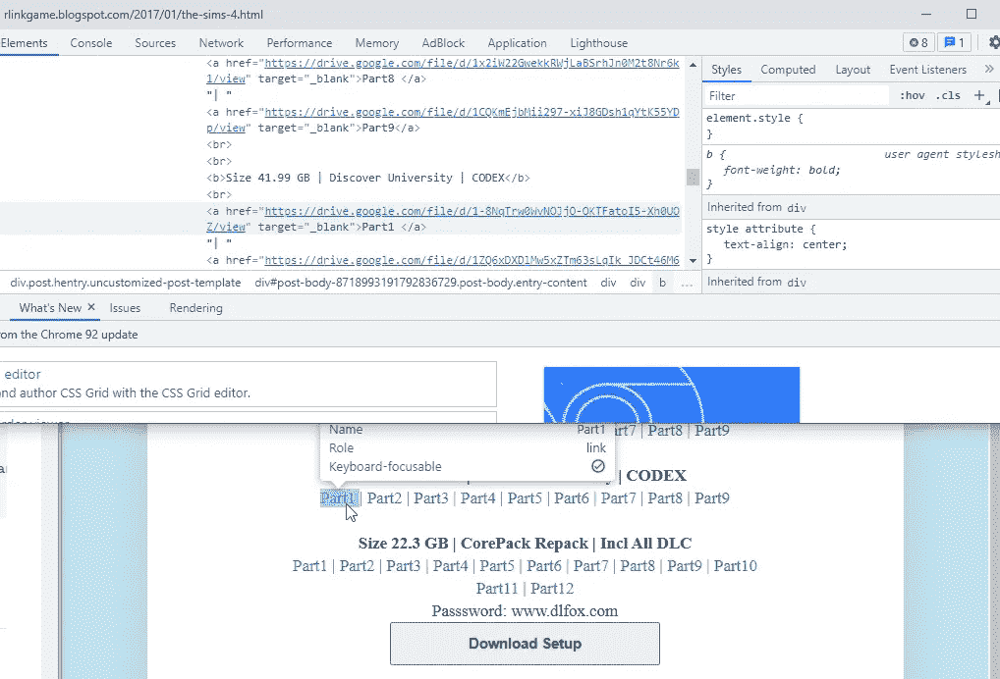
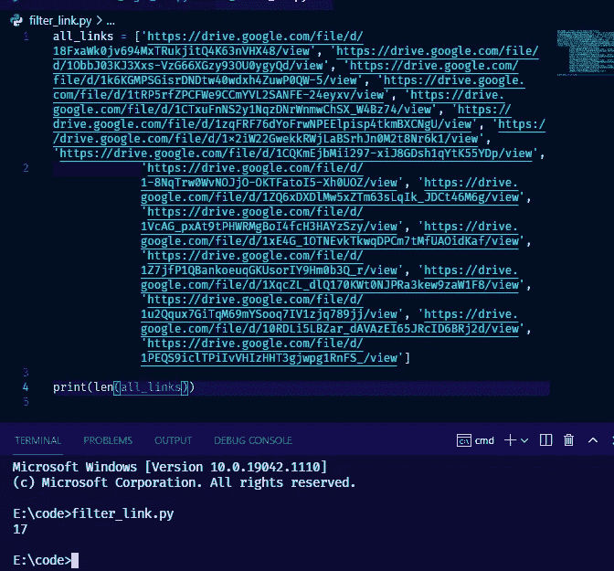
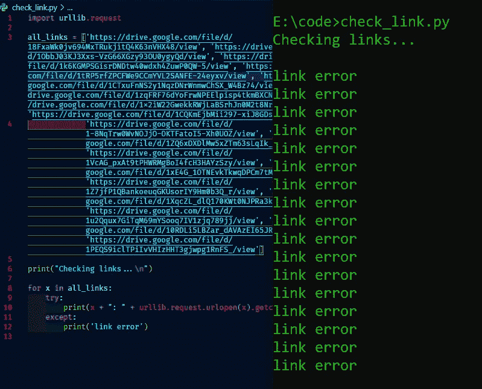
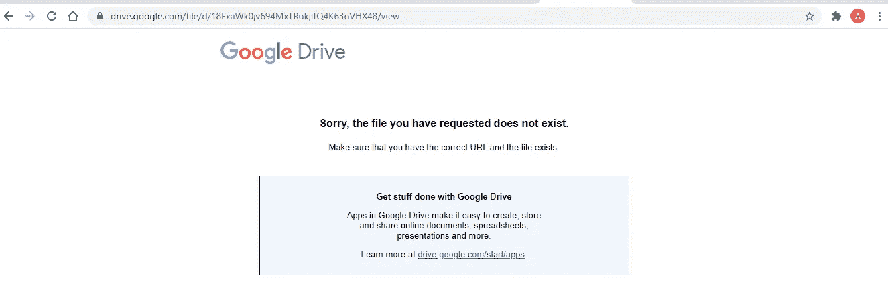

# 使用 Python 检查 URL 是否活动的简单脚本

> 原文：<https://medium.com/nerd-for-tech/simple-script-for-checking-whether-an-url-active-or-not-using-python-88fe4d3bd63c?source=collection_archive---------4----------------------->

照片由[帕特里克·福尔](https://unsplash.com/@patrickian4?utm_source=unsplash&utm_medium=referral&utm_content=creditCopyText)在 [Unsplash](https://unsplash.com/s/photos/typewriter?utm_source=unsplash&utm_medium=referral&utm_content=creditCopyText) 拍摄

URL(统一资源定位器)是一个地址，它指向我们正在寻找东西。通常我们称之为链接。当从网上下载东西时，我们通常使用链接。因为链接可以把我们带到任何我们想要的地方。有时候可以是音乐，电影，游戏，种子，等等。

# 问题

从网上下载东西已经成为人类不可或缺的一部分。今天，我们只需要在浏览器中点击链接，它就会带我们进入我们想要的东西。但是当涉及到大文件时，有时我们不希望下载这么破的东西。如果你曾经下载过游戏，而且游戏的大小很大(超过 10GB)。在一些地方，他们把尺寸分成许多部分。这真的是在帮助网络连接不好的人。

把链接分成许多部分的好处是很棒的主意。但是，它就像硬币的两面。另一方面，它也有许多缺点。真正令人失望的是，并不是所有的网站上传文件后都承担责任。他们不再担心断开的链接。

如果断开的链接是在数据的第一部分开始，这没问题，但是如果断开的链接是在 10 的第 9 部分。这真的很烦人对吗？。作为用户，我们应该聪明对待这个东西。因为这样可以节省我们的时间和网络数据。在这个故事中，我想分享如何检查链接是否活跃。

# 例子

下面的图片包含模拟人生 4 游戏安装的链接，这里有太多的文件。

作为普通人，我们会从第一部分开始一步一步下载，直到最后。但是你有没有遇到过这样的情况，你在部分中间出错了。相信我，我曾经得到它，它真的很烦人。

那么，使用在线解决方案是最好的和快速的方法来测试你是否将访问断开的链接。但是在这个故事中，我不会那样做，因为记住一个原则，开发者不仅仅是用户。开发者用他/她的代码方便他人。所以让我们开始吧。

# 解决办法

## 收集所有链接

首先，我们需要得到所有的活动链接，这里是收集链接的脚本。你可以在这里获得更多关于剧本[的信息。](https://pythonprogramminglanguage.com/get-links-from-webpage/)

运行脚本后，您将从 URL 获得所有链接元素。

嗯，太多了吧？。因此，让我们进入下一步，只减少我们需要的链接。

## 过滤链接

这一步，为了简单一点，我会手动完成，所以在抓取完所有链接后，我只想下载有 9 个部分的`Size 42.7 GB | The Sims 4 Eco Lifestyle | CODEX` 。因为我想使用手动技术，我可以像这样使用 inspect 元素来检查特定元素以获得链接。

有趣的是所有文件都是指谷歌驱动平台。所以让我们像这样从输出中复制所有的 google drive 链接。

从上面的图片中，我得到了 17 个指向 google drive 链接的链接。因为我的目的是检查链接是否活动，所以让我们全部检查。

## 检查链接是否处于活动状态

接下来，我们使用这个语法编写一个简单的脚本来检查链接是否活动。

把所有你想查看的网址放入`all_links`。在我的情况下，我试图把所有的谷歌驱动链接。但是当我运行脚本时，我得到了这样的回答。

嗯，所有的链接似乎是错误的，之后我检查了链接，得到了这样的东西。

幸运的是，我们从可下载部分的第一个 URL 得到了一个错误。所以，我们可以搜索另一个网站来获得正确的链接。

## 打破剧本

从检查脚本我只需要`urllib.request`模块。它用于获取 URL 并检查脚本是否处于活动状态。在最后一行，我还使用了 try except 语法。我之所以用这个东西是因为每当`urlopen`一个`urllib`函数运行出错，程序就会崩溃。因此，为了防止任何崩溃，我使用了语法。

# 结论

好了，我们完成了所有的脚本运行，从我的角度来看，它真的可以节省我的时间和数据，你的呢？实际上，你可以把这些脚本合并成一个，你可以在我的 GitHub 仓库里找到上面所有的脚本。

 [## 主 theDreamer911 上的每日挑战/URL checker/每日挑战

### 在 GitHub 上创建一个帐户，为梦想 911/每日挑战的发展做出贡献。

github.com](https://github.com/theDreamer911/dailyChallenges/tree/master/urlChecker) 

# 注意

*   这个故事仅用于教育目的，没有盗版的意思

感谢阅读
祝✌代码愉快