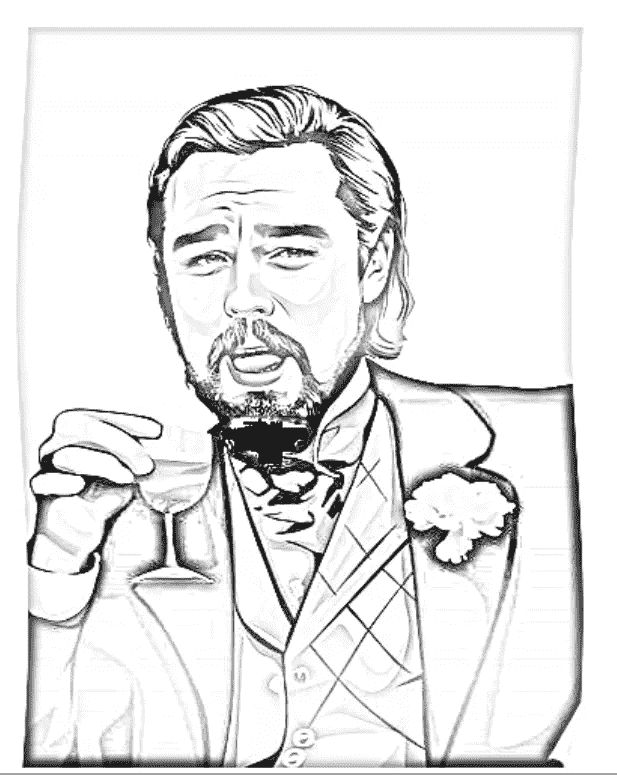
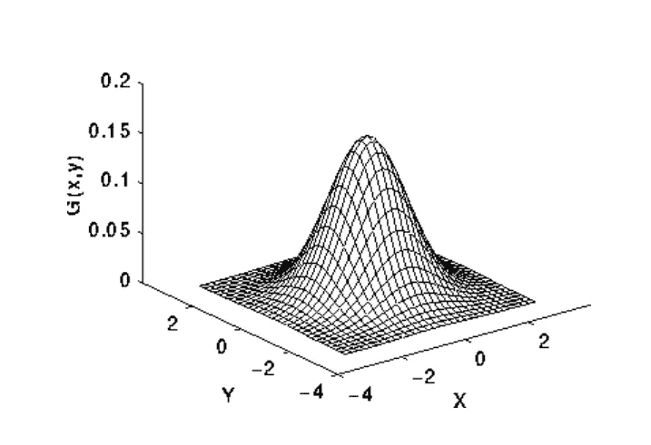
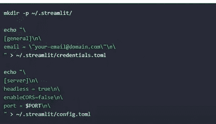
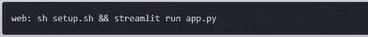

# 简单的 sketch maker 图像处理项目:从无到有

> 原文：<https://medium.com/nerd-for-tech/simple-sketch-maker-image-processing-project-from-scratch-to-deployment-49c672b70439?source=collection_archive---------5----------------------->

> "接受新思想的头脑永远不会恢复到原来的大小."——阿尔伯特·爱因斯坦



我创作的素描

查看我的素描制作人的链接:【https://chinmaytheartist.herokuapp.com/ 

如果你想学习新的东西，就这个话题做一个简单的项目总是有帮助的。在这篇博客中，您将了解 CV2 的功能以及如何免费部署您的应用程序。就此而言，我创造了这个简单而有趣的草图生成器。不仅仅是 sketch，我在这个应用中包含了很多与 streamlit 相关的东西和功能。因此，没有任何进一步的原因，让我们进入实际的执行。

**步骤 1)导入库**

我用 python 写了所有的东西。您将需要以下启动项目的进口。

```
import streamlit as st
import cv2
from PIL import Image
import os
import glob
import numpy as np
import shutil
from PIL import Image
import base64
```

如果您得到这样的错误，

```
cant import (library name)
```

然后，您必须单独安装该库。

```
pip install streamlit
pip install opencv-python
. 
.
.
```

同样，你可以安装所有的模块。我只提供了 pip 安装命令，但是如果您正在创建特定的环境，您可以进行 **conda** 安装。我们可以使用前端使用 HTML 模板的烧瓶。但就此而言，你应该学一点 Flask 和 HTML。我将保持这个教程简单。现在我将跳过 Flask & HTML。我将为 UI(用户界面)使用 streamlit。 **Streamlit** 是一个面向机器学习和数据科学团队的开源应用框架。

使用 Streamlit 的优势在于，您还可以在其中添加所有 HTML 功能。我会告诉你怎么做。

**步骤 2)添加背景图像**

所有安装完成后，让我们开始实际的图像处理代码。

首先，我将为我们的应用程序设置一个漂亮的背景图像。我们必须允许我们的代码使用少量的 HTML 模板，以及将图像转换成适当的可执行格式。我在这里使用 base64。

```
def get_base64(file_path):
with open(file_path, 'rb') as f:
data = f.read()
return base64.b64encode(data).decode()
def set_background(file_path):
bin_str = get_base64(file_path)
page_bg_img = '''
<style>
.stApp {
background-image: url("data:image/png;base64,%s");
background-size: cover;
background-repeat: no-repeat;
background-attachment: scroll; # doesn't work
}
</style>
''' % bin_str
st.markdown(page_bg_img, unsafe_allow_html=True)
return
set_background('Your image')
```

根据上面的代码，我们现在为背景渲染一个图像。

现在下一步是从用户输入图像制作草图。我们必须考虑所有的可能性。PNG，。JPG，JPEG 格式，同时接受输入。

**步骤 3)草图的实际代码**

当我们把图像转换成数组时，大多数图像处理都变得简单了。现在，我们将接受图像输入，并从下面的代码转换成数组。

```
image_file = st.file_uploader("Upload Your Image", type=['jpg', 'png', 'jpeg'])
if  image_file is not None:
original_image = Image.open(image_file)
st.image(original_image, caption='Uploaded image', use_column_width=True)
image11 = np.asarray(original_image)
grey_img = cv2.cvtColor(image11, cv2.COLOR_BGR2GRAY)
invert = cv2.bitwise_not(grey_img)
blur = cv2.GaussianBlur(invert, (21, 21), 0)
invertedblur = cv2.bitwise_not(blur)
```

如果从图像处理的角度来思考，素描不过是把图像灰度化，把图像模糊化，使其边缘突出，清晰。因此，在处理过程中，我们使用高斯模糊。

**高斯模糊:**



图片作者: [ed.ac.uk](https://homepages.inf.ed.ac.uk/rbf/HIPR2/gsmooth.htm)

想象这种分布叠加在图像的一组像素上。从该图中可以明显看出，如果我们对该点的像素值和曲线高度进行加权平均，则该组中心的像素对结果值的贡献最大。本质上，这就是高斯模糊的工作原理。

**高斯模糊**是一种通过使用高斯函数来模糊图像的简单方法。

在此操作之后，您的图像将被转换为草图。现在我们只想显示和装饰我们的 UI。Streamlit 提供了许多功能来使 UI 具有交互性和美观性。

```
sketch = cv2.divide(grey_img, invertedblur, scale=256.0)
st.balloons()
st.image(sketch,caption = "Sketch", use_column_width=True)
st.subheader("Your Sketch is Ready ! Your Sketch is Ready !  !")
st.write("I used simple Open-CV image processing techniques like blur, Sobel, gray-scaling")
option = st.selectbox('Do you like sketch?',
("None",'YES', 'NO'))
st.write('You selected:', option)
if option == "None":
pass
if option == "YES":
st.write( " A Big Thank you !!!!")
if option == "NO":
st.write("I will improve my skills , Thank you !!")
st.markdown("<h2 style='text-align: center; color: green;'>\b !! Lets stay connected !! \b</h2>", unsafe_allow_html=True)
```

上面的代码将是我们代码结构的最后一块基石。我已经包含了所有用于本地部署的 streamlit 命令。在命令提示符/终端[windows]上运行以下命令以查看本地部署。

**步骤 4)在 streamlit 上本地部署网络应用**

```
streamlit run {your_python_file_name}.py 
```

请注意，您的所有文件和图像应该在同一个文件夹中，您应该在同一个文件夹中打开您的命令提示符/终端来执行。这是您在本地部署应用程序的方式。

但是**如果你想要一个可以部署在任何远程服务器上的共享项目链接呢？**

我们也可以这样做。有许多免费的好的托管网站，允许我们在那里的服务器上托管我们的项目。我在这里用过 **Heroku** 。选择 Heroku 的理由很少。

1.  它允许我们免费托管高达 **500 Mb**
2.  使用相对**容易。**
3.  我们可以在 Heroku 上创建 5 个项目。
4.  我们可以使用 **Git Desktop、**或者直接上传代码

关于在 Heroku 上部署 web-app，请参考这个信息丰富的编码视频，它很有趣。这里是[的**链接。**](https://youtu.be/nJHrSvYxzjE) 我建议你浏览一下这个视频，以获得详细而简单的 **Heroku 部署。**

**步骤 5)在主机服务器上部署**

我将概述 Heroku 的部署。创建一个文件夹，把你的背景图片和 python 代码放在里面。然后通过运行以下命令为该代码创建一个简单的 requirement.txt 文件，

```
pipreqs <directory path>
```

您的 requirement.txt 文件将如下所示。

```
numpy==1.22.3
opencv_python_headless==4.5.4.60
Pillow==9.1.1
streamlit==1.8.1
protobuf<=3.19.1
```

现在创建 setup.sh 和 procfile。两者都是文本文件，但我们将安装文件的扩展名转换为。sh 并删除了 procfile 的。txt 扩展名

打开 setup.txt 文件，并在其中复制以下代码。



[来源](https://www.youtube.com/watch?v=nJHrSvYxzjE&t=327s)

现在打开 procfile 并复制以下代码。



[来源](https://www.youtube.com/watch?v=nJHrSvYxzjE&t=327s)

现在更改 setup.sh 和 procfile 的扩展名。两者都是 txt 文件，但我们将安装文件扩展名转换为。sh 并删除了 procfile 的。txt 扩展名。我们可以通过右键单击重命名来做到这一点。

现在在 Heroku 和 git 上创建帐户。在存储所有文件的文件夹中创建一个空的 git repo。如果你的应用在其根目录中包含一个`requirements.txt`、`setup.py`或`Procfile`文件，Heroku 会自动将你的应用识别为 Python 应用。

当部署的应用程序被识别为 Python 应用程序时，您将在构建输出中看到这一点，

```
git push heroku master
-----> Python app detected
```

我将再次强调以下步骤:

1.  下载并安装 [Heroku CLI](https://devcenter.heroku.com/articles/heroku-command-line) 。

```
heroku login
```

2.在新的或现有的目录中初始化 git 存储库

```
$ cd my-project/
$ git init
$ heroku git:remote -a projectname
```

3.部署应用程序

将您的代码提交到存储库，并使用 Git 将其部署到 Heroku。

```
$ git add .
$ git commit -am "make it better"
$ git push heroku master
```

对于现有的存储库，只需添加`Heroku`遥控器

```
$ heroku git:remote -a projectname
```

这将生成最后一个链接:

 [## 细流

chinmaytheartist.herokuapp.com](https://chinmaytheartist.herokuapp.com/) 

这是您部署的 web 应用程序。现在你可以在任何地方与任何人分享这个链接，因为它现在是服务器托管的。像这样，您可以创建任何应用程序，并在简单的步骤中部署它。向客户或上级展示你的 MVP(最低可行产品)或 POC(概念证明)是非常有用的。


最终应用

|| **看我以前的故事** ||

[**物体检测精简版:模板匹配**](/@BH_Chinmay/object-detection-lite-template-matching-c9af77517f6c)

[**图像处理中的校准**](/@BH_Chinmay/calibration-in-image-processing-c4c164870f21)

[**边缘检测算法的种类**](/@BH_Chinmay/types-of-edge-detection-algorithms-365122d799bf)

更多此类内容请关注我[**LinkedIn**](https://www.linkedin.com/in/chinmay-bhalerao-6b5284137/)&[**Medium**](/@BH_Chinmay)。

# 谢谢你！！