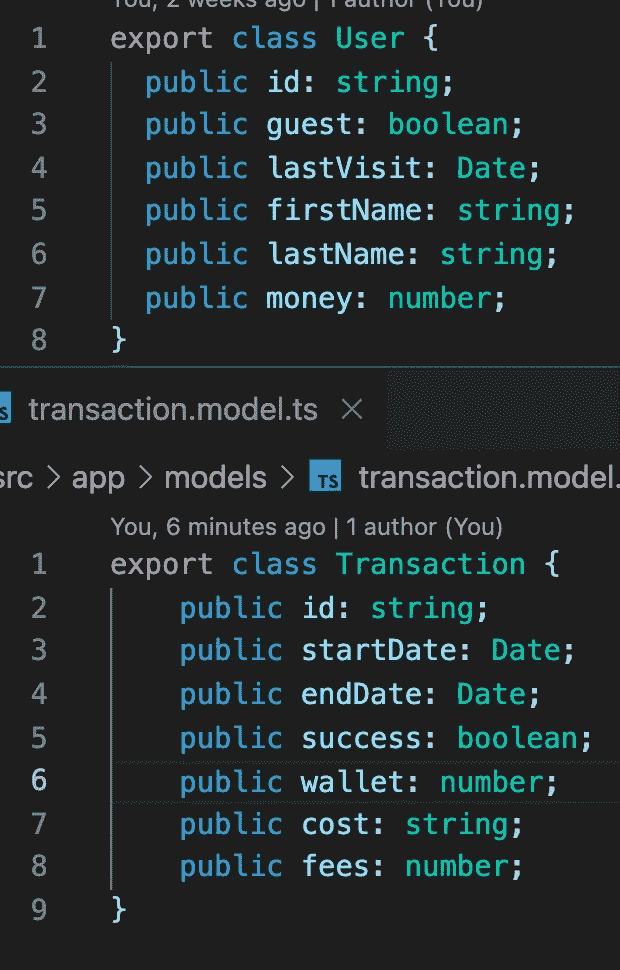
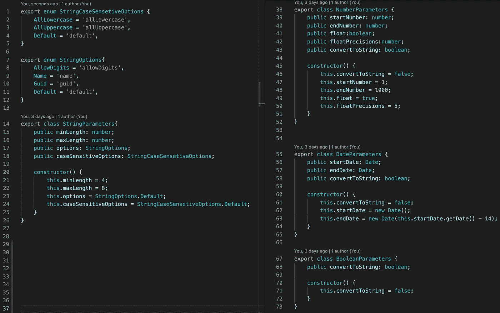
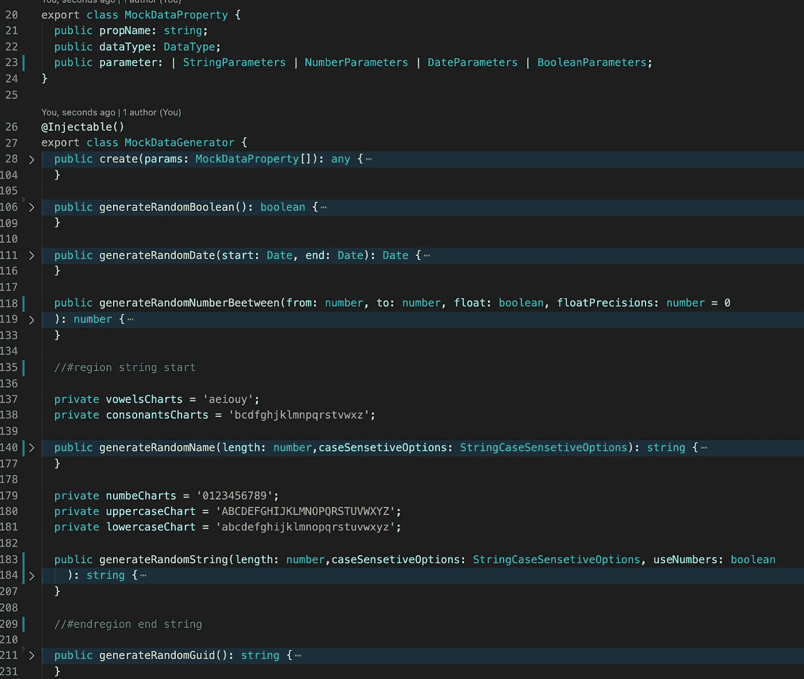
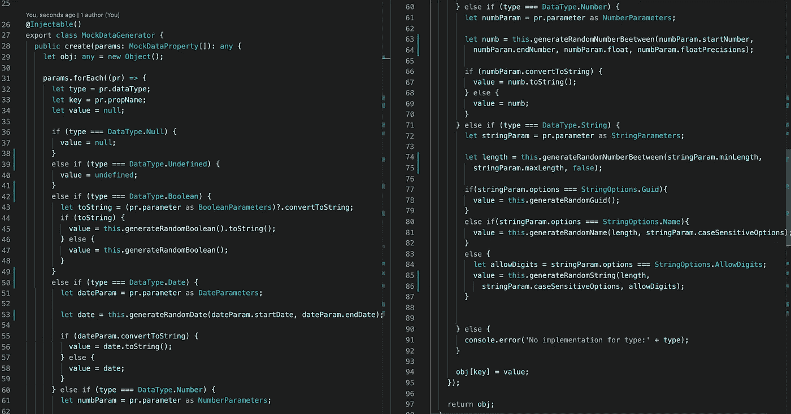
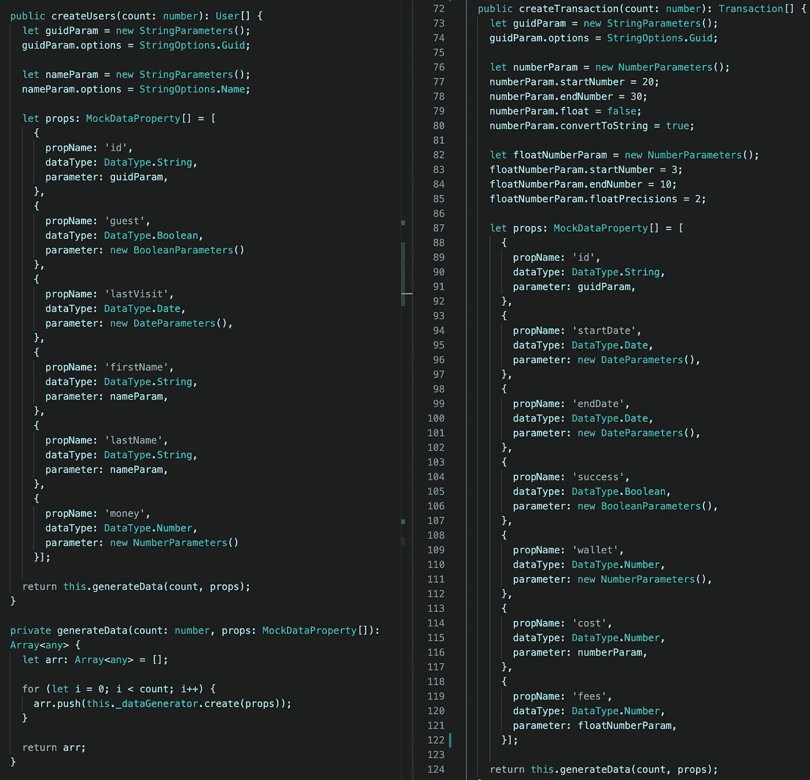
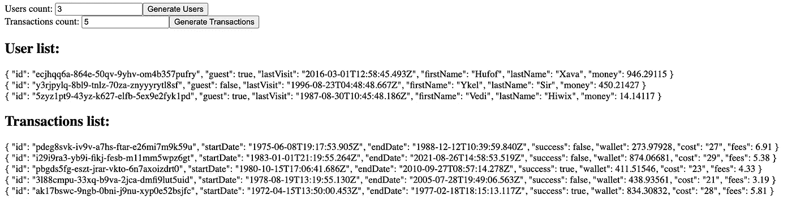

# 简单的角度测试数据发生器

> 原文：<https://medium.com/nerd-for-tech/simple-test-data-generator-in-angular-3e0704b6ce02?source=collection_archive---------3----------------------->

每个应用程序都必须经过测试。为此，我们需要数据。之后就可以发现一些 bug，做出一个好的应用。

在本文中，我们将创建一个生成测试数据的服务。第一步是定义我们要生成的模型。

正如您所看到的，这些模型包含了一系列简单的类型，如布尔型、日期型、字符串型或数字型。让我们把重点放在用不同的参数生成那些类型上。例如，字符串参数包含长度，数字参数包含起始数字，结束数字可以浮动，等等。每个参数都有一个带默认参数的构造函数。如果我们需要不同的行为，我们很容易改变这些参数的值。

我们的主生成器包含用随机数据生成简单数据类型的不同算法。

我们的生成器中的主要方法是“create”方法。它解析参数并使用不同的方法生成数据。当然，数据的生成依赖于参数中的信息。因为 JS 是一种动态语言，我们可以很容易地创建不同属性的对象。

现在我们有了一个生成简单类型的服务。下一步是创建另一个服务，该服务将使用我们生成的简单数据来创建一个复杂类型，如用户模型或事务模型。在该服务中，我们定义了用于在模型中生成所有属性的所有参数。

因此，我们有几个服务来生成我们想要的随机数据。

如果你需要仔细看看这个项目[，这里是链接](https://github.com/8Tesla8/js-test-data-generator/)。

*原载于 2022 年 2 月 26 日*[*【http://tomorrowmeannever.wordpress.com】*](https://tomorrowmeannever.wordpress.com/2022/02/26/test-data-generator-in-angular/)*。*