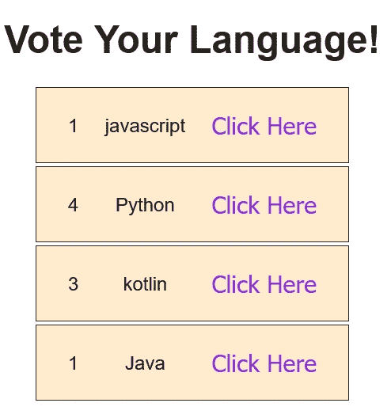

# React 中的简单投票系统

> 原文：<https://medium.com/nerd-for-tech/simple-voting-system-4ce944d3937e?source=collection_archive---------4----------------------->

让我们建立一个简单的投票系统，一起学习。这是一个简单的投票计算器示例，每次点击都会增加计数。

要为此示例创建示例项目，请打开命令提示符，导航到一个方便的位置，然后运行命令，如下所示:

```
npx create-react-app votingsystem
```

如何在 vs 代码使用中打开命令提示符

```
ctrl+alt+`
```

我引入了**有状态组件**，它们是使用一个类定义的，使得跟踪组件提供的应用程序状态变得更加容易。这个组件示例展示了如何在 JSX 添加 **onClick** 事件。

**有状态组件**

有状态组件依赖于它的状态对象，并且可以改变它自己的状态。该组件基于其状态的改变而重新呈现，并且可以将其状态的属性作为 props 对象上的属性向下传递给子组件。

现在，只需用下面给出的内容替换 App.js 和 App.css 的占位符内容:

src\App.js

```
import React,{Component} from 'react';
import './App.css';

class App extends Component{
	constructor(props){
		super(props);
		this.state = {
			languages : [
				{name: "Jvascript", votes: 0},
				{name: "Python", votes: 0},
				{name: "kotlin", votes: 0},
				{name: "Java", votes: 0}
			]
		}
	}

	vote (i) {
		let newLanguages = [...this.state.languages];
		newLanguages[i].votes++;
		function swap(array, i, j) {
			var temp = array[i];
			array[i] = array[j];
			array[j] = temp;
		}
		this.setState({languages: newLanguages});

	}

	render(){
		return(
			<>
<h1>Vote Your Language!</h1>
<div className="languages">
					{
						this.state.languages.map((lang, i) => 
		<div key={i} className="language">
		<div className="voteCount">
									{lang.votes}
								</div>
<div className="languageName">
								{lang.name}
								</div>
								<button onClick={this.vote.bind(this, i)}>Click Here</button>
	</div>
	)}
	</div>
        </>
	);
	}
}
export default App;
```

在 React 中，我们需要为扩展 React 类的类创建一个**构造函数**。我们将一个名为“props”的参数传递到 **super(props)** 中，这个参数在组件构造函数类中也是可用的。super()函数将使**这个**在构造函数方法中可用。

```
*{
  margin: 0;
  padding: 0;
}

body {
  text-align: center;
  color: #222;
  font-size: 24px; 
  font-family: sans-serif;
}

h1 {
  margin: 30px;
}

.languages {
  height: 400px;
  width: 400px;
  margin: 10px auto;
  display: flex;
  flex-direction: column;
}

.language {
  flex: 1;
  display: flex;
  justify-content: space-between;
  align-items: center;
  padding: 10px 40px;
  background-color: blanchedalmond;
  border: 1px solid #222;
  margin: 2px;
}

.voteCount {
  border-radius: 50%;
  display: flex;
  justify-content: center;
  align-items: center;
}

.language button {
  color: blueviolet;
  background-color: #0000;
  border: none;
  font-size: 30px;
  outline: none;
  cursor: pointer;
}
```

**结果**



源代码[https://github.com/gatwirival/simple-voting-system](https://github.com/gatwirival/simple-voting-system)