# 通过互联网自动收集图像的简单方法(Instagram、Google 等)

> 原文：<https://medium.com/nerd-for-tech/simple-way-to-collect-image-across-internet-automatically-instagram-google-etc-56a75d63221b?source=collection_archive---------0----------------------->


由 [Unsplash](https://unsplash.com/?utm_source=unsplash&utm_medium=referral&utm_content=creditCopyText) 上的 [Oksana Zub](https://unsplash.com/@oxanamiles?utm_source=unsplash&utm_medium=referral&utm_content=creditCopyText) 拍摄

```
Disclaimer: In some country, there maybe rules that forbid data scraping. This article is for educational/research purposes only. Any violence because of this article is beyond my responsibility.
```

收集数据在数据科学中至关重要；没有数据就无法创建模型。可以通过多种方式收集数据，例如手动下载、网络抓取、购买数据集、重用旧数据集或自动下载图像。我们将看看最后的选项，并自动从网站下载图像。

在这篇文章中，我想分享在互联网上自动收集图像的简单步骤。例如，让我们使用 Instagram 创建一个数据集。在我写一篇关于从谷歌下载大量图片的文章之前，你可以看看这里的。

在那篇文章中，我是用 Python 写的，但是在这篇文章中，我想让它简单一些。让我们使用扩展。随着数据的快速增长，在许多方面，如果我们拒绝只用大脑，我们将会不知所措。在这个不断发展的世界里，我们并不孤独。许多人已经有了可以帮助我们工作的很酷的东西。

> "如果有更简单的方法，为什么我们喜欢用困难的方法来假装酷？"~我

扩展的名字是 Fatkun 批量下载器。如果你已经知道了，恭喜你，如果没有，也没关系。让我们一起来探索一下。

# 什么是法特昆？

Fatkun 是一个有用的图像批量下载器。这些扩展使得只需一次点击就可以下载大量图片。支持在大多数包含图片的网站上下载。如 Airbnb、Pinterest、Instagram、Twitter、脸书、谷歌、阿里巴巴、Konami 等

# 装置

这个扩展是通过我的 chrome 浏览器测试的。以下是为数据科学家安装这些有用工具的步骤。

1.将这个扩展下载到你的 chrome 浏览器中。首先，点击页面右上方的三个点>更多工具>扩展

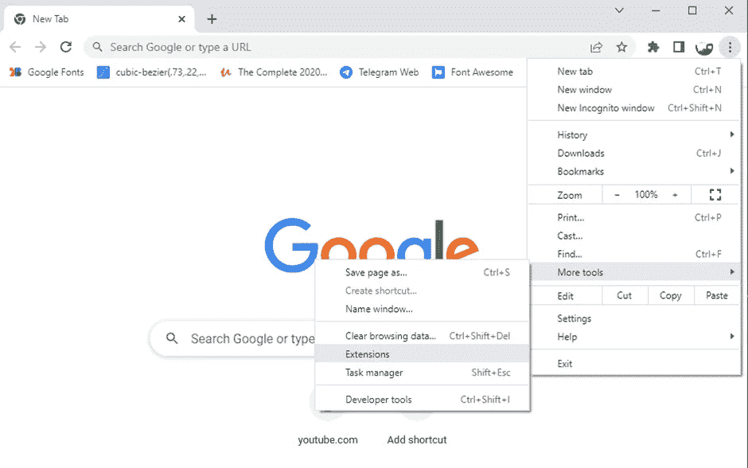

2.在页面的左上角，点击三个长方形，这个窗口将被打开；点击打开 Chrome 网络商店

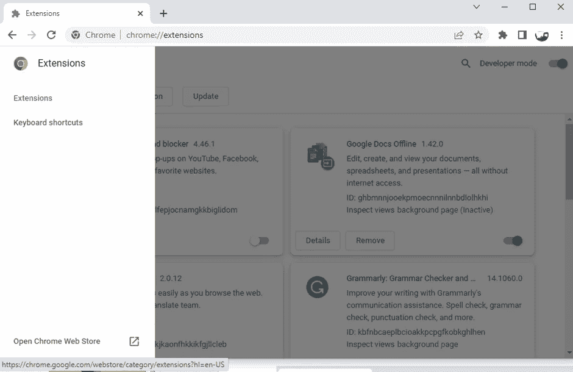

3.使用搜索栏，找到 fatkun 并单击第一个输出，“Fatkun 批量下载图像”您还可以探索其他扩展。

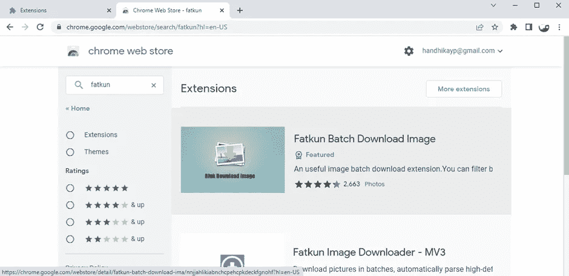

4.点击添加到 Chrome，等待几分钟，直到它下载完毕

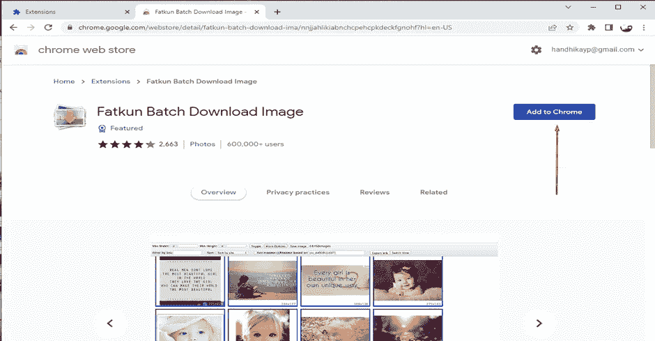

5.下载后，会有一个弹出窗口。选择添加扩展名

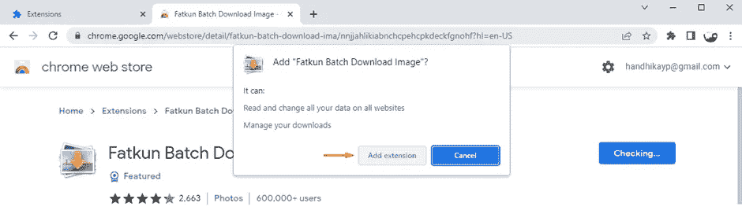

6.这些扩展将被添加到您的浏览器中

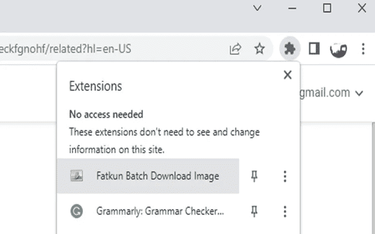

7.打开 Instagram，打开你想收集他们数据的人。对我来说，我想创建一个我最喜欢的女演员金达美的数据集。

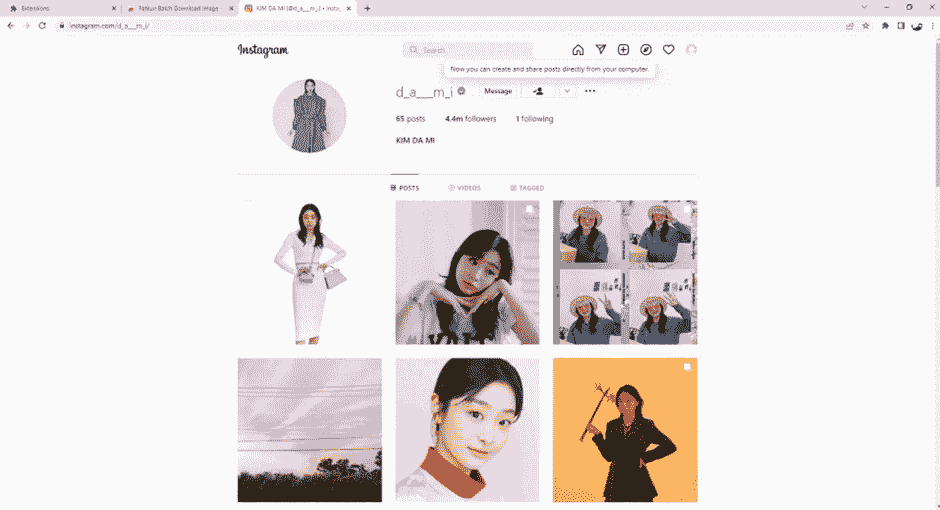

8.单击扩展，然后单击下载[当前选项卡],因为我想从该选项卡下载图像。

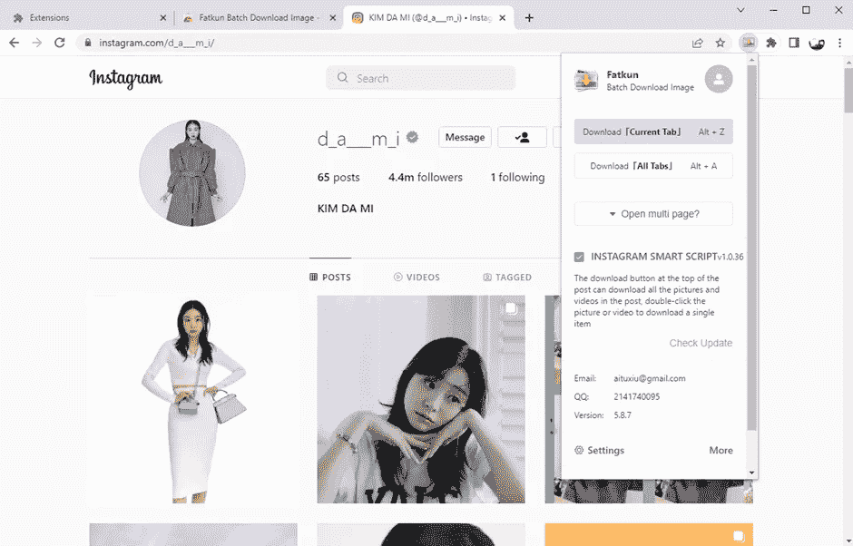

9.有时，如果这个人有太多帖子，你需要向下滚动，直到下面的图标消失，图片出现。因为 Fatkun 只会下载一个页面上已有的图片。

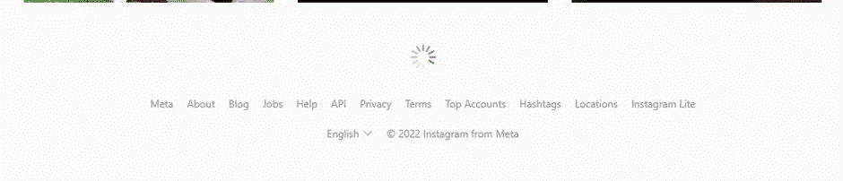

10.在 Fatkun 窗口中，您可以看到 fatkun 会选择您可以从帐户下载的图像。你可以过滤图像的宽度和高度，等等。

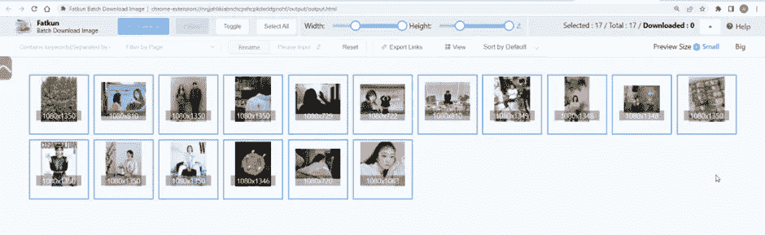

11.Fatkun 能做的最好的事情是，你也可以选择图片，这样你就可以处理无用的数据。嗯，如果你选择完图片，点击下载按钮。

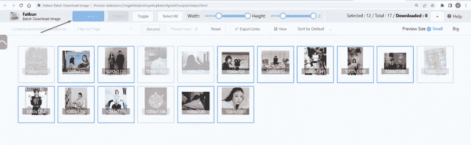

12.在弹出窗口中，单击下载图像。

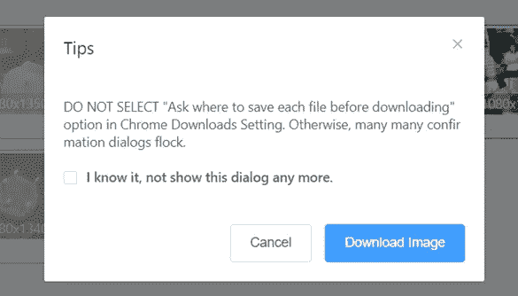

13.图像将自动下载


14.关于 fatkun 的另一个最好的事情是它可以自动创建一个名为 get 的文件夹

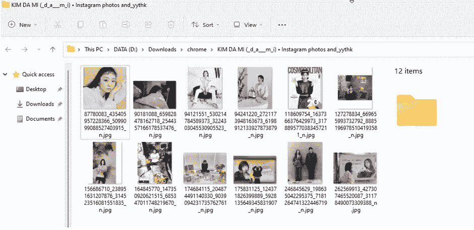

15.如果数据不够，你还可以在谷歌或其他类似的搜索引擎上浏览。

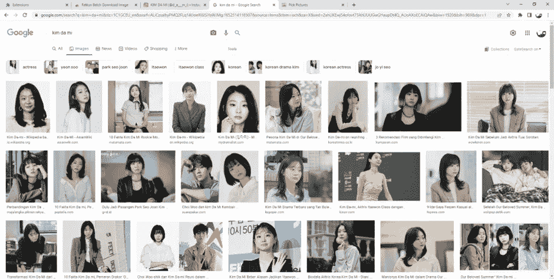

16.Tadaaaa！！！用同样的方法，你会从谷歌上得到至少 100 张图片


# 优势

正如我们对法特昆所做的那样，我们可以得到几样东西

1.Fatkun 让我们自动下载图像，从任何来源创建数据集

2.Fatkun 有一个特性，让我们可以选择对创建模型有用的图像，留下无用的图像

3.数据集将很容易保存在计算机上

你知道另一个优势吗？在评论区添加；我很乐意对此作出回应。

# 结论

在这篇文章中，我将讨论如何从互联网上自动下载大量的图片。本文的重点是逐步介绍 Fatkun 的安装以及如何使用它。如果你有任何问题，请在评论区提问。乐意帮忙，谢谢！！！感谢阅读，直到这条路结束。

```
Disclaimer: In some country, there maybe rules that forbid data scraping. This article is for educational/research purposes only. Any violence because of this article is beyond my responsibility.
```