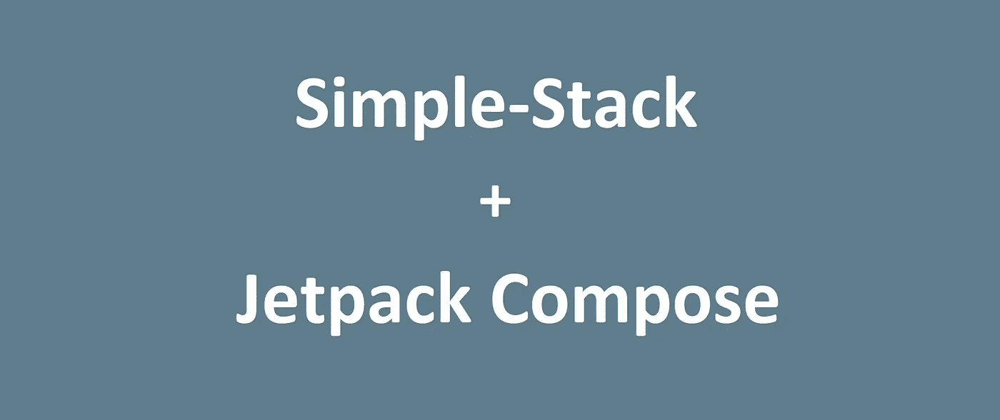

# 使用简单堆栈简化 Jetpack 组件之间的导航

> 原文：<https://medium.com/nerd-for-tech/simplified-navigation-between-composables-of-jetpack-compose-using-simple-stack-9a796a909128?source=collection_archive---------8----------------------->



你曾经想要在两个组件之间导航吗？你希望它像你去那里一样容易吗？

好消息，因为现在似乎可以用 [***简单的——Stack ' s Compose integration***](https://github.com/Zhuinden/simple-stack-compose-integration/)——我现在认为是 ***BETA*** ，但尽管如此，这是可能的。

# 它看起来像什么

## 初始设置和依赖关系:

首先，您将添加依赖项:

```
implementation 'com.github.Zhuinden:simple-stack:2.6.0'
implementation 'com.github.Zhuinden:simple-stack-extensions:2.2.0'
**implementation 'com.github.Zhuinden:simple-stack-compose-integration:0.2.0'**
```

当然，您可以添加 Jitpack(不是 JCenter):

```
// build.gradle
allprojects {
    repositories {
        // ...
        maven { url "https://jitpack.io" }
    }
    // ...
}
```

最重要的是，你可以编写:

```
compileOptions {
    sourceCompatibility JavaVersion.VERSION_1_8
    targetCompatibility JavaVersion.VERSION_1_8
}
kotlinOptions {
    jvmTarget = '1.8'
    **useIR = true**
}
buildFeatures {
    **compose true**
}
```

## 设置

为了在活动中使用简单堆栈，我们一如既往地使用导航器。

合成集成仅仅是`StateChanger`的一个不同实现，以及一个助手，允许将`Backstack`作为`CompositionLocal`暴露给可合成树中的子节点。

```
class MainActivity : AppCompatActivity() {
  **private val composeStateChanger = AnimatingComposeStateChanger()** 

  override fun onCreate(savedInstanceState: Bundle?) {
    super.onCreate(savedInstanceState)

   ** val backstack** = Navigator.configure()
      .setScopedServices(DefaultServiceProvider())
      **.setStateChanger(AsyncStateChanger(composeStateChanger))** 
      .install(this, androidContentFrame, History.of(FirstKey()))

    setContent {
      **BackstackProvider(backstack)** {
        MaterialTheme {
          Box(Modifier.fillMaxSize()) {
            **composeStateChanger.RenderScreen()**
          }
        }
      }
    }
  }

  override fun onBackPressed() {
    if (!Navigator.onBackPressed(this)) {
      super.onBackPressed()
    }
  }
}
```

这个`StateChanger`的实现能够在从`DefaultComposeKey`延伸的按键之间切换。

在示例中，我通常使用以下关键超类:

```
abstract class ComposeKey : DefaultComposeKey(), Parcelable, DefaultServiceProvider.HasServices {
 **override val saveableStateProviderKey: Any = this**

    override fun getScopeTag(): String = javaClass.name

    override fun bindServices(serviceBinder: ServiceBinder) {
    }
}
```

请注意，使用键本身作为`saveableStateProviderKey`要求键是可打包的、不可变的，并且必须实现 equals/hashCode。

一旦这个“无聊”的设置部分完成(你只需要做一次)，屏幕的定义就像这样:

```
**@Immutable
@Parcelize
data** **class** FirstKey(val title: String) **: ComposeKey()** {
    @Composable
    override fun ScreenComposable(modifier: Modifier) **{** FirstScreen(title, modifier)
    **}** }
```

其中`FirstScreen`是一个常规的日常组合:

```
@Composable
fun FirstScreen(title: String, modifier: Modifier = Modifier) {
    // ...
}
```

## 从可组合导航到另一个可组合

为了在组件之间导航，我们只需要访问 backstack，并导航到另一个屏幕。简单。

```
@Composable
fun FirstScreen(title: String, modifier: Modifier = Modifier) {
 **val backstack = LocalBackstack.current** Column(
    modifier = modifier.fillMaxSize(),
    verticalArrangement = Arrangement.Center,
    horizontalAlignment = Alignment.CenterHorizontally
  ) {
    Button(
      onClick = {
        **backstack.goTo(SecondKey())**
      }, 
      content = {
        Text(title)
      }
    )
  }
}
```

*(理论上有可能定义一个顶级的* `*val backstack: Backstack get() = LocalBackstack.current*` *，但是它会对名称空间造成相当大的干扰，所以没有发生。)*

## 跨配置更改存储数据

为了跨配置更改存储数据，Simple-Stack 提供的方法是 ScopedServices(与这里概述的方法[](/swlh/simplified-android-development-using-simple-stack-6e44ce808c35)*)没有特别的不同)。*

*举个例子，*

```
*@Immutable
@Parcelize
data class FirstKey(val title: String) : ComposeKey() {
  @Composable
  override fun ScreenComposable(modifier: Modifier) {
    FirstScreen(title, modifier)
  } *// from DefaultServiceProvider.HasServices*
 **override fun bindServices(serviceBinder: ServiceBinder) {
    with(serviceBinder) {
      add(*FirstModel*())
    }
  }**
}*
```

*其中`FirstModel`只是一个普通类:*

```
*class FirstModel {
 *// ...*
}*
```

*并且为了简化对`remember { backstack.lookup<FirstModel>() }`的调用，提供了名为`rememberService<T>`的函数。*

```
*@Composable
fun FirstScreen(title: String, modifier: Modifier = Modifier) {
  val backstack = LocalBackstack.current **val firstModel = rememberService<FirstModel>()** // ...*
```

*对于所有的作用域服务，实现`ScopedServices.Registered`、`ScopedServices.Activated`、`ScopedServices.HandlesBack`和`Bundleable`的能力是拦截重要的导航相关生命周期回调(和状态持久性支持)的可能方式。*

# *它是如何工作的？*

*可以在 [***这里***](https://github.com/Zhuinden/simple-stack-compose-integration/blob/d2a6753c80e557a43a14479339f0f00ec04d74db/core/src/main/java/com/zhuinden/simplestackcomposeintegration/core/ComposeIntegrationCore.kt#L151-L268) 找到动画状态改变器的代码(它可以根据方向进行基本的连续动画或交叉淡入淡出动画)，但这很棘手，它需要自己的文章，专门用来编写 Jetpack😅所以期待以后的某个时候。*

**

# *结论*

*总的来说，我们已经设法降低了定义可组合组件及其导航的复杂性，定义了一个简单的“key”类，该类也与其自身的可组合组件相关联。*

```
*@Immutable
@Parcelize
data class FirstKey(val title: String) : ComposeKey() {
    @Composable
    override fun ScreenComposable(modifier: Modifier) {
        ***// ...***
    }
}*
```

*为此，我们获得了在屏幕之间自由导航、跨配置更改存储数据、跨进程死亡保持状态的能力，最重要的是:将`Parcelable`类作为参数传递，因为所有路径都是简单的不可变(parcelable)数据类。*

*然而，它是 **0.2.0** 是有原因的:它是全新的，虽然通过修改器有简单的过渡支持，但与更复杂的动画相比，它可能有点低级，所以事情可能仍然会发生变化。*

*此外，它目前只支持 Android，还没有桌面支持。*

*尽管如此，我认为这是一个好的开始。源代码可以在 [*这里*](https://github.com/Zhuinden/simple-stack-compose-integration) 找到。*