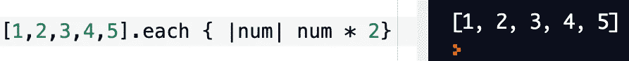
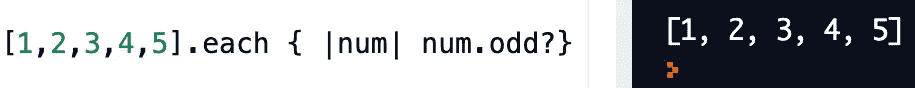
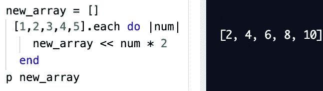
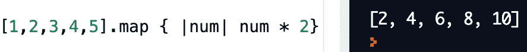
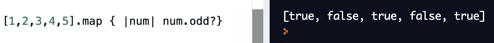
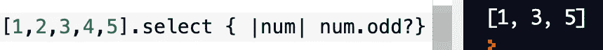

# 简化 Ruby 的。选择，。每一个还有。地图方法—

> 原文：<https://medium.com/nerd-for-tech/simplifying-rubys-select-each-and-map-methods-a6019cc87605?source=collection_archive---------1----------------------->

如果你和我一样(编程新手)，在软件开发道路上起步可能会令人生畏。不仅有许多新术语需要消化，还有许多不同的方法可供选择。当我第一次接触这些方法时，我努力去掌握它们的基本原理。我相信你已经问过自己:我什么时候使用一种方法而不是另一种方法？我如何使用这些可枚举的？如果这是你，那么你来对地方了。在这篇文章中，我将解开背后的谜团。每个，。地图和。为您选择！

这些方法的重要性很小，但它取决于返回值。本质上，问问你自己:“我期待回报的是什么？”

# ***//。每一个*T3**

这个方法将*隐式返回原始数组。*使用。each 将为数组的“each”元素执行块中的给定条件，但它不改变返回值，从而返回初始数组。

*举例:*

。每个都返回相同的数组

。每个都返回初始数组

在上面的例子中，数字数组被迭代，block 参数中的每个元素都应该乘以 2。但是，块内的代码会被执行，但计算出的值最终不会返回。如你所见，**。如果您试图将每个数字乘以 2，那么每个**都不如其他方法有用。这并不是说我们不应该抛弃这种方法，但是为了得到你想要的结果，还有其他必要的步骤。例如，见下文。

为了。为了正确地返回我们想要的值，必须创建一个空数组。被执行的代码块必须被铲入空数组。当“new_array”被返回时，这些值将被打印出来。

# */*/***。地图(可与互换使用。*收藏)**

如果您想跳过**中的所有额外步骤。每个**方法，然后是**。地图**是你的朋友！这个方法*返回一个新的* *转换后的*数组。它将返回所有值，包括不适用于代码块的“nil”。返回数组的大小将与原始数组的大小相同。

*例如:*

。map 返回一个新数组，其中每个数字的值乘以 2

。对于每次迭代，map 将数组的所有值作为布尔值 true 或 false 返回

# **/*/。选择(类似于。*find _ all)**

的。 **select** 方法*返回一个数组*的元素，您已经*选择了这些元素来满足块中的条件。返回数组的大小将根据真值的不同而不同。*

**例如:**

**

*。select 返回一个数组，该数组仅包含块参数中返回 TRUE 的元素。返回值是“选定的”奇数。*

****牢记** : *。散列中使用的 find_all* 将返回一个数组[key:value],而。*在 hashes 中选择*将返回一个 hash {:key = > value}*

*我希望这有助于简化。每个，。地图和。为您选择！关键的一点是知道你想退回什么将帮助你决定最好的方法。*

*编码快乐，朋友们！！*