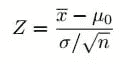

# 简单解释统计学中的假设检验

> 原文：<https://medium.com/nerd-for-tech/simply-explain-hypothesis-testing-in-statistics-c7c55d1f9e2f?source=collection_archive---------17----------------------->

亨德里克·科内里森在 [Unsplash](https://unsplash.com?utm_source=medium&utm_medium=referral) 上拍摄的照片

我很确定你在你的大学里听说过这个假设检验，但是即使我们大部分时间都听说过，当我们要使用它的时候还是会有一些疑问。如果你在数据科学领域工作，你必须经常使用这个概念。但是大多数人第一眼看不懂。我在一开始试图搞清楚什么是假设检验的时候，也面临过同样的情况。我将一步一步地帮助你到达目的地，我相信你在阅读完这篇文章后会理解假设检验的基本概念。

**什么是假设？**

假设仅仅是根据你的知识做出的假设。它必须是可检验的，这意味着你应该能够用科学的方法证明你的假设。例如，您构建了一个新的 web 应用程序，您发现新的 web 应用程序比现有的应用程序运行得更好。现在你可以假设你的新应用程序更好，你应该用科学的方法来证明它，除非没有人会相信你。你可以进行一个测试来证明你的假设，我们称之为假设检验。

**假设检验**

这里你基本上是在测试，你的结果是否来自偶然。如果您的结果来自偶然，我们不能使用它，我们不能取代我们目前的应用程序。进行假设检验有两个主要步骤。

1.  陈述你的零假设和替代假设
2.  为你的问题选择最好的测试类型并进行测试。

如你所知，我们应该证明我们的假设。在进行测试之前，我们应该陈述两个主要观点。

1.  零假设( *H0)*
2.  替代假设( *Ha)*

但实际上，对于初学者来说，陈述零假设和备择假设并不容易。这让你产生了很多疑虑。但这比你想象的要容易。我能说的是**只要把你的研究假设作为替代假设，然后针对你的替代假设陈述你的零假设。**

如果我们举前面的例子，你看到你的 web 应用程序运行得更好，因此你可以陈述你的**替代假设，因为新的应用程序更好**。之后你可以陈述你的无效假设，因为新的应用程序并不比现有的更好。

另一个例子，研究人员发现，当人们每天锻炼时，他们会比不每天锻炼的人长寿，人类的平均寿命是 75 岁。所以你可以陈述你的另一个假设，每天锻炼的人会活 75 岁以上。这是研究人员所看到的，你可以陈述你的**无效假设，因为每天锻炼的人会活得等于或少于 75 岁(H0 μ ≤ 75)** 。

现在我们有了替代假设和无效假设。然后，我们应该选择一个非常合适的假设检验来证明我们的假设。有许多测试类型。

1.  单样本 Z 检验
2.  双比例 Z 检验
3.  单一样本 T 检验
4.  双样本 T 检验

还有更多…..

## **一个样本 Z 测试**

这个测试是一个非常简单的假设测试，我们很容易理解。但是大多数时候我们不能用这个，因为我们很少知道总体参数。如果你知道总体标准差，你可以使用这个测试。

举个例子，一位老师说她的学生在她的科目上比其他学生聪明。然后我们可以计算她班上学生的平均分数(样本均值)，我们就知道该科目的全校平均分数(总体均值= 80)。和人口标准差。然后我们可以陈述替代假设和零假设。

H1: μ > 80

H0: μ= 80

你也应该注意到这是一个单尾测试。因为我们检查大于 80 的值。就像一面。

然后求阿尔法值。通常是 0，05，但是你可以根据你的要求来决定。如果我们的测试是一个双尾测试，那么我们必须除以α值。但这是一个单尾测试。因此，我们可以只使用 0.05，你应该从 Z 表中找到给定的 alpha 级别。0.05 是 1.645。

然后使用下面的 Z 分数公式找到测试的相关 Z 值

z 检验公式

然后把你收到的值和 1.645 比较一下。如果值大于 1.645，那么你可以拒绝零假设，除非你不能拒绝它。

如果我说的是单尾检验和双尾检验，这样想，如果你的替代假设是 Ha :≠ X，那么它意味着值可以大于 X 或小于 X，所以你必须检查两边。这是双尾检验。如果你的另一个假设是 Ha : > X，那么它意味着这个值大于 X，所以你只需要检查一边。这是一个尾部测试。

当你有两个尾部测试时，你必须将你的阿尔法水平除以 2(0.025)。当你有一个尾部测试，你可以只使用你给定的阿尔法水平(0.05)。

## 谢谢你的阅读！！！